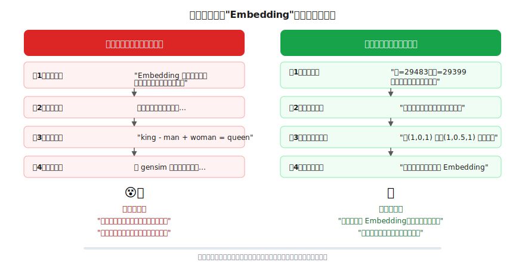
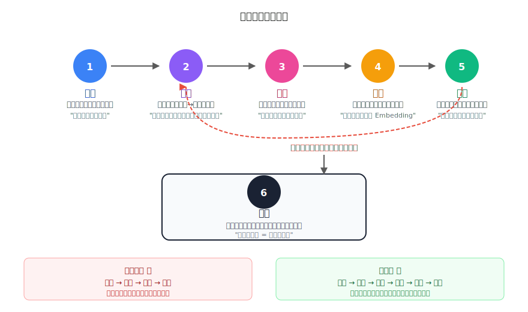

# 六步引导式学习法：如何让任何人学会任何东西

> 一个全栈工程师的大模型学习笔记（番外篇）

最近我在学大模型原理。作为一个完全不懂 AI 的程序员，我用了一种特别的方法，10 分钟就自己推导出了大模型的核心概念。

过程中我发现：**不是知识难，是教法不对。**

这篇文章不讲大模型，讲的是这个让我"比打游戏还爽"的学习方法本身。它不限于 AI——学任何东西都能用。

---

## 传统教法出了什么问题？

回想你上学时学一个新概念，通常是这样的：

```
第1步：老师给定义   "Embedding 是将离散符号映射到连续向量空间的技术"
第2步：老师讲原理   向量空间、余弦相似度、损失函数...
第3步：老师举例子   "比如 king - man + woman = queen"
第4步：你做练习     用 gensim 库加载预训练 Embedding...
```

结果呢？

**"每个字都认识，连起来不知道在说啥。"**

你背住了定义，但不知道为什么需要这个东西。你做了练习，但说不清它到底解决了什么问题。过两周，全忘了。

问题出在哪？**你从来没有"需要"过这个知识。** 老师直接给了你答案，但你脑子里根本没有对应的问题。

---

## 换一种方式试试

同样是教 Embedding 这个概念，换一种教法：

```
第1步：提问题    "UTF-8 里猫=29483、狗=29399，这种编号能表示意思相近吗？"
第2步：让你动手  "给猫、狗、汽车打个分：是动物？体型大？能当宠物？"
第3步：你自己发现 "猫(1,0,1) 和狗(1,0.5,1) 好像啊！汽车(0,1,0)完全不一样"
第4步：揭晓名字  "你刚才做的这件事，就叫 Embedding"
```

**区别在哪？** 你先自己发现了"用多个数字描述一个词，意思相近的词数字就相近"这件事，然后才知道它叫 Embedding。

你不是在记一个定义——你是在**给自己的发现贴标签**。这种知识忘不掉，因为它是你自己想通的。



---

## 六步引导式学习法

把这个方法抽象出来，就是六步：



### 第一步：锚定（Anchor）

> 找到学习者已经懂的东西，作为起点。

学任何新东西，都不是从零开始的。每个人都有自己的知识基础。关键是找到那个**连接点**。

| 学习者背景 | 学习目标 | 锚点 |
|-----------|---------|------|
| 程序员 | 学大模型 | "你写过函数对吧？" |
| 厨师 | 学化学 | "你知道为什么糖加热会变焦吧？" |
| 销售 | 学数据分析 | "你平时怎么判断哪个客户要签单？" |
| 司机 | 学物理 | "你知道急刹车时身体为什么会前倾吧？" |

**原则：从对方的日常经验出发，而不是从学科的定义出发。**

### 第二步：架桥（Bridge）

> 提一个问题，把已知的东西和未知的东西连起来。

这个问题有几个要求：
- 学习者**能理解**题意（用他熟悉的词汇）
- 他**答不上来**或者只能给出部分答案（否则没有学习空间）
- 他的答案能**自然引向**目标概念

好的架桥问题：
- ✅ "如果一个函数输入文字、输出下一个字，return 里写什么？"（程序员能理解，但答不好）
- ❌ "请解释 next token prediction"（用了学习者不懂的术语）
- ❌ "1+1=?" （太简单，没有学习空间）

### 第三步：推导（Derive）

> 不告诉答案，引导学习者自己推出来。

这是最关键的一步，也是最考验引导者的一步。核心技巧：

**a) 给具体的例子让他动手**
- 不要说"想一想向量怎么表示语义"
- 要说"你给猫、狗、汽车三个属性打个分"

**b) 用反例制造认知冲突**
- "如果这句话出现在美食摄影杂志里呢？下一个字还是'吃'吗？"
- 学习者原以为答案是确定的 → 发现答案是概率的 → 认知升级

**c) 让学习者做简单的推理**
- "把 z = k1×x+b1 代入 y = k2×z+b2，你展开看看？"
- 他自己算出 y = Kx+B → 自己发现"叠两层线性还是线性" → 产生"那怎么办"的动机

**关键原则：引导者的工作不是给答案，而是设计能让答案自己浮现的问题链。**

### 第四步：命名（Name）

> 等学习者推出答案后，再告诉他这个概念的正式名字。

这一步很反直觉——传统教育是"先给名字，再解释意思"。引导式是反过来：**先有意思，再给名字。**

```
传统: "Embedding 的定义是..." → 学习者记住一个空壳
引导: "你刚才做的这件事，就叫 Embedding" → 学习者给自己的理解贴标签
```

这个顺序非常重要。当一个人已经理解了一件事，你再告诉他它叫什么，他会觉得**"原来这就叫 Embedding！好简单！"** 而不是 **"Embedding 好复杂啊记不住"**。

### 第五步：追问（Extend）

> 从刚得出的答案中，自然引出下一个问题。

好的追问让学习者感觉知识在"自动展开"，而不是被硬塞进来：

```
"大模型是一个输出概率的函数"
↓ 追问
"那这些概率从哪来？" → 引出训练
↓ 追问
"训练学到的知识存在哪？" → 引出参数
↓ 追问
"参数怎么调？" → 引出梯度下降
```

**每个答案自然催生下一个问题，形成一条发现链。** 学习者不是在"上课"，而是在"探索"——像游戏里一个任务解锁下一个任务。

### 第六步：输出（Teach）

> 让学习者用自己的话，把学到的东西教给别人。

费曼说过："如果你不能用简单的话解释一件事，说明你还没真正理解它。"

输出的形式可以是：
- **写一篇博客**（最推荐——逼你组织语言、查漏补缺）
- **讲给朋友/同事听**
- **画一张图**
- **录一段语音备忘**

关键不在于形式，而在于**你必须把别人脑子里没有的东西讲清楚**。这个过程会暴露你理解中的漏洞——"等等，这一步我好像也没完全想通"——然后你回去补上，理解就更深了。

---

## 这个方法为什么有效？

三个原因：

### 1. 先有问题，再有答案

传统教育给你答案，你没有问题。引导式先制造问题（"一个数字为什么装不下语义？"），你有了疑问，答案才有地方安放。

**没有问题的答案，就像没有钉子的墙上挂一幅画——挂不住。**

### 2. 自己推出来的，记得牢

心理学里有个概念叫**生成效应（Generation Effect）**：自己推导出的结论比被动接收的记忆保持率高 2-3 倍。

你不是在记"Embedding 的定义是……"，而是在回忆"我当时给猫狗汽车打分，发现相似的东西数字就相似"。这是一段**经历**，不是一段文字。

### 3. 知识自动连成网

追问形成的发现链，让每个概念都和前一个、后一个紧密关联。你不是在记一堆孤立的知识点，而是在建一张网——知道每个概念从哪里来、为什么需要、通向哪里。

---

## 怎么用在你的领域？

这个方法不限于技术学习。设计引导式教学只需要回答三个问题：

| 问题 | 举例（教厨师理解美拉德反应） |
|------|--------------------------|
| **学习者已经懂什么？** | 知道牛排煎的时候会变色变香 |
| **什么问题能连接已知→未知？** | "为什么煎到一定温度才会变色，温度低就不行？" |
| **怎么让他自己发现？** | "你试试 100°C 和 150°C 分别煎 1 分钟，看看区别" |

再举几个例子：

**教产品经理理解 A/B 测试：**
1. 锚定："你做决策时靠直觉还是靠数据？"
2. 架桥："如果两个方案都有人支持，你怎么客观判断哪个好？"
3. 推导：让他设计一个实验——"如果同时放两个按钮颜色，怎么知道哪个点击率高？"
4. 命名："你设计的这个实验，就叫 A/B 测试"

**教小朋友理解浮力：**
1. 锚定："你知道铁球放水里会沉下去对吧？"
2. 架桥："那铁做的轮船为什么不沉？"
3. 推导：给他一块橡皮泥——捏成球沉下去，展开成碗状就浮起来。"你觉得区别是什么？"
4. 命名："让东西浮起来的力，叫浮力。跟形状（排水体积）有关"

**规律是一样的：找到锚点 → 提好问题 → 让他动手 → 他自己发现 → 你给名字。**

---

## 一个提醒：引导比灌输难

这个方法对**引导者**要求很高：

- 你要真正理解这个领域，才能设计出好的问题链
- 你要了解学习者的背景，才能找到合适的锚点
- 你要忍住不直接说答案——等待学习者自己想通

好消息是：AI 特别适合干这件事。它有无限耐心、能调整问题难度、能根据你的背景选择类比。

我的整个大模型学习过程就是和 AI 对话完成的——它问我问题，我自己推导，推出来之后它告诉我这叫什么。这可能是 AI 最被低估的用法：**不是让它给你答案，而是让它引导你自己找到答案。**

---

## 总结

| | 传统方式 | 引导式 |
|---|---------|-------|
| **起点** | 从定义出发 | 从学习者的经验出发 |
| **过程** | 老师讲，学生听 | 引导者提问，学习者推导 |
| **概念命名** | 先给名字再解释 | 先理解再给名字 |
| **知识结构** | 孤立的知识点 | 问题链串成的网 |
| **记忆方式** | 记住定义 | 回忆发现过程 |
| **学习感受** | "好难，记不住" | "原来就这么回事！" |

**六步法：锚定 → 架桥 → 推导 → 命名 → 追问 → 输出。**

不管你学什么、教什么——AI、做菜、物理、金融、管理——这个框架都能用。核心只有一句话：

> **别给答案，给问题。让人自己成为知识的发现者。**

---

*这是「全栈工程师的大模型学习笔记」系列的番外篇。正篇用这个方法从零讲大模型原理：[第一篇：从 if-else 到概率预测](01-what-is-llm.md) ｜ [第二篇：文字是怎么变成数字的](02-token-and-embedding.md)*
