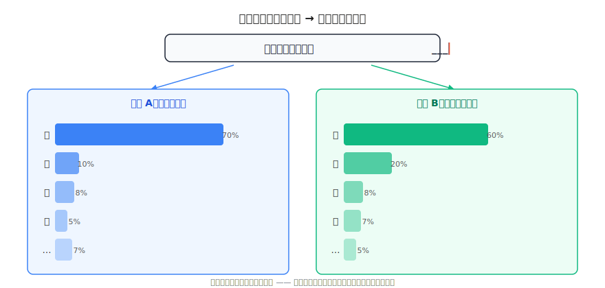
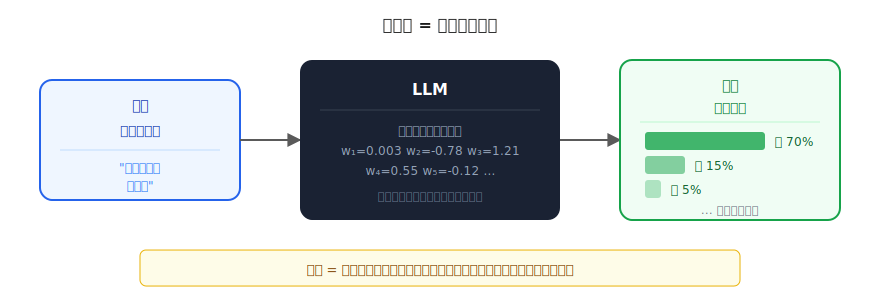
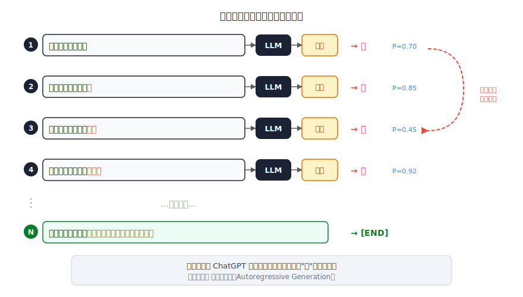
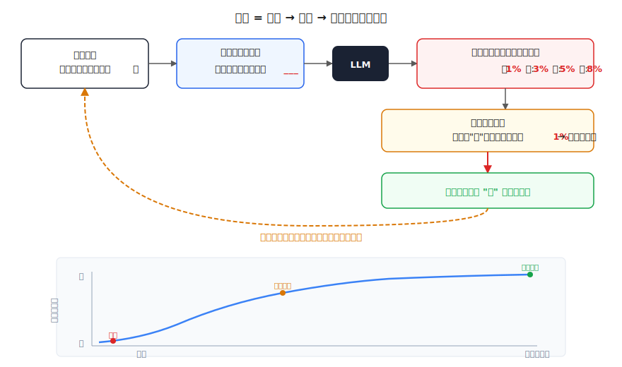
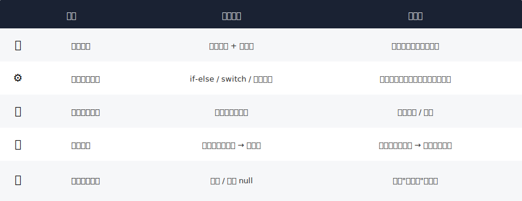

# 从 if-else 到概率预测：程序员眼中的大模型

> 一个全栈工程师的大模型学习笔记（一）

我是一个写了多年业务代码的全栈开发，最近决定搞懂大模型到底是怎么回事。不是那种"调个 API 就行"的懂，是真的搞懂它内部在干什么。

这篇文章不会给你一堆定义让你背。相反，我会带你走一遍我自己"想通"的过程。如果你是程序员，你大概率能在 10 分钟内自己推导出大模型的核心原理。

---

## 一、一个奇怪的函数

作为程序员，我们对"函数"再熟悉不过了：

```javascript
function add(a, b) {
  return a + b
}
```

给定输入，产生输出。确定性的，可预测的，写什么逻辑就走什么逻辑。

现在我问自己一个问题：**如果有一个函数，输入是一段文字，输出是"下一个字"，这个函数里面该写什么？**

```javascript
function predictNext(text) {
  // ???
  return nextWord
}
```

比如输入 `"今天天气"` ，它应该返回什么？

我的第一反应是：

```javascript
function predictNext(text) {
  if (text.includes("天气")) {
    const weather = await fetch("https://api.weather.com/today")
    return weather.description  // "晴朗"
  }
  if (text.includes("股价")) {
    const stock = await fetch("https://api.stock.com/price")
    return stock.price
  }
  // ... 无穷无尽的 if-else
}
```

调 API，查事实，返回答案。这是工程师的本能：**给确定性的问题写确定性的逻辑。**

但这个思路马上就撞墙了——你不可能为世界上所有可能的输入都写一条 if-else。

---

## 二、你比你想的更"AI"

换一个输入：`"从前有座山，山上有座"` —— 下一个字是什么？

**庙。**

没有任何 API 可以查"从前有座山后面跟什么字"。但你秒答了。为什么？

"因为我小时候听过这个故事。" 对，你从**大量的阅读和听说**中学会了这个模式。

但再想一步：你真的是"背住"了这句话吗？

试试这个：`"从前有座山，山上有个"` —— 你会接什么？

还是"庙"。但是这句话你大概率没见过原样。`"有个庙"` 和 `"有座庙"` 用词不同，但你的大脑自动理解了意图，做了模糊推断。

再试一个：`"从前有片海，海里有条"` —— 你会接什么？

"龙"？"鱼"？"船"？你从来没见过这句话，但你能给出合理的答案。

**你的大脑不是在查表，而是在做模式识别 + 推断。**

这种能力从何而来？不是某一本书教你的，而是你**从小到大接触过的所有文本**在你脑中形成的语言直觉。

---

## 三、不是答案，是概率

刚才的"庙"几乎是 100% 确定的。再来一个没那么确定的：

`"这家餐厅的菜真好"` —— 下一个字是什么？

我选"吃"。理由很直觉：去餐厅就是吃饭，觉得好自然是"好吃"，这个推理链很自然。

**但如果这句话出现在一本美食摄影杂志里呢？**

> "这家餐厅的菜真好**看**，摆盘精致得像艺术品。"

同样的前文，下一个字变成了"看"。

如果出现在一本美食评测里呢？

> "这家餐厅的菜真好**香**，还没上桌就闻到了。"

这说明了一个关键事实：我给出的不是一个**确定的答案**，而是一个**概率分布**——每个可能的字都有一定的可能性，只是高低不同。而且，**上下文不同，概率分布就不同。**



▶ [点击查看动画：概率分布随上下文变化](assets/video/01-probability-shift.mp4)

这张图的关键信息是：**同样的输入文字"这家餐厅的菜真好___"，因为隐含的上下文不同（朋友圈 vs 摄影杂志），每个候选字的概率完全不同。**

---

## 四、大模型 = 一个概率函数

走到这里，我突然意识到，大模型做的事情和我刚才做的**一模一样**：

它不是在"思考"，不是在"理解"，不是在"查资料"。

**它就是一个函数——输入一段文字，输出每个可能的下一个 token 的概率。**



用代码表示：

```javascript
function LLM(context) {
  // 不是 if-else
  // 不是查数据库
  // 而是：通过内部几十亿个参数的数学运算
  // 根据上下文，给词表中每个 token 分配一个概率
  return {
    "吃": 0.70,
    "看": 0.15,
    "闻": 0.05,
    "香": 0.03,
    // ... 词表中的每一个 token 都有一个概率
    // 所有概率加起来 = 1.0
  }
}
```

这里出现了一个关键词：**token**。你可以暂时把它理解为"字"或"词"，它是模型处理文本的最小单位。（下一篇会详细讲 token 到底是什么。）

用一个专业术语来说，大模型做的事叫**下一个 token 预测（Next Token Prediction）**。

---

## 五、一个字一个字蹦出来

OK，大模型能预测下一个字。但 ChatGPT 回复的是一整段话，这是怎么来的？

答案简单得出奇——**把预测出的字拼到输入后面，然后再预测下一个字。循环往复。**



▶ [点击查看动画：自回归生成过程](assets/video/01-autoregressive-loop.mp4)

每一步只干一件事：预测一个字。然后把这个字拼到末尾，作为新的输入，继续预测。

这就是为什么你用 ChatGPT 时看到回复是一个字一个字"蹦"出来的——**它真的就是一个字一个字生成的。** 这个过程有个正式的名字：**自回归生成（Autoregressive Generation）**。

你可能会问：每一步有那么多候选字，模型怎么选？是直接选概率最高的吗？

不一定。如果每次都选概率最高的（这叫**贪心采样 greedy**），生成的文本会非常"安全"但无聊，容易重复。实际使用中，模型会引入一定的**随机性**——有时候会选概率第二、第三高的字。

这就是你在调用 API 时看到的 **temperature** 参数的含义：

| temperature | 效果 |
|-------------|------|
| 0（或接近 0） | 几乎总是选概率最高的，输出确定、保守 |
| 0.7（常用值） | 适度随机，兼顾创意和连贯性 |
| 1.0 或更高 | 高度随机，更有创意但可能不连贯 |

**temperature 不改变概率分布本身，而是改变"从分布中选字"时的随机程度。**

---

## 六、概率从哪来？

好，它输出概率。但这些概率是从哪来的？

想想你自己。你为什么能预测"从前有座山"后面跟"庙"？因为你**从小到大读过、听过大量的文本**——故事书、课本、网页、聊天记录……

大模型也一样。它"读过"互联网上**万亿个 token 的文本**。

这个"读书"的过程叫**训练（Training）**。

但和你"看一遍就记住"不同，模型的训练更像是反复做练习题：

1. 从训练数据中取一段文本，比如 `"从前有座山山上有座庙"`
2. 遮住最后一个字，让模型预测
3. 模型一开始是瞎猜的（所有参数都是随机初始化的）
4. 对比正确答案，算出"猜得有多离谱"
5. 根据离谱程度，微调内部参数
6. 换下一段文本，重复以上过程——**万亿次**



经过万亿次这样的"看题→猜答案→被纠正→调整"循环，模型内部的参数被不断打磨，最终能对任何输入给出合理的概率分布。

**训练完成后，模型就不再需要训练数据了——所有从数据中学到的规律，都已经"编码"在参数里。**

---

## 七、知识存在哪？

训练完了，学到的知识存在哪？

作为工程师，我第一反应是"数据库"或者"内存里的一张表"。但不是。

想想九九乘法表。`7 × 8 = ?` 你脱口而出 56。但你脑子里并没有一个 `HashMap<String, Integer>` 存着所有答案。知识不是以"数据"的形式存在的，而是编码在你**神经元之间的连接方式**中。

大模型类似。它的知识不是存在某张表里，而是编码在**大量的数字**中：

```javascript
function LLM(text) {
  // 内部有非常多数字，比如：
  // w1 = 0.0023, w2 = -0.7841, w3 = 1.2095, ...
  //
  // 这些数字有多少个？
  // - GPT-3:    1750 亿 个
  // - Llama 3:  700 亿 个
  // - GPT-4:    据传上万亿个
  //
  // 这些数字和输入文本经过一系列数学运算
  // 最终输出每个 token 的概率
}
```

这些数字叫**参数（Parameters）**，也叫**权重（Weights）**。

你一定听过新闻说"GPT-4 有上万亿参数"、"Llama 3 有 700 亿参数"。现在你知道了——**这就是在说那个函数内部有多少个数字。**

这些数字共同决定了函数的行为：面对任何输入，输出什么样的概率分布。参数不同，行为就完全不同。一个随机初始化的模型和一个训练好的模型，唯一的区别就是这些数字的值。

---

## 八、两种完全不同的编程范式

走到这里，你可能隐约感觉到：大模型和我们平时写的代码，是两种**根本不同的东西**。

没错。这是计算机科学中两种截然不同的范式：



传统编程：**人类写规则，计算机执行规则。**

大模型：**人类提供数据，计算机自己从数据中学出规则。**

这也是为什么大模型能处理模糊性的输入——它不需要精确匹配，而是根据训练中见过的海量模式，给出"最可能"的回答。

---

## 总结

让我们把今天推导出的所有概念串起来：

| 概念 | 一句话解释 | 类比 |
|------|-----------|------|
| **大模型 (LLM)** | 输入文本 → 输出下一个 token 的概率分布 | 你听到"从前有座山"会自动接"庙" |
| **Token** | 文本的最小处理单位（字、词、子词） | 类似于文本的"像素" |
| **训练 (Training)** | 用海量文本反复调整参数，让预测越来越准 | 你从小到大的阅读积累 |
| **参数 (Parameters)** | 函数内部的数字，编码了从数据中学到的知识 | 你的神经元连接强度 |
| **概率分布** | 每个候选 token 的可能性大小 | 你心中几个候选答案的"感觉" |
| **采样 (Sampling)** | 从概率分布中选一个 token 出来 | 你从几个候选词中选一个说出口 |
| **自回归生成** | 每次预测一个字，拼上去继续预测 | 你说话也是一个词接一个词 |
| **temperature** | 控制采样的随机程度 | 说话时"保守"还是"放飞" |

---

## 留给你的问题

如果你跟着这篇文章想到了这里，你可能会冒出两个问题：

### 问题一：文字是怎么变成数字的？

大模型内部全是数学运算，但输入是文字。`"从前有座山"` 这五个字，是怎么变成模型能计算的数字的？

而且不只是简单编号（比如"从"=1，"前"=2）——模型需要能捕捉到"好吃"和"美味"意思相近，而"好吃"和"难吃"意思相反。简单编号做不到这一点。

### 问题二：参数是怎么调整的？

"调参数让预测更准"说起来简单，但几十亿个参数，每个该往大了调还是往小了调？调多少？这背后是什么数学原理？为什么这种方法能 work？

这两个问题，分别通向大模型的两个基础构件：**Embedding（词嵌入）** 和 **梯度下降（Gradient Descent）**。

下一篇，我们先解决第一个：**文字是怎么变成数字的。**

---

## 读者问答：大模型就是 f(x) = kx + b 吗？

学完上面的内容，你可能会想：说到底，训练就是从数据中算出参数，使用就是给输入算输出——**这不就是 `f(x) = kx + b` 吗？**

你的直觉抓住了核心：**从数据中学参数，用参数算输出**——所有机器学习本质上都是这个套路。

但 `kx + b` 只是一条直线。而人类语言的规律远比一条直线复杂。一条直线甚至拟合不了"收入随年龄先涨后降"这样简单的曲线，更别说语言了。

怎么办？把很多个 `kx + b` 叠起来，层与层之间加一个"掰弯"操作（叫**激活函数**），就能拟合任意复杂的曲线：

```
直线（kx + b）          → 只能拟合简单关系
多层叠加 + 激活函数      → 能拟合任意复杂的规律
```

**`kx + b` 是砖头，激活函数是水泥，叠在一起才能盖高楼。** 这就是为什么大模型需要几十亿甚至上万亿个参数——不是炫技，是人类语言的复杂度需要那么多"砖头"。

具体怎么叠、怎么训练、激活函数为什么有效——这些会在后续的「神经网络」篇章中从零推导。

---

*这是「全栈工程师的大模型学习笔记」系列第一篇。我是一个全栈开发者，正在从零学习大模型原理。这个系列不讲公式，用程序员能理解的方式，把大模型从里到外拆明白。如果你也是一个对 AI 好奇的程序员，欢迎一起上路。*
