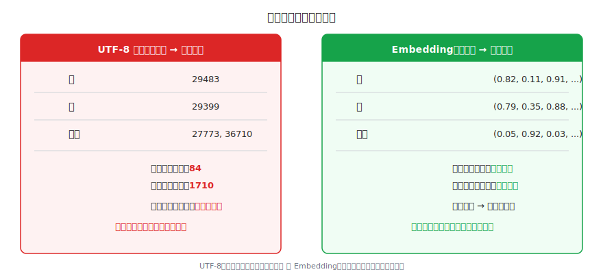
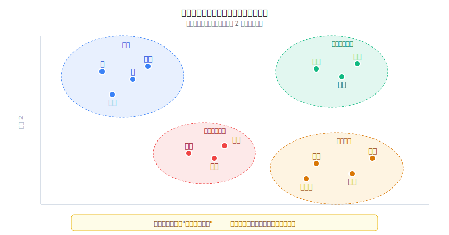
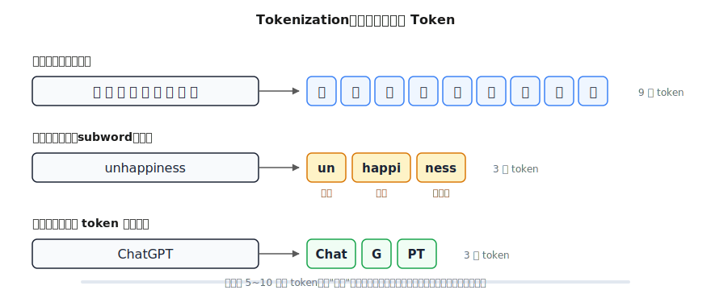
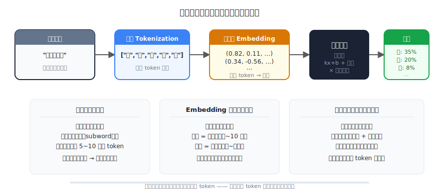

# 文字是怎么变成数字的：Token 与 Embedding 图解

> 一个全栈工程师的大模型学习笔记（二）

上一篇我们搞懂了：大模型就是一个函数，输入文字，输出下一个 token 的概率分布。但有一个问题悬而未决——

**大模型内部全是数学运算。输入却是文字。文字是怎么变成数字的？**

这篇文章带你推导出答案。

---

## 一、最简单的方案：编号

作为程序员，你一定用过字符编码。UTF-8 里，每个字都有一个编号：

```
"猫" → 29483
"狗" → 29399
"汽" → 27773
```

一个字一个数字，简单直接。能用吗？

来看个问题：在 UTF-8 编码里——

- "猫"和"狗"的差值：84
- "猫"和"汽"的差值：1710

按数字距离看，"猫"跟"狗"更近。但这**纯属巧合**——UTF-8 是按字形结构（部首、笔画）排列的，跟语义没有半毛钱关系。

换个例子就露馅了：

- "开心"和"高兴"意思几乎一样，但编号差了十万八千里
- "开心"和"开车"共享一个"开"字，编号反而很近

**一个数字，装不下"意义"这种复杂的东西。**

---

## 二、给每个词"画像"

那怎么办？换个思路。

如果让你描述"猫"这个概念，你会怎么说？你可能会用一些属性：

- 是不是动物？
- 体型大不大？
- 能不能当宠物？

每个属性用 0 到 1 打分（1 = 完全是，0 = 完全不是）：

| | 是动物？ | 体型大？ | 能当宠物？ |
|---|---|---|---|
| **猫** | 1 | 0 | 1 |
| **狗** | 1 | 0.5 | 1 |
| **汽车** | 0 | 1 | 0 |

看这三组数字：

```
猫:   (1,   0,   1)
狗:   (1,   0.5, 1)
汽车: (0,   1,   0)
```

**猫和狗的数字几乎一样，猫和汽车的数字完全不同。** 意思相近的东西，数字就自然相近。

这三个数字组成的东西，在数学里叫**向量（Vector）**。用向量来表示一个词，就像给每个词画了一张"多维画像"——维度越多，画像越精细。

---

## 三、从 3 个维度到几千个维度

3 个维度够用吗？

"猫"和"老虎"在上面那张表里几乎一样（都是动物、不太大、差不多能当宠物），但它们显然差别很大。你得加更多维度才能区分——比如"危不危险"、"是不是家养的"、"体重多少"……

人类语言有几万个词，词与词之间的关系纷繁复杂：

- "国王"和"王后"——类似但有性别差异
- "北京"和"中国"——地点与国家的关系
- "跑"和"奔跑"——几乎同义但语气不同

要捕捉这些微妙的关系，需要**几千个维度**。

实际中，GPT-3 用了 **12288 维**——每个 token 用 12288 个数字来表示。



---

## 四、Embedding：让模型自己学

到这里你可能想问：这几千个维度每个代表什么意思？是"是不是动物"、"体型大不大"这种人类定义的属性吗？

不是。

回想上一篇的结论：大模型的知识不是人定义的，是**从数据中学出来的**。Embedding 也一样。

这几千个维度不是人类设计的"是不是动物"这种具体属性，而是模型自己在训练中发现的某种**抽象特征**。你说不清第 3721 个维度代表什么具体含义，但模型用这些维度能精确地编码语义关系。

**怎么学的？** 思路非常优雅：

> 经常出现在相似上下文中的词，意思就相近。

模型在训练中看到大量文本：

```
"我家的猫特别可爱，每天都要撸"
"我家的狗特别可爱，每天都要遛"
"我家的汽车特别省油，每天都要开"
```

"猫"和"狗"出现在几乎相同的上下文中（"我家的___特别可爱"），而"汽车"出现在完全不同的语境里。经过万亿次训练，模型自动把"猫"和"狗"的向量调得很近，把"汽车"的向量调得很远。

**没有人告诉模型"猫和狗是一类"——它自己从数据中发现了这个关系。**



训练完之后，整个词表的 Embedding 就固定下来了，形成一张大表：

```
Embedding 表
├── 行数 = 词表大小（约 10 万个 token）
├── 列数 = 向量维度（如 12288）
└── 总参数量 = 10 万 × 12288 ≈ 12 亿个数字

  查表操作：
  "猫" → 查第 29483 行 → 得到 (0.82, 0.11, 0.91, ..., 0.34)
  "狗" → 查第 29399 行 → 得到 (0.79, 0.35, 0.88, ..., 0.31)
```

就是一次查表操作——输入 token 编号，输出对应的向量。简单、快速。

---

## 五、等一下，Token 到底是什么？

我们一直在说"字"和"词"，但大模型实际处理的最小单位到底是什么？

来看英文。假设我们按"整个单词"来处理：

```
"unhappiness" → 1 个 token
"ChatGPT"     → 1 个 token（如果词表里有的话）
```

问题来了：英语有几百万个不同的词（加上人名、地名、专业术语、网络新词）。词表要多大？而且新词一直在出现——"ChatGPT" 在 2022 年之前根本不存在，词表里不可能有它。

换一个思路：按单个字母？

```
"unhappiness" → ["u","n","h","a","p","p","i","n","e","s","s"]  → 11 个 token
```

词表只需要 26 个字母，永远够用。但 11 个 token 太长了，模型需要处理更多步骤，而且单个字母几乎没有语义信息。

**最佳方案在中间：子词（subword）。**

```
"unhappiness" → ["un", "happi", "ness"]   → 3 个 token
```

- "un" 是否定前缀，"happi" 是快乐，"ness" 是名词后缀——每个片段都有意义
- 词表只需要几万个子词，就能组合出任意文本
- 新词也能处理："ChatGPT" → ["Chat", "G", "PT"]

这就像**组件化开发**——一套可复用的子词"组件"，组合出无穷多的词。



中文怎么办？中文没有明显的子词结构（不像英文有前缀后缀），所以通常**按字拆分**，有时也会把常见词（如"我们"、"的"）作为一个 token。

---

## 六、把流水线串起来

到这里，你已经理解了大模型处理文字的完整流程。让我们把它串成一条流水线：



用 `"猫喜欢吃鱼"` 举个完整的例子：

```
第一步 Tokenization（分词）
  "猫喜欢吃鱼" → ["猫", "喜", "欢", "吃", "鱼"]
  把文字拆成 token 序列

第二步 Embedding（查表）
  "猫" → (0.82, 0.11, 0.91, ..., 0.34)   ← 12288 个数字
  "喜" → (0.34, -0.56, 0.22, ..., 0.78)
  "欢" → (0.41, -0.48, 0.19, ..., 0.65)
  "吃" → (0.77, 0.08, 0.85, ..., 0.29)
  "鱼" → (0.80, 0.15, 0.89, ..., 0.37)
  每个 token 查出一个向量

第三步 神经网络（运算）
  这些向量进入几十层神经网络
  层层运算、变换、交互
  （这里面的细节是 Transformer 的核心，后面会详细讲）

第四步 输出
  最终输出下一个 token 的概率分布
  {"的": 0.35, "。": 0.20, "和": 0.08, ...}
```

**每运行一次这条流水线，生成一个 token。然后把新 token 加入输入，重复运行——这就是上一篇讲的自回归生成。**

---

## 七、一个有趣的发现

Embedding 还有一个令人惊叹的特性。研究者发现，训练好的词向量之间存在**有意义的数学关系**：

```
向量("国王") - 向量("男") + 向量("女") ≈ 向量("王后")
```

也就是说：

> 国王之于男，等于王后之于女。

这不是人为设计的，是模型从海量文本中**自己学出来**的。向量空间里编码了人类语言中的类比关系、层次关系、语义关系……比任何人工设计的规则都丰富。

类似的例子还有很多：

```
向量("巴黎") - 向量("法国") + 向量("日本") ≈ 向量("东京")
向量("走")   - 向量("现在") + 向量("过去") ≈ 向量("走了")
```

**这就是为什么大模型能"理解"语言——不是真的理解，而是它的向量空间精确地编码了语言的结构。**

---

## 总结

| 概念 | 一句话解释 | 类比 |
|------|-----------|------|
| **Token** | 文本的最小处理单位（子词） | 组件化的零件 |
| **Tokenization** | 把文字拆成 token 序列 | 把句子拆成组件 |
| **Embedding** | 把每个 token 映射成一个高维向量 | 给每个词画多维画像 |
| **向量** | 一组数字，编码了 token 的语义 | 词的"坐标"——近义词坐标近 |
| **Embedding 表** | 存所有 token 向量的大表 | 一张 10 万行 × 12288 列的查找表 |

现在我们知道了：

1. **文字通过 Tokenization 变成 token 序列**
2. **每个 token 通过 Embedding 表变成一个向量**
3. **向量进入神经网络进行运算**

---

## 留给你的问题

流水线的前两步（Tokenization + Embedding）搞定了，第三步"神经网络运算"里面到底发生了什么？

具体来说：

**模型怎么知道"吃"跟前面的"猫"有关系？** 在 Embedding 之后，每个 token 各自是一个独立的向量。但语言不是孤立的——"猫喜欢吃鱼"里，"吃"的含义取决于谁在吃、吃什么。模型怎么让这些向量之间**互相沟通**，捕捉到上下文关系？

这就是大模型最核心的机制——**Attention（注意力）**，也是 Transformer 的灵魂。

但在聊 Attention 之前，我们还差一块基础：**模型那几十亿个参数是怎么训练出来的？** 上一篇说"猜错了就调参数"，但具体怎么调？往哪个方向调？调多少？

下一篇，我们来解决这个问题：**梯度下降——AI 是怎么"练习"的。**

---

*这是「全栈工程师的大模型学习笔记」系列第二篇。上一篇：[从 if-else 到概率预测：程序员眼中的大模型](01-what-is-llm.md)。如果你也是一个对 AI 好奇的程序员，欢迎一起上路。*
