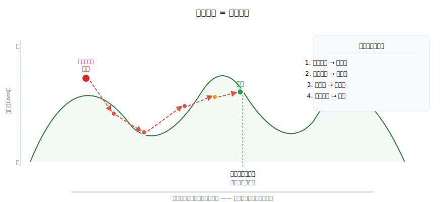
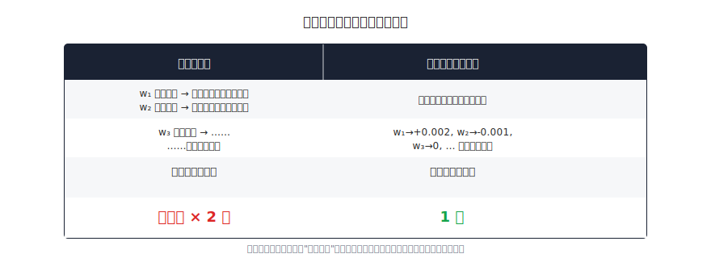
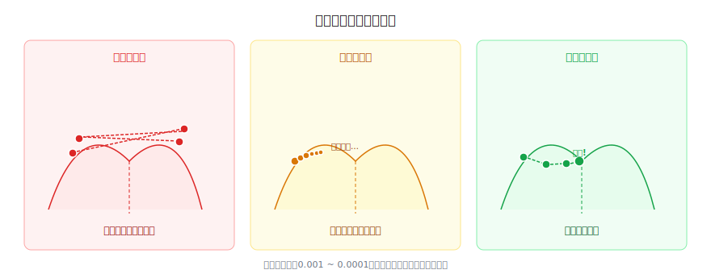
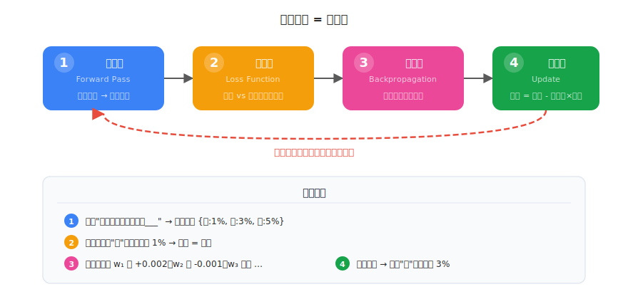

# 梯度下降：AI 是怎么"练习"的

> 一个全栈工程师的大模型学习笔记（三）

前两篇我们搞懂了：大模型是一个预测下一个 token 概率的函数，文字通过 Tokenization 和 Embedding 变成向量，然后进入几十层神经网络运算。

但有一个关键问题还没解决——

**模型的几十亿个参数，是怎么从"瞎猜"变成"精准预测"的？**

上一篇说"训练就是不断调参数"，但几十亿个参数，每个该往大了调还是往小了调？调多少？这篇带你推导出答案。

---

## 一、蒙眼下山

假设你蒙着眼站在一座山上，目标是走到山谷最低点。你看不见任何东西，但你能感觉到**脚下的坡度**——哪边更陡，哪边更平。

你会怎么走？

**用脚感觉哪边低，往低的方向迈一步。到了新位置，再感觉，再迈一步。重复，直到所有方向都是高的——说明你到谷底了。**

这就是梯度下降的全部思想。接下来我们把这个直觉翻译成大模型的语言。

---

## 二、山的高度 = 损失

"山的高度"代表什么？

回想训练过程：模型预测"庙"的概率只有 1%，但正确答案就是"庙"。1% 和 100% 之间的差距巨大——此时模型表现**很差**。

如果模型预测"庙"的概率是 95%，差距很小——模型表现**很好**。

```
预测很离谱（1%）  → 模型在"山顶" → 高度大
预测很准确（95%） → 模型在"谷底" → 高度小
```

这个"高度"，在 AI 里叫**损失（Loss）**—— 预测和正确答案之间的差距。

**训练的目标就是：从山顶走到山谷，让损失越来越小。**



<video src="assets/video/03-mountain-descent.mp4" autoplay loop muted playsinline style="max-width:100%;border-radius:8px;margin:16px 0"></video>

---

## 三、几十亿个方向，怎么选？

蒙眼下山时，你只有前后左右几个方向可以选。但大模型有**几十亿个参数**，每个参数都是一个独立的"方向"——可以往正方向调，也可以往负方向调。

如果逐个尝试：把参数 w₁ 调大一点，看损失变大还是变小；再把 w₂ 调大一点，看损失变大还是变小……几十亿个参数，每个试两个方向，**一步就要试上百亿次**。而训练需要万亿步。这条路根本走不通。

但数学里有一个工具，能**一次性算出所有参数该往哪个方向调**。



<video src="assets/video/03-gradient-arrows.mp4" autoplay loop muted playsinline style="max-width:100%;border-radius:8px;margin:16px 0"></video>

这个工具叫**梯度（Gradient）**。

梯度就是你在山上"用脚感觉到的坡度"——只不过不是在二维平面上感觉前后左右，而是在几十亿维空间上，**同时算出每个维度的坡度**。

它利用了微积分中的**链式法则**：因为神经网络是一层层嵌套的函数（还记得 `kx+b → 激活 → kx+b → 激活` 吗？），可以从输出层往回，逐层计算每个参数对损失的影响。这个过程叫**反向传播（Backpropagation）**——从输出反向传回每一层。

你不需要完全理解链式法则的数学细节。关键是记住：**梯度能一次告诉你，每个参数该往哪个方向调，才能让损失变小。**

---

## 四、步子多大？学习率

知道了方向（梯度），还差一个问题：**迈多大一步？**

步子太大，直接跳过谷底，到对面山坡上去了，然后又跳回来——来回震荡，永远到不了最低点。

步子太小，每次只挪一丁点，训练几年都走不到谷底。

这个"步子大小"叫**学习率（Learning Rate）**，通常是一个很小的数，比如 0.001。



<video src="assets/video/03-learning-rate-compare.mp4" autoplay loop muted playsinline style="max-width:100%;border-radius:8px;margin:16px 0"></video>

学习率是训练前人为设定的**超参数**（不是模型自己学的，而是人手动调的）。找到合适的学习率是训练大模型的关键技术之一——太大会发散，太小会浪费时间和算力。

实际训练中，学习率通常不是固定的，而是**逐渐减小**——开始时大步走快速接近谷底，后期小步精调避免错过最优点。这叫**学习率衰减（Learning Rate Decay）**。

---

## 五、训练一步 = 四件事

把上面的所有概念串起来，训练一步就是四件事：



<video src="assets/video/03-training-loop.mp4" autoplay loop muted playsinline style="max-width:100%;border-radius:8px;margin:16px 0"></video>

用代码思维理解：

```javascript
for (let step = 0; step < 万亿; step++) {
  // 1. 算预测（前向传播）
  const prediction = model.forward("从前有座山山上有座___")
  // prediction = { "庙": 0.01, "楼": 0.03, "人": 0.05, ... }

  // 2. 算损失
  const loss = computeLoss(prediction, "庙")
  // loss = 4.6（很大，因为只给了 1%）

  // 3. 算梯度（反向传播）
  const gradients = model.backward(loss)
  // gradients = { w1: +0.002, w2: -0.001, w3: 0, ... }

  // 4. 调参数
  for (const param of model.parameters) {
    param.value -= learningRate * gradients[param.name]
  }
}
```

**第四步的公式是整个梯度下降的核心：**

```
参数新值 = 参数旧值 - 学习率 × 梯度
```

为什么是减号？因为梯度指向损失**增大**的方向，我们要往**减小**的方向走，所以要减。就像下山要往坡度的**反方向**走。

---

## 六、从瞎猜到精准

让我们看看这个过程的效果。以预测"从前有座山山上有座___"为例：

```
训练开始（随机初始化）
  "庙" 的概率：0.8%     ← 瞎猜，和其他字差不多

第 1000 步
  "庙" 的概率：3.2%     ← 开始有点感觉了

第 10000 步
  "庙" 的概率：22%      ← 已经是最高的几个候选之一

第 100000 步
  "庙" 的概率：78%      ← 遥遥领先

训练完成
  "庙" 的概率：96%      ← 几乎确定
```

**这不是记住了这一个例子**——模型同时在万亿个不同的文本上训练。它学到的是语言的**通用规律**，不是某一句话的答案。

这也是为什么大模型能回答它训练数据中没有的问题——它学到的是"模式"，不是"答案"。

---

## 七、一个程序员的类比

如果你觉得上面的内容还是有点抽象，这里有一个纯编程的类比：

想象你在做 A/B 测试优化一个推荐算法。你有几个参数（推荐权重），目标是提高点击率。

| A/B 测试 | 梯度下降 |
|---------|---------|
| 调整一个参数 | 调整所有参数 |
| 上线看效果 | 计算损失 |
| 点击率变高了？继续这个方向 | 梯度指向损失减小的方向 |
| 每次只调一个参数看效果 | 一次算出所有参数的方向 |
| 一周出一次结果 | 一步零点几秒 |

梯度下降就像一个**全自动的、每秒运行几百次的 A/B 测试**，同时优化所有参数。

---

## 总结

| 概念 | 一句话解释 | 类比 |
|------|-----------|------|
| **损失（Loss）** | 预测和正确答案的差距 | 你在山上的高度 |
| **梯度（Gradient）** | 损失增大最快的方向（往反方向走就能减小损失） | 脚下的坡度方向 |
| **反向传播** | 利用链式法则，一次算出所有梯度 | 从山顶开始感觉坡度 |
| **学习率** | 每一步调多大 | 下山时的步幅 |
| **梯度下降** | 四步循环：算预测→算损失→算梯度→调参数 | 蒙眼下山的过程 |

训练大模型，本质上就是在一个几十亿维的空间里做梯度下降：找到一组参数，让模型对万亿个文本的预测损失尽可能小。

---

## 留给你的问题

到这里，你已经理解了大模型的三个核心拼图：

1. ✅ **大模型在做什么** — 预测下一个 token 的概率
2. ✅ **文字怎么变数字** — Tokenization + Embedding
3. ✅ **参数怎么训练** — 梯度下降（算预测→算损失→算梯度→调参数）

但还有一个关键问题没解决：

**在第一步"算预测"里，神经网络内部到底发生了什么？**

具体来说："猫喜欢吃鱼"这句话中，模型怎么知道"吃"跟"猫"有关系，而不是跟前面一段话里的某个无关的字？

每个 token 经过 Embedding 后各自是一个独立的向量。但语言是有上下文的——"猫吃鱼"和"鱼吃猫"用的是同样的字，意思却完全不同。模型怎么让这些向量之间**互相沟通**，捕捉到谁跟谁有关系？

这就是大模型最核心的机制——**Attention（注意力机制）**，也是 Transformer 架构的灵魂。

下一篇，我们来拆解它。

---

*这是「全栈工程师的大模型学习笔记」系列第三篇。上一篇：[Token 与 Embedding](02-token-and-embedding.md)。下一篇：Attention 注意力机制。*
