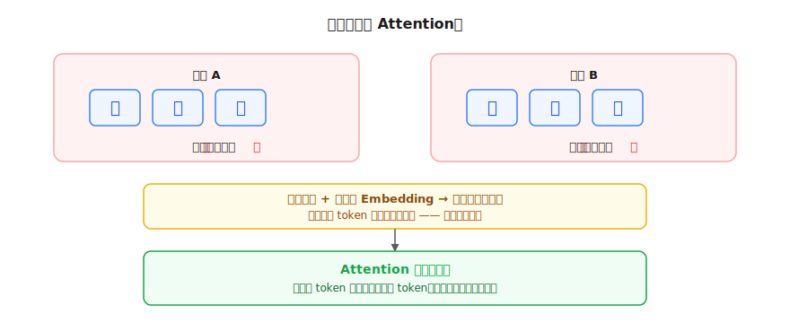
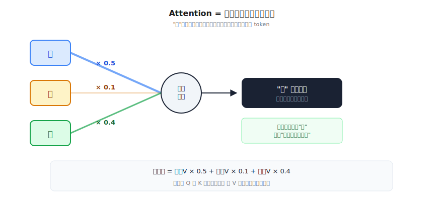
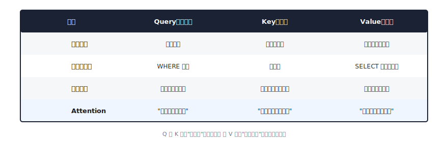
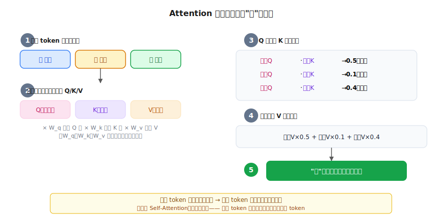

# Attention 注意力机制：让 token 互相沟通

> 一个全栈工程师的大模型学习笔记（四）

前面三篇我们搞懂了：大模型是一个预测概率的函数，文字通过 Embedding 变成向量，参数通过梯度下降不断调优。

但在"算预测"那一步里，神经网络内部到底发生了什么？具体来说——

**每个 token 的向量是独立的，模型怎么知道"猫吃鱼"和"鱼吃猫"意思不同？**

这篇来拆解大模型最核心的机制：**Attention（注意力）**。

这是整个系列最难的一篇。但别怕，我们还是老方法——一步一步推。

---

## 一、同样的字，不同的意思

看这两句话：

```
"猫 吃 鱼"
"鱼 吃 猫"
```

同样的三个字，Embedding 查出来的向量也一样。但意思完全不同：第一句是猫在吃鱼，第二句是鱼在吃猫。

**区别在于：字和字之间的关系不同。**

"吃"这个字，光看它自己是不够的——它需要知道"谁在吃"和"吃什么"。也就是说，它需要去**看一看旁边的 token**，才能确定自己在这句话里的角色。



---

## 二、看哪个 token？

那"吃"应该看哪个 token？

你可能会说"看紧挨着的前一个"。但如果句子是：

> "那只在沙发上睡觉的猫突然跳起来吃了一条鱼"

"吃"要关注的"猫"隔了好几个字。光看前一个字"来"，根本不知道谁在吃。

那"看第一个 token"？如果句子是：

> "鱼缸里的鱼看着旁边的猫吃了它的饲料"

第一个 token 是"鱼"，但吃东西的是"猫"。

**没有简单的规则能告诉你该看哪个 token。** 所以模型的策略是：

> **跟每一个 token 都比较一下，算出相关性分数，分数高的就多关注。**

这就是 Attention 的核心思想。

---

## 三、权重：谁的信息更重要？

Attention 不是"只看最相关的那个"，而是**看所有 token，按相关性分配权重**。

先忘掉所有术语，看一道小学数学题：

三个数字 a=10、b=20、c=30，权重分别是 0.5、0.3、0.2：

```
结果 = 10 × 0.5 + 20 × 0.3 + 30 × 0.2 = 5 + 6 + 6 = 17
```

如果换一组权重 0.1、0.1、0.8：

```
结果 = 10 × 0.1 + 20 × 0.1 + 30 × 0.8 = 1 + 2 + 24 = 27
```

**谁的权重大，结果就更靠近谁。** 这就是加权平均。

Attention 做的就是这件事——把每个 token 的向量按权重加在一起：



▶ [点击查看动画：Attention 按权重融合信息](assets/video/04-attention-weights.mp4)

"吃"的新向量 = 猫的信息 × 0.5 + 自己的信息 × 0.1 + 鱼的信息 × 0.4。

经过这一步：
- "猫吃鱼"里的"吃"向量，融合了"猫在前、鱼在后"的信息
- "鱼吃猫"里的"吃"向量，融合了"鱼在前、猫在后"的信息
- **同一个字"吃"，在不同上下文中得到了不同的新向量**

---

## 四、权重从哪来？

关键问题：0.5、0.1、0.4 这些权重是怎么算出来的？

**算相似度。** 就像你做搜索功能——用户输入关键词，你把关键词和每个结果比较，越匹配的排越前面。

但有个问题：用 token 原始的 Embedding 向量直接比，能比出"谁在吃"这种语法关系吗？

不能。原始向量只编码了"这个字是什么意思"，没有编码"我在找什么关系"。

所以需要**先变换一下**再比较。怎么变换？用我们的老朋友—— `W × x`（矩阵乘法）。

每个 token 的原始向量，分别通过三组不同的参数矩阵，变换出三个不同的向量：

| 名称 | 怎么来的 | 作用 | 类比 |
|------|---------|------|------|
| **Query（查询）** | 原始向量 × W_q | "我在找什么关系" | 你在聚会上的需求 |
| **Key（键）** | 原始向量 × W_k | "我能被谁匹配到" | 别人胸前的名牌 |
| **Value（值）** | 原始向量 × W_v | "匹配上后提供什么信息" | 别人实际能聊的内容 |



W_q、W_k、W_v 是三组参数矩阵，在训练中学出来的。模型通过在万亿句子上训练，自动学会了：
- 怎么生成 Query 才能找到正确的关系
- 怎么生成 Key 才能被正确匹配
- 怎么生成 Value 才能传递有用的信息

---

## 五、完整流程

把所有东西串起来，Attention 的完整计算就是五步：



▶ [点击查看动画：Q/K/V 完整计算流程](assets/video/04-qkv-flow.mp4)

用伪代码表示：

```javascript
function attention(tokens) {
  // 1. 每个 token 通过三组参数变换出 Q、K、V
  const Q = tokens.map(t => t.vector × W_q)
  const K = tokens.map(t => t.vector × W_k)
  const V = tokens.map(t => t.vector × W_v)

  // 2. 对每个 token，用它的 Q 和所有 K 算相似度
  for (const i of tokens) {
    const scores = K.map(k => dot(Q[i], k))  // 点积算相似度

    // 3. 把分数转成权重（所有权重加起来 = 1）
    const weights = softmax(scores)

    // 4. 用权重对所有 V 加权求和
    tokens[i].newVector = sum(V.map((v, j) => v * weights[j]))
  }

  return tokens  // 每个 token 都有了融合上下文的新向量
}
```

**这就是 Self-Attention（自注意力）**—— "Self"是因为每个 token 关注的是**同一个序列里的其他 token**（包括自己）。

---

## 六、一个细节：为什么要 Softmax？

第三步有一个 `softmax`——它把原始的相似度分数转成概率分布（所有权重加起来 = 1）。

```
原始分数：[2.5, 0.1, 2.4]
softmax 后：[0.50, 0.05, 0.45]  ← 加起来 = 1.0
```

为什么要这样？因为我们要做**加权平均**，权重必须加起来等于 1，否则结果会越来越大或越来越小。

Softmax 还有一个好处：它会放大差距——最大的分数会得到更大的权重，让模型更"聚焦"在最相关的 token 上。

---

## 七、Multi-Head：从多个角度看

最后一个关键概念。

回到"猫吃鱼"。"吃"需要同时知道两件事：
- **谁在吃？**（主语关系）→ 关注"猫"
- **吃什么？**（宾语关系）→ 关注"鱼"

一组 Q/K/V 只能捕捉一种关系。如果模型只有一组 Q/K/V，它可能只能找到主语，或者只能找到宾语，很难同时找到两种关系。

解决方案：**用多组 Q/K/V，每组独立计算，各自关注不同的关系。**

```
Head 1 的 Q/K/V → 可能学会了关注主语（谁在吃）
Head 2 的 Q/K/V → 可能学会了关注宾语（吃什么）
Head 3 的 Q/K/V → 可能学会了关注修饰语（怎么吃）
...
```

这就是 **Multi-Head Attention（多头注意力）**。GPT-3 用了 96 个 head，也就是同时从 96 个不同的角度去看上下文关系。

最后把所有 head 的结果拼起来，就得到了一个融合了多种上下文关系的新向量。

---

## 总结

| 概念 | 一句话解释 | 类比 |
|------|-----------|------|
| **Attention** | 让每个 token 按相关性从其他 token 收集信息 | 在聚会上按需求找人聊天 |
| **Query** | "我在找什么" | 你去聚会的需求 |
| **Key** | "我能被谁找到" | 别人胸前的名牌 |
| **Value** | "找到后提供什么" | 别人实际能聊的内容 |
| **权重** | Q 和 K 的相似度决定关注多少 | 需求和名牌越匹配越关注 |
| **Self-Attention** | 关注同一序列中的所有 token | 看看句子里每个字 |
| **Multi-Head** | 多组 Q/K/V 捕捉不同关系 | 同时关注主语、宾语、修饰等 |

**Attention 解决的核心问题：让孤立的 token 向量变成携带上下文信息的向量。**

---

## 留给你的问题

到这里，你已经掌握了大模型的四个核心拼图：

1. ✅ 大模型 = 预测下一个 token 的概率
2. ✅ Tokenization + Embedding = 文字变向量
3. ✅ 梯度下降 = 训练参数
4. ✅ Attention = 让 token 理解上下文

把它们组装在一起，就是完整的 **Transformer 架构**——大模型的骨架。

下一篇，我们来把这些零件拼成一台完整的机器：**Transformer 逐层拆解**。

---

*这是「全栈工程师的大模型学习笔记」系列第四篇。上一篇：[梯度下降](03-gradient-descent.md)。下一篇：[Transformer 完整架构](05-transformer-architecture.md)。*
