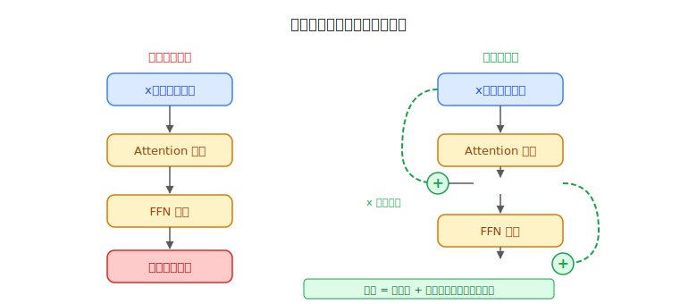
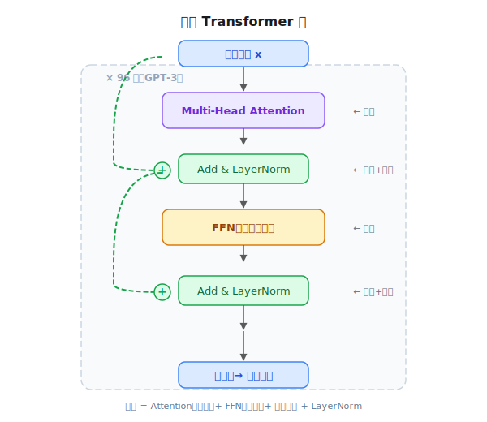
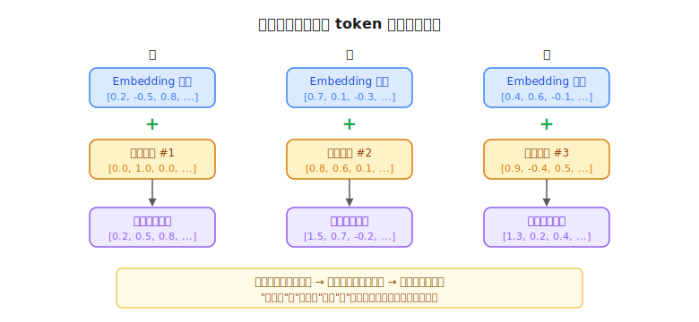
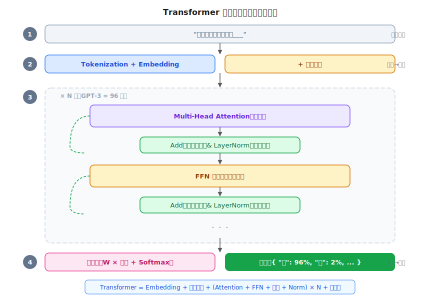

# Transformer 完整架构：把零件拼成一台机器

> 一个全栈工程师的大模型学习笔记（五）

前四篇我们搞懂了四个核心零件：

1. ✅ 大模型 = 预测下一个 token 的概率
2. ✅ Embedding = 文字变向量
3. ✅ 梯度下降 = 训练参数
4. ✅ Attention = 让 token 理解上下文

这篇来把它们拼成一台完整的机器——**Transformer**。

---

## 一、零件清单

开始之前，先盘点一下我们手里有什么：

| 零件 | 作用 | 来自 |
|------|------|------|
| **Embedding** | 把文字变成向量 | Blog 02 |
| **Attention（Q/K/V）** | 让 token 之间互相看，收集上下文 | Blog 04 |
| **梯度下降** | 训练参数的方法 | Blog 03 |
| **输出层** | 把向量变回概率，预测下一个 token | Blog 01 |

但光有这四个零件还拼不出 Transformer。还需要几个新零件——不难，一个个来。

---

## 二、先沟通，再消化

Attention 让每个 token 去"看"其他 token，收集上下文信息。比如"吃"从"猫"和"鱼"那里收集了信息。

**但收集完就够了吗？**

想想你做技术选型的过程：

1. **开会**——跟前端、DBA、运维聊一圈，收集各方意见
2. **自己想**——综合所有人的意见，独立思考，做出判断

第一步是 Attention（集体沟通），第二步需要一个新零件——**FFN（前馈网络，Feed-Forward Network）**。

FFN 其实就是 Blog 01 里的老朋友 `W × x + b`（矩阵乘法 + 激活函数），只不过这次输入的是 Attention 加工过的向量：

```javascript
// 一个 Transformer 层 = 两步
x = attention(x)   // 第一步：沟通（token 之间互相看）
x = ffn(x)         // 第二步：消化（每个 token 独立思考）
```

关键区别：
- **Attention**：token 之间互相看——集体活动
- **FFN**：每个 token 自己单独计算——独立思考

一个 Transformer 层就是这两步：**先沟通，再消化**。

---

## 三、残差连接：别忘了原来的自己

上面的流程有一个隐藏的风险。

信息经过 Attention 变换一次，又经过 FFN 变换一次。如果模型有 96 层，就要变换 192 次。**原始信息还能保留吗？**

就像你写一个数据处理管道：

```javascript
let data = originalData
data = step1(data)  // 变换一次
data = step2(data)  // 又变换一次
data = step3(data)  // 再变换一次
// originalData 的信息可能已经面目全非了
```

怎么解决？**每一步变换完，把原始输入加回来**：

```javascript
data = step1(data) + data   // 变换完，加回原来的
```



就这么一个加号，就能保证：不管变换函数做了什么，原始信息一定还在。最坏情况下，如果变换函数学出来的全是零，结果至少等于原始输入——**信息不会比输入更差**。

这个技巧叫**残差连接（Residual Connection）**。Transformer 里每一步都用：

```javascript
x = attention(x) + x    // 沟通完，加回原来的
x = ffn(x) + x          // 消化完，加回原来的
```

---

## 四、LayerNorm：防止数值爆炸

还有一个问题：数据经过几十层，每层都在做矩阵乘法和加法。**数值会怎么样？**

```
1.1 × 1.1 × 1.1 × ... （连乘 96 次）= 9227    ← 爆炸
0.9 × 0.9 × 0.9 × ... （连乘 96 次）= 0.00003  ← 消失
```

数值要么越来越大（爆炸），要么越来越小（消失），96 层下来肯定不正常。

解决方案：每层计算完之后，做一次**归一化**——把数字重新拉回到均值 0、方差 1 的范围。

就像你做数据可视化时，年薪 580000 和年龄 28 放在同一张图上，必须先把它们缩放到同一个范围，否则 28 这个数据点根本看不见。

这个操作叫 **LayerNorm（层归一化）**，Transformer 在每一步之后都做一次：

```javascript
x = attention(x) + x     // 沟通 + 残差
x = layerNorm(x)          // 拉回正常范围

x = ffn(x) + x            // 消化 + 残差
x = layerNorm(x)          // 再拉回正常范围
```

现在一个完整的 Transformer 层就齐了：



---

## 五、位置编码：告诉模型谁先谁后

还有一个容易忽略的问题。

回忆 Blog 04——Attention 用 Q 和 K 做点积来算相似度。但这个计算**完全不知道 token 的顺序**。

"猫吃鱼"和"鱼吃猫"，同样的三个字，Embedding 查出来的向量一样，Q 和 K 一样，点积也一样。但意思完全不同！

**Attention 天生不知道谁在前谁在后。**

解决方案很直接——**在进入 Attention 之前，给每个 token 的向量加上一个位置向量**：

```javascript
// 输入处理
tokens[0].vector = embedding("猫") + position(第1个)
tokens[1].vector = embedding("吃") + position(第2个)
tokens[2].vector = embedding("鱼") + position(第3个)
```



这样"猫"在第 1 位和"猫"在第 3 位，向量就不一样了。Attention 再算点积时，就能区分顺序。

这叫**位置编码（Positional Encoding）**。

---

## 六、完整流水线

现在所有零件都齐了，串成一条完整的流水线：



用代码表示：

```javascript
function transformer(inputText) {
  // 1. 文字 → token → 向量
  let tokens = tokenize(inputText)           // "从前有座山" → [从, 前, 有, 座, 山]
  let x = tokens.map(t => embedding(t))      // 每个 token 查 Embedding 表

  // 2. 加上位置编码
  x = x.map((vec, i) => vec + position(i))   // 加上"第几个"的信息

  // 3. 过 N 层 Transformer（GPT-3 是 96 层）
  for (let layer = 0; layer < 96; layer++) {
    // 沟通（Attention + 残差 + 归一化）
    x = layerNorm(attention(x) + x)

    // 消化（FFN + 残差 + 归一化）
    x = layerNorm(ffn(x) + x)
  }

  // 4. 最后一个 token 的向量 → 概率分布
  const lastToken = x[x.length - 1]
  const probs = softmax(W_output × lastToken)
  // probs = { "山": 0.01, "庙": 0.96, "楼": 0.02, ... }

  return probs
}
```

**就这么多。这就是 GPT、Claude 等大模型内部的完整架构。**

从用户输入一句话，到模型输出下一个 token 的概率，中间经过的每一步你现在都能看懂了。

---

## 七、模型的物理形态

你可能还好奇：这台"机器"在物理上是什么样的？

```
架构代码：一段 Python 程序，定义了多少层、多少个 head、向量多大
         ↓
训练前：  代码 + 一堆随机数（参数）         → 瞎猜
         ↓  经过几个月、几千张 GPU 的训练
训练后：  代码 + 调好的参数                 → 精准预测
         ↓  把参数存成二进制文件
发布：    别人下载参数文件，加载到 GPU 显存   → 就能用了
```

- 参数是一堆浮点数，存在二进制文件里（不是文本文件，因为二进制更小更快）
- 单个参数没有人类能理解的含义——意义在于几十亿个参数的配合模式
- 训练在数据中心的 GPU 集群上进行（几千到几万张显卡，跑几个月）
- 使用（推理）便宜得多——几张卡就能服务请求

---

## 总结

| 零件 | 作用 | 类比 |
|------|------|------|
| **Embedding + 位置编码** | 文字变向量，带上位置 | 给每人发名牌和号码牌 |
| **Attention** | token 之间互相沟通 | 开会收集各方意见 |
| **FFN** | 每个 token 独立思考 | 回去自己消化总结 |
| **残差连接** | 每步加回原始输入 | 笔记本上写着原始信息 |
| **LayerNorm** | 每步归一化数值 | 统一度量衡 |
| **堆叠 N 层** | 从浅到深层层理解 | 从字面意思到深层含义 |
| **输出层** | 向量变概率 | 做出最终判断 |

**Transformer = (Attention + FFN + 残差 + LayerNorm) × N 层**

这就是 GPT、Claude、Llama 等大模型的骨架。不同的模型区别只在于：层数多少、向量多大、训练数据不同——架构都是同一套。

---

## 留给你的问题

这篇我们把 Transformer 拼完了。但回顾整个系列，有一些基础概念你可能还有点模糊：

- 为什么一组数字 `[0.2, -0.5, 0.8]` 能代表一个词的含义？
- 两组数字"逐个相乘再求和"（点积）为什么能算出相似度？
- `W × x` 这个矩阵乘法到底在做什么？

这些都属于**向量**的基础知识。下一篇，我们暂停前进，回头补一课——用程序员能理解的方式，把向量、点积、矩阵乘法讲透。

---

*这是「全栈工程师的大模型学习笔记」系列第五篇。上一篇：[Attention 注意力机制](04-attention.md)。下一篇：[向量基础补课](06-vector-basics.md)。*
