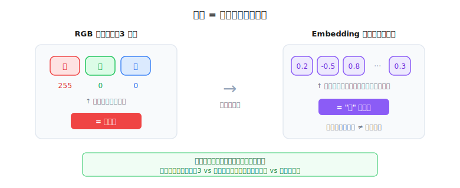
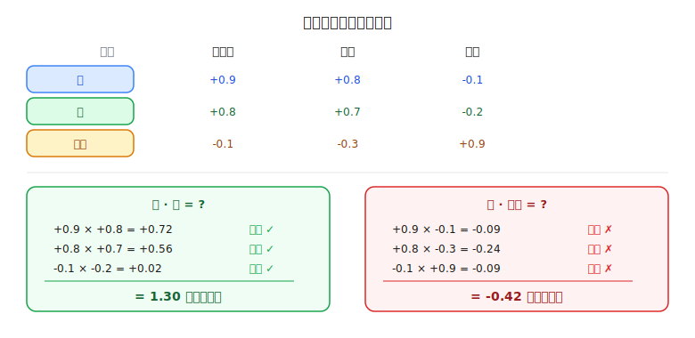
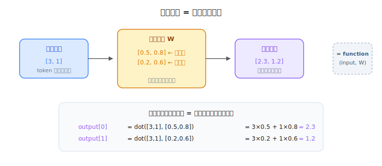
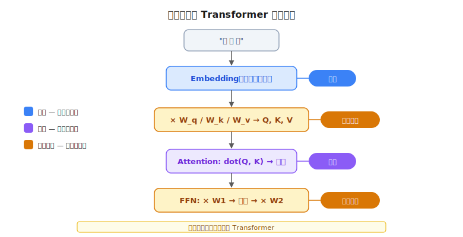

# 向量基础补课：程序员已经会的数学

> 一个全栈工程师的大模型学习笔记（六）

前面几篇我们反复提到"向量"、"点积"、"矩阵乘法"，但一直没有展开讲。如果你看到 `dot(Q, K)` 或者 `token × W_q` 的时候觉得有点晕——这篇就是为你准备的。

好消息是：**这些概念你其实已经在用了，只是没叫这个名字。**

---

## 一、向量 = 一组数字

作为程序员，你天天写数组：

```javascript
const color = [255, 0, 0]  // RGB 红色
```

三个数字放在一起，表示一个颜色。这就是一个**向量**——一组有顺序的数字，每个位置代表一个维度。

| 位置 | 含义 | 值 |
|------|------|-----|
| 第 1 个 | 红色程度 | 255 |
| 第 2 个 | 绿色程度 | 0 |
| 第 3 个 | 蓝色程度 | 0 |

RGB 是 3 维向量，每个维度的含义是人类定义的，你一看就懂。



回忆 Blog 02：Embedding 把"猫"变成 `[0.2, -0.5, 0.8, ...]`，这也是一个向量——只不过有几千个维度，而且每个维度的含义是模型在训练中自己学出来的，人类看不懂。

但这不重要。**我们不需要知道每个维度的含义，只需要知道一件事：**

> **意思相近的词，向量的数字也相近。**

"猫"和"狗"的几千个数字很接近，"猫"和"经济"的差距很大。

---

## 二、衡量差距：距离

既然向量是一组数字，怎么比较两个向量"像不像"？

最直觉的方法——**逐项相减**：

```javascript
const a = [255, 0, 0]    // 纯红
const b = [250, 10, 5]   // 接近红
const c = [0, 0, 255]    // 纯蓝

// a 和 b 的差值
a - b = [255-250, 0-10, 0-5] = [5, -10, -5]
```

但差值还是三个数字，不是一个"分数"。而且有正有负。

**直接加起来行不行？** `5 + (-10) + (-5) = -10`。试试这个：

```javascript
const x = [100, 0, 0]
const y = [0, 100, 0]

x - y = [100, -100, 0]
// 直接加：100 + (-100) + 0 = 0
```

一个偏红一个偏绿，差距很大，但得分是 0——**正负抵消了**。

解决方案：**平方每一项**（让所有值变正，而且放大大差距）：

```javascript
// a 和 b 的距离
5² + (-10)² + (-5)² = 25 + 100 + 25 = 150  // 小

// a 和 c 的距离
255² + 0² + (-255)² = 65025 + 0 + 65025 = 130050  // 大！
```

150 vs 130050——数字清楚地告诉你：a 和 b 很近，a 和 c 很远。

> **距离 = 逐项相减，平方，求和。数字越小越相似。**

---

## 三、衡量相似：点积

距离衡量的是"差多远"。大模型里还有另一种比法——**点积**，衡量的是"方向多一致"。

公式很简单：

```javascript
function dot(a, b) {
  let sum = 0
  for (let i = 0; i < a.length; i++) {
    sum += a[i] * b[i]  // 逐项相乘
  }
  return sum  // 再求和
}
```

跟距离的区别：距离是**逐项相减**再平方求和，点积是**逐项相乘**再求和。

来算一下：

```javascript
const 猫 = [0.9,  0.8, -0.1]   // 三个维度：动物性、可爱、金融
const 狗 = [0.8,  0.7, -0.2]
const 股票 = [-0.1, -0.3,  0.9]
```

**猫 · 狗：**

```
0.9×0.8 + 0.8×0.7 + (-0.1)×(-0.2)
= 0.72  +  0.56   +  0.02
= 1.30  ← 大正数！
```

**猫 · 股票：**

```
0.9×(-0.1) + 0.8×(-0.3) + (-0.1)×0.9
= -0.09    +  -0.24     +  -0.09
= -0.42  ← 负数
```

为什么？看每一项相乘时的**正负号**：



| 猫 · 狗 | 猫 · 股票 |
|---------|----------|
| 正 × 正 = **正** ✓ | 正 × 负 = **负** ✗ |
| 正 × 正 = **正** ✓ | 正 × 负 = **负** ✗ |
| 负 × 负 = **正** ✓ | 负 × 正 = **负** ✗ |
| 三项全正，加起来大 | 三项全负，加起来小 |

**规律：**
- 对应位置**同号**（都正或都负）→ 乘积为正 → 贡献"相似"
- 对应位置**异号**（一正一负）→ 乘积为负 → 贡献"不相似"

> **点积本质上就是在统计：两组数字有多少维度"方向一致"。结果越大越相似。**

这就是 Blog 04 里 Attention 用 `dot(Q, K)` 算相关性的原理——Q 和 K 方向越一致，相关性越高。

---

## 四、向量变换：矩阵乘法

最后一个概念。回忆 Blog 04，每个 token 的向量要乘以参数矩阵变成 Q：

```javascript
Q = token向量 × W_q
```

这个"乘以矩阵"到底在做什么？看一个最小的例子：

```javascript
// 输入向量（2维）
const input = [3, 1]

// 参数矩阵（2×2）
const W = [[0.5, 0.8],
           [0.2, 0.6]]

// 计算过程
output[0] = 3×0.5 + 1×0.8 = 2.3   // input 和 W 的第一行做点积
output[1] = 3×0.2 + 1×0.6 = 1.2   // input 和 W 的第二行做点积

// 输出向量
output = [2.3, 1.2]
```



发现了吗？**每个输出数字就是输入向量和矩阵某一行的点积。**

输入 `[3, 1]`，输出 `[2.3, 1.2]`。数字变了，但维度数不变。这就是一个**变换**——用代码来理解：

```javascript
function transform(inputVector, W) {
  return W.map(row => dot(inputVector, row))
}

// 矩阵乘法 = 一个参数化的函数
// W 里的数字 = 函数的参数（可学习）
// 不同的 W = 不同的变换规则
```

在 Attention 里，同一个 token 向量通过三个不同的 W 矩阵，变出三个不同用途的向量：

```javascript
Q = transform(token, W_q)  // "我在找什么"
K = transform(token, W_k)  // "我能被谁找到"
V = transform(token, W_v)  // "我能提供什么信息"
```

W_q、W_k、W_v 里的数字是模型在训练中学出来的。训练之前是随机数，训练之后就学会了怎么把原始向量变换成正确的 Q/K/V。

> **矩阵乘法 = 用一组可学习的参数，把向量从一个"视角"变换到另一个"视角"。**

---

## 五、回到大模型

现在把三个概念放回大模型的完整流程里，看看它们各自出现在哪里：



| 概念 | 用在哪 | 做什么 |
|------|--------|--------|
| **向量** | Embedding 层 | 把文字变成一组数字（向量），作为后续计算的基础 |
| **点积** | Attention 层 | Q 和 K 做点积，算出每个 token 的相关性分数 |
| **矩阵乘法** | Q/K/V 变换、FFN | 用参数矩阵把向量变换成新的向量 |

这三个运算撑起了整个 Transformer：
- **向量**是数据的表示方式
- **点积**是比较的方式
- **矩阵乘法**是变换的方式

---

## 总结

| 概念 | 一句话 | 程序员类比 |
|------|--------|-----------|
| **向量** | 一组数字，表示某样东西的特征 | `const color = [255, 0, 0]` |
| **距离** | 逐项相减再平方求和，衡量差多远 | 比较两个数组的差异 |
| **点积** | 逐项相乘再求和，衡量方向多一致 | 两组数字"同号"的程度 |
| **矩阵乘法** | 用参数把向量变成新向量 | `function transform(input, W)` |

**一个关键洞察：** 矩阵乘法的每一步其实就是在做点积——输出的每个数字 = 输入向量和矩阵某一行的点积。所以**点积是矩阵乘法的基本积木**。

现在回头看 Blog 02 到 Blog 05，那些公式应该不再陌生了。

---

*这是「全栈工程师的大模型学习笔记」系列第六篇。上一篇：[Transformer 完整架构](05-transformer-architecture.md)。*
