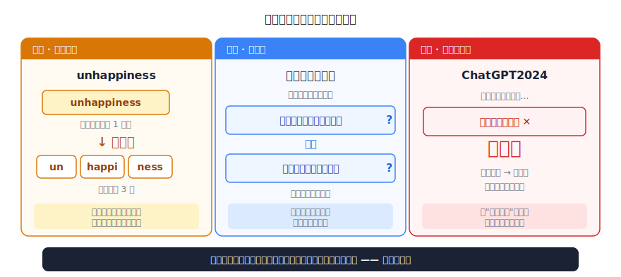
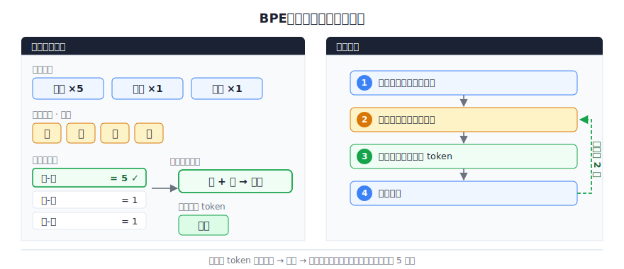
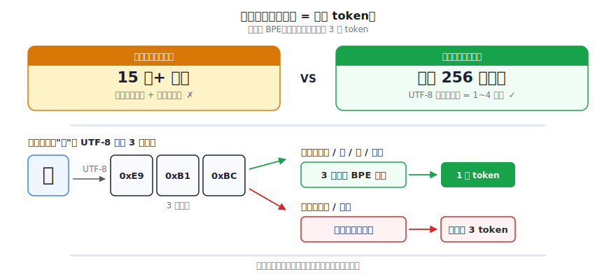
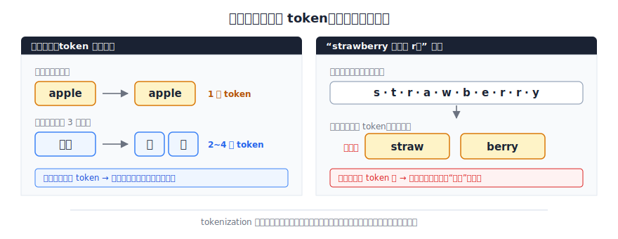

# Tokenizer 深入：BPE 算法与词表构建

> 一个全栈工程师的大模型学习笔记（七）

一个中文字，为什么常常被拆成三个 token？

这篇文章带你从零推导出答案——顺便搞懂一件事：当你看 Hugging Face 上任何一个模型卡片，那些 `vocab_size`、`byte-level BPE`、`50257 tokens` 的字眼，到底在说什么。

---

## 一、Blog 02 留下的尾巴

第二篇我们得出过一个结论：处理文字的最佳方案是**子词（subword）**。

```
"unhappiness" → ["un", "happi", "ness"]   → 3 个 token
```

- "un" 是否定前缀，"happi" 是快乐，"ness" 是名词后缀
- 词表只需要几万个子词，就能组合出任意文本

当时我们说："词表约 10 万个 token，就够用了。"听起来很完美。

但有一个问题，我当时偷偷绕过去了，现在得还债——

**这些切分点，是谁定的？**

凭什么是 `un / happi / ness`，而不是 `unha / ppi / ness`？凭什么"happi"是一块，而不是"hap"加"pi"？总得有人、或者有个程序，坐下来把每个词该怎么切定下来吧。

是谁？按什么标准？

---

## 二、假如这活儿交给你

我们来当一回设计者。

假设我把整个互联网——一亿篇文章——倒给你，再给你一个硬约束：**词表大小固定，比如 5 万**。你的任务是决定哪 5 万个"字符片段"进词表。

你会用什么标准来挑？

先别急着想算法。想想常识：如果你只能选 5 万个零件来拼出所有文章，你会选**常用的**还是**罕见的**？

当然是常用的。"the"、"ing"、"的"、"是"——这些天天出现的片段，必须进词表，进了就能反复复用。而"魑魅魍魉"这种一亿篇里出现三次的，进词表纯属浪费名额。

所以你的直觉已经给出了标准：**统计频率，高频的优先进词表。**

方向对了。但魔鬼在细节里。

---

## 三、先有鸡还是先有蛋

很多人（包括当初的我）的第一反应是："那就统计**词**的频率呗，按空格切开，数哪个词出现得多。"

听起来合理。我们试试。

第一个麻烦——**英文**：

```
"unhappiness"
```

按空格切，它就是 **1 个词**。可我们明明想要 `un / happi / ness` **三块**。空格帮不了我们，它只知道单词边界，不知道单词**内部**该怎么切。

第二个麻烦——**中文**：

```
"我昨天买了会员"
```

一个空格都没有。"我昨天买了会员"是一个词？还是"我 / 昨天 / 买 / 了 / 会员"？切点在哪，空格压根没告诉你。

第三个麻烦——**新词**：

```
"ChatGPT2024"
```

词表里从来没见过这个组合。它算一个词，还是"Chat / GPT / 2024"？你拿什么标准判断？

发现矛盾了吗——

> 我们本来想用"统计词频"来决定怎么切词。可是"什么算一个词"**本身**就是我们要解决的问题。

这是个先有鸡还是先有蛋的死循环：要数词频，得先知道怎么切词；要知道怎么切词，又得先有词频。**不能把"词"当成前提，因为"词"正是我们要造出来的东西。**



得换条路。

---

## 四、退到不会有歧义的地方

"词"这个概念太模糊、太依赖语言习惯，靠不住。

那就退一步：有没有一种单位，**任何文本都能切、切出来永远没有歧义、不需要任何语言知识**？

有。**字符**。

```
"unhappiness" → u n h a p p i n e s s
"我昨天买了会员" → 我 昨 天 买 了 会 员
```

不管英文中文、不管见没见过这个词，逐个字符拆开，绝对不会卡住，绝对没有"该不该切"的争议。一个字符就是一个字符。

所以词表的**起点**有了：把语料里出现过的所有单字符，全都放进词表。这是一个谁都没法反驳的基础。

每个文本现在都能 100% 拆成"已知字符"的序列。地基稳了。

---

## 五、再退一步：从字符到字节

不过这个地基有个隐患。

"把出现过的所有单字符放进词表"——到底有多少个字符？

英文好说，二十六个字母加标点，撑死一百来个。但 Unicode 收录了 **15 万+** 个字符：所有汉字、日文假名、阿拉伯文、各种 emoji……如果基础词表要装下它们全部，光地基就 15 万，5 万的总预算直接爆掉。

更糟的是：**总有你没见过的**。明天出个新 emoji，后天有人用一个你训练时没收录的生僻字——基础词表里没有，整个文本就拆不下去了。

我们要的是"任何文本都能切"，结果字符这个单位还是不够通用、不够稳定。

有没有比字符更小、更通用、数量还固定的东西？

提示一下：计算机里，所有东西归根结底是什么？

**0 和 1。** 二进制。

那干脆用 bit（位）当最小单位？只有两种值，0 和 1，永远不会爆，任何数据都能表示。

但 bit 太碎了。一个字符拆成一串 0101，单个 bit 几乎不携带任何信息，而且序列会变得**长 8 倍**——本来 100 个字符，变成 800 个 0/1，模型要处理的步骤暴增。太亏。

往上凑一档：**8 个 bit 打包成 1 个字节（byte）**。

字节的好处，每一条都正中要害：

- 1 字节 = 8 bit，正好 **256 种**可能的值（0~255），数量**固定**，永远是 256，不多不少
- UTF-8 编码下，**任何** Unicode 字符都是 1~4 个字节的组合——英文字母 1 字节，汉字通常 3 字节，emoji 多为 4 字节
- 256 个字节能拼出**世界上任何文本**，包括明天才发明的新字、新 emoji

于是基础词表彻底确定了：**就这 256 个字节，固定，永不爆炸，永不缺货。**

记住"字节"这个词——它就是接下来那个算法名字里 **Byte** 的由来。

---

## 六、动手：词表是怎么"长"出来的

地基有了（256 个字节）。但光有 256 个字节，每个汉字 3 个 token、每个英文单词一堆 token，序列长得没法用。我们要的是把高频片段合并成大块。

怎么合并？还记得第二节的直觉吗——**统计频率，高频优先**。现在我们把它落到地上。

为了看清楚，我们用一个迷你语料（先用"字"演示，字节版原理一模一样，下一节揭晓）：

```
新闻   （出现 5 次）
旧闻   （出现 1 次）
新人   （出现 1 次）
```

**第一步**：全部拆成最小单位。当前词表 = `新` `闻` `旧` `人`。

```
新 闻      ×5
旧 闻      ×1
新 人      ×1
```

**第二步**：统计所有**相邻的两个单位**（相邻对）出现了多少次：

| 相邻对 | 频次 |
|--------|------|
| 新-闻 | 5 |
| 旧-闻 | 1 |
| 新-人 | 1 |

**第三步**：把**频次最高**的那一对——`新-闻`（5 次）——合并成一个新 token `新闻`，加进词表。

现在词表 = `新` `闻` `旧` `人` `新闻`，语料变成：

```
新闻      ×5     ← "新闻"现在是一个整体了
旧 闻      ×1
新 人      ×1
```

停下来体会一下刚才发生了什么：

> 我们**没有用任何语言学知识**。没有词典、没有语法、没有人告诉机器"新闻"是一个词。我们只是数了数哪两个东西最常贴在一起，然后把它们粘起来。

"新闻"这个 token，是**自己浮现**出来的。

这就是第一节那个问题——"切分点是谁定的？"——的答案：

**没人定。是统计出来的。**

---

## 七、把它写成一个循环

一次合并只能造一个 token。我们想要 5 万个，那就重复。把上面三步写成程序员熟悉的循环：

```
while 词表大小 < 目标大小:
    1. 把语料拆成当前最小单位序列
    2. 统计所有相邻对的频次
    3. 找出频次最高的一对，合并成新 token，加入词表
    # 回到第 1 步，继续
```



接着上面的例子跑下去：下一轮，如果语料里 `新闻` 后面经常跟 `联`、`联` 后面经常跟 `播`，那么几轮之后会依次合并出 `新闻联` → `新闻联播`。

规律就出来了：

- **跑得越久，token 越长**：`新` → `新闻` → `新闻联播`
- **高频组合长成大块**：天天出现的，被一步步粘成一个 token
- **低频的留作碎片**：没人爱搭理的生僻组合，永远停在单字节/单字符

什么时候停？词表凑够目标大小（比如 5 万）就停。停下来的那一刻，所有的合并规则按顺序记下来，这套规则就是这个模型的 **Tokenizer**。以后来一段新文本，照着这套规则切就行。

---

## 八、命名：这就是 BPE

你刚才亲手推导的这个算法，有个正式名字：

**BPE（Byte Pair Encoding，字节对编码）。**

拆开看，名字本身就是说明书：

- **Byte**：基础单位是字节（第五节我们推出来的那 256 个）
- **Pair**：每次盯的是相邻的**一对**
- **Encoding**：合并成新 token，本质是一种编码方式

一个冷知识：BPE 不是 AI 时代的发明。1994 年，一个叫 **Philip Gage** 的人发明它，本来是用来做**数据压缩**的——把文件里最常见的字节对，替换成一个没用过的字节，文件就变小了。三十年后，研究者发现：诶，这套"把高频组合合并成新符号"的思路，拿来造词表正合适。

如果你觉得"合并高频组合让序列变短"这件事似曾相识——没错，它**本质就是压缩**。Huffman 编码、gzip，背后都是同一种味道：**常见的东西用短编码，罕见的东西用长编码。** BPE 只是把这套老智慧搬到了 token 上。

---

## 九、揭晓谜题：一个汉字为什么是三个 token

现在我们攒齐了所有零件，回到开头那个问题。

先看一个事实。汉字"鱼"在 UTF-8 编码里，不是 1 个字节，而是 **3 个字节**：

```
"鱼" → 0xE9 0xB1 0xBC      （三个字节）
```

而 BPE 的基础词表只有 256 个字节。所以**一开始**，"鱼"在模型眼里是 `[0xE9][0xB1][0xBC]` 三个独立的 token。

接下来就看 BPE 那台"数频率"的机器愿不愿意把它们合并了。规则你已经很熟了：**高频才合并。**

于是分成两种命运：

- **常用字**（`的` `是` `我` `鱼`）：在海量中文语料里高频出现 → 它那 3 个字节天天一起出现 → BPE 几轮就把它们合并成 **1 个 token**
- **生僻字**（`鳕` `饕` `魑` `魅`）：出现得太少 → 那几个字节凑不够频次 → BPE 懒得合并 → 它们一直**停在 2~3 个 token**



这就是谜底：

> 一个中文字被拆成几个 token，**没有人专门为中文定规则**。它纯粹是"字节级 BPE + 统计频率"的**副作用**——常用字被合并了，生僻字没轮上。

为什么英文显得"占便宜"？因为英文字母本来就在那 256 个字节里（1 个字母 = 1 个字节），常用单词如 `apple`、`the` 又高频，几下就合并成 1 个 token。而中文每个字天生 3 字节起步，得靠"足够常用"才能换回 1 个 token 的待遇。

起跑线本来就不一样。

---

## 十、程序员会踩的三个坑

理解了上面这条因果链，很多平时觉得"莫名其妙"的现象，瞬间就通了。

**坑一：同样一段话，中文调 API 比英文"贵"。**

API 按 token 计费、按 token 限制上下文长度。英文 `apple` 高频，1 个 token 搞定；中文每个字 3 字节起步，常用字才换回 1 token，稍微生僻一点就是 2~3 个。结果同样信息量的一段话，中文的 token 数往往比英文多——**更费 token、更费钱、上下文窗口更快被撑满**。不是你错觉，是 tokenization 的账。



**坑二：大模型数不清 strawberry 有几个 r。**

这是个经典翻车现场。但现在你应该能猜到原因了——

模型看到的 `strawberry` 不是 10 个字母，而是被切成 `straw`、`berry` 这样的**几个 token**（具体切成几块取决于词表）。在模型眼里，"字母"这个层级**根本不存在**，它从来没见过孤立的 `r`，只见过被打包好的 token。让它数 `r`，相当于让你数一个你看不见内部结构的盒子里有几颗螺丝。

**它不是笨，是 tokenization 把"字母"这个信息藏起来了。**

**坑三：偶尔蹦出半个乱码字。**

大模型是**逐 token** 生成的。生僻字往往是好几个字节拼起来的，如果模型在字节还没凑齐时就停了（比如刚好到了长度上限），你看到的就是一个 UTF-8 解不出来的"半个字"——那串字节不构成一个完整字符，于是渲染成乱码方块。

这三个坑，根子都在同一处：**模型处理的从来不是"文字"，是 token。**

---

## 总结

| 概念 | 一句话解释 | 类比 |
|------|-----------|------|
| **字节（byte）** | 最小、最通用的基础单位，固定 256 种 | 乐高里最小的那种基础颗粒 |
| **相邻对合并** | 数哪两个单位最常贴在一起，粘成新 token | gzip 把高频组合换成短编码 |
| **BPE** | 反复合并最高频相邻对，直到词表够大 | 滚雪球：高频片段越滚越大 |
| **词表（vocab）** | 所有 token 的集合，大小固定 | 一套可复用的零件清单 |

把这一篇串起来：

1. "怎么切词"不能靠"词"本身——先有鸡还是先有蛋
2. 退到**字节**，得到一个永不爆炸的 256 个基础单位
3. **BPE** 靠纯统计反复合并高频字节对，词表自己长出来
4. 常用字被合并、生僻字留碎片——这就是"一个汉字三个 token"的真相

现在再去看 Hugging Face 上任何一个模型卡片，`vocab_size=50257`、`byte-level BPE` 这些字眼，你应该能一眼读懂它在说什么了。

---

## 留给你的问题

词表造好了，文字能稳稳变成 token 序列了。Blog 02 那条流水线的入口，彻底打通了。

但还有一件大事没交代。

回想一下：模型那**几十亿个参数**，在训练**开始之前**，全是**随机数**——Embedding 表是随机的，每一层的权重矩阵也是随机的。一个塞满随机数的模型，输出当然是一片胡言乱语。

可我们见到的大模型，能写代码、能翻译、能讲笑话。从"一堆随机数"到"会说话"，中间到底发生了什么？

答案是四个字：**喂万亿 token**。

但"喂"具体是怎么喂的？模型怎么从天文数字的文本里，把语言能力一点一点**练**出来，最后把那些随机数调成"懂中文、懂英文、懂代码"的参数？

这就是第二阶段的核心——**预训练（Pre-training）**。下一篇，我们来看这场"大力出奇迹"的训练，到底是怎么发生的。

---

*这是「全栈工程师的大模型学习笔记」系列第七篇，第二阶段「训练的秘密」第一篇。上一篇：[向量、点积、矩阵乘法：补一节数学课](06-vector-basics.md)。如果你也是一个对 AI 好奇的程序员，欢迎一起上路。*
