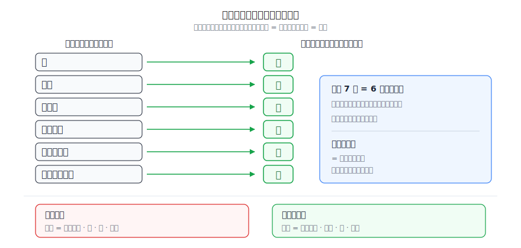
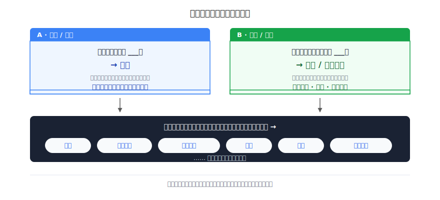
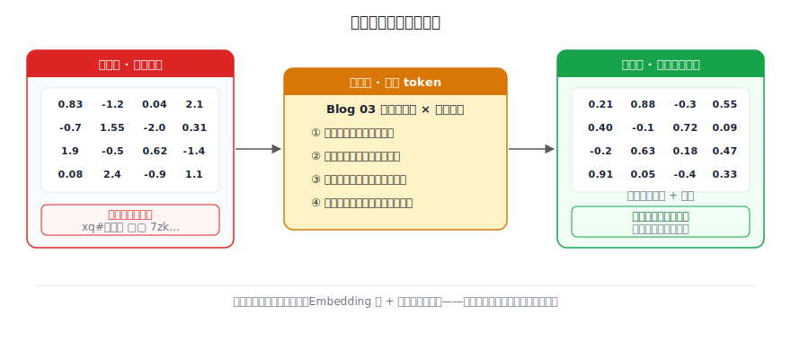
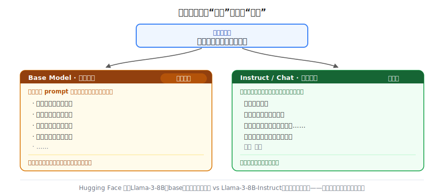

# 预训练：从随机噪声到语言能力

> 一个全栈工程师的大模型学习笔记（八）

万亿 token 喂进去，模型到底学到了什么？

这篇文章带你从零推导出答案——顺便搞懂一件事：当你在 Hugging Face 上看到 `Llama-3-8B` 和 `Llama-3-8B-Instruct` 并排躺着，名字就差一个 `Instruct`，那道分界线到底是什么。

---

## 一、Blog 07 留下的尾巴

上一篇结尾，我们站在一个悬崖边上。

模型那几十亿个参数，在训练**开始之前**，全是**随机数**——Embedding 表是随机的，每一层的权重矩阵也是随机的。一个塞满随机数的模型，输出当然是一片胡言乱语：

```
输入：今天天气
随机参数模型输出：氪 ## 翻 9 的彼
```

可我们见到的大模型，能写代码、能翻译、能讲笑话。从"一堆随机数"到"会说话"，中间到底发生了什么？

当时我给了四个字的答案：**喂万亿 token。**

但"喂"这个动作，具体是怎么做的？这上万亿的文本，是怎么把那一堆随机数，一点一点调成"懂中文、懂代码、懂推理"的数的？

这一篇，我们把"喂"这个字拆开看。

---

## 二、先别急，其实没有新魔法

学新东西，第一步永远是**锚定**——看看手里已经有什么零件。

Blog 03 我们推过一个东西，叫**训练四步循环**。我把它默写一遍，你回忆一下：

```
① 前向预测   把一段输入喂进模型，让它预测下一个 token
② 算损失     比一比：预测的，和正确答案，差多少
③ 反向传播   算出每个参数，该往哪个方向调、调多少
④ 更新参数   照着调一遍，然后回到 ①，再来一轮
```

Blog 01 我们还得出过：大模型的本质，就是**预测下一个 token**。

好。现在请你把这两件事摆在一起想一秒钟——

> 所谓"预训练"，会不会根本不是什么新东西，而就是把 Blog 03 那个循环，在**海量文本**上**疯狂地跑**，把随机参数一点一点调对？

是的。就这么简单。**预训练没有新机制**，它只是把你已经懂的那个四步循环，规模拉到天文数字：在整个互联网级别的文本上，跑上万亿次。

所以这篇真正的问题，不是"循环怎么转"——那你已经会了。真正的问题藏在第 ② 步里。

---

## 三、第 ② 步有个大窟窿

我们把镜头怼到第 ② 步：**算损失**。

算损失要干嘛？要拿模型的**预测**，去比**正确答案**，看差多少。

```
输入：我家的猫爱吃
模型预测：鱼（概率 3%）
正确答案：鱼
→ 差距很大，损失高，该挨调
```

注意那行"正确答案"。它从哪来？

这是监督学习的老规矩了：你得喂模型一对一对的 `(输入, 正确答案)`。要练出语言能力，得喂**上万亿对**。

那好，问题来了——

> 这上万亿对答案，谁来提供？

你想想监督学习平时是怎么搞的。要教模型认猫狗，得有人坐那儿，一张一张地给十万张图片打标签："这张是猫""这张是狗"。这叫**人工标注**。

现在我们要的不是十万对，是**上万亿对**。每一对都是"给定一段话，正确的下一个词是什么"。

请你诚实地算一笔账：有没有任何一个团队，雇得起人，手工标注一万亿个词的"下一词答案"？

没有。这个成本是天文数字，根本不可能。地球上所有的标注工加在一起，干到世界末日也标不完。

可大模型明明就练出来了。所以这上万亿对自带答案的训练数据，**一定有个不花钱的来源**。

它在哪？

---

## 四、答案，就藏在句子里

别想复杂了。我们退回到最朴素的地方，盯着一句普通的话看：

```
我家的猫爱吃鱼
```

这句话，是某个人**早就写好**的。它本身就是"正确的"——一个正常人就是这么说话的。

现在，我做一个小动作：把最后一个字**挡住**。

```
我家的猫爱吃 ___
```

请你回答：这个被挡住的字是什么？

你脱口而出：**鱼**。

停一下，体会刚才发生了什么——

> 我没有请任何人来告诉你答案是"鱼"。**那个被挡住的字，自己就是标准答案。** 它本来就写在那儿，我只是先把它盖住，让模型猜，再揭开对答案。

不用标注。不花一分钱。一句本来就存在的话，天然自带了它自己的"下一词答案"。

而且——一句话能榨出的，远不止一对。我们用滑窗（一个字一个字往后挪）把它全榨出来：

```
输入「我」           → 答案「家」
输入「我家」         → 答案「的」
输入「我家的」       → 答案「猫」
输入「我家的猫」     → 答案「爱」
输入「我家的猫爱」   → 答案「吃」
输入「我家的猫爱吃」 → 答案「鱼」
```

一句 7 个字的话，榨出了 **6 对**训练数据。每一对都免费、自带正确答案、不需要任何人插手。



现在把这个动作放大到**整个互联网**：所有的网页、书籍、代码、论坛帖子……每一句话都能这么榨。

结果就是——**万亿级、零成本、自动标注好的训练对**，凭空出现了。

这就是第三节那个问题的解答：

> 这上万亿对答案，没有谁来提供。**文本自己就是答案。**

---

## 五、命名：这叫自监督学习

你刚才亲手发现的这套做法——**不另外找答案，而是把数据自己的一部分挡住，拿它当答案**——有个正式名字：

**自监督学习（Self-Supervised Learning）。**

名字本身就是说明书：监督（有正确答案可对）+ 自（答案是数据"自己"提供的，不是外人标的）。

跟它对照着看，你立刻就懂了：

| | 监督学习 | 自监督学习 |
|---|---------|-----------|
| **答案哪来** | 人工标注 | 数据自己提供 |
| **典型例子** | 给十万张图片标"猫/狗" | 把句子的下一个词挡住 |
| **成本** | 贵、慢 | 几乎免费 |
| **数据量上限** | 有限（人标得过来才行） | 海量（整个互联网） |

请把这张表的最后一行刻在脑子里，因为它是整个预训练"大力出奇迹"的**前提**：

> 正因为答案是白送的，模型才**喂得起**整个互联网。

如果每对答案都要花钱请人标，万亿规模的训练**从经济上就不可能发生**。自监督这一招，把"答案"这道成本墙直接拆了——这才是大模型能"大力"的根本原因。

---

## 六、"预测下一个词"，凭什么练出会写代码的脑子？

到这儿，很多人（包括当初的我）心里会犯嘀咕：

> 这任务也太弱智了吧？不就是**文字接龙**吗？挡一个字让它猜下一个字。这种小儿科游戏，凭什么能练出会写代码、会翻译、会推理的大模型？

这个怀疑很合理。我们来认真对待它——做两道接龙题，你自己来填。

**A 题：**

```
中国的首都是 ___
```

正确答案：**北京**。

现在请你想象一个**老外**：他中文语法学得无可挑剔，主谓宾、的地得用得比你还溜，但他从没听说过中国这个国家。他能填对这个空吗？

填不对。因为"北京"这个答案，**不在语法里**。它是一条**事实**。要填对 A 题，光会说话的规则不够——脑子里必须额外**存着关于世界的知识**。

**B 题：**

```
他把水倒进杯子，结果水 ___
```

正确答案：**满了 / 溢出来了**。

这个答案，你查任何一本字典都查不到。但你毫不费力就填出来了。怎么填出来的？你在脑子里**模拟**了一下：水，倒进，杯子，杯子有限……于是水会满、会溢。

这要的不是查表，是**推理**——得从海量文本里学到"水、杯子、满、溢"之间的常识关联，在脑子里粗略**模拟**出会发生什么（你可以把这种能力理解为一种朴素的"世界模型"）。



好，现在把 A、B 两题的结论收一收：

- A 题逼出来的是 **事实知识**（北京是中国首都）
- B 题逼出来的是 **推理 / 常识**（水满了会溢）

而模型要做的，是在**整个互联网**上，把**每一个**下一词都尽量猜准。互联网上有 A 这种句子，也有 B 这种句子，还有代码、数学公式、英汉对照、莎士比亚、菜谱……

要把这些全猜准，模型**被迫**顺带学会：

```
语法规则        （否则连句子都接不顺）
事实知识  ← A   （否则填不对"北京"）
推理常识  ← B   （否则填不对"溢出来"）
翻译能力        （否则接不上中英对照语料的下一句）
代码逻辑        （否则补不全 GitHub 上那行代码）
写作风格        （否则模仿不了莎士比亚的下一行）
数学            （否则算不出公式的下一步）
……
```

于是怀疑被反过来了：

> "预测下一个词"看着弱智，其实是个**万能任务**。人类把多少东西编码进了语言，模型为了猜准下一词，就被迫学多少东西。

这就是副标题那个问题——"到底学到了什么"——的答案：**语言里编码了多少世界，模型就学进去多少世界。**

顺便，"为什么要大力"也有了答案：数据越多、参数越多，能压进去的世界就越大。这不是堆料，是**世界的容量**之争。

---

## 七、这些东西，到底存在哪？

模型"学到了知识和推理"——这话好听，但作为程序员，你应该追一句：**它物理上存在哪儿？**

回到 Blog 02 和 Blog 07 我们反复确认过的那件事：模型里那些会被训练改动的数，统统叫**参数**。它们就两类：

- **Embedding 表**：每个 token 对应的那个高维向量
- **每一层的权重矩阵**：Attention、前馈网络里那一堆矩阵

训练**唯一**能改的，就是这些数。所以无论模型"学会"了什么，最终都只能**落到参数的数值上**。



于是预训练这整件事，可以用一句话说干净：

> 预训练，就是把一堆**随机数**，靠四步循环在万亿 token 上反复调，最后调成一组"**懂知识、会推理**"的数。

"北京是中国首都"不是存在某个数据库的某一行里，而是**弥散在几十亿个参数的数值关系中**。这也顺带解释了一个常见困惑：为什么大模型会"记错事实"、会"一本正经胡说八道"——因为知识从来不是被精确存储的条目，而是被**统计平均**进了参数里。它记的是"倾向"，不是"档案"。

---

## 八、裂缝：你拿到的是一台续写机，不是助手

到这一步，预训练似乎大功告成了。我们手里有了一台顶级的 **next-token 预测机**：知识有了，推理有了，参数也从噪声调成了语言能力。

那它是不是就是你天天用的那个聊天助手了？

做个实验，你就知道哪里不对劲了。

**实验一**，喂它一句陈述句的开头：

```
输入：中国的首都是
输出：北京。北京是中华人民共和国的首都，位于华北平原……
```

流畅、正确，完美。

**实验二**，这次我们**问它一个请求**：

```
输入：请帮我写一封辞职信
```

你期待它写信。但请你站在它的角度想一想：它脑子里**唯一**会做的事是什么？

它会做的，是 Blog 01 那个本能——"互联网上，这行字后面，**统计上最常接什么**"。

而互联网上"请帮我写一封辞职信"这行字后面，经常出现的……是一个**列表**。它的输出并不固定，但很可能是这样一种：

```
输入：请帮我写一封辞职信
输出：请帮我写一封请假条
      请帮我写一封感谢信
      请帮我写一封道歉信
      请帮我写一封推荐信
      ……
```

它没疯。它**忠实地续写了文本的统计分布**——把你的请求,当成了某个"待办清单 / prompt 列表"里的一条，然后老老实实往下列。

它完全**没有满足你的请求**。



为什么会这样？把前面几节连起来，答案其实呼之欲出：

> 预训练只教了它一件事——**模仿文本、续写下一词**。从来没有人教过它："当一个人问你，你要**回答**""你要做一个**有用、听话**的助手"。

知识，它有了（实验一证明了）。推理，它也有了（第六节证明了）。但"**服从指令、乐于助人**"这个**行为**，预训练这道工序里**压根没有**——互联网文本里没有谁专门示范"被请求时要照做"，模型自然学不到。

这种"只会续写、还不会当助手"的半成品模型,有个名字：

**基座模型（Base Model）。**

现在，回到本篇开头那个 Hugging Face 上的谜题。你在模型列表里看到的这两行——

```
Llama-3-8B            ← base，预训练的产物，只会续写的半成品
Llama-3-8B-Instruct   ← 被调教成听话助手之后的成品
```

——它们的差别，**就是预训练之后那道还没讲的工序**。`base` 是这一篇的终点，`Instruct` 是下一篇的起点。

---

## 总结

| 概念 | 一句话解释 | 类比 |
|------|-----------|------|
| **自监督学习** | 不找外人标注，把数据自己的一部分挡住当答案 | 自己出题自己判，答案早写在卷子上 |
| **next-token prediction** | 反复猜"下一个词"，一个万能任务 | 一道接龙题，逼你顺带学会整个世界 |
| **预训练** | 在万亿 token 上跑四步循环，把随机参数调成语言能力 | 把一锅噪声，慢炖成会说话的数 |
| **基座模型（Base）** | 预训练的产物，有知识有推理，但只会续写、不会当助手 | 读完整个图书馆、却不知道要回答问题的人 |

把这一篇串起来：

1. 预训练**没有新魔法**——就是 Blog 03 的四步循环，规模拉到万亿
2. 第 ② 步要"正确答案"，但万亿对答案没人标得起——**文本自己当答案**，这叫**自监督**
3. "预测下一个词"看着弱智，其实是**万能任务**，逼模型把语言里的知识、推理、代码、翻译全学进去
4. 学到的一切都**落进参数**——随机数被调成了"懂知识的数"
5. 但预训练只教会**续写**，没教**服从指令**——所以你拿到的是 **base 基座模型**，不是助手

现在再去看 Hugging Face 上任何一个模型卡片，"pretrained on 2T tokens""base model""self-supervised"这些字眼，你应该能一眼读懂它在说什么了。

---

## 留给你的问题

预训练结束，我们手里这台机器，肚子里装着整个互联网的知识，脑子里能模拟世界——可它就是不肯**听话**。你问它问题，它把你的问题当成一段文本接着往下抄。

知识它有，推理它有，唯独缺了那个最关键的转变：**从"续写文本"变成"回答问题"**。

那么——

**怎么把这台只会续写的机器，调教成一个会听指令、乐于助人的助手？**

这个转变，不可能再靠"挡住下一个词"来完成了——因为互联网文本里，根本没有"被请求就照做"这种示范。我们需要一种新的训练方式，专门教它"服从"。

而且做这件事，甚至常常**不必从头重训那几十亿个参数**——下一篇会讲到一种省力的办法（LoRA），用很小的代价就能改变模型的行为。但请记住：让 base 变成听话助手，靠的是这道"教它服从"的**对齐**工序本身，LoRA 只是把它做得更省力的手段，不是变身的关键。

这就是下一阶段的核心——**微调与对齐**。下一篇，我们来看这道把"续写机"变成"助手"的工序，到底是怎么做的。

---

*这是「全栈工程师的大模型学习笔记」系列第八篇，第二阶段「训练的秘密」第二篇。上一篇：[Tokenizer 深入：BPE 算法与词表构建](07-tokenizer-bpe.md)。下一篇：《微调与 LoRA：让通才变专家》。如果你也是一个对 AI 好奇的程序员，欢迎一起上路。*
