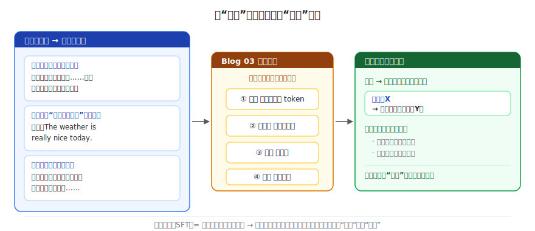
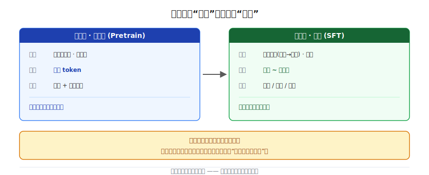
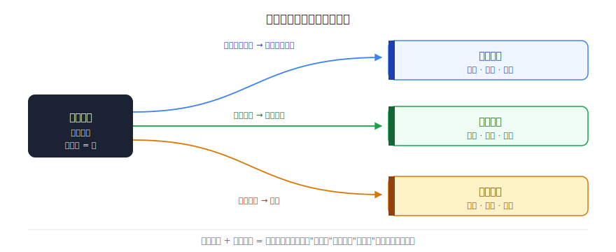
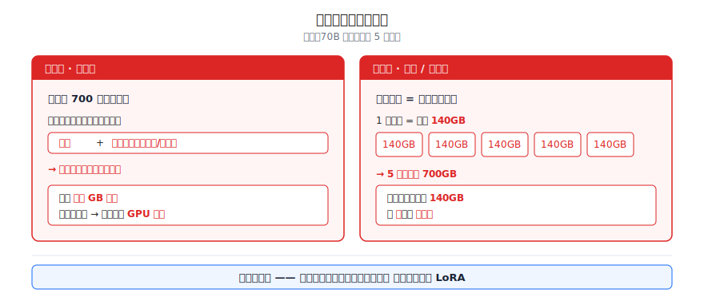

# 微调：让通才变专家

> 一个全栈工程师的大模型学习笔记（九）

怎么把"只会续写的基座"调教成"听话的助手"？

这篇文章带你从零推导出答案——顺便搞懂一件事：当你在 Hugging Face 上翻一个模型卡片，看到 `SFT`、`instruction-tuned`、`fine-tuned on 50k examples`、`full fine-tuning` 这些字眼，到底在说什么。

---

## 一、Blog 08 留下的尾巴

上一篇结尾，我们手里攥着一台很拧巴的机器。

它叫**基座模型（base model）**，是预训练的产物。它肚子里装着整个互联网的知识，脑子里能模拟世界——你问它"中国的首都是"，它对答如流。但你一旦**请求**它做点什么：

```
输入：请帮我写一封辞职信
输出：请帮我写一封请假条
      请帮我写一封感谢信
      请帮我写一封道歉信
      ……
```

它没疯。它只是忠实地干了它**唯一**会的事——续写：互联网上"请帮我写一封辞职信"这行字后面，统计上最常接的，是一个待办清单。它把你的请求当成了清单里的一条，老老实实往下列。

所以 Blog 08 我们得到了两条结论，请你先记牢，这一篇全靠它们：

> ① 模型的一切本领，都来自**模仿它见过的文本里的模式**。
> ② 它不会服从指令，恰恰是因为**互联网文本里没人示范"被要求就照做"**。

现在目标很清楚了：把这台只会续写的机器，调教成一个**会听指令、乐于助人的助手**——甚至更进一步，调教成**某个领域的专家**。

怎么调？这一篇，我们来推。

---

## 二、缺什么，就补什么

学新东西，第一步永远是**锚定**——盯着手里已有的零件看。

我们手里的零件，就是上面那两条结论。把它们摆在一起，多看两眼，你会发现它俩其实是**同一句话的两半**：

- 模型学会了知识、学会了推理，是因为文本里**有**知识和推理给它模仿。
- 模型没学会服从，是因为文本里**缺**了"服从"这种示范。

请你顺着这个逻辑往下推一步——既然它的本事全靠"模仿见过的东西"，那它没学会的东西，问题只可能出在哪？

> 出在它**没见过**。它没学会服从，不是因为它笨，是因为没人给它**示范过**服从长什么样。

那解法就自己浮出来了，朴素得有点好笑：

**缺什么，就补什么。** 缺"服从"的示范，那我们就**造一批"服从"的示范**喂给它。

就这么简单。难的不是这个思路，难的是相信它真的够用——别急，我们一步步把它坐实。

---

## 三、"服从"的示范，长什么样？

要造示范，先得想清楚：一条"服从"的示范，具体长啥样？

别想复杂了。"服从"无非就是——**有人提了个指令，然后给出了一个理想的回答**。那一条示范就是这么一对东西：`(指令 → 理想回答)`。

举几个例子，你立刻就懂了：

```
指令：帮我写一封辞职信
回答：尊敬的领导：本人因个人发展原因，经慎重考虑，特此提出辞职……

指令：把"今天天气真好"翻译成英文
回答：The weather is really nice today.

指令：解释什么是递归
回答：递归就是一个函数直接或间接地调用自己……
```



我们人工写上一批这样的配对——成千上万条，覆盖各种各样的指令：写作、翻译、解释、改写、问答……每一条都是"被要求 → 好好照做"的标准示范。

写好了，然后呢？然后——

> 还是 Blog 03 那个**训练四步循环**，一点没变。

我把它再默写一遍，你回忆一下：

```
① 前向预测   把输入喂进模型，让它预测下一个 token
② 算损失     比一比：预测的，和正确答案，差多少
③ 反向传播   算出每个参数该往哪调
④ 更新参数   照着调一遍，回到 ①
```

跟预训练**用的是同一台机器、同一套循环**。唯一的区别只有一处：这次喂进 ① 的，不再是原始的互联网网页，而是我们这批**精心写好的"指令-回答"示范**。

模型照样在干它唯一会干的事——**模仿**。只不过这次它模仿到的模式，不再是"网页后面接什么网页"，而是：

> 看到"指令：X"这种开头，就该产出一个有帮助的"回答：Y"。

请你停下来体会一下这里的关键：模型并不需要在这一步**学会新知识**——递归是什么、辞职信怎么写，这些它预训练时早就会了。它这一步学的，只是一个**行为习惯**：被问了，就好好答，而不是接着往下列清单。

所以哪怕之后来了一个示范里从没出现过的新指令，它也会照着"被问就好好答"的套路来——因为知识和推理它本来就有，这次补上的，只是那个缺失的**行为**。

---

## 四、关键反差：和预训练比，这一步小得离谱

现在做个对比，你会对这一步的"轻"产生一个直观的震撼。

把这一步训练，和上一篇的预训练并排放在一起看：

| | 预训练 | 这一步微调 |
|---|--------|-----------|
| **数据是什么** | 原始互联网网页、书、代码 | 人工精写的"指令-回答"示范 |
| **答案哪来** | 自监督（文本自己当答案） | 监督（人写好的理想回答） |
| **数据量级** | **万亿** token | 几千 ~ 几万条 |
| **学的是什么** | 知识 + 推理 | 服从 + 行为 + 格式 |
| **要多久 / 多贵** | 几个月、几千张卡 | 几小时到几天、少得多的卡 |



盯着"数据量级"那一行看——**万亿** vs **几千到几万**。差了好几个数量级。

这就反常识了。第一反应你会觉得：教它一个全新的本事，怎么可能比预训练还省这么多？

答案藏在"学的是什么"那一行：

> 这一步**根本不是在教它新知识**。它满腹经纶的脑子，预训练时已经造好了。这一步只是在一个**已经什么都懂**的模型上，**轻轻拨一下方向**——把它的输出习惯从"续写"扳到"应答"。

拨方向，当然比从零塑造一个大脑省得多。几千条好示范，就足够把这个"行为开关"打开了。这也是为什么这一步又快又便宜——你不是在重新教育一个人，你只是在告诉一个已经读完整座图书馆的人："被问问题时，请回答，别复述。"

---

## 五、命名：这叫监督微调（SFT）

你刚才亲手推出来的这套做法——**用一批人工写好的"指令-回答"示范，在预训练好的模型上继续跑几步训练，把它的行为从续写扳到应答**——有正式名字：

**监督微调（Supervised Fine-Tuning，简称 SFT）。**

也常被叫作**指令微调（Instruction Tuning）**。

名字依旧是说明书，拆开看：

- **监督（Supervised）**：每条数据都有人写好的"标准答案"（理想回答），和 Blog 08 那个"答案白送"的自监督正好相反——这次答案是人**花钱花精力写**的。
- **微调（Fine-Tuning）**：在一个**已经预训练好**的模型基础上，用**少量**数据**继续训练**，对参数做**微微**的调整。注意这三个词——"已经训好""少量""微微"——它和"从头训练"是两码事。

所以"微调"这个词本身就把它和预训练区分开了：预训练是**从随机噪声炼出语言能力**，微调是**在成品上拧一下螺丝**。

---

## 六、同一招，换批数据，通才就变专家

到这儿，标题里"让通才变专家"那半句，还没兑现。我们只是把基座变成了一个**通用**助手。怎么变"专家"？

其实你已经有全部零件了，把它们拼一下就行。

我们再看一眼第三节那条因果链：**你喂什么示范，它就模仿到什么模式。** 刚才我们喂的是各种各样的通用指令，所以它成了通用助手。那如果——

> 我们喂的示范，**全都是某一个领域**的呢？

比如，全部换成法律领域的配对：

```
指令：员工试用期内被辞退，公司需要赔偿吗？
回答：根据《劳动合同法》第二十一条，试用期内用人单位解除劳动合同……

指令：帮我起草一份房屋租赁合同的违约责任条款
回答：第X条 违约责任：甲乙双方任何一方未履行本合同约定的……
```

成千上万条这样的法律示范喂下去，模型模仿到的模式就成了"看到法律问题 → 产出专业的法律回答"。它就成了一个**法律专家**。

同一台机器、同一套四步循环、同一个 SFT 方法——**只是换了一批数据**：



- 喂 `(法律问题 → 专业法律回答)` → 法律专家
- 喂 `(病情描述 → 规范诊疗建议)` → 医疗助手
- 喂 `(需求 → 可运行代码)` → 代码助手
- 喂 `(客户问题 → 标准话术)` → 客服机器人

示范喂往哪个方向，它就往哪个方向"专"。这就是标题那句话的全部含义：

> **通才变专家，靠的不是换模型，是换示范。** 同一个基座，喂不同领域的"指令-回答"对，就能塑造出不同领域的专家。

到这里，"微调能干嘛"算是讲透了：它既能把 base 变成听话的通用助手，也能进一步把通用助手雕成领域专家。

---

## 七、代价：全量微调，又贵又重

故事讲到这儿太美好了。但作为程序员，遇到"很美好"的方案，你应该本能地追一句：**代价是什么？**

我们来认真算一笔账。

回到"微调"的定义——它是**继续训练**。继续训练，默认要动什么？要动模型里**全部的参数**。这种"把整个基座的参数全部参与训练"的做法，有个名字叫**全量微调（Full Fine-Tuning）**。

现在设一个真实场景。假设你手上有个 **70B**（700 亿参数）的开源模型，你想做 **5 个专家**：法律、医疗、代码、客服、翻译，各微调一份。我们来看这要付出什么。



**痛点一 · 训练的时候，显存爆炸。**

你可能以为，训练一个 70B 模型，显存装下这 700 亿个参数就够了？远远不够。训练时，**每一个**参数身上还得额外挂一堆东西：

```
每个参数训练时要存：
  · 参数本身          （那个数值）
  · 它的梯度          （该往哪调，多大）
  · 优化器状态        （动量、二阶动量等，常见的 Adam 要存两份）
```

算下来，训练时占的显存，是模型本身的**好几倍**。70B 模型光参数就上百 GB，全量微调真跑起来，显存需求膨胀到**几百 GB**，得动用一整个 GPU 集群。个人和小团队，**根本玩不起**。

**痛点二 · 存储和部署的时候，又重又笨。**

就算你财大气粗，把 5 个专家都训出来了。每一个专家，都是一份**完整的、改动过的 70B 模型**——大约 **140GB**。

```
法律专家   140GB
医疗专家   140GB
代码专家   140GB
客服专家   140GB
翻译专家   140GB
————————————————
合计       700GB
```

5 个专家就是 **700GB**。更要命的是部署：你想从"法律专家"切到"医疗专家"，得把 140GB 整个模型**重新加载**进显存——又慢又占地方。你也别指望一张卡同时伺候多个专家，它一次只装得下一个。

一句话总结这两个痛点：

> **全量微调，又贵又重。** 训练时显存爆炸，部署时每个专家一份 140GB 的庞然大物。专家越多，账单越离谱。

方法是对的、效果是好的——但成本这道墙，把绝大多数人挡在了门外。

---

## 八、有没有更省的办法？（一个钩子）

于是一个特别诱人的问题冒出来了：

> 有没有办法，**不动那几十亿个参数、只用极小的代价**，就完成一次微调？

听起来像在要鱼和熊掌。但还真有——它叫 **LoRA**。

LoRA 赌的是这么一件事：第四节我们不是说过吗，微调只是"轻轻拨一下方向"。既然只是轻轻一拨，那这个**改动本身**会不会其实很"简单"、很"小"——简单到能用**远少得多**的信息就描述清楚？如果这个赌成立，我们就不必去碰那 700 亿个参数，只需要存下那一点点"改动"就行了。

5 个专家，就从"5 份 140GB" 变成"1 份基座 + 5 个小补丁"。痛点一和痛点二，可能一起被解掉。

但是——为什么这个改动可以"很简单"？凭什么能用很少的信息描述清楚？这背后藏着一个需要从**数学根上**讲明白的概念（叫"低秩"），三言两语糊弄不过去，硬讲只会变成又一个"每个字都认识、连起来不知道在说啥"的定义。

所以，我们不在这一篇里赶进度。**下一篇专门补一节数学课，把 LoRA 彻底讲清楚**——它到底赌了什么，为什么能只动约 1% 的参数就完成微调。

（到此为止。这一篇你只需要记住一件事：全量微调的痛点是真痛，所以才有了 LoRA 这条出路。）

---

## 总结

| 概念 | 一句话解释 | 类比 |
|------|-----------|------|
| **监督微调（SFT）** | 用人写的"指令-回答"示范继续训练，把模型从续写扳到应答 | 缺啥补啥：缺服从的示范，就造服从的示范喂它 |
| **指令微调** | SFT 的另一个叫法，强调喂的是"指令"格式的数据 | 同一件事，换个说法 |
| **微调（Fine-Tuning）** | 在预训练好的模型上，用少量数据微微调整参数 | 在成品上拧螺丝，不是从头造 |
| **全量微调** | 微调时动用模型的全部参数 | 给整座楼重新装修，每个专家一栋楼 |
| **通才变专家** | 同一招换一批领域数据，把通用助手雕成领域专家 | 示范喂哪个方向，它就往哪个方向专 |

把这一篇串起来：

1. base 模型有知识有推理，唯独不会**服从**——因为文本里没人示范过服从
2. **缺什么补什么**：造一批"指令-回答"示范喂给它，还是 Blog 03 那个四步循环
3. 它不学新知识，只是**把行为从"续写"扳到"应答"**——所以**几千到几万条就够**，比预训练省好几个数量级
4. 这叫**监督微调（SFT）/ 指令微调**
5. 同一招换一批领域数据，通用助手就变成**领域专家**
6. 但默认的**全量微调又贵又重**：训练显存爆炸，部署一个专家一份 140GB

现在再去看 Hugging Face 上任何一个模型卡片，`SFT`、`instruction-tuned`、`full fine-tuning`、`fine-tuned on 52k examples` 这些字眼，你应该能一眼读懂它在说什么了。

---

## 留给你的问题

我们学会了把通才变专家，方法既清楚又有效。但最后那笔账太扎心了：全量微调，训练时显存膨胀到几百 GB，部署时一个专家就是 140GB 的庞然大物。专家越多，账单越离谱。

方法是对的，可成本这道墙，把绝大多数个人和小团队都挡在门外了。

那么——

**有没有办法，不去动那几十亿个参数、只用大约 1% 的代价，就完成一次微调？**

这个问题的答案，藏在一个看似反常识的赌注里：微调带来的那点改动，其实"简单"得可以用极少的信息描述清楚。可这背后是一个必须从数学根上讲透的概念——**低秩**。

所以下一篇，我们专门**补一节数学课**，把 **LoRA** 彻底讲明白：它凭什么敢赌"改动很简单"，又是怎么只动约 1% 的参数，就把上面那两道成本墙一起推倒的。

---

*这是「全栈工程师的大模型学习笔记」系列第九篇，第二阶段「训练的秘密」第三篇。上一篇：[预训练：从随机噪声到语言能力](08-pretraining.md)。下一篇：《LoRA 低秩补课：只动 1% 参数的微调》。如果你也是一个对 AI 好奇的程序员，欢迎一起上路。*
