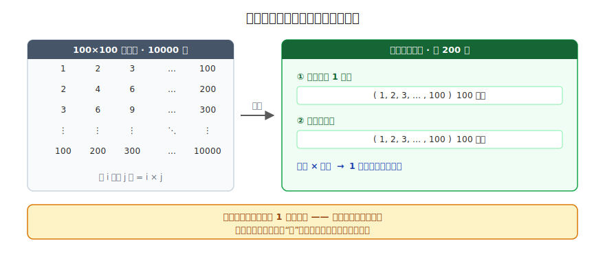
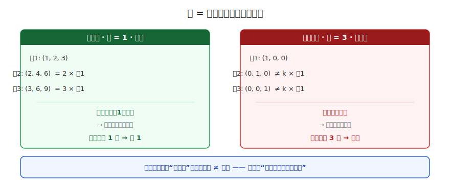
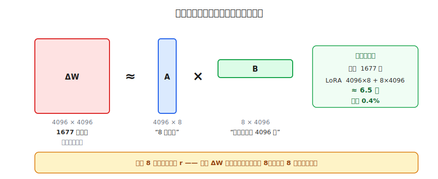
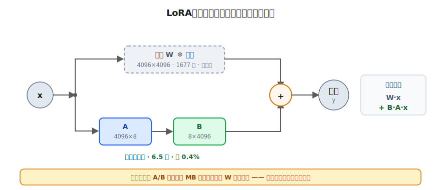
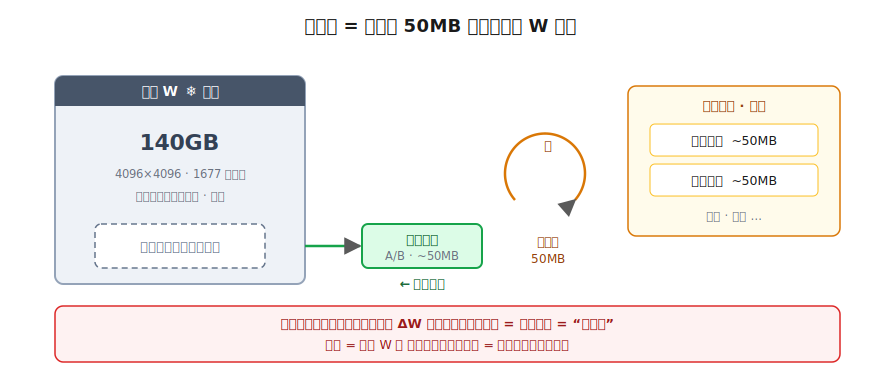

# LoRA 低秩补课：只动 1% 参数的微调

> 一个全栈工程师的大模型学习笔记（十）

上一篇结尾，我们欠了一笔账。

全量微调又贵又重：训练时显存膨胀到几百 GB，部署时一个专家就是 140GB 的庞然大物。然后我抛了个钩子——有没有办法，**不动那几十亿个参数、只用大约 1% 的代价**，就完成一次微调？

答案叫 **LoRA**。它赌的是一句话：

> 微调带来的那点改动，其实"简单"得可以用**极少的信息**描述清楚。

这一篇就专门把这句话讲透。但要讲清楚"为什么改动可以很简单"，绕不开一个数学概念——**秩（rank）**。这个词三言两语糊弄不过去，硬塞一个定义只会变成"每个字都认识、连起来不知道在说啥"。所以我们不赶进度，从一张乘法表开始，把它从根上推出来。

读完这一篇，你再看到 `LoRA`、`rank=8`、`lora_alpha`、`PEFT`、`adapter` 这些字眼，应该能一眼看穿它们在说什么。

---

## 一、先建一个直觉：有些"大"，其实很"小"

学新东西，第一步永远是**锚定**——找一个你已经会的东西，盯着它看。

我们要锚定的东西，是一张乘法表。一张 100×100 的乘法表，第 i 行第 j 列填的是 `i × j`：

```
       第1列  第2列  第3列  ...  第100列
第1行:   1     2     3    ...   100
第2行:   2     4     6    ...   200
第3行:   3     6     9    ...   300
 ...
第100行: 100   200   300  ...  10000
```

一共 **1 万个格子**。现在我说一句听起来有点离谱的话：

> 这 1 万个格子，其实只要 **200 个数字**就能完整还原。

先别信，我们来验证。盯着这张表的"行"看——把每一行看成一个**向量**（你在 Blog 06 学过，向量就是一组数字）。然后回答一个问题：

> 第 2 行 `(2, 4, 6, ..., 200)` 和第 1 行 `(1, 2, 3, ..., 100)`，是什么关系？

是 2 倍。第 3 行是第 1 行的 3 倍，第 100 行是 100 倍。**每一行，都是第 1 行的某个倍数。**

那么要还原整张表，我真正需要存的只有两样：

1. **那个唯一的"方向"**：第 1 行 `(1, 2, ..., 100)` —— 100 个数
2. **每一行各自的"倍数"**：`(1, 2, 3, ..., 100)` —— 100 个数

`100 + 100 = 200`。外面拿"倍数 × 方向"一乘，1 万个格子全回来了。



这就是 LoRA 的第一块基石——**有些看起来很庞大的数据，骨子里很"扁"，能用极少的信息描述清楚。** 接下来要做的，就是把这个"扁"字，变成一个能算的概念。

---

## 二、给"扁"起个名字：秩

为什么乘法表能这么省？关键在刚才那句话——**每一行都躺在同一个方向上**。

这 100 个行向量，看起来是 100 个不同的向量，但它们全都是 `(1,2,...,100)` 这一个方向的拉伸和缩放，没有任何一行"拐到新方向上去"。所以真正独立的方向，只有 **1 个**。

数学里把"这堆向量里，真正独立的方向有几个"这个数量，叫做这个矩阵的**秩（rank）**。

- 乘法表的所有行都在一个方向上 → 独立方向只有 1 个 → **秩 = 1**。

秩 1 是最"扁"、最能压的。那什么样的矩阵压不动？我们看反面。

来一张 3×3 的表：

```
行1: (1, 0, 0)
行2: (0, 1, 0)
行3: (0, 0, 1)
```

它也有规律啊——"行号和列号相同的位置填 1，其余填 0"。那它能不能像乘法表一样压掉？

**这里有个特别重要的坑，挑明了你对"秩"的理解就真正牢了：**

> **"能用一句规则描述" ≠ "秩低 / 能压"。**

秩问的不是"有没有规律"，而是一个更窄的问题：**每一行，能不能用别的行乘个倍数（再相加）拼出来？**

拿这把尺子去量这张表：我想用第 1 行 `(1,0,0)` 乘一个倍数 `k`，凑出第 2 行 `(0,1,0)`。可 `k × (1,0,0) = (k,0,0)`，第二个位置永远是 0，**永远变不出 `(0,1,0)`**。也就是说，`(0,1,0)` 指向一个第 1 行够不到的**全新方向**。第 3 行 `(0,0,1)` 又是另一个新方向。

三行指向**三个互不相干的方向**，谁也压不动谁 → 独立方向有 3 个 → **秩 = 3**。它正好等于行数，这种"压无可压"的情况叫**满秩（full rank）**。

对照着记，"秩"就刻进去了：



| | 乘法表 | 单位矩阵 |
|---|--------|---------|
| 有没有规律 | 有（i×j） | 有（同 1 异 0） |
| 行能互相缩放推出吗 | **能**，全是第 1 行的倍数 | **不能**，各指新方向 |
| 独立方向数 = 秩 | **1**（可压） | **3**（满秩，压不动） |

一句话钉死这个概念：

> **秩 = 这堆向量里真正"独立的方向"有几个。秩越低，矩阵越扁，越能用"几个方向 + 一堆倍数"省着存。**

手里有了"秩"，我们就能去拆 LoRA 的赌注了。

---

## 三、LoRA 的赌注：那个"改动"，秩很低

回到微调。微调在干嘛？它在原来的权重 `W` 上，叠加一个**改动量**，我们记作 `ΔW`（读作 delta W，就是"W 的变化"）。微调结束后，模型用的是 `W + ΔW`。

这个 `ΔW` 有多大？它和 `W` 一样大。在大模型里，一个权重矩阵动不动就是 `4096 × 4096`——也就是 **1677 万个数**。全量微调的贵，就贵在你要把这 1677 万个数全部当成训练对象。

现在，研究者发现了一件关键的事，也是 LoRA 整个方法的赌注：

> 这个 `ΔW` 虽然个头有 4096×4096 那么大，但它的**秩其实很低**。

换句话说——微调带来的改动，虽然铺开来是一张巨大的表，但它"很扁"，真正独立的方向没几个。就像那张乘法表，看着 1 万格，骨子里是秩 1。

如果这个赌成立，那根据第二节学的，我们立刻能想到一个天大的好处：**既然 `ΔW` 是低秩的，就不必存它全部 1677 万个数，只要存下那"几个方向 + 一堆倍数"就够了。**

这正是 LoRA 的做法。把第一节"方向 + 倍数"的存法，搬到矩阵上来——一个低秩矩阵，可以拆成**两个瘦矩阵相乘**：

```
ΔW  (4096×4096)   ≈    A (4096×8)   ×   B (8×4096)
 庞大、低秩            瘦高一条          扁平一条
                    "8 个方向"      "怎么把方向组合回 4096 行"
```

这里的 `8`，就是你选定的秩，LoRA 里管它叫 **rank，记作 r**。它是你拍板的一个小数字——你赌 `ΔW` 的"真实方向数"不超过 8，于是只给它 8 个方向的额度。

这个 `A × B` 的写法，就是**低秩分解**。我们来算算它到底省了多少。



- **不拆（全量微调）**：`4096 × 4096 = 1677 万` 个数，全要训练、全要存。
- **拆了（LoRA）**：一块 `4096 × 8` 的瘦高矩阵 `A`，加一块 `8 × 4096` 的扁矩阵 `B`，`4096×8 + 8×4096 ≈ 6.5 万` 个数。

**1677 万 → 6.5 万，省到原来的 0.4%。** 你只训练这 0.4%，就能逼近那个巨大的 `ΔW`。

这就是标题里"只动 1% 参数"的来历——实际上常常比 1% 还少得多。

---

## 四、把零件拼起来：LoRA 完整长什么样

秩懂了，低秩分解懂了，LoRA 的完整画面就只差拼装了。我一次性给你拼齐，你对着看是不是顺：



1. **预训练好的巨大权重 `W`（4096×4096）冻住不动**——一个参数都不训。这是关键的省钱点：那 1677 万个数你压根没碰。
2. 旁边**挂上两块小矩阵 `A` 和 `B`**（就是上一节那对瘦矩阵），**只训这两块**。
3. 前向计算时走 `W·x + B·A·x`——原来的 `W` 照常算它的，旁路 `A × B` 算出那个"微调增量 `ΔW`"，加进去。
4. 训完，要存的**只有 `A`、`B` 这 0.4%**。

最后这点，正好把上一篇的两道成本墙一起推倒。还记得那个"5 个专家"的场景吗？

> **痛点一（训练显存爆炸）**：你只训 `A`、`B` 那 6.5 万个参数，需要算梯度、存优化器状态的，就这一小撮。主干 `W` 全程只读、不参与训练。显存需求从几百 GB 砍到一张消费级显卡就能扛。

> **痛点二（部署又重又笨）**：5 个专家不再是"5 份 140GB 的完整模型"，而是**1 份共享的基座 `W` + 5 个小小的 `A/B` 补丁**。每个补丁才几十 MB。想从法律专家切到医疗专家，主干 `W` 留在显存里不动，只换那个几十 MB 的补丁就行——又快又省。

```
        全量微调              →            LoRA
   法律 140GB                      基座 W   1 份（共享）
   医疗 140GB                      法律补丁  ~50MB
   代码 140GB                      医疗补丁  ~50MB
   客服 140GB                      代码补丁  ~50MB
   翻译 140GB                      客服补丁  ~50MB
   —————————                      翻译补丁  ~50MB
   合计 700GB                      ——————————————
                                  合计 ≈ 1 份基座 + 250MB
```

这就是为什么这几年人人都在用 LoRA 微调：你从来没碰那 1677 万个参数，只动了 6.5 万。**鱼和熊掌，它真的两个都给你了。**

---

## 五、补丁怎么用：换，不是叠加

读到这你可能冒出一个很自然的疑问：那个 50MB 的"专家补丁"，是不是一个能独立运行的小模型？

不是。**补丁本身只是那对瘦矩阵 `A/B`（也就是 ΔW），单拎出来跑不了。** 要真正得到一个专家，永远是这道加法：

> **专家 = 共享基座 W ＋ 对应任务的补丁 A/B**

前向计算时，输入 `x` 同时走两条路——主干 `W·x` 照算，旁路 `A/B` 算出"往这个领域拨的增量"，两者相加（就是上一节那个 `W·x + B·A·x`），合起来才表现得像专家。



这就带出两个部署时绕不开的问题。

**问题一：能不能把 5 个补丁全加到基座上，做一个"全能模型"？**

不能。每个补丁的 `ΔW` 指向**不同的方向**：法律补丁往法律拨，医疗补丁往医疗拨。全加上去 `W + ΔW法律 + ΔW医疗 + …`，等于让模型同时往五个方向拨，方向互相打架——结果不是"五项全能"，是"五不像"。所以**任何时刻，基座上只挂当前任务那一个补丁**。

**问题二：那"切专家"具体是什么动作？**

看你用哪种部署模式，这是 LoRA 落地时必须分清的两条路：

- **合并模式（merge）**：把补丁算进基座，`W' = W + B·A`，生成一个新的完整 140GB 模型。推理时没有旁路、最快，但它又变回庞然大物、**焊死了就不能再轻松换**。适合只服务单一任务、追求极致速度的场景。
- **挂载模式（adapter）**：基座 `W` 一次性装进显存、**全程冻着不动**，补丁作为旁路挂在旁边。"切"就是把显存里那 50MB 的 `A/B` **换成**另一个任务的——140GB 主干一字节都不用重新加载。法律切医疗，只挪那 50MB。

挂载模式落到物理上其实很朴素，用你熟悉的话说，就是给每个 Linear 层**包了一层中间件**：

```python
def forward(self, x):
    return self.W(x) + self.B(self.A(x))   # 主路 + 旁路
```

这个包装层握着 `W`、`A`、`B` 三个引用。**"切"不过是把 `A`、`B` 的指针重指向另一对张量，`W` 的指针从头到尾不动。** 这就是它换得快、省得狠的根：你换的只是 50MB 和一个指针。

> 一句话钉死：**补丁 = 改动（A/B），专家 = 基座 + 一个补丁，切 = 换那个补丁、绝不叠加。**

---

## 六、回头看那个 `r`：秩选多大？

最后留一个实践里绕不开的问题：那个 rank `r`，到底该选多大？

你现在有能力自己推这件事了。`r` 是你给 `ΔW` 的"方向额度"：

- **`r` 太小**（比如 1、2）：方向额度不够，万一这次微调的改动其实需要十几个方向，你只给 2 个，`A × B` 凑不出真正的 `ΔW`，效果就打折——这叫**欠拟合**。
- **`r` 太大**（比如 512）：方向给太多，参数量重新膨胀，省钱的优势没了，还容易把训练数据里的噪声也学进去——这叫**过拟合**，也违背了"低秩"这个前提。

所以 `r` 是个权衡。实践中常见的取值是 **8、16、32、64**——小得惊人，但对大多数微调任务已经够用。这恰恰反过来印证了 LoRA 的赌注：微调带来的改动，**真的很低秩**。

你在 LoRA 配置里还会看到一个 `lora_alpha`，它管的是"这个旁路 `B·A·x` 加进主干时，按多大比例放进去"——相当于一个音量旋钮，这里先知道有这么个东西即可，不展开。

---

## 总结

| 概念 | 一句话解释 | 类比 |
|------|-----------|------|
| **秩（rank）** | 一堆向量里真正"独立的方向"有几个 | 乘法表所有行同一个方向 = 秩 1 |
| **满秩（full rank）** | 秩等于行数/列数，压无可压 | 单位矩阵，每行各指新方向 |
| **低秩** | 秩远小于矩阵尺寸，很"扁"，能压 | 1 万格的乘法表骨子里只要 200 个数 |
| **低秩分解** | 把低秩大矩阵拆成两个瘦矩阵相乘 | ΔW ≈ A × B |
| **LoRA** | 冻结主干 W，只训旁路的瘦矩阵 A、B | 不碰 1677 万，只动 6.5 万 |
| **补丁 / adapter** | 训出来的那对 A/B，几十 MB；专家 = 基座 + 一个补丁 | 主机不变，插不同卡变不同专家 |
| **merge / 挂载** | 焊进基座（最快不可换）/ 旁路可插拔（可热切） | 切专家 = 换补丁，绝不叠加 |
| **rank r** | 你给 ΔW 的"方向额度"，常取 8/16/32 | 太小欠拟合，太大过拟合且不省 |

把这一篇串起来：

1. **有些"大"其实很"小"**：1 万格的乘法表，因为每行都是第 1 行的倍数，只要 200 个数就能还原
2. 这个"扁"的程度有个名字叫**秩**——独立方向的个数；注意"有规律 ≠ 低秩"
3. LoRA 的赌注：微调的改动 `ΔW` 虽然巨大，但**秩很低**
4. 所以可以**低秩分解** `ΔW ≈ A × B`，把 1677 万压成 6.5 万（0.4%）
5. **冻结主干 W，只训瘦矩阵 A、B**，一举推倒训练显存和部署存储两道墙
6. 部署时**专家 = 共享基座 + 一个几十 MB 的补丁**；切专家 = 换补丁（挂载模式只挪 50MB），绝不是把所有补丁叠加
7. rank `r` 是方向额度，实践常取 8~64——小得惊人却够用，反过来证明了"改动真的低秩"

现在再去看一个 LoRA 微调脚本里的 `r=8`、`target_modules`、`PEFT`、`adapter`，你应该知道每个字在赌什么、省什么了。

---

## 留给你的问题

到这里，"怎么训练一个模型"这条线我们走得差不多了：预训练打底（Blog 08）、SFT 教它听话（Blog 09）、LoRA 让微调变便宜（本篇）。

但有件事我们一直没碰。SFT 是怎么教模型的？给它看"指令 → 理想回答"的示范，让它模仿。可"模仿示范"有个天花板——

> 它只能学会**模仿你写出来的那个答案**，却没法理解"为什么这个答案比另一个更好"。

举个例子：同一个问题，模型生成了两个回答，一个礼貌专业，一个生硬敷衍。两个都"通顺"、都"像人话"，SFT 那套"照着抄"根本分不出高下——因为示范里只有"标准答案"，没有"A 比 B 好"这种**比较**。

那模型怎么才能学会"哪个回答更好"，从而越答越合人心意？

下一篇，我们讲 **RLHF**——让模型从"人类的偏好"里学习，而不只是从"标准答案"里模仿。

---

*这是「全栈工程师的大模型学习笔记」系列第十篇，第二阶段「训练的秘密」第四篇。上一篇：[微调：让通才变专家](09-fine-tuning.md)。下一篇：《RLHF 与 RLVR：对齐人类意图》。如果你也是一个对 AI 好奇的程序员，欢迎一起上路。*
