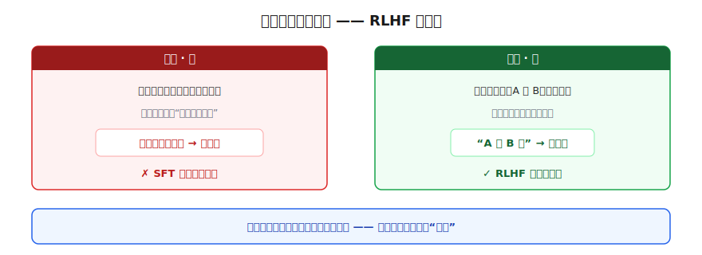
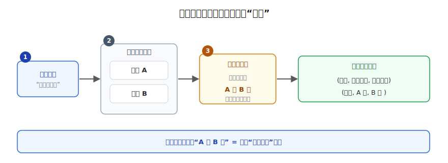
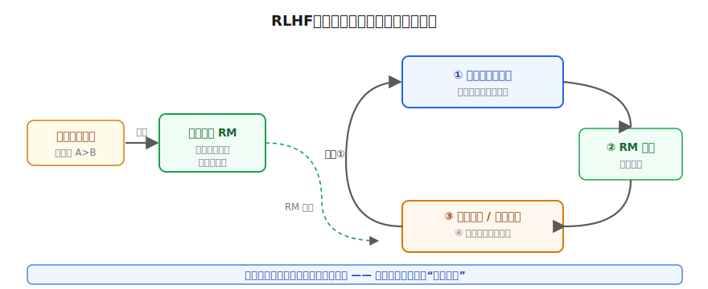
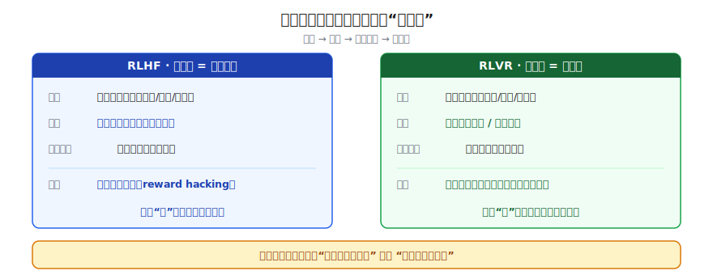

# RLHF 与 RLVR：对齐人类意图

> 一个全栈工程师的大模型学习笔记（十一）

模型怎么知道哪个回答更好？

上一篇结尾我们埋了个尾巴：SFT 只会"模仿标准答案"，可它学不会"为什么 A 回答比 B 回答更好"。这一篇就来推导出答案——顺便搞懂当你在模型卡片或论文里看到 `RLHF`、`reward model`、`PPO`、`RLVR`、`aligned` 这些字眼时，到底在说什么。

---

## 一、SFT 的死穴：有些问题，你压根写不出"标准答案"

老规矩，先**锚定**——盯着 SFT 已有的东西看，找出它转不动的地方。

回忆 Blog 09：SFT 能跑，有一个**硬前提**——每条指令，你都得**亲手写出一个"理想回答"**当标准答案，让模型去模仿。

这个前提，在很多任务上根本立不住。我们拿三个指令试试：

```
指令A：法国的首都是哪里？
指令B：写一首关于秋天的七言绝句
指令C：我刚失恋了，很难受，安慰我几句
```

- **指令 A**：你能干脆利落地写出唯一答案——"巴黎"。SFT 没问题。
- **指令 B、C**：好答案有**无数种**，甚至因人而异。你写得出一个"还不错"的回答，但你写不出那个**唯一的、标准的**理想答案——因为它**不存在**。

这就是 SFT 的死穴。而现实里绝大多数真实需求——写文案、出主意、安慰人、给建议、聊天——全都是 B、C 这种**没有唯一标准答案**的开放问题。

> SFT 的运作前提是"每条指令都有人写好理想回答"，可这种开放问题，你**根本写不出那个唯一答案**。死穴就卡在这。

按 Blog 09 那个朴素思路——**缺什么补什么**——SFT 缺的是"好坏"的信号。那我们就得想办法，把"好坏"喂给模型。可"好"都写不出标准答案，怎么喂？

---

## 二、关键支点：评判，比创作容易

别急，换个姿势看同一件事，墙就裂了。

写一首好诗很难（创作）。但如果我**生成两首诗**摆在你面前，让你挑"哪首更好"呢？

你大概能分辨。哪怕你自己写不出好诗，你也**认得出**哪首更好。这件事，比从零创作省力得多。

把它钉成一条原则，这是整篇文章的支点：



> **评判，比创作容易。** 让人从零产出"理想答案"很难，但给人几个候选让他挑"哪个更好"，做得到。

这条不对称，正好绕开了第一节那堵墙：

> 既然"让人写理想答案"行不通，而"让人判断哪个更好"做得到——那我们就**别再费劲让人写答案了**，改成让人做他擅长的那件事：**比较**。

---

## 三、偏好数据：让人只动一根手指

顺着"让人比较"往下，把它落成具体的数据。

像考试选择题——人面对几个选项做选择，而不是从零写答案。但要磨锋利两处：

- **选项谁出的？** 不是人写的，让**模型自己生成**。同一个指令喂给模型，让它采样出好几个不同回答（它生成本来就带随机性）。被评判的，是模型**自己的产物**。
- **选"更好"，不是选"正确"。** "哪首诗更好"没有标准对错，只有**偏好**。人只需动一下手指：标出哪个更好、哪个更差。一个字都不用写。

一条数据的采集流程和形状就定了：



```
① 拿一个指令               "写一首关于秋天的诗"
② 让模型生成两个回答         回答A、回答B
③ 人只做一件事：标好坏       人觉得 A 比 B 好
————————————————————————————————
一条数据 = (指令, 较好的回答, 较差的回答)
         = (指令,    A(胜),     B(负)   )
```

这种"A 比 B 好"的成对数据，正式名字叫**偏好数据（preference data）**。攒上几万条，就是一座"人类品味"的矿。

人该干的活儿到这就完了——他只负责"比较"，轻松。但麻烦在下一步等着。

---

## 四、奖励模型：一个不知疲倦的裁判

回忆 Blog 03 那个**训练四步循环**：前向 → 算损失 → 反向 → 更新。要让它转起来，模型每生成一个回答，都得立刻拿到一个**分数**，才能算损失、调参数。而且训练要反复跑——生成、打分、调整，**几百万次起步**。

这里撞上一堵新墙：

> 我们手里只有几万条"人标好的偏好"，是**死的、有限的**。可训练时要打分**几百万次**，每次还都是模型**新生成、人从没见过**的回答。

```
你标注过的：  指令"写秋天的诗" → A好, B差   （死数据，几万条）

训练第 50 万步，模型生成了：
  指令"写秋天的诗" → 回答Z   ← 全新的，数据集里没有
                              这条 Z 该打几分？？
```

死数据里找不到 Z，人又不在现场。这几百万次的分，谁来打？

解法要拐个弯：**别直接拿偏好数据去训大模型**。换个用法——

> 先拿这几万条人类偏好，去**单独训练一个"小模型"**，它的唯一任务是：看一个 `(指令, 回答)`，吐出一个**分数**，而且打得**像人一样**。

这个学会了"人的品味"的打分器，就是**奖励模型（Reward Model，简称 RM）**。

- 它和被训练的大模型**不是同一个**，是两个独立的模型（早期实践里 RM 常比大模型小以省算力，但二者规模没有硬性关系，现在也常用同规模甚至更大的 RM）。
- 它用那几万条偏好数据训练：喂它"A 比 B 好"，它就学着给 A 打高分、给 B 打低分。学到最后，它内化了"人觉得什么样的回答好"。

练成之后，它不知疲倦、随叫随到——训练时模型生成的任何新回答 Z，丢给它，立刻得到一个分。**人那几万次标注，被放大成了奖励模型无限次的打分能力。**

为什么叫"奖励"？因为它打的分，在训练里扮演的是**奖励信号**：分高 = 告诉大模型"这么答对，多这么干"，分低 = "这么答不行，少这么干"。这套"用奖励/惩罚塑造行为"的说法，是**强化学习**的语言。

---

## 五、把零件咬合：RLHF

现在两个零件齐了：一个**会生成**的大模型，一个**会打分、且打得像人**的奖励模型。把它们咬进四步循环，一台能自己转的机器就成型了：



```
①  大模型对一个指令，生成一个回答
②  奖励模型给这个回答打分（替代了人）
③  分高 → 强化这种答法；分低 → 抑制     ← 这一步就是“强化学习”
④  照着调大模型的参数，回到 ①
        ……自动跑几百万次，人完全不用在场
```

每转一圈，大模型就朝"奖励模型打高分的方向"挪一点。而奖励模型的高分 = 人的偏好。所以转到最后：

> **大模型越来越会答出"人类觉得好"的回答。** 它不再只是模仿标准答案（SFT），而是真正学会了迎合人的品味。

这套"用人类偏好训出奖励模型、再用强化学习去优化大模型"的完整方法，正式名字就是标题那个词：

**RLHF —— Reinforcement Learning from Human Feedback，基于人类反馈的强化学习。**

名字就是说明书：**强化学习（RL）** 是那个生成-打分-调整的循环；**人类反馈（HF）** 被浓缩进了奖励模型里。（循环里那个负责调参的算法，最常见的叫 **PPO**，知道有这么个名字即可，原理不在这篇展开。）

让模型的输出**对齐（align）**人类的偏好与意图，这整件事就叫**对齐（alignment）**——这也是本篇标题"对齐人类意图"的由来。你在模型卡片上看到的 `aligned`，说的正是它经过了这类训练。

**一个要当心的软肋：钻空子（reward hacking）。** 奖励模型只是"人的赝品"，不是人本身。大模型很可能发现某种**讨它欢心却没真正变好**的捷径——比如答案里疯狂堆礼貌套话、把回答拖得老长，骗到高分。所以实践中会加一道约束（拴住它别离 SFT 模型太远），防止它为了刷分把话说得不像人。记住这个词，它是 RLHF 一切麻烦的根源。

---

## 六、当对错是铁打的：RLVR

我们费这么大劲搞奖励模型，根子上是因为"诗好不好、安慰暖不暖"**没有客观标准，只能靠人的主观偏好**。

那反过来想：有没有哪类任务，回答好坏是**铁打的客观对错**，而且机器还能**当场自动验证**？

有，而且你天天打交道：

```
数学题：  "37 × 24 = ?"     → 对答案，对就是对，错就是错
写代码：  "实现快速排序"      → 跑测试用例，全过=对，挂了=错
```

它俩的共同点，正是这条路线的命门——**对错能被一条规则 / 一个程序自动验证（verify），根本不需要人的主观品味。**

那对这种任务，还需要费劲训一个"模仿人品味"的奖励模型吗？

**不需要。** 奖励模型存在的全部理由，是"没法客观判断、只能模仿人"。可数学和代码**有客观裁判**——直接拿那个**验证器**当打分器：

> 答案对，给 +1 分（奖励）；答案错，给 0 分。规则即奖励，不用人工标注、能无限次自动判，也没有"模仿人品味"那层赝品——**验证器比奖励模型更难被讨好。**

把 RLHF 循环里的"奖励模型"换成"自动验证器"，就是另一条路线：

**RLVR —— Reinforcement Learning from Verifiable Rewards，基于可验证奖励的强化学习。**

近两年推理模型（比如能做奥数、写复杂代码的那些）的突飞猛进，背后很大程度上就靠 RLVR——因为数学和代码的对错可以大规模、无需人工地自动判，模型能在里头反复"刷题"自我提升。

不过别把 RLVR 当万灵药。**验证器更难被讨好，但不是完全免疫**——模型照样能钻规则的空子：把答案硬编码进代码骗过测试用例、或者数学题猜对了最后的数字、推理过程其实全错。只是相比"模仿人品味"的奖励模型，这种空子通常更容易被发现和堵上。

两条路线并排一比，整篇的骨架就齐了：



| | RLHF | RLVR |
|---|------|------|
| 适用任务 | 没有客观对错（写作/对话/安慰） | 有客观对错（数学/代码/逻辑） |
| 谁来打分 | **奖励模型**（模仿人的偏好） | **验证器**（规则/跑测试） |
| 分从哪来 | 人类偏好数据训出来的 | 答案对错，当场算出 |
| 软肋 | 奖励模型容易被钻空子 | 只能用于可验证任务；规则也可能被钻空子（但更难） |

两者共用同一个**强化学习循环**（生成→打分→强化高分→再生成），区别只在那个"打分器"是**学来的（RM）**还是**算出来的（验证器）**。

---

## 总结

| 概念 | 一句话解释 | 类比 |
|------|-----------|------|
| **评判 < 创作** | 判断哪个更好，比从零写出理想答案容易 | 写不出好诗，但认得出哪首更好 |
| **偏好数据** | 模型生成多个回答，人只标"A 比 B 好" | 像选择题，但人只选、不写 |
| **奖励模型（RM）** | 用偏好数据训出的打分器，替人无限次打分 | 学会了人品味的不知疲倦的裁判 |
| **RLHF** | 奖励模型打分 + 强化学习循环，优化大模型 | 朝"裁判打高分"的方向反复挪 |
| **reward hacking** | 模型钻空子讨好奖励模型，没真正变好 | 堆礼貌套话、拉长篇幅来骗高分 |
| **RLVR** | 把奖励模型换成自动验证器，用于可验证任务 | 数学对答案、代码跑测试，规则即奖励 |

把这一篇串起来：

1. SFT 的死穴：开放问题（写作/对话）**写不出唯一标准答案**，没法用"模仿"教
2. 支点：**评判比创作容易**——人写不出好答案，却认得出哪个更好
3. 于是收集**偏好数据**：模型生成、人只标"A 比 B 好"
4. 训练要打分几百万次，人陪不起 → 用偏好数据训一个**奖励模型**当裁判
5. 奖励模型 + 强化学习循环 = **RLHF**，让模型迎合人的品味（当心 reward hacking）
6. 对数学/代码这种**可验证**任务，裁判换成验证器 = **RLVR**

现在再看模型卡片或论文里的 `RLHF`、`reward model`、`PPO`、`RLVR`、`aligned`，你应该知道每个词在解决什么问题了。到这里，第二阶段「训练的秘密」——预训练、SFT、LoRA、RLHF/RLVR——一条完整的"模型是怎么炼成的"链路，就走通了。

---

## 留给你的问题

我们已经把一个模型从随机噪声一路炼到"既有知识、又听话、还合人心意"。训练这条线，到此告一段落。

但有件事我们一路都在回避：这些模型到底有**多大**？前面老说"70B 模型 140GB""训练显存爆炸""塞进一张消费级显卡"——这些 GB 数是怎么算出来的？

- 一个参数，在硬盘和显存里到底占几个字节？
- 同样一个 70B 模型，为什么有人说要 140GB，有人说 70GB 就够，还有人说 35GB 也能跑？
- 推理要的显存，和训练要的显存，为什么差那么多？

下一篇，我们把模型的**物理形态**摊开看——参数、精度（量化）、显存占用，把这些一直在用却没算清的数字，彻底算明白。

---

*这是「全栈工程师的大模型学习笔记」系列第十一篇，第二阶段「训练的秘密」第五篇。上一篇：[LoRA 低秩补课：只动 1% 参数的微调](10-lora-low-rank.md)。下一篇：《模型的物理形态：参数、精度与显存》。如果你也是一个对 AI 好奇的程序员，欢迎一起上路。*
