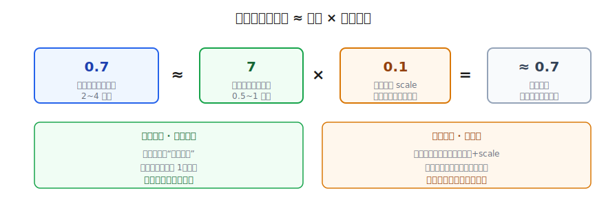
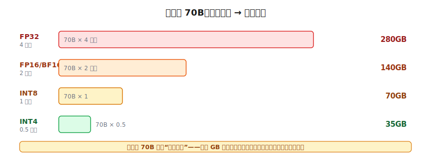
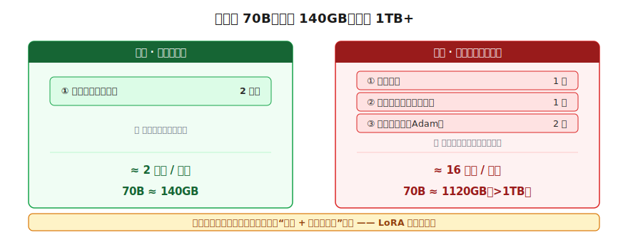

# 模型的物理形态：参数、精度与显存

> 一个全栈工程师的大模型学习笔记（十二）

70B 模型到底要多少显卡才能装下？

这一篇我们不引入新机制，只干一件事：把前面一路在用、却从没算清的那些数字——"70B 等于 140GB""训练显存爆炸""塞进一张消费级显卡"——彻底算明白。读完，你看到模型卡片上的 `7B`、`FP16`、`Q4_K_M`、`GGUF`、`需要 24GB 显存` 这些字眼，能直接在脑子里换算出它要多大、跑不跑得动。

---

## 一、"70B → 140GB"是怎么算出来的

老规矩，**锚定**你已有的两个零件：

1. 你早就知道：模型的参数，就是一堆**浮点数**，存在二进制文件里。
2. 你反复听我说：一个 **70B**（700 亿参数）的模型，大约 **140GB**。

把这两条摆一起，反推一下——存一个数字要占空间，这事你作为程序员有直觉（`int`、`float` 各占固定字节）。那：

```
140 GB ÷ 70 B 个参数
= 140 × 10⁹ 字节 ÷ 70 × 10⁹ 个
= 2 字节 / 参数
```

**一个参数，平均占 2 个字节。** 这就是全部来历，一个朴素的乘法：

> **模型大小 = 参数个数 × 每个参数占的字节数。**
> 70B × 2 字节 = 140GB。

整篇文章，其实就是在抠这个公式右边的两个因子——尤其是"每个参数几字节"这一项。

---

## 二、为什么是 2 字节，不是 4？——精度

盯着"2 字节"，它该让你这个程序员皱一下眉。

你写代码存一个小数，用的是 `float`——**4 个字节**（32 位）；要更精确还有 `double`，8 字节。可模型这里，一个参数只用了 **2 字节**，比标准 `float` 还少一半。为什么？

答案藏在一个反直觉的事实里：**模型参数，不需要那么精确。**

想想参数是干嘛的：它就是一堆权重，在网络里被乘来加去（`kx+b`、矩阵乘法）。一个权重是 `0.7234` 还是 `0.7236`，差在小数点后第四位——乘进去、加起来、过激活函数，对最终输出的影响**微乎其微**。就像你算账时把 `3.14159` 四舍五入成 `3.14`，结果几乎不变。

> 模型有几百亿个参数，靠的是**海量参数协同**，不是任何单个参数的极致精确。所以每个数"粗一点"完全扛得住。

"一个数字用多少位来表示"这件事，名字叫**精度（precision）**。位数越多越精确、越占空间。常见几档记一下：

| 精度 | 位数 | 每参数字节 | 说明 |
|------|------|-----------|------|
| **FP32** | 32 位 | 4 字节 | 你熟悉的标准 `float`，最精确最占地 |
| **FP16 / BF16** | 16 位 | 2 字节 | "半精度"，现在模型权重的常用档 |

这就解释了那个"2 字节"——现在的大模型，权重默认就用 16 位半精度存，够用又省一半。

（小提醒：FP16 和 BF16 都是 2 字节，区别在"位"怎么分配——BF16 牺牲了一点小数精度、换来和 FP32 一样大的表示范围，训练时更不容易溢出。记住它俩都是 2 字节即可。）

---

## 三、插一句：为什么参数是浮点数，不是整数？

讲到这里你可能冒出一个更根上的疑问：**既然能压缩，干脆一开始就用整数存不就好了？为什么非得是浮点数？**

问得好，而且它正好引出下一节的"量化"。

**核心原因：学习这件事，本质是"一点点地挪"权重。**

回忆 Blog 03 的训练四步循环，第④步更新参数：`新权重 = 旧权重 − 学习率 × 梯度`。学习率常是 `0.001` 这种很小的数，所以每一步对权重的改动可能只有 `0.0001` 这种**极小的零头**。

假设权重是**整数**：整数的最小变化是 **1**。你想给它挪 `0.0001`？整数要么不动、要么直接跳 1——**没有"挪一点点"这个档位**。梯度下降靠的就是千万次微小爬坡，整数这步子太粗，根本走不了。

> 训练必须用浮点数——因为学习 = 连续地、微小地调整，而**只有小数能表示"微小"**。

再加两条：权重本身就是带正负的小数（`0.0034`、`-1.72`），整数表示不了；网络里全是乘加、归一化、概率，结果天然是小数。

---

## 四、再往下压：量化

既然参数这么能扛低精度，胆子大一点——能不能把每个参数压到 **1 字节（8 位，INT8）**，甚至 **半字节（4 位，INT4）**？

能。这种"主动降低精度来换空间"的操作，名字叫**量化（quantization）**。

但这里有个矛盾要解开：上一节刚说"训练必须用浮点"，INT8/INT4 不就是整数吗？

关键在于**量化发生的时机和方式**：

> 量化不是"模型用整数训练"，而是——**先用浮点把模型完整训练好，事后为了省空间，再把训练好的浮点权重近似编码成整数。**

而且它存的不是光秃秃的整数，还配一个**缩放系数 scale**（scale 本身是浮点）：

```
真实权重 ≈ 整数 × scale
例：  0.7  ≈   7   × 0.1
      1.3  ≈  13   × 0.1
```

用的时候把整数乘回 scale，还原成一个**近似的小数**。整数在这里只是个"紧凑的编码"，背后表达的还是小数——只是精度变粗了（`0.73` 可能被还原成 `0.7`）。



所以两件事发生在不同时间，不冲突：

> **训练阶段离不开浮点**（要靠小数做微小的梯度更新）；**部署阶段才量化**，把练好的浮点权重压成"整数 + scale"省地方。

代价当然有：精度越低，还原出的权重越糙，模型可能变"笨"一点点。所以实践中是个权衡——INT8 通常几乎无损，INT4 在多数任务上也够用，再往下（3 位、2 位）就开始明显掉效果了。你在 `llama.cpp` 里看到的 `Q4_K_M`、`Q5_K_S` 这类标记，说的就是"量化到几位、用哪种量化方案"。

---

## 五、解开谜题：同一个 70B，为什么有人说 140GB、有人说 35GB

四种精度凑齐了，那个一直让你困惑的"同一个模型大小报得五花八门"的谜题，现在自己就解开了。同一个 **70B**，用不同精度各存一份：



```
FP32  (4 字节/参数)   = 70B × 4   = 280GB   ← 最精确，最重
FP16  (2 字节/参数)   = 70B × 2   = 140GB   ← 半精度，常用档
INT8  (1 字节/参数)   = 70B × 1   =  70GB   ← 量化到 1 字节
INT4  (0.5 字节/参数) = 70B × 0.5 =  35GB   ← 量化到半字节，最轻
```

> **同一个 70B，根本不存在"唯一的大小"。** 别人报的 GB 数不一样，不是谁记错了，是用的**精度**不同。下次看到"70B 要 140GB"，心里自动补一句"——那是 FP16 的算法"。

这也直接回答了标题：70B 要多少显卡？看你用什么精度——FP16 要两张 80GB 的专业卡，量化到 INT4 只要 35GB，一张消费级显卡（比如 RTX 4090 24GB 不够、但双卡或 48GB 卡）就够推理了。**量化，就是把大模型搬进小显卡的关键魔法。**

---

## 六、推理 vs 训练：那条让显存暴涨的尾巴

但注意，上面四个数算的都是**同一样东西：光是那堆权重本身占的空间**（模型文件大小、或把权重装进显存的底量）。

而"实际要多少显存"，得分两种场景，差别巨大。

**推理**（模型跑起来回答问题）：显存里基本就是那堆权重，加一点运行时零碎。所以一个 FP16 的 70B 推理，显存需求大致就在 140GB 这个量级。

**训练**：显存需求**暴涨好几倍**。问题出在——训练时，每一个参数身上，除了"它自己这个数值"，还得额外拖着一条尾巴。顺着四步循环就能逮到它们：

- **第③步反向传播**算出每个参数的**梯度**（该往哪调、调多大），得存住才能用 → 每参数 +1 份。
- **第④步更新**，常用的优化器 **Adam** 不是简单减一下，它还给每个参数维护额外的"历史记录"（动量、二阶动量），Adam 要存**两份** → 每参数 +2 份。
- 此外还有**激活值（activations）**：前向每一层的输出都得暂存，因为反向传播要用它们算梯度。



把一个参数训练时的随身行李列全：

```
训练时，每个参数身上挂着：
  ① 参数本身        1 份
  ② 梯度            1 份   ← 反向传播要存
  ③ 优化器状态      2 份   ← Adam 的动量 + 二阶动量
  ————————————————————————
  合计 ≈ 4 份（再加全局的激活值）
```

按每份 4 字节粗算（这是个经验法则），训练时一个参数要约 **16 字节**，而推理只要 2~4 字节。差距立刻拉开：

```
70B 推理 (FP16)：  70B × 2 字节  ≈ 140GB        ← 一两张卡
70B 全量训练   ：  70B × 16 字节 ≈ 1120GB(>1TB) ← 必须一整个 GPU 集群
```

> **同一个 70B，推理 140GB，全量训练 1TB+——差近一个数量级。** 暴涨的根源就是：训练时每个参数都拖着"梯度 + 优化器状态"的尾巴，外加要暂存的激活值。

---

## 七、回扣：LoRA 和量化，省的到底是哪一块

有了这张"显存账单"，回头看前两篇，你会有种豁然开朗的感觉。

- **Blog 09 说"全量微调显存爆炸"**——爆的就是上面那条尾巴：70 亿个参数，每个都要算梯度、存两份优化器状态。
- **Blog 10 的 LoRA"只训 0.4% 参数"**——它冻住主干 W，那条"梯度 + 优化器状态"的尾巴就**只长在 0.4% 的小矩阵上**，瞬间从 1TB+ 砍回单卡能扛。它省的，正是这条尾巴。
- **本篇的量化**——省的是另一块：**权重本身**那一项。把 2 字节压到 0.5 字节，140GB 的底量直接变 35GB。

两招省的是账单的不同栏目：**LoRA 砍"训练的尾巴"，量化砍"权重的底量"**。它俩还能叠加（QLoRA：在量化的模型上做 LoRA），把"在消费级显卡上微调大模型"这件事彻底变成现实。

---

## 总结

| 概念 | 一句话解释 | 关键数字 |
|------|-----------|---------|
| **模型大小公式** | 参数个数 × 每参数字节数 | 70B × 2 = 140GB |
| **精度（precision）** | 一个数字用多少位表示 | FP32=4B / FP16=2B |
| **量化（quantization）** | 训练后把浮点权重压成"整数 × scale" | INT8=1B / INT4=0.5B |
| **为什么用浮点训练** | 学习要靠小数做微小的梯度更新 | 整数最小只能跳 1，太粗 |
| **推理显存** | 主要就是权重本身 | 70B FP16 ≈ 140GB |
| **训练显存** | 权重 + 梯度 + 优化器状态 + 激活值 | ≈ 16 字节/参数，70B ≈ 1TB+ |

把这一篇串起来：

1. 模型大小 = **参数数 × 每参数字节**，70B × 2字节 = 140GB
2. 为什么 2 字节：参数能容忍**低精度**，FP16 半精度够用又省一半
3. 参数必须是**浮点数**，因为学习靠"微小地挪"，整数步子太粗
4. **量化**把练好的浮点权重压成"整数 × scale"，INT8/INT4 进一步省空间
5. 同一个 70B 有 280/140/70/35GB 之分，差别全在**精度**
6. **训练显存远大于推理**：每个参数拖着梯度 + 优化器状态 + 激活值，≈16 字节/参数
7. **LoRA 砍训练的尾巴，量化砍权重的底量**——两块不同的省法

现在再看任何一张模型卡片：`7B`、`FP16`、`Q4_K_M`、`需要 24GB 显存`，你应该能在脑子里直接换算出它多大、用什么精度、跑不跑得动了。

至此，第二阶段「训练的秘密」全部走完——BPE 分词、预训练、SFT、LoRA、RLHF/RLVR、再到今天的物理形态。一个模型**怎么炼成、长什么样、要多少资源**，你已经有了完整的图景。

---

## 留给你的问题

我们已经知道一个 70B 模型 FP16 要 140GB 显存才装得下。可这只是"装下"——真正让它**跑起来回答问题**，还有一堆讲究。

你有没有注意过一个现象：你问大模型一个问题，它**第一个字**往往要"想"一下才蹦出来，但一旦开始，后面的字就**哗哗地流**出来，越来越顺？

- 为什么第一个 token 慢，后面的快？
- 模型每生成一个字，是不是都要把前面所有内容重新算一遍？如果是，那不是越往后越慢吗——可实际体验恰恰相反？
- 同时伺候 100 个用户和只伺候 1 个，显卡是怎么安排的？

下一篇进入**第三阶段「推理与部署」**，我们拆开模型"吐字"的过程，看看 **KV Cache** 这个让推理快起来的关键机制——它正是"第一个字慢、后面快"的答案。

---

*这是「全栈工程师的大模型学习笔记」系列第十二篇，第二阶段「训练的秘密」收官篇。上一篇：[RLHF 与 RLVR：对齐人类意图](11-rlhf-rlvr.md)。下一篇：《推理过程：KV Cache 与批处理》，第三阶段开篇。如果你也是一个对 AI 好奇的程序员，欢迎一起上路。*
