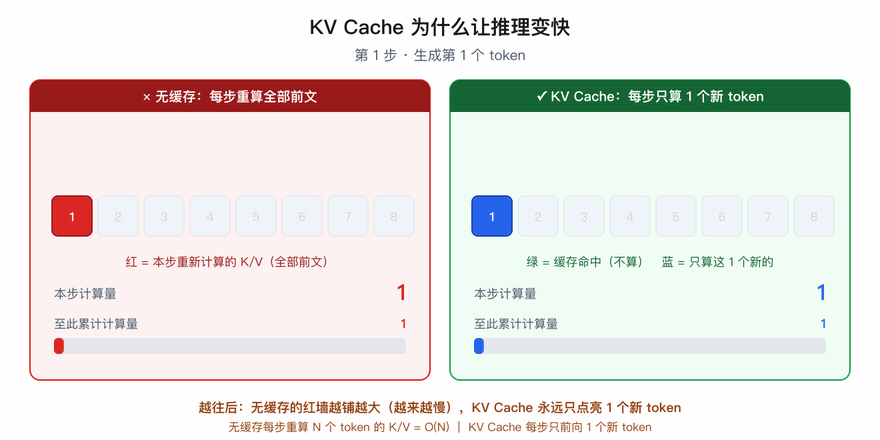
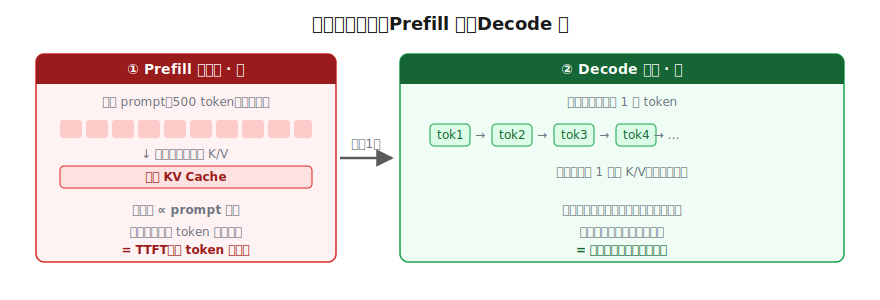

# 推理过程：KV Cache 与批处理

> 一个全栈工程师的大模型学习笔记（十三）

为什么第一个 token 慢，后面的快？

进入第三阶段「推理与部署」。前两个阶段我们搞懂了模型**怎么炼成、长什么样、要多少资源**。这一篇开始问一个新问题：一个已经训好、装进显存的模型，**怎么把字一个一个吐出来**——以及为什么它能吐得又快又稳，还能同时伺候一屋子用户。

读完，你会理解一个你天天都在体验、却没细想过的现象：问大模型一个问题，**第一个字往往要等一下，一旦开始就哗哗地流**。这背后是 `KV Cache`、`prefill`、`decode`、`continuous batching`、`TTFT` 这一串词，看完你能一眼读懂它们。

---

## 一、先看清模型怎么"吐字"

**锚定**两个你已经会的零件：

1. **模型是逐 token 生成的（自回归）**。它不是一次喷出整段回答，而是：生成第 1 个 token → 把它接到序列末尾 → 整个序列再喂回模型 → 生成第 2 个 token → 再接上 → 再喂回去……直到结束。（注意单位是 **token** 不是"字"——回忆 Blog 07，一个 token 可能是一个词、一个汉字、甚至半个汉字的字节片段。）
2. **Attention（Blog 04）**：每个 token 要"看"前面所有 token——拿自己的 **Q** 去和前面每个 token 的 **K** 做点积算出"该关注谁"，再用这些权重加权前面每个 token 的 **V**。

把两条摆一起，看一个具体场景：模型已经生成了 99 个 token，正要生成第 100 个。按上面的流程，它把这 100 个位置整个喂回去跑一遍。

那为了算出第 100 个 token，它要对前面那 99 个做什么？——拿第 100 个的 Q，去和前 99 个的 **K** 配对，再加权它们的 **V**。**所以它需要前面 99 个 token 的 K 和 V。**

关键问题来了：**这前 99 个的 K/V，和上一步（生成第 99 个时）算过的，是一样的、还是变了？**

---

## 二、发现浪费：前文的 K/V，每步都在重算

答案是：**一模一样，没变。**

为什么？因为 Attention 里有**因果掩码**——每个 token 只能看它**前面**的，看不到后面。所以：

> 第 50 个 token 的 K 和 V，只取决于它自己和它前面的 token。后面来了第 100 个，**丝毫影响不到**第 50 个的 K/V。

也就是说，前 99 个的 K/V，在生成第 99 个那一步**就已经算出来过了**，到第 100 步它们没有任何变化。可朴素的"整个序列重喂回去"做法，每步都把它们从头再算一遍：

```
生成第 2 个 token：重算 第1个 的 K/V
生成第 3 个 token：重算 第1、2个 的 K/V
生成第 4 个 token：重算 第1、2、3个 的 K/V
   ……
生成第 100 个：重算 前99个 的 K/V   ← 这些上一步全算过！
```

每一步都把前面所有 token 的 K/V 重算一遍，而它们一个字节都没变。看到"一个值反复被重新计算、却从不改变"，你这个程序员的本能反应应该是——**缓存它。**

---

## 三、KV Cache：算过的就别再算

把这个朴素直觉命名：

> **KV Cache（KV 缓存）**：把已经算过的每个 token 的 **K 和 V 存起来**。生成新 token 时，**只算新 token 这一个的 K/V**，追加进缓存；前面所有 token 的 K/V 直接从缓存取，绝不重算。



机制简单，效果是质变。看每一步的工作量：

```
朴素做法：  第 N 步要重算 N 个 token 的 K/V   → 越往后越慢，O(N)
KV Cache：  第 N 步只算 1 个新 token 的 K/V   → 这部分压到 O(1)
```

省掉的，是"把前面每个 token 的 K/V 重算一遍"这件 O(N) 的重活——现在每步只前向 1 个新 token。

（严谨一点：新 token 的 Q 仍要和缓存里**全部前文的 K/V** 做一遍注意力，这部分还是随长度走的；但它远比"把每个 token 的完整前向重算一遍"便宜，而且 decode 真正的瓶颈在搬权重的显存带宽（第六节会讲），不在这点点积上。所以你**感知到的**是"每步差不多快"。）这就是大模型能把长回答哗哗流式吐出、而不越写越卡的原因。

> **彩蛋：为什么叫 KV Cache，不带 Q？** 一个 token 一旦生成完、成了"过去"，未来的新 token 只会拿它的 **K 去匹配、V 去取内容**；而它自己的 **Q 只在它还是"当前 token"那一瞬用过一次**，之后再用不到。所以缓存只存 K 和 V，Q 不用存——名字一个字母都不多。

---

## 四、解谜：为什么第一个 token 慢，后面快

有了 KV Cache，开篇那个现象就能解了，答案藏在生成的**两个阶段**里。

设想你发了个 **500 token 的问题**，模型开始回答。吐出第 1 个 token 前，缓存是空的——它必须先把你那 **500 个 token 整个跑一遍**，算出全部 K/V 灌进缓存。这一步很重。之后每生成一个 token，只算那 1 个的 K/V。两个阶段各有名字：



| 阶段 | 干什么 | 工作量 | 快慢 |
|------|--------|--------|------|
| **预填充 Prefill** | 把整个 prompt（500 token）一次跑完，算出全部 K/V 灌进缓存 | 正比于 **prompt 长度** | **慢**（首 token 前的等待） |
| **解码 Decode** | 之后每步只生成 1 个 token，只算这 1 个的 K/V，追加进缓存 | **恒定**（每步 1 个 token） | **快**（哗哗地流） |

> **"第一个 token 慢、后面快"的真相**：首 token 前要做 **Prefill**——把整个问题嚼一遍（所以你问得越长，首 token 等得越久）；之后进入 **Decode**，每个 token 只干一点点活，自然流畅。

这件事你能直接感知：**prompt 越长，首 token 延迟越明显**（prefill 变重），但一旦开始吐字，速度和 prompt 长短关系不大（decode 每步只前向 1 个 token）。工程上把首 token 的等待单拎出来衡量，叫 **TTFT（Time To First Token）**。

---

## 五、缓存的代价：它在偷偷吃显存

天下没有免费的缓存。KV Cache 把"重算"换成了"占地方"，而它占的是 Blog 12 那块寸土寸金的——**GPU 显存**，和模型权重挤在同一块地。

它能涨多大？有个挺干脆的公式：

```
KV缓存 ≈ 2(K和V) × 层数 × 每层维度 × 序列长度 × 并发数 × 每个数的字节
                  └─── 模型定死 ───┘   └─ 这两个在变 ─┘
```

撑大它的是**两个**因子一起：**并发数**（同时多少用户）× **序列长度**（prompt + 已生成，回答越长、对话越多轮越大，且每个用户各涨各的）。


拿 70B 量级粗算，每个 token 的 K/V 约几百 KB 到 ~2MB：

```
一个用户、聊到 4000 token         ：单会话就吃掉好几 GB 显存
100 个用户同时在线、各自长对话    ：KV Cache 能涨到几百 GB —— 比模型权重还大！
```

> **KV Cache 的代价**：它把重算省了，却能占得比模型本身还多。显存就那么大，权重占一块，剩下的全靠 KV Cache 和用户数、对话长度抢——抢光了，要么新用户挤不进来，要么对话被掐断。

**这也顺带连到了"上下文窗口"。** 上下文窗口（context window，比如 128K）是模型能看的最大 token 数，而 KV Cache 正比于实际用的长度——**用满上下文窗口，就等于把 KV Cache 撑到最大**。这正是上下文不能无限大的现实原因：拉长它要同时付两份越来越贵的账——

- **显存账（KV Cache）**：正比于长度 `O(N)`，长度翻倍缓存翻倍。
- **计算账（Attention）**：每个 token 要和前面所有 token 点积，`O(N²)`，长度翻倍计算量翻 4 倍。

（治 KV Cache 这头吃显存猛兽有一堆专门招数——GQA 让多个注意力头共享 K/V 来缩小缓存、PagedAttention 像操作系统管内存一样精细分配；长上下文的取舍则留给 Blog 15 专门深挖。这里知道"它是显存大户"即可。）

---

## 六、批处理：让 GPU 一次伺候一片人

最后一个问题：100 个用户同时来，GPU 怎么伺候才聪明？

先认识 GPU 的脾气：它不是"算得快"，是"**能同时算一大堆**"。而且大模型推理的瓶颈往往不是算，是**把那几百亿个权重从显存搬出来**——而搬一次权重，服务 1 个请求是搬，服务 50 个也是搬这一次。

> 算 1 个和算 50 个耗时差不多，吞吐量却差 50 倍。所以"算一个等一个"是巨大浪费——把多个用户的请求**叠成一批一起喂进去**，GPU 一次发力服务一片人。这就是**批处理（batching）**。

但"凑齐一批一起跑到底"有个坑。最朴素的**静态批处理**：凑够 16 个绑成一批，等全部生成完再换下一批。问题是各请求生成长度天差地别：

```
请求A：生成 10 个 token 就结束    ← 早早完工，却被困在批里干等
请求B：生成 1000 个 token 才结束  ← 全批都得等它
```

最快的被最慢的拖着，GPU 又空转；新请求还得等整批清空才能进场。聪明的办法是**连续批处理（continuous batching）**：不绑死一批，而是**每生成一步，就把完成的请求踢出去、把排队的新请求填进空位**——某请求一结束，它的槽位立刻腾出，等待队列里下一个马上补进来，GPU 每一步都装满活。这正是 vLLM 这类推理框架的看家本领。

把它和 KV Cache 接上，闭环就成了：

> **批里能同时塞多少请求，上限由显存卡着**——因为每个请求都拖着自己的一份 KV Cache。所以"能并发多少用户"，最终又回到"**显存能同时装下多少份 KV Cache**"。批处理决定怎么榨干 GPU，KV Cache 的显存占用决定你能榨到多宽。

---

## 七、一个请求的一生：完整链路

把这一篇和前面几篇串起来，一个请求从到达到结束，正好是一条流水线：



```
①  请求到达        用户发来 prompt 文本
②  分词 Tokenize   文本 → token 序列（Blog 07 BPE）
③  入队 + 调度      进等待队列；连续批处理调度器决定何时纳入当前批次
④  Prefill 预填充   整个 prompt 一次跑完，算全部 K/V 灌进缓存 → 吐第 1 个 token（首 token 慢在这）
⑤  Decode 循环      每步：拿上一个 token 当输入 → 只算这 1 个的 K/V 追加进缓存
                    → 得到下一个 token 的概率分布（Blog 01：模型是概率函数）
                    → 采样选一个 token → 流式推给用户 → 回到循环
⑥  结束判定         吐出 EOS（结束符）或 达到长度上限 → 停
⑦  收尾             释放这个请求的 KV Cache 显存槽位 → 等待队列下一个补进来
```

几个点睛：

- **④⑤ 就是 Prefill / Decode**：一次重的预填充，之后一串轻的单步解码。
- **⑤ 里的"采样"**呼应 Blog 01——模型每步输出的不是一个确定 token，而是**整个词表上的概率分布**，从中挑一个。这也是同一问题它每次答得略有不同、以及 RLHF 偏好数据里"模型自己生成多个候选"的由来。
- **⑦ 的"释放 + 补新请求"**就是连续批处理在干的事——一个请求咽气，显存立刻回收给下一个。

---

## 总结

| 概念 | 一句话解释 | 关键点 |
|------|-----------|--------|
| **自回归生成** | 逐 token 吐，每个 token 接回序列再生成下一个 | 单位是 token，不是字 |
| **KV Cache** | 缓存前文每个 token 的 K/V，新 token 只算自己的 | 省掉重算前文 K/V（O(N)→每步只前向 1 个 token） |
| **Prefill** | 第一步把整个 prompt 跑完灌缓存 | 慢，正比于 prompt 长度（→ TTFT） |
| **Decode** | 之后每步生成 1 个 token | 快，每步恒定 |
| **KV Cache 显存** | 缓存吃显存 ≈ 并发 × 序列长度 | 能涨到比权重还大；上下文窗口是其天花板 |
| **批处理 / 连续批处理** | 多请求叠一起喂 GPU；动态踢完成的、补排队的 | 榨干 GPU，并发上限被 KV Cache 卡着 |

把这一篇串起来：

1. 模型**逐 token 自回归**生成，每步都要 attention 前面所有 token 的 K/V
2. 前文 K/V **每步不变却被重算**——浪费，于是**缓存它（KV Cache）**，每步成本压到恒定
3. 生成分 **Prefill（嚼完整个 prompt，慢）+ Decode（每步 1 token，快）**——这就是"首 token 慢、后面快"
4. 代价：KV Cache **吃显存**，大小 ≈ 并发 × 长度，能比权重还大；**上下文窗口**是它的天花板
5. **批处理 + 连续批处理**榨干 GPU 吞吐，但能并发多少又被 KV Cache 显存卡住

现在再看推理框架的文档里 `KV cache`、`prefill/decode`、`TTFT`、`continuous batching`、`PagedAttention`，你应该知道每个词在解决什么了。

---

## 留给你的问题

我们让模型跑起来、吐字、还能同时伺候很多人。但有个一直没正面回答的难题：模型本身就 140GB（FP16 70B），KV Cache 还在旁边一个劲吃显存——这俩加起来，对一张消费级显卡来说还是太大了。

- 能不能让模型**本身变小**，又不太掉智商？
- 我们 Blog 12 提过的**量化**（压到 INT4 → 35GB）到底是怎么做到"缩水还能用"的？除了量化，还有别的瘦身术吗？
- 一个"大老师模型"的本事，能不能"教"给一个跑得飞快的"小学生模型"？

下一篇 Blog 14《量化与蒸馏：大模型瘦身术》，我们把模型塞进小显卡的两大法宝彻底讲明白。

---

*这是「全栈工程师的大模型学习笔记」系列第十三篇，第三阶段「推理与部署」开篇。上一篇：[模型的物理形态：参数、精度与显存](12-model-physical-form.md)。下一篇：《量化与蒸馏：大模型瘦身术》。如果你也是一个对 AI 好奇的程序员，欢迎一起上路。*
