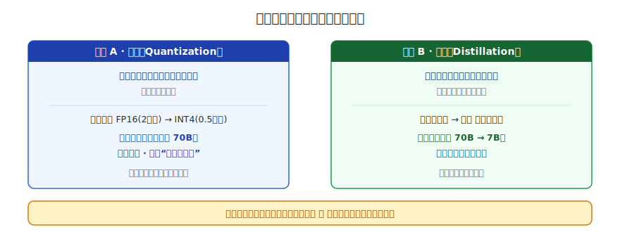
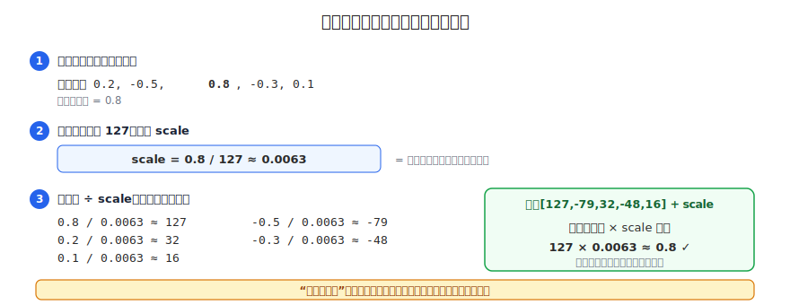
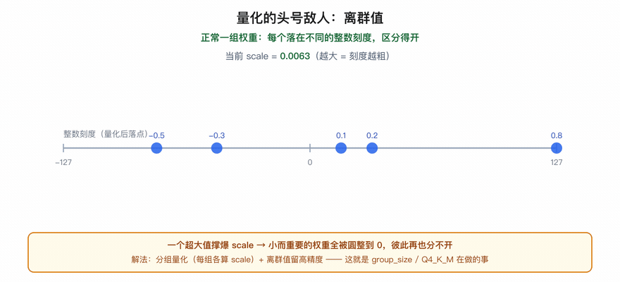
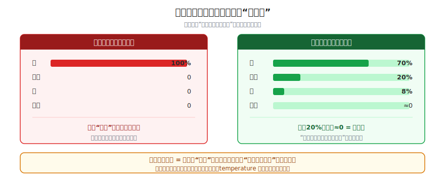

# 量化与蒸馏：大模型瘦身术

> 一个全栈工程师的大模型学习笔记（十四）

怎么让 70B 模型跑在单张消费级显卡上？

上一篇我们让模型跑了起来，也算清了它有多吃显存：FP16 的 70B 光权重就 140GB，旁边 KV Cache 还在一个劲吃。对绝大多数人手里的卡，这还是太大了。这一篇我们来解决它——把模型**本身变小**，又尽量不掉智商。

读完，你能看懂模型卡片上的 `GPTQ`、`AWQ`、`Q4_K_M`、`group_size`、`DistilBERT`、`-distill` 这些字眼到底在说什么，以及它们各自牺牲了什么、换来了什么。

---

## 一、两条根本不同的瘦身路

**锚定**一下目标：模型太大，要变小。但"让一个东西变小"，其实有**两条根本不同的路**。用一本厚书打比方：

> **路子 A**：内容一字不改，但**换个更省的存法**——字印小一点、纸用薄一点。书还是那本书，只是占的物理空间小了。
>
> **路子 B**：请高手把它**浓缩重写成一本更薄的精华小册子**——这是一本**全新的、更小的书**，努力保住原书的精华。

这俩对应模型瘦身的两大法宝，先把它们对号入座：



- **量化（Quantization）= 路子 A**。还记得 Blog 12 吗？把每个参数从 2 字节的浮点压成 0.5 字节的整数。判据很关键：**量化之后，模型还是那 700 亿个参数、还是同样的架构吗？——是的，一个参数都没少。** 变的只是"每个数字怎么存"。所以它是 A：模型本体不动，换个省的存法。
- **蒸馏（Distillation）= 路子 B**。另造一个**参数更少、架构更小**的新模型（"小学生"），让它去逼近大模型（"大老师"）的本事。这是一个真正更小的模型。

一句话分野，钉死它：**量化不改参数个数，只改存法；蒸馏直接换一个更小的模型。** 这一篇，我们分别把这两条路推透。

---

## 二、量化：怎么"缩水还能用"

Blog 12 给了量化的概念——`浮点权重 ≈ 整数 × scale`，比如 `0.7 ≈ 7 × 0.1`。但留了个黑箱没拆：**那个整数和 scale，到底怎么算出来的？**

拆开看，就三步。拿一组真实权重走一遍：

```
某一组权重（浮点）：  0.2,  -0.5,  0.8,  -0.3,  0.1
目标：各压成一个 INT8 整数（范围 -127 ~ +127）+ 一个共享的 scale
```

**第一步，找这组里绝对值最大的数。** 这里是 `0.8`。

**第二步，让这个最大值"顶满"整数上限，反推 scale。** 整数最多到 127，你最大的数是 0.8，那就让 **0.8 对应 127**：

```
scale = 最大绝对值 / 127 = 0.8 / 127 ≈ 0.0063
```

scale 的含义就是"**一个整数单位代表多大的浮点**"。

**第三步，每个数 ÷ scale，四舍五入成整数。**

```
 0.8 / 0.0063 ≈  127
-0.5 / 0.0063 ≈  -79
 0.2 / 0.0063 ≈   32
-0.3 / 0.0063 ≈  -48
 0.1 / 0.0063 ≈   16
```



存的就是 `[127, -79, 32, -48, 16]` + 一个 scale `0.0063`。用的时候 `整数 × scale` 还原回近似浮点（`127 × 0.0063 ≈ 0.8` ✓）。

> 一句话：**量化 = 拿"最大值"把整个范围撑满整数刻度，其余数按比例落到最近的刻度上。** "缩水还能用"就靠这个**等比例映射**——大小关系全保住了，只是每个数被量到最近的格子，产生一点点圆整误差。

这种"训练完再压"的量化，叫**训练后量化（PTQ，Post-Training Quantization）**——不用重训，拿来就压，快且便宜，是绝大多数开源量化模型走的路。（还有一种 **QAT，量化感知训练**，在训练时就让模型"预演"量化误差、提前适应，效果更好但要重训，贵得多。`GPTQ`、`AWQ` 都是 PTQ 里更聪明的变种。）

---

## 三、量化的头号敌人：离群值

上面那套有个致命弱点，也是量化最大的难点。盯着第二步想：scale 是被**最大值**定死的。那万一这组里混进一个"离群的大家伙"呢？

```
原来：  0.2, -0.5,  0.8, -0.3,  0.1        → scale = 0.8/127 ≈ 0.0063
混入：  0.2, -0.5,  0.8, -0.3, 50.0        → scale = 50/127 ≈ 0.39  ✗
```

scale 被那个 50 劫持，一下撑大到 0.39。于是原来那些小数遭殃：

```
 0.2 / 0.39 ≈ 0.5  → 1
-0.5 / 0.39 ≈ -1.3 → -1
 0.8 / 0.39 ≈ 2.1  → 2
-0.3 / 0.39 ≈ -0.8 → -1
50   / 0.39 ≈ 127  → 127   ← 整个刻度被它一个人霸占
```

原来五个各不相同的小权重，被一齐挤进 `-1, 1, 2` 这么两三档、全堆在 0 附近——彼此再也分不开。



> **离群值的灾难**：一个超大的数把 scale 撑爆，导致一大堆"小而重要"的权重全被圆整到 0 附近、**彼此再也分不开**——精度全浪费在伺候那个离群的大家伙上了。

这就引出量化的两大救命招（你在模型卡片上看到的 `group_size=128`、`Q4_K_M` 这些标记，说的全是它们）：

1. **分组量化**：别让整个大矩阵共享一个 scale。**切成一小组一小组（比如每 64 或 128 个权重一组），每组自己算自己的 scale。** 这样一个离群值最多只毁掉它所在的那一小组，祸害不到全局。
2. **离群值特殊照顾**：把那极少数的离群值**单独留在高精度（如 FP16）**，只量化"乖巧的大多数"。`LLM.int8()` 就是这么干的。

这也解释了**为什么 INT4 比 INT8 难**：整数刻度更窄（只剩 -7~7 这种），离群值一搅就更惨，所以越激进的量化越依赖聪明的分组和离群处理。`Q4_K_M`、`Q5_K_S` 这类标记，本质就是"量化到几位 + 用哪套分组/离群方案"。

---

## 四、蒸馏：传的不是参数，是行为

换到路子 B。目标是另造一个更小的模型，去继承大模型的本事。一个最自然的念头是：**把大模型的参数直接抄给小模型不就好了？**

走不通。盯着形状看就明白：

> 小学生模型是个**全新的、更小的架构**——层数更少、维度更小。大老师的参数矩阵是 4096×4096，小学生的可能是 1024×1024，**形状根本对不上，想抄都抄不进去**。

既然抄不了**参数（大脑内部）**，那就只能让小模型去模仿大模型的**行为（输出）**：

> **蒸馏的命门——传的不是参数，是行为。** 让小学生看着大老师怎么答题，自己照着学，努力答出和老师一样的结果。

具体怎么操作？还是 Blog 03 那个四步循环（前向→算损失→反向→更新），唯一的变化在"标准答案从哪来"：

> 不用人写标准答案，而是**让大老师对每道题给出答案，把老师的答案当作训练学生的目标**。学生预测，和老师的答案比，算损失，反着调参数。

这一步你已经能自己推出来了。但蒸馏真正妙的地方，藏在"老师给的答案"到底是什么样——这才是它的灵魂。

---

## 五、蒸馏的灵魂：软标签与暗知识

回忆 Blog 01 和 13：模型输出的**不是一个确定的答案，而是一整张概率分布**（在语言模型里，就是整个词表上每个词的概率）。这个"分布即答案"的特性，用一个更直观的分类例子最好懂——假设老师被问"图里这个动物是什么？"，它内部算出来的其实是（同样的道理，对语言模型"词表上的下一个词"完全成立）：

```
猫    70%
老虎  20%
狗     8%
卡车   0.0001%
```

那么用老师教学生，有两种给法，关键的分岔就在这：

- **硬标签（hard label）**：只告诉学生老师的**最终答案**——"是猫"，即 `猫=100%，其余全=0`。和普通训练没区别。
- **软标签（soft label）**：把老师**那整张概率分布**原样交给学生——"猫70%、老虎20%、狗8%、卡车≈0……"。



哪种信息量更大？关键在那些"老师没选、但也给了分"的选项。老师给"老虎 20%、卡车≈0"，**不是噪声，是在偷偷告诉学生一件硬标签里没有的事**：

> **"猫和老虎很像（所以都给高分），猫和卡车毫不相干（所以≈0）。"**

软标签里编码的，是老师脑子里整张**"什么和什么像"的认知地图**。而硬标签（`猫=100%`）把这张地图**全抹平了**，只剩一个"是猫"。这层藏在软分布里的相似性结构，有个形象的名字：**暗知识（dark knowledge）**。

蒸馏的灵魂就是：**学生不只学"答案"，还把老师的暗知识一并继承了。** 由此带来两个结论：

1. **为什么小学生能又快又好，甚至超过"同样大小、从零硬训"的模型？** 因为每个样本携带的信息量大得多——一个分布（几万个数的相对关系）vs 一个 one-hot（就一个"1"）。信息密度高，小模型学得更省、更准。
2. **temperature（温度）旋钮**：实践中会把老师的分布"调软"一点（适当放大老虎、狗那些小概率），让暗知识更突出、更好学。这就是 Blog 01 那个 temperature——同一个旋钮，调高就把分布抹平。

现实里 **DistilBERT**、各种 `-distill` 小模型走的都是这条路：一个小学生，继承大老师的行为 + 暗知识，体积小一截、跑得飞快，本事却掉得不多。

---

## 六、量化 vs 蒸馏：各省什么，能不能叠加

两条路推完，并排一比，分野就清楚了：

| | 量化（A） | 蒸馏（B） |
|---|---------|---------|
| 动了什么 | 只改**数字的存法**（FP16→INT4） | 换一个**更小的新模型** |
| 参数个数 | **不变**（还是 70B） | **变少**（如 70B→7B） |
| 要不要重训 | PTQ 不用，拿来就压 | **要**，得训练学生 |
| 省的是什么 | 每个参数的**字节数** | 参数的**数量** |
| 主要代价 | 圆整误差（离群值是难点） | 学生容量有限，难全盘继承 |
| 典型标记 | `GPTQ` `AWQ` `Q4_K_M` | `DistilBERT` `-distill` |

最妙的是——**这两条路砍的是账单的不同栏目，可以叠加**：

> 先**蒸馏**出一个 7B 的小学生（参数从 700 亿降到 70 亿），再把它**量化**到 INT4（每个参数从 2 字节降到 0.5 字节）。两刀下去，模型可以从 140GB 一路砍到几个 GB，真正塞进一张普通显卡。

再回头看 Blog 12 点过名的 **QLoRA**（Blog 10 的 LoRA + 量化的底座），你会更通透：它就是"**量化的底座 + LoRA 的微调**"——在量化压缩过的模型上做低秩微调。量化、蒸馏、LoRA，这些"省"的招数本就可以层层叠加，这正是大模型能飞入寻常显卡的工程底气。

---

## 总结

| 概念 | 一句话解释 | 关键点 |
|------|-----------|--------|
| **量化（路子 A）** | 模型不变，把每个数等比例映射到整数刻度 | scale = 最大绝对值/127；圆整误差 |
| **离群值** | 一个超大值撑爆 scale，把小权重全压成 0 | 量化头号敌人 |
| **分组量化 / 离群处理** | 每小组各自算 scale；离群值留高精度 | `group_size`、`Q4_K_M`、`LLM.int8()` |
| **蒸馏（路子 B）** | 另造小模型，模仿大老师的输出 | 传行为不传参数 |
| **软标签 / 暗知识** | 老师的整张概率分布，编码"什么和什么像" | 比硬标签信息量大得多 |
| **可叠加** | 先蒸馏再量化，还能配 LoRA（QLoRA） | 省的是账单不同栏目 |

把这一篇串起来：

1. 瘦身有两条根本不同的路：**量化（换存法，模型不变）** vs **蒸馏（造一个更小的新模型）**
2. 量化 = 拿最大值撑满整数刻度、等比例映射；难点在**离群值**，靠**分组 + 离群处理**破解
3. 蒸馏 = **传行为不传参数**，让小学生模仿大老师的**软标签**，连**暗知识**一起继承
4. 两条路**可以叠加**（蒸馏 + 量化 + LoRA），把大模型一路砍进普通显卡

现在再看任何一个量化/蒸馏模型的卡片，`Q4_K_M`、`group_size=128`、`AWQ`、`DistilBERT`，你应该知道每个词在省什么、牺牲什么了。

---

## 留给你的问题

我们已经把模型从"怎么炼成"一路讲到"怎么塞进小显卡"。但有个一直被我们当背景板、却越来越重要的东西，还没正面拆开——**上下文窗口**。

Blog 13 我们提过：KV Cache 正比于序列长度，上下文窗口是它的天花板。现在各家都在卷"128K 上下文""1M 上下文"——

- 这些动辄十几万、上百万 token 的上下文，**真的能用满吗**？
- 把一篇超长文档整个塞进去，模型是真"读懂"了，还是只是"装得下"？
- 为什么有时候关键信息明明在上下文里，模型却像没看见（"中间遗忘"）？

下一篇 Blog 15《上下文窗口与长文本策略》，我们拆开"长上下文"这件又贵又微妙的事。

---

*这是「全栈工程师的大模型学习笔记」系列第十四篇，第三阶段「推理与部署」第二篇。上一篇：[推理过程：KV Cache 与批处理](13-kv-cache-batching.md)。下一篇：《上下文窗口与长文本策略》。如果你也是一个对 AI 好奇的程序员，欢迎一起上路。*
