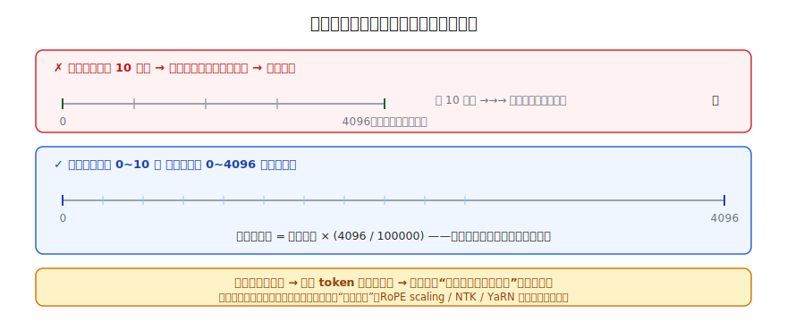
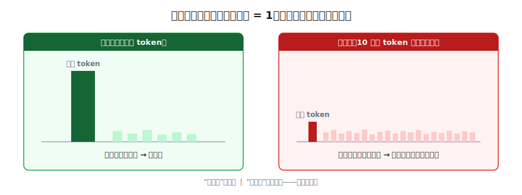
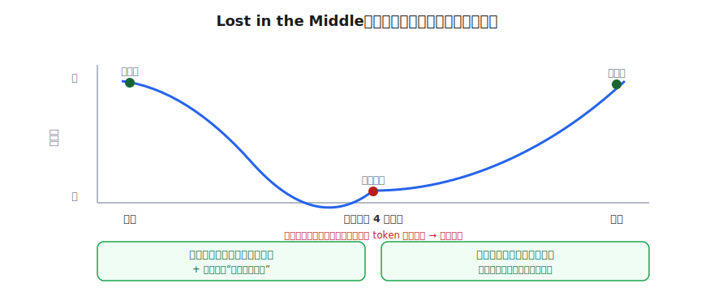
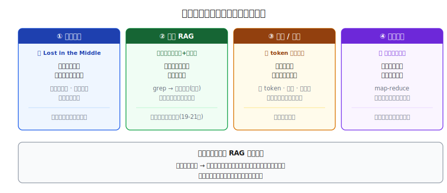

# 上下文窗口与长文本策略

> 一个全栈工程师的大模型学习笔记（十五）

128K 上下文真的能用满吗？

上一篇我们把模型本身变小了。这一篇换个角度：模型大小不动，**它一次能"看"多少字**？各家都在卷"128K 上下文""1M 上下文"，听起来像是"能一口气读完一整本书"。但这数字背后，藏着一笔"装得下"和"用得好"完全是两回事的账。

读完，你能看懂模型卡片上的 `context length`、`RoPE scaling`、`position interpolation`、`YaRN` 这些字眼，更重要的是——知道为什么"标称 128K"不等于"128K 都好用"，以及真要做长文档应用时，工程上有哪几招。

---

## 一、先把"窗口"这堵墙的来历钉死

**锚定**一下。第十三篇我们一起算过两笔账，是理解这一篇的地基，先回忆出来：

1. **KV Cache 吃显存，是 O(N)**——上下文里每多一个 token，就要永久缓存它的 K 和 V，显存随长度线性往上涨。
2. **注意力的计算量是 O(N²)**——第 N 个 token 要回头和前面所有 token 算分数，序列翻倍，计算量翻四倍。

所以"上下文窗口"这个数字，本质是**厂商在显存和算力上画的一条天花板线**：

> 到这里为止，KV Cache 缓存得下、注意力算得动。超过这条线，要么显存爆，要么慢到不可用。

记住这个定性：**窗口 = 工程能扛住的天花板，不是模型"理解力"的边界。** 这一篇要拆的所有微妙之处，根子都在这句话里。

---

## 二、厂商怎么把窗口从 4K 撑到 128K

模型最早只有 2K、4K 窗口。要撑到 128K，第一关不是显存，而是一个更隐蔽的东西——**位置**。

回忆第五篇——模型靠**位置编码**知道"每个 token 排第几号"（当时我们用的是最朴素的做法：把一个位置向量直接**加**到 embedding 上）。现代主流模型换成了一个更强的变体 **RoPE（旋转位置编码，本篇新引入）**：它不再做加法，而是给每个位置算一组**旋转角度**，位置越靠后转得越多。关键在于——**训练时模型只见过 0~4095 号位置对应的角度**。

那现在你硬给它喂一个"第 10 万号"token，会怎样？

> 第 10 万号对应一个模型**从没见过的大角度**。它没学过这个位置该怎么处理，直接懵——输出乱套。这叫**外推失败（extrapolation）**。

聪明的解法不是硬往外推，而是反过来——**把长序列"压"回模型认得的范围**：

> 模型只会读一把 **0~4096 的尺子**。来了 10 万个 token，与其造一把它没见过的 10 万长尺子，不如**把旧尺子的刻度捏密**——让"第 10 万号"落到旧尺子"第 4096"的位置上，中间所有 token 按比例挤进去。
>
> `映射后的位置 = 真实位置 × (4096 / 100000)`

这就是 **位置插值（Position Interpolation）**。模型看到的角度全都还在它训练时认得的范围里，于是不再外推到崩。（你在模型卡片上看到的 `RoPE scaling`、`NTK-aware`、`YaRN`，都是这个思路的精装版——对不同频率的维度做更聪明的分别缩放，效果更好，但内核还是"把陌生大位置压回训练范围"。）

不过得补一句关键前提：**光把刻度压回去，往往只是"不崩"，离"好用"还差一步——通常还要在长序列上做少量微调，把模型重新"校准"回来**。这也正是 YaRN 这类方法被看重的原因：它把所需的微调量压得很低。所以"撑大窗口"从来不是改个数字那么简单。

**但天下没有免费的窗口。** 尺子刻度捏密了，**相邻两个 token 的位置差就变小了**：本来 1 号和 2 号隔得清清楚楚，现在挤在一起，模型分辨"谁前谁后、谁离谁近"的能力**下降**。

> 一个 128K 大窗口，在内容还没塞进去之前，**光是"把窗口撑大"这一步，就已经悄悄付了一笔分辨率的税**。

这是第一层代价。下面是更要命的第二层。

---

## 三、装得下 ≠ 用得好：信噪比这笔账

假设窗口已经撑到 128K，也没爆显存。现在我把一篇 **10 万字的长文档**整个塞进去，问它："文档第 4 万字那段提到的那个数字是多少？"

它能稳定答对吗？盯着**注意力机制**想——每个 token 要和前面所有 token 算注意力分数，这些分数过 softmax 后**加起来等于 1**，是一份**固定的预算**。

候选从几十个 token 变成 10 万个，等于 **10 万张嘴抢同一碗饭**。

> 注意力不是平均分配（它训练出来会**尖峰**，该聚焦的能抢到高权重），但候选越多，想让正确的那个 token 从噪声里"尖"出来就越难。周围 9 万多个不相关 token，每个分到的权重虽小，**架不住数量多，积少成多的背景噪声会把信号压下去**。

这是个**信噪比**问题：塞得越满，正确信息相对于背景噪声就越微弱。**"装得下"靠的是显存，"找得到"靠的是信噪比——这俩是两回事。** 模型答不出来时，它不会老实说"我没找到"，而是**编一个**——这就是长文档问答里幻觉高发的根源。

---

## 四、最反直觉的一招：Lost in the Middle

信噪比还不是全部。把同一条关键信息放在长文档的**不同位置**，实测出来的答对率，是一条**U 形曲线**：

放**开头**记得住，放**结尾**也记得住，唯独放**中间**——掉得最狠。这个现象有个正式名字：**Lost in the Middle（中间遗忘）**。

为什么偏偏是中间塌？是两股力气一头一尾把中间挤垮的：

**力气一·开头记得牢（首因效应）。** 你记一份 50 人名单，最容易想起第一个。模型这边对应两个原因：

- **训练数据的习惯**：自然界的文章，重要信息天然爱待在开头（标题、导语、论点先行）。模型读了万亿 token，被训出一个本能——"开头通常重要，多分点注意力"。
- **注意力锚点（attention sink）**：模型会对**最前面那几个 token**形成结构性的强注意力，像抛了个锚。哪怕开头内容本身不重要，这个位置也被盯住。

**力气二·结尾记得牢（近因效应）。** 你回忆名单，最后一个也容易想起，因为最新鲜。模型这边对应两点：一是生成下一个 token 时，**当前位置紧挨着结尾**，结尾内容和"正在生成的地方"语义最贴近、关联最强；二是 RoPE 这类位置编码本身就带"**相对距离越远、注意力越容易衰减**"的倾向（ALiBi 更是直接对远处加惩罚）。注意别误读成"远处就够不到"——自注意力对每个位置都能等距触达，远处只是更**容易在内容竞争里被压过**（正好呼应上一节的信噪比）。所以结尾不是"近到够得着"，而是"**又新鲜又强相关，更容易抢到高权重**"。

于是中间被两头夹塌：**没有开头的锚，没有结尾的新鲜，还要和最多的 token 抢那份归一化的注意力预算**——三面受敌。

> 这就是为什么"关键信息明明在上下文里，模型却像没看见"。它不是没存进去，是**存进了那个最迟钝的位置**。

---

## 五、四类长文本策略：怎么把"又贵又微妙"驯服

既然硬塞长文档又贵（O(N²) + O(N) 的账单）、又塌中间，工程上就有了四类对策。我们一类一类看，每一类都对应前面推出来的某个痛点。

**策略一·摆放顺序（针对 Lost in the Middle）。** 既然模型对头尾最敏感，那就**把最关键的内容摆在开头和结尾，把次要的塞进中间迟钝区**：

- **问题放两遍**：开头说一次"请回答 X"，结尾再重复一次"记住，问题是 X"——头尾双锚。
- **检索结果重排（reordering）**：取回的多段资料，把模型判断**最相关的排在最前和最后**，最不相关的丢中间。
- **指令别埋中间**：系统提示、关键约束往头尾放。

代价：这是**治标**。总量没变，O(N²) 的账照样付，中间那段还是没人好好看。

**策略二·检索后塞（RAG，首选解）。** 重排只是给同一堆东西换位置。更狠的问题是：**一开始为什么非要把整篇文档都塞进去？** 如果用户问"第 4 万字那个数字"，理想情况下我**只**把那一小段喂进去就够了。

那怎么在塞之前就找出"哪段相关"？最朴素的版本就是 `grep`——关键词匹配。但它有个语义的洞：用户问"盈利"，文档写"净利润"，`grep` 匹配不到。所以要进一化——把"问题"和"每段文档"都变成**向量**（第六篇/embedding：语义相近的向量距离近），找**距离最近**的几段。这叫**语义检索**。

> **"先检索相关片段，再只塞那一小段"——这整套就是 RAG（检索增强生成），是"长文本爆炸"的首选解。** 与其把整本书塞进去赌模型能找到，不如先翻到那一页，只把那页给它。

RAG 太重要，本系列**第 19~21 篇**会专门拆。但这里要把它的位置说准，别给你错觉：它把问题从"在 10 万 token 里抢注意力"**缩小到一小段相关内容**，信噪比和中间遗忘因此大幅缓解——**但不是凭空消除，而是把难点转移到了"检索"这一步**。检索召回并不完美：召回了无关段，信噪比就在拼接后的上下文里重现；漏掉了相关段，模型压根看不到。所以策略一的"重排"在 RAG 里照样用得上。一句话：**RAG 把"模型找不找得到"换成了"检索准不准"，问题搬了家、没消失**——工程难点也跟着搬到检索，细节留到 19~21 篇。

**策略三·压缩 / 摘要（针对 token 太多）。** 长文档先让模型（或一个小模型）**缩成摘要**，再把摘要塞进去。省 token、省钱、省延迟。代价：摘要会**丢细节**，问到摘要里没保住的内容就抓瞎。适合"要全局把握、不抠细节"的场景。

**策略四·分段处理（针对超出窗口）。** 文档长到连窗口都装不下时，只能**切块**：每块单独处理，再把结果**汇总**（经典的 map-reduce）。代价：**慢**，而且**跨块的关联会断**——如果答案需要把第 1 块和第 50 块的信息凑一起，分段就容易漏。

---

## 六、并排一比，什么时候用哪招

| 策略 | 针对的痛点 | 一句话 | 主要代价 |
|---|---|---|---|
| **摆放顺序** | Lost in the Middle | 重要的放头尾，次要塞中间 | 治标，总量没变，贵照样贵 |
| **检索 RAG** | 信噪比 + 中间遗忘 | 先找相关一小段，只塞那段 | 要建向量库（19-21 篇） |
| **压缩摘要** | token 太多、太贵 | 先缩成摘要再塞 | 丢细节 |
| **分段 map-reduce** | 超出窗口上限 | 切块各处理再汇总 | 慢，跨块关联断 |

一个实用的决策直觉：

> **能用 RAG 就别硬塞**——这是首选解（代价是检索准不准成了新的关键）。塞不可避免时（比如必须看全文），用**摆放顺序**保护关键信息、用**压缩**砍掉冗余。**只有**文档超出窗口上限，才退到**分段**。

---

## 总结

| 概念 | 一句话解释 | 关键点 |
|------|-----------|--------|
| **上下文窗口** | 工程能扛住的天花板，不是理解力的边界 | 来自 KV Cache O(N) + 注意力 O(N²) |
| **位置插值** | 把陌生大位置压回训练范围 | `RoPE scaling`/`YaRN`；代价是分辨率下降 |
| **信噪比** | 塞得越满，正确信息越被背景噪声压下去 | "装得下"≠"找得到" |
| **Lost in the Middle** | 关键信息放中间最容易被忽略 | U 形曲线；首因 + 近因夹塌中间 |
| **四类策略** | 摆放顺序 / RAG / 压缩 / 分段 | 能用 RAG 就别硬塞 |

把这一篇串起来：

1. **窗口是天花板，不是理解边界**——根子在第十三篇的 O(N) 显存和 O(N²) 计算
2. 厂商靠**位置插值**把窗口撑大，代价是**分辨率下降**
3. 装得下 ≠ 用得好：**信噪比变差** + **Lost in the Middle**，让"128K 标称"和"128K 好用"成了两回事
4. 四类策略对症下药，**能用 RAG 就别硬塞**

现在再看任何一个标称"长上下文"的模型，你应该会多问一句：**它是真能用满，还是只是装得下？**

---

## 留给你的问题

我们已经把模型从"怎么炼成"讲到"怎么瘦身"再讲到"怎么喂长文本"。到这里，第三阶段的**原理**部分基本齐了——但有个一直被绕开的实操问题：**这一切，到底跑在哪、怎么跑起来给真实用户用？**

- 一个权重文件躺在硬盘上，怎么变成一个能被 App 调用的 **API 服务**？
- 第十三篇提过的 **vLLM**、连续批处理，真要部署时怎么配？
- 100 个用户同时来问，**负载均衡、显存怎么分**，才不会一崩崩一片？

下一篇 Blog 16《模型部署实战：从权重文件到 API 服务》，我们把第三阶段学的所有"省"和"快"的招数，落到一套真能上线的部署里。

---

*这是「全栈工程师的大模型学习笔记」系列第十五篇，第三阶段「推理与部署」第三篇。上一篇：[量化与蒸馏：大模型瘦身术](14-quantization-distillation.md)。下一篇：《模型部署实战：从权重文件到 API 服务》。如果你也是一个对 AI 好奇的程序员，欢迎一起上路。*
