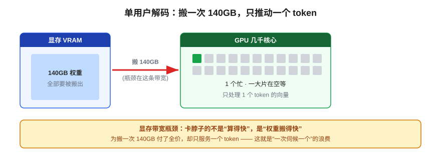
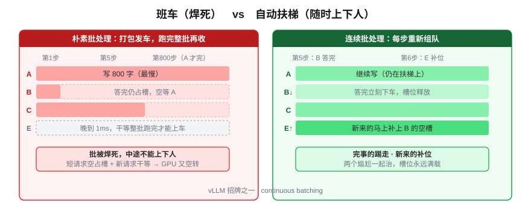
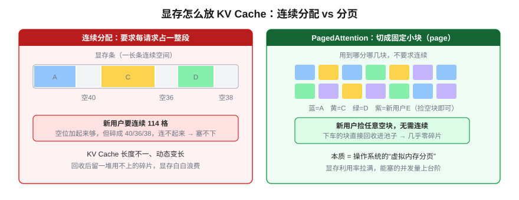
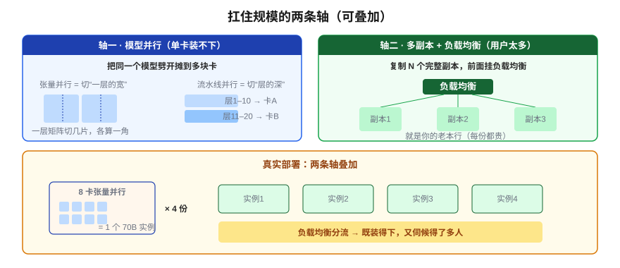

# 模型部署实战：从权重文件到 API 服务

> 一个全栈工程师的大模型学习笔记（十六）

vLLM、Docker、负载均衡怎么搭？

前面五篇，我们把模型从"怎么炼成"讲到"怎么瘦身"再到"怎么喂长文本"。但有个问题一直没正面回答：**这一切，到底怎么跑起来给真实用户用？** 一个 140GB 的权重文件躺在硬盘上，离一个能被 App 调用的 API，中间隔着什么？

这一篇是第三阶段的收官。好消息是：**你是全栈工程师，"部署一个服务"这件事你太熟了**——我们就从你的 Web 部署直觉出发，看大模型部署到底"特殊"在哪。读完，你能看懂 `vLLM`、`continuous batching`、`PagedAttention`、`tensor parallel`、`OpenAI-compatible` 这些部署绕不开的词，到底在解决什么问题。

---

## 一、第一关：权重该装到哪里去

**锚定**你最熟的场景。部署一个普通 Web API，大致是这样：

```
代码文件 → 起一个进程 → 加载进内存(RAM) → 监听端口 → 收请求 → 处理 → 返回
                                              ↑
                                  并发高了就多开实例 + 负载均衡
```

普通服务，代码加载进**内存**就能干活。但大模型这个 140GB 的家伙——它该装到哪？答案是 **GPU 的显存（VRAM）**。为什么不能像普通程序那样塞进内存就完事？根子在 **GPU 的超能力：并行**。

回忆第六篇：模型一次前向传播，核心是**一连串巨大的矩阵乘法**。而矩阵乘法是那种"成千上万个乘加、彼此谁也不依赖谁"的活：

> CPU 像几个博士，单个聪明但人少，只能一个一个算；GPU 像几千个小学生，每人算一格，**一声令下全班同时动手**。矩阵乘法正好是这种能"全班并行"的题。

所以权重必须躺在**显存**里——只有显存能喂饱这几千个核心。要是放在普通内存，GPU 每次都得隔着 PCIe 总线去远处搬数据，几千个核心全在干等，并行优势瞬间归零。

这一条就定死了大模型部署和普通 Web 部署的**根本区别**：

| | 普通 Web 服务 | 大模型服务 |
|---|---|---|
| 加载到哪 | 内存（RAM），便宜，容量大 | **显存（VRAM），贵，单卡才 24/80GB** |
| 多开实例 | 几乎零成本（代码很小） | **每个实例都要一整份权重塞进显存** |

记住这句**铁律：显存又贵又有限**。这一篇后面所有的难点，根子都在这。

---

## 二、把 GPU 当普通服务用，浪费在哪

权重进显存了。最自然的做法，是像部署普通 API 那样：起个 FastAPI 进程包住它，**来一个请求处理一个**。但这么干，会把 GPU 的命根子浪费掉。盯着**解码**这一步看。

第十三篇讲过，生成是逐 token 的：要把当前这**一个** token 的向量，穿过模型那一堆巨大的权重矩阵，算出下一个。算一下两边的量：

> - **要搬动的权重**：整整 140GB，全得从显存读出来喂给核心。
> - **要处理的数据**：就**一个** token 的向量（几千个数字）。

于是出现一个荒诞画面：

> 你花血本把 140GB 权重从显存搬了一遍，**结果只为推动一个 token 往前走一步**。几千个核心刚拿到权重，活一下就干完，然后集体**等下一轮权重搬运**。

这叫**显存带宽瓶颈（memory-bandwidth bound）**：卡脖子的不是"算得快不快"，而是"权重搬得快不快"。核心是闲的，时间全耗在搬权重上。



**你为搬一次 140GB 付了全价，却只服务了一个 token。** 这就是"一次伺候一个"最大的浪费。

---

## 三、批处理：让闲置的核心"搭车白赚"

既然"搬一次 140GB 权重"这个贵价动作已经付了，而核心又大把闲着——那就该让更多用户**搭这趟车**。

> 用户 A、B、C、D 都在等生成下一个 token。把这四个人的 token **凑成一摞，趁这一次权重搬运，一起穿过去**。权重还是只搬一次，多服务的那三个用户，**几乎是白赚的**——因为瓶颈本来就是搬权重，不是算力，闲着的核心正好吃下这多出来的几摞 token。

这就是**批处理（batching）**，第十三篇见过。它把 GPU 从"为一个 token 空转"变成"一次喂饱一摞"，**吞吐量翻好几倍**，是推理服务的命脉。

但最朴素的批处理——**等够 4 个人打包一起跑、跑完整批再收下一批**——有两个尴尬：

**尴尬一·有人写长文，有人问是非。** 同一批里，A 让它写 800 字（要 800 个 token），B 只问"对还是错"（5 个 token 就完）。整批要**等最慢的 A 跑完**才结束。B 早早生成完，它占的槽位却**只能空等 A**，谁也填不进来——GPU 又空转了。

**尴尬二·来晚一步，干等一批。** 批刚发车，用户 E 晚到 1 毫秒，按"跑完整批再收下一批"，E 得眼睁睁等这一整批跑完才能上车。延迟全堆这儿。

这两个尴尬，本质是同一件事：**批一旦发车就被焊死了，中途不能上下人。**

---

## 四、vLLM 的两个绝活：连续批处理 + PagedAttention

把"班车"换成"**自动扶梯**"想，解法就出来了。

**绝活一·连续批处理（Continuous Batching）。** 不再"打包发车、跑完再收"，而是**每生成一步都重新组队**：谁生成完了（B 答完）就**立刻下扶梯**，腾出的槽位**马上让新来的 E 补上**。不用等整批，每一步都在动态上人下人。两个尴尬一起治：短请求随时下车不占位，新请求随时上车不干等。



**绝活二·PagedAttention（显存分页）。** 但"随时上下人"有个前提：槽位里装的是那个用户的 **KV Cache**（第十三篇：每个请求的前文缓存）。B 下车，它那块 KV Cache 就得**立刻回收**，腾给 E。

麻烦在于，KV Cache **每个用户长度不同、还在动态变长**。要是像数组那样要求"每个请求占一整段连续显存"，回收时就会留下一堆**碎片**（这儿空 100、那儿空 200，新用户要 250 却哪都塞不下）。这个问题，你做后端肯定见过它的孪生兄弟——**操作系统管内存**：

> 把显存切成一个个固定大小的**小块（page）**，KV Cache 用到哪儿分哪几块，**不要求连续**；用户下车，把它的块直接回收进池子。这就是 **PagedAttention**——本质是给显存做了套"虚拟内存分页"，几乎消灭碎片浪费。



**连续批处理（扶梯随时上下人）+ PagedAttention（显存分页不留碎片）**，这俩一配合，GPU 利用率和能塞的并发量上一个台阶。这就是为什么真上线大家用 **vLLM / TGI** 这类推理引擎，而不是自己 FastAPI 包一层裸模型。

---

## 五、扛住 100 个用户：两条不同的"加卡"轴

单卡榨干了，但还有 Blog 15 结尾那个钩子：**100 个用户同时来怎么办？** 先用铁律算笔账：一块 80GB 的卡，光 FP16 的 70B 权重就要 140GB——**连一份权重都装不下**。

这逼出两条**意味完全不同**的"加卡"方向，别混为一谈：

**轴一·模型太大装不下 →【模型并行】（大模型特有的新麻烦）。** 把**同一个模型劈开摊到多块卡**，两种劈法：

- **张量并行（Tensor Parallel）**：把**每一层那个大矩阵**切几刀，每块卡各算一片，算完拼起来——像一道大矩阵乘法四个人各算一角。卡间通信极频繁，所以一般只在一台机器内、靠高速互联（NVLink）的卡之间做。
- **流水线并行（Pipeline Parallel）**：按**层**切——第 1~10 层放卡 A，11~20 层放卡 B，数据像过流水线依次穿过。

一句话分野：**张量并行切的是"一层的宽"，流水线并行切的是"层的深"。** 目的都一样——几块卡凑出足够显存，把单卡装不下的模型托起来。

**轴二·用户太多 →【多副本 + 负载均衡】（你的老本行）。** 模型本身装得下，纯粹流量大，那就是你最熟的套路：**复制 N 个完整副本，前面挂负载均衡分流**。和部署普通 Web 服务没本质区别——只不过每个副本都贵（一整份权重 × N）。

**关键：两条轴是叠加的。** 真实大厂部署长这样：



> 先用 **8 块卡的张量并行**凑出显存、托起**一个** 70B 实例 → 再把这个"8 卡单元"**复制 4 份**、挂上**负载均衡** → 扛住高并发。既要装得下（模型并行），又要伺候得了多人（多副本）。

---

## 六、最后一层：包装成真正的服务

推理引擎能榨干 GPU 了，但它还不是"服务"。补上外面两层，才真能上线：

- **API 层（OpenAI-compatible）**：vLLM、TGI 都默认提供一个**和 OpenAI 接口长得一样**的 HTTP 端点（`/v1/chat/completions`）。好处是：你的应用代码按 OpenAI 的格式写，**底层换成自己部署的开源模型，几乎不用改代码**——这是事实标准，记住它，第四阶段写应用全靠它。
- **容器化（Docker）**：模型部署依赖一长串特定版本的 CUDA、驱动、Python 库，环境地狱比普通服务更深。所以标准做法是**打成 Docker 镜像**：镜像里固化好 vLLM + 模型 + 全部依赖，到哪台机器都能一键拉起，扩副本时直接复制容器。

把这一层加上，整条链就闭合了：

```
权重文件 → 推理引擎(vLLM: 连续批处理+PagedAttention) → 模型并行/多副本
        → OpenAI 兼容 API 层 → Docker 容器 → 负载均衡 → 用户 POST /chat
```

---

## 总结

| 概念 | 一句话解释 | 解决什么 |
|------|-----------|---------|
| **权重进显存** | GPU 几千核心并行算矩阵乘法 | 为什么非显存不可（铁律：显存贵且有限） |
| **显存带宽瓶颈** | 搬一次 140GB 只服务一个 token | 单用户解码核心大量空转 |
| **批处理** | 多用户 token 凑一摞搭同一趟权重搬运 | 吞吐量翻倍，多服务的几乎白赚 |
| **连续批处理** | 每步动态上人下人，不等整批 | 治长短不一 + 来晚干等 |
| **PagedAttention** | 显存分页，KV Cache 不要求连续 | 消灭碎片，槽位灵活回收 |
| **模型并行** | 张量切宽 / 流水线切深 | 单卡装不下的模型摊到多卡 |
| **多副本 + 负载均衡** | 复制完整副本分流 | 用户太多（老本行） |
| **OpenAI 兼容 + Docker** | 标准接口 + 固化环境 | 应用免改 + 一键扩缩 |

把这一篇串起来：

1. **权重必须进显存**，因为 GPU 靠几千核心并行算矩阵乘法——由此得铁律"显存又贵又有限"
2. 单用户解码是**显存带宽瓶颈**，搬一次权重只服务一个 token，核心空转
3. **批处理**让闲置核心搭车白赚；朴素批两尴尬，靠 **连续批处理 + PagedAttention（vLLM）** 破解
4. 扛规模有两条轴：**模型并行**（装得下）× **多副本 + 负载均衡**（伺候得了多人），可叠加
5. 外面再包 **OpenAI 兼容 API + Docker**，整条链才闭合成能上线的服务

到这里，**第三阶段「推理与部署」收官**。你现在应该能看懂一个模型从权重文件到线上 API 的完整路径，也理解每一处性能瓶颈卡在哪、用什么招破解。

---

## 留给你的问题

第三阶段我们一直在折腾"模型这台机器本身"——怎么跑快、跑省、跑稳。但有个扎心的现实：**同样一个模型、同样的 API，有人用出花来，有人用得稀烂。** 差距不在模型，在**怎么喂它**。

- 为什么同样问一件事，换个问法、补一段背景，效果天差地别？
- "提示词工程"听起来很玄，它背后有没有可复用的章法？
- 比 Prompt 更大的一个词——**Context Engineering（上下文工程）**，到底在工程什么？

从下一篇起，我们进入**第四阶段「构建 AI 应用」**。Blog 17《Context Engineering：超越 Prompt 的上下文工程》，我们从"把模型当黑盒积木，怎么用好它"重新出发。

---

*这是「全栈工程师的大模型学习笔记」系列第十六篇，第三阶段「推理与部署」收官篇。上一篇：[上下文窗口与长文本策略](15-context-window.md)。下一篇：《Context Engineering：超越 Prompt 的上下文工程》。如果你也是一个对 AI 好奇的程序员，欢迎一起上路。*
