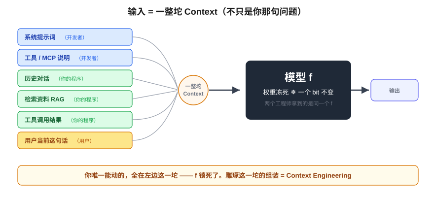
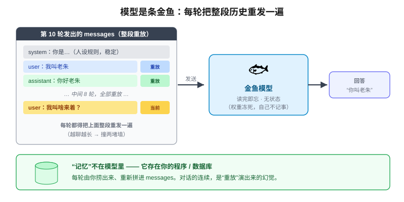
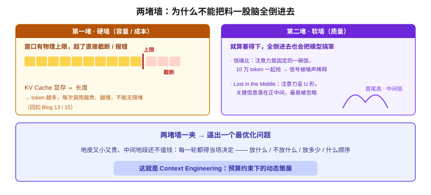
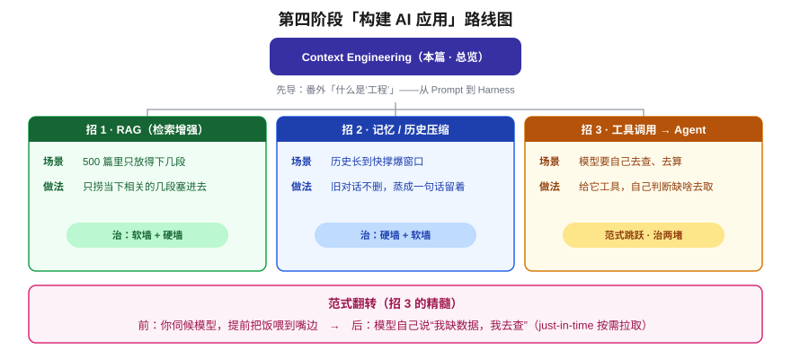

# Context Engineering：超越 Prompt 的上下文工程

> 一个全栈工程师的大模型学习笔记（十七）

同一个模型，为什么有人用出花、有人用稀烂？

前面十六篇，我们一直在**拆这台机器本身**：文字怎么变 token、Attention 怎么让 token 互相沟通、参数怎么从随机噪声训成语言能力、怎么瘦身、怎么塞进显存跑成一个 API 服务。到上一篇收官，这台机器已经作为一个 `/v1/chat/completions` 端点，稳稳地跑起来了。

从这一篇开始，**视角要翻面**。我们不再折腾机器内部，而是把它当成一块**冻住的黑盒积木**——你这个全栈工程师，要在它上面**盖楼**了。这是第四阶段「构建 AI 应用」的开篇。

读完这篇，你会拿到第四阶段的**整张地图**：什么是 Context Engineering，它为什么比"写好提示词"大得多，以及后面那一串篇目（RAG、记忆、Agent）到底各自在解决什么。

---

## 一、唯一的杠杆：你只能动"输入"

先从上一篇结尾我埋的那个钩子说起：

> 同一个模型、同一个 API 端点，两个工程师去调。一个做出来惊艳，一个做出来稀烂。

把模型当成一个数学函数，这件事我们第一篇就讲过：

```
输出 = f(输入)
```

关键在于——我们后面亲手证明过两件**铁律**：

1. **`f` 是冻死的**。模型上线后推理时，权重一个 bit 都不会变（不像训练那样反向传播去更新它）。
2. 对两个工程师来说，**这个 `f` 一模一样**，是同一份权重、同一个服务。

那"惊艳 vs 稀烂"的全部差距，**在物理上只可能来自一个地方**：

> `f` 锁死了，你唯一能动的，就是喂进去的那个 `输入`。

就这么朴素，又这么关键。**所有的成败，100% 落在输入上。** 这就是为什么"怎么构造输入"值得单独开一个阶段，当成正经工程来做。

---

## 二、输入不是"那句问题"，是一整坨

很多人一听"输入"，脑子里浮现的就是**自己敲进对话框的那句话**——把"写个排序"改写成"用 Python 写带注释的快排，处理空数组边界"。在这个层面雕字句，大家叫它 **Prompt Engineering（提示词工程）**。

但请你回忆**真实**用 AI 编程的场景。你不会甩一句孤零零的问题就指望它干好活。模型推理那一刻真正"看到"的输入里，除了你当前这句话，**还塞了一大堆别的东西**：

| 成分 | 谁放进去的 | 例子 |
|---|---|---|
| **系统提示词** | 应用开发者（你） | "你是谨慎的客服，只答公司业务" |
| **工具 / MCP 的定义说明** | 你 | 有哪些函数能调、参数啥格式 |
| **历史对话** | 你的程序 | 前几轮的 user / assistant 消息 |
| **检索来的资料** | 你的程序 | 从公司文档库捞出的相关段落 |
| **工具调用的结果** | 你的程序 | 上一步 `查天气()` 返回的 JSON |
| **用户当前这句话** | 用户 | "那明天呢？" |

看出关键了吗——**这一整坨**，才是模型真正吃进去的 `输入`。而 **Prompt Engineering 只是在雕琢上面表格里的一两行**（主要是系统提示词和用户那句话）。

> 把**这一整坨的组装**当成工程问题来做——放什么、不放什么、放多少、按什么顺序摆——这就是 **Context Engineering（上下文工程）**。它严格地**包住**了 Prompt Engineering，是更大的一层。



---

## 三、模型是条金鱼：每轮都得把整坨重发一遍

上面表格里有一行特别值得抠：**"历史对话"**。

设想你跟 AI 聊了 10 轮。第 1 轮你说"我叫老朱"，到第 10 轮它还能叫出你名字。感觉上，它"记住"了你。

但回忆两件事：① 模型权重**冻死**，推理时一个 bit 不变；② 上一篇那个 API 服务，本质是**无状态**的——一次请求处理完，服务器并不替你保留什么。

那这份"记忆"到底存哪、谁塞进去的？答案是：**存在你这一侧**（你的应用的数据库 / 内存），每次请求时，**由你的程序重新拼进输入里**。具体不是揉进系统提示词，而是把历史作为 `messages` 数组**原样重放**：

```
[
  {role: system,    content: "你是..."},      ← 人设规则，稳定
  {role: user,      content: "我叫老朱"},      ← 第1轮，重放
  {role: assistant, content: "你好老朱"},      ← 第1轮，重放
  ...  中间 8 轮，全部重放  ...
  {role: user,      content: "我叫啥来着？"}    ← 第10轮，当前
]
```

想透这点，会得到一个挺颠覆的结论：

> 模型其实是条**金鱼**：每次调用，它对**之前发生过什么一无所知**。你必须把整段历史**从头到尾重发一遍**，它才"看起来像"在连续对话。所谓"聊天"，是你的程序用**重放历史**演出来的幻觉。



这条直接决定了第四阶段的难度：既然**每一轮都得把整坨重发**，那这坨东西只会**越聊越大**——而这，正好撞上下面两堵墙。

---

## 四、两堵墙：为什么这配得上"工程"两个字

有人会想："那我买个 100 万 token 的大窗口，把所有料一股脑全倒进去不就完了？" 偏偏不行。会撞上两堵墙。

**第一堵，硬墙（容量 / 成本）。** 回忆第十五篇：上下文窗口有**物理上限**，超了直接截断或报错。而且回忆第十三篇：KV Cache 占的显存正比于序列长度——**token 越多，每次调用越贵、越慢**。你那坨东西不能无限堆。

**第二堵，软墙（质量）。** 这堵更阴险。就算钱管够、窗口大到**根本塞不满**，把 500 篇文档全倒进去也是个坏主意——还记得第十五篇的两个现象吗：

- **信噪比**：softmax 的注意力预算是固定的一碗饭，10 万 token 一起抢，真正的信号被噪声稀释，模型容易抓瞎、甚至幻觉。
- **Lost in the Middle**：注意力呈 U 形，关键信息一旦落到长上下文的**正中间**，最容易被忽略。

两堵墙一夹，"工程"两个字就立住了。因为它逼出一个**最优化问题**：

> 你手里有一块**又小又贵、而且中间地段还不值钱**的地皮（上下文窗口），却有一大堆东西都想往里挤。每一次调用，你都得当场决定：**放什么、不放什么、放多少、按什么顺序摆**——还得每轮重新决策（金鱼，记不住）。



这就是 Context Engineering 的活儿本身：

> **在预算约束下，对喂给模型的那一整坨做"动态策展"。** 不是写一句好 prompt，是经营一块地皮。

"约束下做权衡、每次都要重新决策"——这种味道，是不是很像你日常做的别的工程？（这个"工程"二字本身的份量，下一篇番外专门聊。）

---

## 五、三类策展手段：第四阶段路线图

面对这两堵墙，一个 Context 工程师手里有哪几类"招"？正好用它们铺开第四阶段的地图：

| 场景 | 招 | 正式名字 | 治哪堵墙 |
|---|---|---|---|
| 500 篇文档，每次只放得下几段 | **检索** | **RAG**（检索增强生成） | 软墙 + 硬墙 |
| 对话长到历史快撑爆窗口 | **压缩旧的** | 摘要 / 分层记忆 | 硬墙 + 软墙 |
| 模型需要自己去查、去算 | **给它工具** | 工具调用 / Agent | 两堵都缓解 |

前两招好理解：**RAG** 是"500 篇里只捞当下相关的几段塞进去"；**压缩**是旧对话不删，而是**蒸成一句话**留着（回扣第十五篇的摘要 / mapreduce）。

第三招藏着第四阶段最大的**范式跳跃**，值得先点一句：

> 前面我们都是**"你伺候模型，提前把饭喂到嘴边"**；而 Agent 是**反过来——模型自己说"我缺个数据，我去查"**，按需（just-in-time）把上下文拉进来。给它一把工具，让它自己判断缺什么、当场去取。

你表格里写过的"工具调用结果"，正是这么回来的。这一翻转，后面会专门展开成工具调用 → Agent → 多 Agent 一条线。

```
第四阶段「构建 AI 应用」路线图
17 Context Engineering（本篇 · 总览框架）  ← 你在这儿
   ├─ 番外：什么是"工程"思维（从 Prompt 到 Harness）
   ├─ RAG：检索增强                    （招 1 展开）
   ├─ 记忆 / 历史压缩                   （招 2 展开）
   └─ 工具调用 → Agent → 多 Agent      （招 3 展开 · 范式跳跃）
```



---

## 小结

这一篇没有新公式，但它把你的视角从"理解模型"扳到了"用模型盖楼"：

- **唯一的杠杆是输入**——`f` 冻死，成败全在你喂进去的东西。
- **输入是一整坨 Context**，不只是那句问题；雕琢这一整坨的组装，就是 Context Engineering，它包住了 Prompt Engineering。
- **模型是条金鱼**——无状态，每轮都得把整段历史重放，"记忆"是你的程序演出来的。
- **两堵墙**（硬墙容量成本 + 软墙信噪比 / Lost in the Middle）把这件事逼成一个**预算约束下的动态策展**最优化问题——这才配叫"工程"。
- **三类策展手段**（RAG / 压缩记忆 / 工具 Agent）铺成了整个第四阶段的路线图。

下一篇是个**番外**：我在这篇里反复砸"工程"两个字，但什么叫"工程思维"？从"懂原理"到"会盖楼"，中间隔的那层东西，正好趁这个跨阶段的当口讲清楚。
