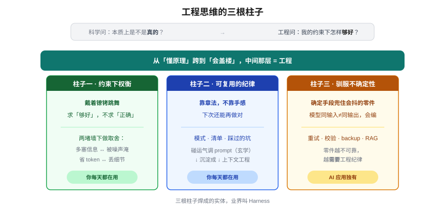
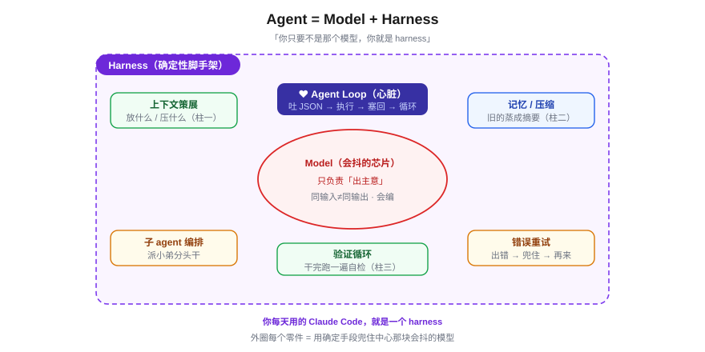
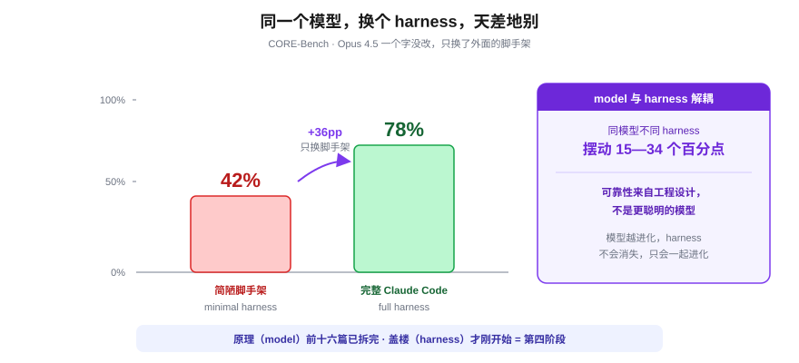

# 什么是"工程"？从 Prompt 到 Harness

> 一个全栈工程师的大模型学习笔记（番外 · 第四阶段定调）

上一篇我反复砸两个字：**工程**。

> "把这一整坨的组装当成**工程**问题来做。"
> "这才配叫**工程**。"
> "约束下做权衡、每次都要重新决策——这种味道，是不是很像你日常做的别的**工程**？"

砸得很爽，但我一次都没正面回答：**凭什么这堆事配叫"工程"，而不只是"调模型的奇技淫巧"？**

这一篇就来还这笔账。它没有新公式、没有新架构——它讲的是从"懂原理"到"会盖楼"，中间隔着的那层东西。讲清楚了，第四阶段后面那一长串篇目（结构化输出、RAG、记忆、Agent）你才知道它们各自在拼一块什么积木。

而且巧的是，2025—2026 年业界给这层东西起了个特别贴切的名字，正好拿来收尾。先按住不表，我们从你自己身上问起。

---

## 一、先问你：程序员 和 工程师，差在哪？

你已经写了十几年代码。我想先问个看似废话、其实是这篇地基的问题：

> 一个**能把功能跑通**的实习生，和一个你**愿意称为"工程师"**的人，差的到底是哪一层？

大多数人脱口而出：**设计能力**。对，但这词太大，我们把它捏小。

设计，到底在跟什么东西较劲？拿你最熟的场景：一个接口要不要加缓存。

- 实习生想的是：**加了快**。
- 你想的是：加缓存就要处理失效、多一层依赖、数据可能脏几秒、运维多一个组件……**"快"** 和 **这一堆代价** 你得当场掂量，挑一个"此时此地够好"的方案。

看出来没有——所谓"设计能力"，剥到底就是：

> **在一堆互相打架、又没有标准答案的约束里，做权衡、拍一个"够好"的方案。**

这恰恰是**工程**和**科学**的分水岭：

| | 在问什么 | 追求 |
|---|---|---|
| **科学家** | 这件事**本质上是不是真的**？ | 唯一**正确**的答案 |
| **工程师** | 在我**这些约束**下，怎么做**够好**？ | 此时此地**够用**的方案 |

桥牌、造楼、写后端，全是后者。**戴着镣铐跳舞**，是工程的底色。

---

## 二、工程思维的三根柱子

把"设计能力"这把尺子立起来，工程思维其实立着三根柱子。前两根你天天在用，第三根是 AI 应用**独有**、也最反直觉的。

### 柱子一：约束下权衡——戴着镣铐跳舞

求"够好"不求"正确"。上一篇那句"**预算约束下的动态策展**"，翻译过来就是这根柱子：

| 工程内核 | 在 AI 应用里 |
|---|---|
| **约束**（绕不开、互相打架） | 两堵墙：窗口上限 + 成本（硬墙）、信噪比 + Lost in the Middle（软墙） |
| **权衡**（顾此失彼） | 多塞信息↔被噪声淹；用 RAG 省地方↔检索可能漏；压缩历史省 token↔丢细节 |
| **够好**（无唯一解） | 没有"正确的 context"，只有"这个任务、这点预算下够用的策展" |

### 柱子二：可复用的纪律——靠章法，不靠手感

你愿意叫"工程师"的那个人，和一个"碰运气碰出一个好方案"的人，还差一条：**下次他还能再做对。**

他靠的不是手感，是一套**可复制、能传承的章法**——脑子里的模式、检查清单、踩过的坑。这正是 **"碰运气调 prompt"** 和 **"上下文工程"** 的分水岭：前者是玄学，后者是工程。

### 柱子三：驯服不确定性——用确定手段兜住会抖的零件

这根最关键。传统软件工程里，你的零件是**确定的**：一个函数，同样的入参，永远吐同样的结果——你在确定的积木上盖楼。

但 AI 应用的核心零件——模型——**本身就是不确定的**：同样的输入，这次这么答、下次那么答，还可能一本正经地编（回扣第十五篇的幻觉）。你是在一块**会抖、会骗人的地基**上盖楼。

这逼出一个反直觉的结论：

> **正因为零件不可靠，AI 应用比传统软件更需要工程纪律，而不是更不需要。**

温度、重试、结构化校验、给模型留 backup、用 RAG 把"它瞎编"换成"它照着材料说"——第四阶段后面要讲的招，本质都是**用确定性的工程手段，去驯服一个不确定的零件**。



到这儿，"工程思维"四个字落地了。但它还停在抽象层面。下面这个名字，把这三根柱子**焊成了一个看得见摸得着的实体**。

---

## 三、这三根柱子有个现成的名字：Harness

你每天都在用一个东西，它就是这三根柱子盖出来的房子——**Claude Code**。

模型（Claude 本身）只是这盒子最中间那块芯片。真正让它能读你的文件、能跑命令、能记住进度、能派小弟、能自我验证的——是**包在芯片外面的那一整套工程**。这套东西，业界 2025—2026 年给了它一个统一的名字：**Harness（智能体运行框架 / 脚手架）**。

这个词不是凭空造的。它来自**软件测试**——test harness 指的是"在受控条件下把代码跑起来的那套夹具/脚手架"。搬到 AI 里，意思顺理成章：

> **Harness = 把一个会抖的模型，套进一层确定性脚手架，让它能可靠地干活的那一整套工程。**

社区把它压成一个口诀，糙但精准：

> **Agent = Model + Harness。**
> *"If you're not the model, you're the harness."*（你只要不是那个模型，你就是 harness。）

Claude Code 的官方文档把这话说死了——原文：*"Claude Code serves as the agentic harness around Claude."*（Claude Code 就是包在 Claude 外面的那层 agentic harness。）[¹]

所以**你不是 harness 的旁观者，你天天在用一个 harness，而且这个学习系列本身就是在一个 harness 里跑出来的**——我等会儿会用到这个事实。

> ⚠️ **诚实提示**：harness 这个词 2025 年才热起来，定义还没完全焊死。广义用法是上面这个"模型之外的一切"；也有人做更细的切分——harness 专指**执行循环**那层，而系统提示词/工具描述/上下文管理那层叫 scaffolding（脚手架）。本篇取**广义**，够用就行。这本身就很"工程"：术语不重要，能干活的那套结构才重要。

---

## 四、拆开 harness，三根柱子全在里面

把 Claude Code 这种 harness 拆开，你会看到一圈零件围着中间那块会抖的模型。逐个对一下三根柱子——



### 心脏：Agent Loop（柱子三的核心机械）

Anthropic 给 agent 下的定义简单到一句话：**"LLMs autonomously using tools in a loop"**（让大模型在一个循环里自主使用工具）[²]。这个循环就是 harness 的心脏，三步一圈：

```
① 模型决定下一步 → 吐出一段结构化 JSON（"我要调 查天气(北京)")
② 你的确定性代码 真正去执行 这个调用
③ 把结果塞回 context → 进入下一圈
   …… 直到模型说"我干完了"才停
```

这里藏着一个全栈工程师必须拎清的点：

> **工具调用，不是模型在动手。模型只吐"数据"（一段 JSON 说想干啥），真正动手的是你的代码。**[²]

模型负责**推理/决策**，你的代码负责**执行**——推理和执行被一刀切开。这就是为什么 harness 能可靠：会抖的部分（模型）只出主意，真正落地的每一步都是你写死的、可测试的确定性代码。**这正是柱子三的机械实现。**

> （这一圈"吐 JSON → 执行 → 塞回结果"，正是下一篇《结构化输出与工具调用》要拆的第一块积木。）

### 上下文管理 + 记忆（柱子一 & 柱子二）

- **上下文策展**：每一圈往 context 里放什么、压什么——这就是上一篇整篇讲的 Context Engineering，**柱子一**的主场。
- **记忆与压缩**：对话长到快撑爆窗口时，harness 自动把旧的**蒸成摘要**（compaction）——Claude Agent SDK 提供服务端 compaction（触发阈值由你设定），Claude Code 则按上下文占用百分比自动触发[³]。

而最能体现**柱子二（可复用的纪律）**的，是 Anthropic 那个让人会心一笑的设计：他们要让 agent 跨多个 context 窗口干长活，办法是——**让 agent 往一个 `claude-progress.txt` 里记进度日志，再配合 git 历史**，下次开一个新窗口先读这两样，就知道干到哪了。

他们自己点破了灵感来源[⁴]：

> *"Inspiration for these practices came from knowing what effective software engineers do every day."*
> （这些做法的灵感，来自我们知道**优秀的人类工程师每天都在干什么**。）

写进度文档、提交 git——这不就是你每天在做的事吗？**柱子二说的"把人类工程师的章法搬过来"，这就是字面意义上的实现。** 你现在该明白，为什么这个学习系列每次开工我都先读 `progress` 记忆、写完就 git commit——我也是个跑在 harness 里的 agent。

### 还有：子 agent 编排、错误重试、验证循环

派小弟分头干、出错了 compact 进 context 再重试、干完跑一遍自检——这些零件后面会逐个展开。它们全是同一件事：**用确定性的工程结构，兜住一个不确定的模型。**

---

## 五、12-Factor Agents：把人类工程章法成文

如果说柱子二是"靠章法不靠手感"，那 2025 年社区真的把这套章法**写成了十二条**——**12-Factor Agents**[⁵]，直接致敬 2011 年 Heroku 那份著名的《十二要素应用》。

挑三条你一看就懂的：

| 要素 | 说的是 | 对应 |
|---|---|---|
| **F3 · Own Your Context Window** | 你得亲手掌控塞进窗口的每一个 token | = 上一篇的**两堵墙**，柱子一 |
| **F8 · Own Your Control Flow** | *"You should own the while loop."* 循环归你掌控，不是甩给模型 | 柱子三：确定性代码当家 |
| **F12 · Stateless Reducer** | 把 agent 写成一个**纯函数** `f(事件历史) → 下一步动作` | ⬅️ 看这条 |

F12 你应该觉得**眼熟到起鸡皮疙瘩**。上一篇我说模型是**一条金鱼**：无状态、不记事，每一轮你都得把整段历史原样重放给它。

那不就是 `f(events) → next_action` 吗？

**这不是我编的类比——它是一条被正式写下来的工程要素。** 金鱼的"无状态、每轮重放"，在工程语言里就叫 **stateless reducer**：状态全在你这侧的事件历史里，模型只是那个把历史折叠成下一步动作的纯函数。

这就是柱子二最硬的证据：**调模型这件事，已经从"碰运气试 prompt"沉淀成了一套有编号、可传承、能照着做的工程纪律。**

---

## 六、硬证据：工程，是独立于原理的一层

讲到这你可能还有个嘀咕：**说了半天，会不会模型够强了，这些花活就都不需要了？**

恰恰相反。这是本篇最该记住的一组数字——**model 和 harness 是解耦的**：



- **同一个模型**，套进不同的 harness，基准成绩能摆动 **15—34 个百分点**[⁶]。
- CORE-Bench 上，**Opus 4.5 一个字没换**，只把脚手架从"简陋版"换成"完整 Claude Code harness"，分数从 **42% 直接跳到 78%**[⁶]。
- Anthropic 自己说得很白：**连 Opus 4.5 这样的前沿模型**，在循环里只丢给它一句高级 prompt（"给我克隆一个 claude.ai"），也**盖不出生产级应用**——必须有工程化的 harness 兜着[⁴]。

一句话收口[⁷]：

> **可靠性来自周围的工程设计，而不是来自一个更聪明的模型。**

所以那个嘀咕的答案是反的：**模型越进化，harness 不会消失，只会跟着一起进化。** 因为：

> 原理（model）我们前十六篇已经拆完了；盖楼（harness）才刚刚开始。
> **"懂原理"和"会盖楼"中间隔的那层东西，就叫 harness。第四阶段，就是教你盖这层。**

这也回答了开篇那笔账——为什么这堆事配叫"工程"：**因为它有一个独立于模型能力的、可设计、可度量、可复用的结构层。** 这正是工程的定义。

---

## 七、第四阶段，每一篇都在拼 harness 的一块积木

回头看上一篇给的路线图，现在你能用一句话串起来了——**它们全是同一台 harness 上的零件：**

| 后续篇目 | 在 harness 里是哪个零件 |
|---|---|
| 18 结构化输出与工具调用 | agent loop 那步"吐 JSON → 执行" |
| 19 / 20 / 21 Embedding · RAG | 上下文策展 · 招 1（检索） |
| 23 对话记忆与状态管理 | 记忆 / compaction · 招 2 |
| 22 评估与质量度量 | 验证循环（柱子三的自检） |
| 24+ Agent → 多 Agent | agent loop 完全体 + 子 agent 编排 |

你不是在零散地学几个技巧。**你在学怎么亲手造一台 harness**——把一块会抖的芯片，盖成一栋用户敢依赖的楼。

---

## 小结

- **工程 ≠ 科学**：科学求"唯一正确"，工程求"约束下够好"。**戴着镣铐跳舞**是它的底色。
- **工程思维三根柱子**：① 约束下权衡 ② 可复用的纪律 ③ 驯服不确定性（AI 独有、最反直觉）。
- 这三根柱子焊成的实体，业界叫 **Harness**：`Agent = Model + Harness`，"你只要不是模型，你就是 harness"。你每天用的 Claude Code 就是一个。
- 拆开看：**agent loop**（模型出主意、你的代码执行）、上下文策展、记忆压缩、子 agent、重试、验证——全是"用确定手段兜住会抖的零件"。Anthropic 直说这些灵感"来自人类工程师每天干的事"。
- **12-Factor Agents** 把这套章法写成了编号要素：F12 的 `f(events)→next_action` 就是上一篇那条**金鱼**的工程学名。
- **解耦是硬证据**：同模型换 harness，成绩摆动 15—34 个百分点；可靠性来自设计，不是更聪明的模型。**这层独立于原理的结构，就叫工程。**

下一篇回到正轨，从 harness 的心脏拆起：**《结构化输出与工具调用》**——怎么让一条会抖的金鱼，**稳定地吐出一段你的代码能直接执行的 JSON**。那是 agent loop 转起来的第一颗螺丝。

---

### 参考来源

1. Claude Code 官方文档，*How Claude Code works* — "Claude Code serves as the agentic harness around Claude."
2. agent 定义 "LLMs autonomously using tools in a loop" 逐字出自 Anthropic Engineering *Effective context engineering for AI agents*（2025-09）；"工具调用 = 模型只吐结构化数据、由代码执行" 为综述，主要依据 Anthropic *Building effective agents* 及通用工具调用文档。
3. Anthropic，*Claude Agent SDK* / context compaction — 服务端 compaction 的触发阈值由调用方设定；Claude Code 按上下文占用百分比自动触发（具体值随版本与配置变化）。
4. Anthropic Engineering，*Effective harnesses for long-running agents*（2025-11）— `claude-progress.txt` + git 桥接跨会话记忆；"灵感来自人类工程师每天做的事"；Opus 4.5 仅凭高级 prompt 盖不出生产级应用。
5. *12-Factor Agents*（Dex Horthy / HumanLayer，致敬 Heroku 12-Factor App）— F3 Own Your Context Window、F8 Own Your Control Flow、F12 Stateless Reducer。
6. 基准数据：同模型不同 harness 成绩摆动 15—34pp；CORE-Bench 上 Opus 4.5 仅换脚手架 42%→78%（Hugging Face agent glossary 等汇总）。
7. Kubiya / LangChain（Harrison Chase, 2026-02）— "可靠性来自设计而非更聪明的模型"；"agent 是模型外面的系统，不会消失，只会一起进化"。

> *术语说明：harness / scaffolding / framework / runtime 的边界在 2025—2026 年仍在演化，本文取业界最常用的广义口径（harness = 模型之外的一切工程层），不追细分流派。*
