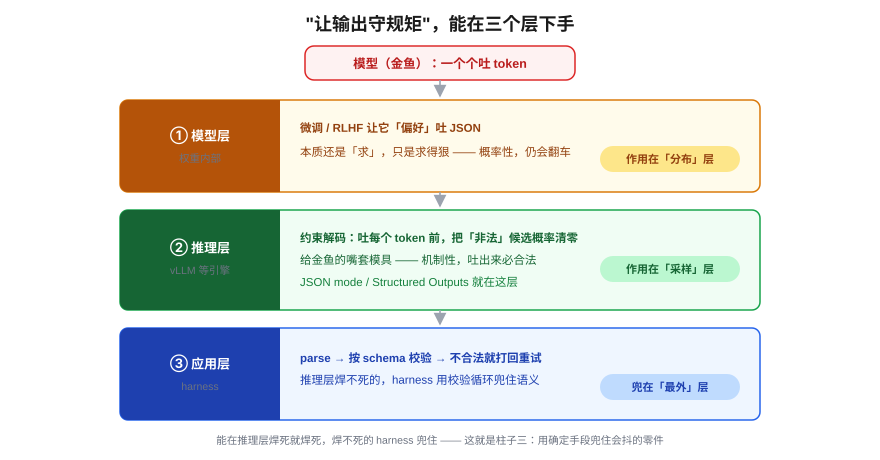
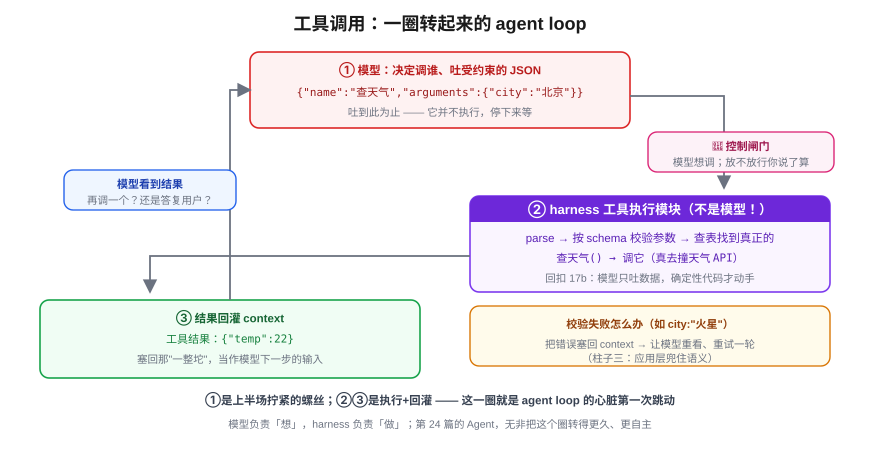

# 结构化输出与工具调用：给大脑接上第一双手

> 一个全栈工程师的大模型学习笔记（十八）

上一篇番外，我们给这颗"大脑"列了张缺陷清单，并说第四阶段就是**一件件给它装零件**。这一篇装**第一件，也是最基础的那件：四肢——让它能调用外部工具去真正做事**。

但动手之前，有颗螺丝卡在最前面。回忆番外 17b 拆 agent loop 的第一步：模型要发起一个工具调用，靠的是**吐出一段结构化数据**，比如：

```json
{"name": "查天气", "arguments": {"city": "北京"}}
```

大脑指挥四肢，靠的是一道**清清楚楚、不会被误解的指令**。可模型是条只会"猜下一个字"的金鱼——**怎么让它稳定地吐出一段你的代码能直接执行的 JSON？** 这颗螺丝拧不紧，后面整套工具调用都是空中楼阁。所以这一篇分两半：上半场拧螺丝（结构化输出），下半场把 loop 转起来（工具调用）。

---

## 一、先看病：金鱼凭什么吐合法 JSON？它不凭

你是全栈工程师，调过的 API 没有一万也有几千。你为什么**敢**对一个返回值直接 `response.city` 拿来用、不怕它哪天返回一句散文？

因为那头站着一份**铁打的契约**：对方服务端是确定性代码，那行 `return {...}` 在物理上**不可能**返回别的形状，坏了还有 4xx/5xx 告诉你。你这个"敢"，底下垫着契约。

现在把这个"敢"原样搬到模型身上——地基立刻塌。模型是条金鱼，它干的唯一一件事是**按概率猜下一个 token**，一个字一个字往外蹦。它脑子里**根本没有"我在填一个 JSON 契约"这个概念**。于是翻车现场至少四类：

| 病 | 现场 | 你的代码怎么炸 |
|---|---|---|
| **裹散文** | "好的！这是你要的：\`\`\`json {…} \`\`\` 希望有用！" | `JSON.parse` 直接抛——JSON 埋在客套话和 Markdown 围栏里 |
| **格式坏** | 尾逗号、单引号、中文标点 `，`、key 没引号 | 不是合法 JSON，parse 失败 |
| **schema 错** | `"days":"三天"`（该数字给了字符串）、漏 `city`、多塞个 `note` | parse 过了，`response.days` 拿到垃圾，下游静默出错 |
| **截断** | token 配额用完，吐到一半 `{"city":"北` 戛然而止 | 半截 JSON |

最要命的不是"会错"，是**概率性**：这次对，下次裹散文。你的 `response.city` 地基，**根本没有契约兜底**。

---

## 二、药有三档：从"求它"到"焊死它"

工程师治这个病，手段有三档，一档比一档硬。

**档 1——求它**：prompt 里写"只返回 JSON，不要任何解释"。
**档 2——给样板**：再塞两个输入输出例子（few-shot），让它照抄格式。

这两档能让翻车**少一点**，但地基**永远是松的**。为什么？

> 金鱼这辈子只会干一件事：**从一个概率分布里，采样下一个 token。** 你 prompt 写得再狠，也只是在**轻轻掰那个分布**——让"合法 JSON 的字"概率高一点。但**再高也不是 100%**，每一步都还留着一丝"蹦出个中文逗号 / 写错类型"的可能；一个长 JSON 几百个 token，那点"一丝"**累乘起来**，翻车几乎是迟早的。再加上采样自带随机（temperature 一搅，这次对下次歪）。

一句话点破：

> **你做的是调高赔率，不是关上门。** "求"作用在**分布**那一层，可翻车发生在**采样**那一层——你够不着真正出问题的地方。所以不可靠是**结构性的**，不是你 prompt 不够好。

**档 3——约束解码（constrained decoding）**：既然病在采样层，药就下到采样层。

> 模型每要吐一个 token 前，系统**对照 JSON 语法（或你给的 schema）**，把所有"会让输出变非法"的候选 token 概率**直接清零**——模型**只能在合法的字里挑**。

打个比方：**你不是求金鱼好好吐字，你是给它的嘴套了一个模具——模具只留合法字形状的洞，它再怎么乱蹦，蹦出来的也必然拼成合法 JSON。** 这就是从"求"到"机制"的质变，也正是番外柱子三的字面实现：**用确定性手段，兜住一个会抖的零件。** 不是把金鱼变聪明，是给它套个物理约束。

| | 档 1/2：求（prompt/few-shot） | 档 3：约束解码 |
|---|---|---|
| 作用层 | 分布（掰赔率） | 采样（关死门） |
| 保证 | 概率性，会翻车 | **机制性，吐出来必合法** |
| 本质 | 跟金鱼讲道理 | 给金鱼的嘴套模具 |

---

## 三、结构能在三个层强制——拎清谁干什么

"让输出守规矩"这件事，其实能在**三个不同的层**下手，搞清楚它们分别在哪，你才知道这套东西归谁管：



| 在哪强制 | 怎么做 | 属于哪一层 |
|---|---|---|
| **模型层** | 微调 / RLHF 让它**偏好**吐 JSON | 模型本身（还是"求"，只是求得狠） |
| **推理层** | **约束解码**：吐字时把非法 token 概率清零 | ← **JSON mode / Structured Outputs 在这** |
| **应用层** | 吐完后 parse + 校验 schema，不合法就打回重试 | ← **harness 的兜底** |

**JSON mode / Structured Outputs 落在中间那层——推理层（decode 那一步）。** 注意它**不在模型权重里**（权重一个 bit 没动，回扣 Blog 01/12），也**不在 harness 那个 while 循环里**，而在**跑模型的推理引擎**里——就是 Blog 16 讲的 vLLM 那一层（vLLM 的 guided decoding / xgrammar 就干这个）。

对你这个全栈工程师，最该记住的是**分工**：

> **推理层负责"关门"**（约束解码，机制保证合法）；**harness 负责"决定门的形状、并兜底"**——把 schema 传下去，拿回结果后还要 parse、校验、不行就**打回重试**。

为什么 harness 还得兜底？因为**约束解码不是哪都有**：有的模型/API 不支持、有的只给弱 JSON mode、自建时你可能没接 grammar。这时"守规矩"就退回应用层，harness 自己 parse + 校验 + retry。这就是柱子三的完整姿态：**能在推理层焊死就焊死，焊不死的，harness 用校验循环兜住。**

### 两个实用区分

- **JSON mode**：只保证"是合法 JSON"，但**不保证字段对**（可能给你合法、但 schema 不符的 JSON）。
- **Structured Outputs（严格 schema）**：连"必须有 `city` 字段、`days` 必须是整数"都用约束解码焊死。

### 约束是"按需开"的

别误会成"全程焊死"。约束解码是**每次请求 opt-in**：

- **普通问答 / 聊天**：不开。模型**自由解码**，想怎么说怎么说——自然语言本就不该塞进 schema。
- **需要机读结果时**：才开。你在这次调用里传 `response_format` 或挂 `tools=[...]`，约束才生效。

为什么不一直开？一是没必要（散文是给人看的），二是有代价（硬把输出掰进 schema，有时会跟模型"本来想说的"打架，轻微伤质量）。**只在你需要机读结果的地方，才付约束的代价。**

---

## 四、下半场：工具调用 = 结构化输出的应用

拧紧了"稳定吐 JSON"这颗螺丝，工具调用几乎是**白捡的**——因为它本质上就是结构化输出的一个特例。

### 第一步：把"有哪些工具"告诉模型

回忆 Blog 17 那张"输入是一整坨"的表，里面有一行叫**"工具 / MCP 的定义说明"**。工具调用的起点，就是你把工具的"说明书"放进 context：

```json
{
  "name": "查天气",
  "description": "查询某城市的当前天气",
  "parameters": {
    "type": "object",
    "properties": { "city": { "type": "string", "description": "城市名" } },
    "required": ["city"]
  }
}
```

注意 `parameters` 就是一份 **JSON Schema**——和上半场那个"门的形状"是同一个东西。你等于告诉模型：有这么个函数，想调它就按这个 schema 吐参数。

### 第二步：模型决定调谁、吐出受约束的请求

模型读懂了任务（"北京明天穿什么"），决定"我得调 `查天气`"，于是吐出：

```json
{"name": "查天气", "arguments": {"city": "北京"}}
```

这段 `arguments` 正是被 schema **约束**焊死的结构化输出。但关键——**它吐到这儿就停了，它并不执行**。

这里还有个你会碰到的精妙点：模型在一轮里**可以先吐一段自然语言**（"好，我查一下"）**再**发起调用。要不要调工具是模型**自由**决定的，API 用 `stop_reason` 告诉你（`end_turn` = 它说完了 / `tool_use` = 它要调工具）；**一旦决定调，那段参数 JSON 才被约束**。所以不是整段被锁，而是**散文自由、结构化的槽位受约束**。

### 第三步：harness 执行，结果回灌，loop 转起来

谁去真正跑 `查天气`？**是 harness 的工具执行模块，不是模型**（回扣番外那一刀切：模型只吐"想调谁、传什么参"，碰不到那个函数）。整圈是这样：



```
①模型吐受约束的 JSON  {"name":"查天气","arguments":{"city":"北京"}}
        ↓  （到此为止，停下，等）
②harness 工具模块接手：
     parse → 按 schema 校验参数 → 查表找到真正的 查天气() → 调它（真去撞天气 API）
        ↓
③拿到返回值 {"temp":22} → 塞回 context 当一条"工具结果"
        ↓
   模型看到结果 → 决定下一步（再调一个？还是给用户答复？）→ 回到 ①
```

①是上半场拧紧的螺丝，②③就是番外里的"执行 + 回灌"。**这一圈，就是 agent loop 的心脏第一次真正跳动。** 后面第 24 篇讲 Agent，无非是把这个圈**转得更久、更自主**。

---

## 五、两个收口：控制闸门 与 校验循环

这一刀切（模型决策 / harness 执行），不只是分工，还兜住了两件大事。

**1. 执行权在 harness 手里 = 一道控制闸门。**
模型就算吐出 `{"name":"删库","arguments":{...}}`，**真正删不删，是你的代码说了算**。你可以校验、可以拦、可以要求人工确认。**模型负责想，你负责放不放行**——这是安全边界，不是客套。把"模型想调什么"和"系统真执行什么"焊在一起，是新手最容易踩的坑。

**2. 校验失败怎么办？——回灌重试。**
模型万一吐的参数虽是合法 JSON、业务上却不对（比如 `city: "火星"`），harness 校验拦下，**把错误信息塞回 context，让模型重看一眼、重试一轮**。这正是上面三层表里"应用层兜底"的样子，也是柱子三的校验循环：**推理层焊死格式，应用层兜住语义，一圈套一圈。**

---

## 小结

- **病**：金鱼无契约，吐 JSON 会裹散文 / 坏格式 / 错 schema / 截断，且**概率性**翻车——你不能像信 API 那样信它。
- **药三档**：求（prompt）→ few-shot → **约束解码**。前两档作用在分布层（掰赔率），永远松；约束解码作用在采样层（关死门），**机制性保证合法**。
- **三个层**：模型层（求偏好）/ 推理层（约束解码，JSON mode 与 Structured Outputs 在此）/ 应用层（harness 校验兜底）。分工：推理层关门，harness 决定门形状并兜底。
- **工具调用 = 结构化输出的应用**：告诉模型工具的 JSON Schema → 模型吐受约束的调用请求（但不执行）→ **harness 执行、结果回灌** → loop 转起来。
- **两个收口**：执行权在 harness = 控制闸门（安全）；校验失败 → 回灌重试（柱子三校验循环）。

我们给大脑接上了第一双手，它能动了。但回头看番外那张缺陷清单，还有个大洞没补——**它的知识是"烤死"的、有截止点**。手再灵活，脑子里没有你公司昨天改的文档、没有最新的资料，它照样抓瞎。

下一组篇目就来补这个洞：怎么给大脑**外挂一个随时可查的知识库**。而这件事的地基，是先让计算机学会一件你以为它早就会、其实根本不会的事——**判断两段文字"意思像不像"**。这就是下一篇《Embedding 应用：语义搜索与分类》的起点。
