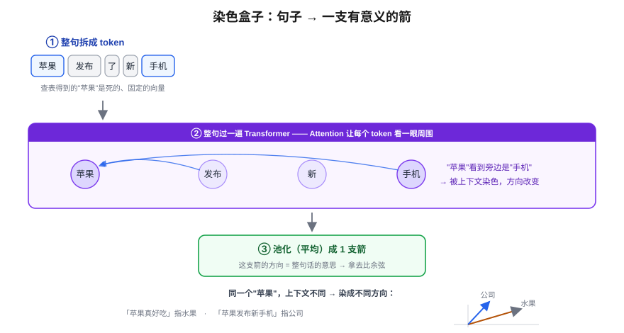
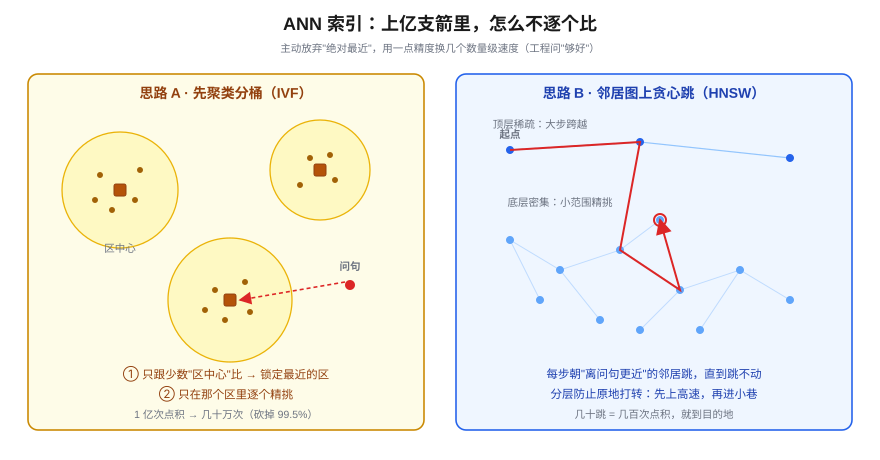
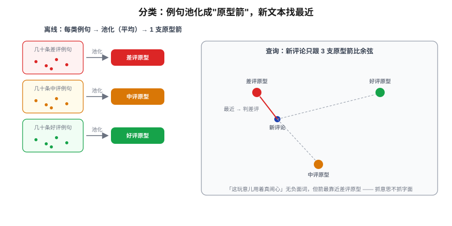

# Embedding 应用：语义搜索与分类

> 一个全栈工程师的大模型学习笔记（十九）

上一篇我们给大脑接上了第一双手——它能调工具、能动手了。但番外那张缺陷清单上，还有个大洞没补：**它的知识是"烤死"的、有截止点**。手再灵活，脑子里没有你公司昨天改的文档、没有最新的资料，照样抓瞎。

补这个洞的方案叫 **RAG**（给模型外挂一个随时可查的知识库），是接下来一组篇目的主角。但 RAG 有个谁都绕不开的地基：它得先能**从一大堆资料里，把跟你问题"意思最像"的那几段捞出来**。

"意思像不像"——这事你我一秒就能判断，可对计算机来说，它根本不是天生就会。这一篇就专门打这块地基：**怎么让计算机理解"相似"这件事**，以及在这块地基上能盖出来的两样东西——**语义搜索**和**分类**。

> 提个醒：Embedding 这个概念，Blog 02 和 Blog 06 已经铺过了（文字变向量、向量就是一组数字、点积怎么算）。这一篇不重讲基础，讲的是**怎么用它干活**。

---

## 一、先把"像不像"翻译成几何题

给你两句话：

- A：「怎么重置我的密码」
- B：「我登录不进去账号了」

**一个字都不一样**，没有任何共同关键词，但你我都知道它俩想说同一件事。如果用关键词匹配（你写过的那种 `LIKE '%密码%'`），这两句话八竿子打不着。可它们的**意思**贴得很近。

怎么让计算机也"看出"这种近？回到 Blog 02 那个事实：一段文字最终会变成**一个向量**。把向量想象成**从原点出发的一支箭**。那么"两句话意思像不像"，就能偷换成一个纯几何问题：

> **这两支箭，指向的方向像不像？**

意思相近 → 两支箭基本同向，**夹角小**；两件**毫不相干**的事（「怎么重置密码」vs「今天天气怎么样」）→ 箭头岔开，**夹角大**。于是"语义相似度"这个虚头巴脑的东西，被我们落地成了一个能算的量：**两支箭的夹角**。

### 用点积，把夹角量出来

回扣 Blog 06 的点积——那篇把它讲成"逐项相乘再求和，衡量两组数字方向多一致"。点积还有一条等价的**几何写法**（这里补上）：

```
A · B = |A| × |B| × cos(θ)
```

θ 就是两支箭的夹角，`|A|`、`|B|` 是各自箭的长度。

但这里有个麻烦：我**只关心方向（夹角 θ）**，根本不在乎箭多长。可这条公式里，点积的结果同时被"夹角"和"长度"两个因素影响——一支很长的箭，哪怕方向偏一点，点积也可能很大。长度成了干扰项。

怎么把它除掉？两边同除 `|A| × |B|`：

```
        A · B
cos(θ) = ─────────
        |A| × |B|
```

干扰项没了，剩下纯粹反映方向的 `cos(θ)`。这东西有名字，记下来——**余弦相似度（Cosine Similarity）**。几乎所有向量检索系统比较两段文字"像不像"，用的都是它。

它的取值范围是 **−1 到 1**，三个锚点帮你建立手感：

| 两支箭的关系 | cos(θ) | 含义 |
|---|---|---|
| 完全同向（夹角 0°） | **1** | 意思一致 |
| 互相垂直（夹角 90°） | **0** | 毫不相干 |
| 完全反向（夹角 180°） | **−1** | 意思相反 |

> ⚠️ 一个现实里的坑：上表是余弦的**数学取值范围**，帮你建立手感用的。但真实 embedding 空间里，意思**相反**的句子夹角往往**并不大**——「我要登录」和「我要注销」常出现在几乎相同的语境里，模型会把它俩摆得很近。−1 是理论极值，自然句子很难真到那儿。这个"相反却很像"的坑，后面 RAG 篇还会专门碰到。

### 一个你会拍大腿的工程优化

把那条余弦公式的分母拆开，分配到两个向量头上：

```
  A · B           A      B
─────────  =   ────  ·  ────   =   Â · B̂
|A| × |B|       |A|     |B|
```

`A / |A|` 是什么？是"把 A 这支箭按比例缩到长度正好等于 1"——也就是**归一化**成单位向量（`Â` 读作 "A hat"，就是 A 归一化后的样子）。所以：

> **余弦相似度 = 先把两支箭都归一化成长度 1，再做一次普通点积。**

这不是近似，是数学上等价的同一件事。而它带来一个生产系统真在用的优化：

> 真实的向量库里存着几百万段文字的箭。查询时每来一句话，要跟几百万支箭挨个比。如果每次都老老实实算 `A·B/(|A||B|)`，每次比较都要重算两个模长再做除法——纯浪费。
>
> 既然余弦 = 单位向量的点积，那就**入库时提前把每支箭归一化好**存进去。查询那一刻，相似度就退化成一个干干净净的**点积**，连除法都省了。

这就是工程里常见的**预计算优化**——把会重复的代价提前算掉。

---

## 二、那支"方向有意义"的箭，到底从哪来？

上面我一直在用一个魔法盒子：把任意句子塞进去，吐出一支箭。可这盒子凭什么吐出来的箭，**方向真能对应语义**，而不是一堆乱指的箭？

直觉答案是对的：这份"方向感"是**预训练逼出来的**（回扣 Blog 08）。模型为了能准确预测下一个词，被迫把"意思相近的词、相近的上下文"在向量空间里安排到相近的位置。没人手工标，是训练的副产品。

但这里有道坎，正是 Blog 19 区别于 Blog 02 的地方，得跨过去：

> Blog 02 那张 Embedding 表是 **token → 向量**：输入"苹果"一个 token，查表吐一个向量。
>
> 可我们要比的是**两整句话**。「怎么重置我的密码」可能 8 个 token，查完表变成 **8 支箭**；另一句 7 个 token，变成 **7 支箭**。
>
> 但余弦相似度一次只能比**两支箭**。8 支 vs 7 支，怎么办？

### 第一刀：把多支箭压成一支（池化）

最朴素的办法：**把 8 支箭相加再除以个数，取平均**。这有个名字叫**平均池化（mean pooling）**。8 支箭平均成 1 支，搞定。很多 embedding 模型最后一步干的就是这个。（池化不止平均一种：也有取句首特殊 token、或取最后一个 token 的向量等做法，这里用最直觉的平均打底。）

但直接平均查表来的箭，有个**致命破绽**：

> 那张表是死的。"苹果"这个 token，不管它在哪句话里，查出来**永远是同一支箭**。于是：
> - 「**苹果**真好吃」
> - 「**苹果**发布了新手机」
>
> 两句里的"苹果"，查表拿到一模一样的箭。可一个指水果、一个指公司，意思天差地别——死表压根分不出。

### 第二刀：让箭进运算前先"看一眼邻居"

我们需要一个机制，能让"苹果"这个 token 在变成箭之前，**先扫一眼它周围的词**（"好吃" vs "手机"），从而方向被上下文**重新染色**。

这个机制你早就学过——**Attention（Blog 04/05）**，它天生就是干"让 token 互相看一眼、交换信息"这件事的。说穿那层机制：Attention 的输出，本质是把当前 token 的箭和周围 token 的箭**按相关度加权混合**成一支新箭——"苹果"旁边是"好吃"还是"手机"，混进来的成分不同，这支新箭的坐标（也就是方向）就被带到不同位置。

于是真正的"染色盒子"长这样：

> **句子 → 整句过一遍 Transformer**（Attention 让每个 token 吸饱上下文，两个"苹果"从此方向不同）**→ 池化成 1 支箭**。



所以"embedding 模型"这个盒子 ≈ **一个 Transformer + 一步池化**。它跟 Blog 02/05 是同一个家族，区别只在于：我们要的**产出物**不是"预测下一个词"，而是中间那支**吸饱语义的句子向量**。

到这儿，地基的两件工具齐了：

- **染色盒子**：任意句子 → 1 支方向有意义的箭。
- **余弦尺子**：量两支箭的夹角，1 / 0 / −1。

下面用这两件工具盖两层楼。

---

## 三、第一层楼：语义搜索（RAG 的检索引擎）

场景：你做了个客服系统，后台有 **10 万条**历史问答。用户问「我付了钱但订单没生成」，你想从这 10 万条里捞出**意思最接近的几条**。

把这件事拆成两步，关键在于**哪些活儿能提前干掉，绝不留到查询那一刻现算**：

- **准备阶段（用户来之前）**：把 10 万条全部过染色盒子 → 归一化 → 存进库。
- **查询阶段（用户问的那一刻）**：只花一次染色的钱把问句变成箭 → 跟库里的箭比余弦（已归一化，就是点积）→ 返回最相似的 top-K。

这套架构就是所有向量检索系统的骨架。但它有个规模问题。

### 1 亿支箭，不能逐个比

10 万还能扛。可库里要是 **1 亿条**呢？每来一个用户，都要做 1 亿次点积才能返回结果。

这个场景你写后端时见过它的近亲：在一张**上亿行**的表里按字段查记录，你绝不会逐行扫描——你会**建索引**。同样的思路搬过来：上亿支箭里快速找最近的箭，也得有"索引"。

但有个坑：**B+ 树在这儿用不了**。B+ 树能高效工作，前提是 key 能**排成一条线**（全序：1 < 2 < 3），它本质是在一根有序的轴上做二分。可你的箭住在几百维的空间里——

> 你**没法**把高维空间里的点排成一条一维的线，还保证"意思相近的点在线上也挨得近"。高维里"近"是**全方位**的概念（一个点四面八方都有邻居），一压扁成一条线，原本在别的维度上的近邻就被拉到线的两头去了。

这就是 B+ 树（和它的高维表亲 KD 树）在高维下**退化到几乎等于全表扫描**的原因。所以向量检索换了一个完全不同的索引家族，叫 **ANN（Approximate Nearest Neighbor，近似最近邻）**。

注意 **Approximate（近似）** 这个词，它藏着一个工程取舍，回扣番外那根柱子——**工程求的是约束下"够好"，不是唯一"精确"**：

> B+ 树查 id=42 返回的**保证**就是那一行，精确。但 ANN 主动**放弃"保证找到那个绝对最近的"**，换来速度——它返回"几乎肯定就是最近的那几个，偶尔漏掉真正第一名也无所谓"。
>
> 对搜索来说，第 1 名和第 2 名相关度都很高，漏了第 1 拿到第 2，用户根本无感。**用一点点精度，换几个数量级的速度。**

### ANN 的两种主流思路



**思路 A · 先聚类分桶（IVF 类）**

离线时，把 1 亿支箭用聚类（k-means）分成比如 1000 个"区"，每区记一个**中心点**。查询时做**两轮**点积：

1. **粗筛**：拿问句的箭只跟 **1000 个中心点**比，挑出最近的几个区。→ 才 1000 次点积。
2. **精挑**：只在那几个区里跟里头的箭逐个比。每区平均 10 万支，挑 5 个区 = 50 万次点积。

合计 ≈ 50 万次，对比暴力扫的 1 亿次，砍掉 99.5%。**比的还是点积，永远是点积——索引的作用不是改运算，而是让绝大多数箭根本不用比**（跟 B+ 树没改"比较 key"、只让你不用逐行比，是同一个哲学）。

> 顺带说一句中心点怎么来：一个区里所有箭**相加除以数量**取重心——又是池化那个动作。而 k-means 是**迭代**的：瞎撒中心点 → 每支箭认最近的中心点（分堆）→ 中心点挪到堆的重心 → 箭重新认 → ……直到中心点不怎么动了（收敛）。这是离线一次性开销，跟查询性能无关。

**思路 B · 邻居关系图上贪心跳（HNSW）**

离线时，每支箭事先连上离它最近的几个邻居，织成一张网。查询时从图上任意一点出发，看邻居里谁离问句更近就**跳过去**，每步只朝"更近"挪，直到周围邻居都不如自己近了，停。每跳只跟当前点的几个邻居比，几十跳就到目的地——几百次点积搞定。

怎么不跳进死胡同找错？靠名字里那个 **H（Hierarchical，分层）**：图建了好几层，**顶层稀疏、连线拉得老远**（用来大步跨越，迅速进对大区域），**底层密集**（小范围精挑）。完全是开车导航的逻辑——**先上高速跨城，下省道，再进小巷找门牌**。顶层那些长链接，正是防止你在偏远小角落里原地打转的关键。

### 语义搜索全貌

> 染色盒子把文档变成箭 → 离线全部归一化 + 建 ANN 索引（聚类分桶 / 邻居图）存进**向量数据库** → 查询只染色问句这一支箭 → 走索引粗筛 + 少量点积 → 返回 top-K。

这套 top-K 检索，**就是 RAG 的前半段**——把"跟问题最相关的资料"捞出来，等着喂给模型。Blog 18 结尾说的"知识烤死要靠 RAG 补"，补的动作就从这里起步。

---

## 四、第二层楼：分类（做判断、拨开关）

分类跟搜索**长得像**（都在找最近的箭），但解决的是另一类事。差别在**答案空间**：

- **搜索**：答案空间是一大坨开放的文档库，返回"最像的几条"——一个**列表**。是"给我相关资料"。
- **分类**：答案空间是你预先定死的几个桶（好评/中评/差评，就这几个），返回"属于哪个桶"——一个**标签**。是"这条该归到哪"。

### 最朴素的办法：找最近的箭

场景：判断评论是好评/中评/差评，你手上有每类几十条**已标好的例句**。只用染色盒子 + 余弦尺子，最朴素的办法是：

> 把新评论这支箭，跟所有标好的例句箭比余弦，看它**落在谁堆里**——离差评例句普遍最近就判差评。

这叫 **k-近邻（k-NN）分类**，甚至可以取最近的 k 个例句**投票**，少数服从多数。注意：分类又被你化简成了"在向量空间里找最近的箭"，跟搜索同一个动作，只是这次找到的箭身上带着**类别标签**。

### 高效版：每类压成一支"原型箭"

k-NN 有个累赘：每来一条新评论，都要跟**全部**例句（3 类 × 几十条 = 上百支箭）逐个比。例句越多越慢。

用我们已经反复用的那个动作收拾它——**把每一类的几十条例句池化成一支代表箭（原型 / prototype）**：



```
离线：差评例句 → 池化 → 1 支「差评原型箭」
      中评例句 → 池化 → 1 支「中评原型箭」
      好评例句 → 池化 → 1 支「好评原型箭」

查询：新评论 → 染色成箭 → 只跟 3 支原型箭比余弦 → 选最近的那类
```

> 这是你**第三次**用到"池化/求平均"这个动作了：①句子里的 token 池化成句子向量 ②一个区里的箭池化成 k-means 中心点 ③一类例句池化成原型箭。**同一把锤子，砸了三颗钉子**——"把一堆向量浓缩成一个代表"在向量世界里反复出现，本质都是求重心。
>
> （别和**归一化**混了：**池化**是把多支箭浓缩成 1 支，管"代表谁"；**归一化**是把 1 支箭缩到长度 1，管"只比方向"。造完原型箭通常也顺手归一化一下，但那是两个动作。）

> 一个边界提醒：原型箭默认一类例句在空间里**挤成一团**。万一某类裂成几簇（比如"差评"里既有愤怒型又有失望型），重心可能落在簇与簇之间的空地、谁都不像——这时退回 k-NN、或一类给多支原型箭会更稳。

### 分类拿来干嘛？

全是你后端天天遇到的活儿，而且**为什么非用 embedding、不用关键词**——跟搜索同一个理由：抓的是**意思**不是字面。「这玩意儿用着真闹心」一个负面词都没有，关键词规则抓不到，但它的箭明显落在"差评"原型那堆里。

- **情感分析**：几万条评论自动判好评/差评，出舆情看板。
- **内容审核 / 垃圾过滤**：UGC 进来判"正常 / 广告 / 违规"，决定放行还是拦。
- **意图路由（最常用）**：客服收到「我要退款」判成"退款"类 → 转财务工单；「登录不上」→ 判"技术"类 → 转技术。**用一句话的意思，决定它走哪条业务分支。**
- **自动打标签 / 归档**：文章、工单自动贴主题标签。

---

## 五、收口：这一篇在 harness 里的位置

回扣第四阶段那条暗线——每个技术都是 harness 的一个零件：

**检索 = 上下文策展"招 1"的地基。** Blog 17 讲过，模型是金鱼、上下文是唯一杠杆，而策展的第一招就是"按需检索相关资料塞进 context"。语义搜索造出来的，正是这个检索引擎。它本身不直接补"知识烤死"那个洞，但它是**下一篇 RAG 赖以工作的前半段**——把资料捞出来，下一篇负责接到模型嘴边。

**分类 = agent 控制流的开关之一。** 在一个 Agent 里，"判断用户这句话是什么意图 → 决定调哪个工具 / 走哪条分支"，本质就是一次分类（回扣 12-Factor 的 "Own Your Control Flow"）。它也是 Blog 22 评估会用到的零件——给模型输出自动打"合格/不合格"标签，同样是分类。

一句话钉死今天两层楼：**检索是"找资料"，分类是"做判断、拨开关"，底下是同一块地基——在向量空间里找最近的箭。**

---

## 小结

- **把"像不像"翻译成几何题**：句子 → 一支箭，"意思相近" = "两支箭夹角小"。
- **余弦相似度**：`cos(θ) = A·B / (|A||B|)`，去掉长度干扰只留方向；范围 −1~1（1 同向 / 0 无关 / −1 相反）。等价于"归一化后做点积"，所以入库时提前归一化，查询时只剩点积。
- **染色盒子 = Transformer + 池化**：不能直接平均查表的死向量（分不出两个"苹果"），要先过 Attention 让 token 吸饱上下文再池化。
- **语义搜索**：离线染色 + 归一化 + 建 **ANN 索引**（B+ 树在高维失效 → 聚类分桶 IVF / 邻居图 HNSW，用近似换速度）存进向量库；查询粗筛 + 少量点积取 top-K。**这是 RAG 的前半段。**
- **分类**：k-NN（找最近的带标签的箭）→ 高效版把每类例句**池化成原型箭**，只比几支。用途：情感分析、内容审核、意图路由、打标签。
- **harness 暗线**：检索 = 上下文策展招 1 的地基；分类 = agent 控制流开关。

地基打好了——计算机现在会判断两段文字"意思像不像"，也能把相关资料捞出来。但捞出来只是半截：**捞到的资料怎么接到模型嘴边，让它据此回答、而不是继续凭烤死的记忆瞎编？** 这就是下一篇《RAG 原理：给模型外挂知识库》要拼上的后半段。
