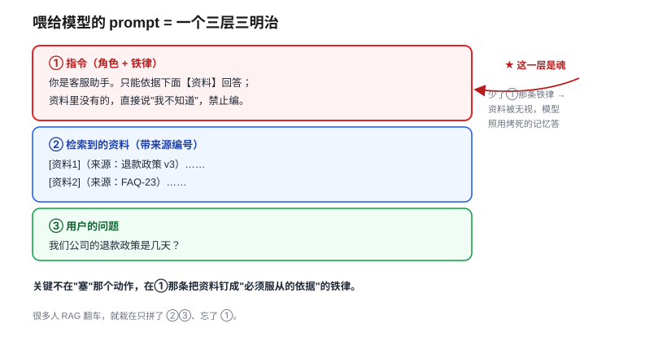
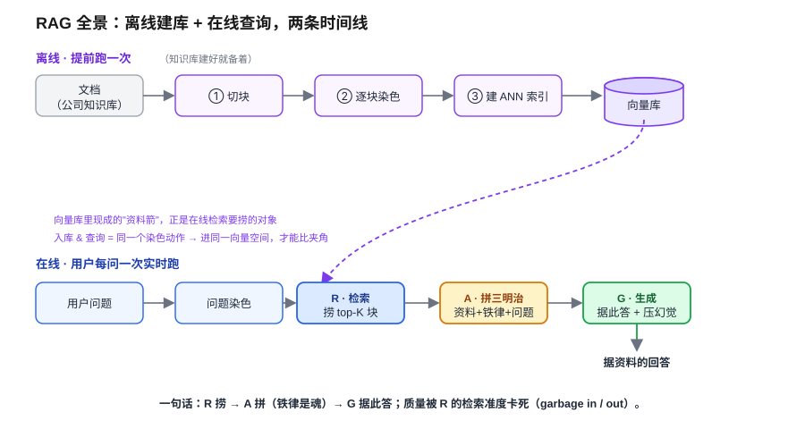
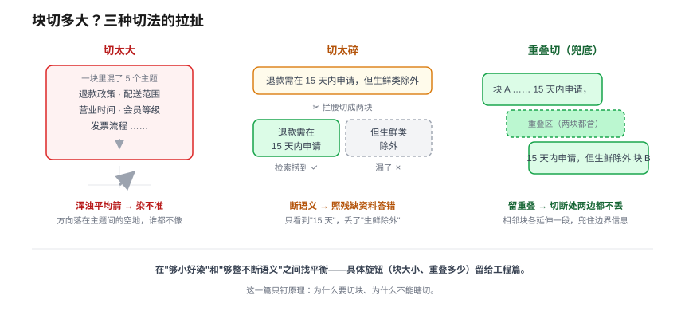

# RAG 原理：给模型外挂知识库

> 一个全栈工程师的大模型学习笔记（二十）

上一篇我们打完了地基——计算机会判断两段文字"意思像不像"了，能把跟你问题最相关的几段资料**捞**出来。但我在结尾留了半截：**捞出来只是前半段，捞到的资料怎么接到模型嘴边，让它据此回答、而不是继续凭烤死的记忆瞎编？**

这一篇就拼上后半段。补的还是那张缺陷清单上最大的洞：**模型的知识是"烤死"的、有截止点**——它不知道你公司昨天改的退款政策，不知道你们内部的 wiki。这一篇讲的方案，名字你已经听了好几篇了：**RAG**。

---

## 一、先堵一条岔路：为什么不直接微调

模型不知道你公司的新文档，**最直觉**的修法是什么？把这些文档拿去**再训练 / 微调一遍**，让它"学会"。

你已经写过预训练（08）、微调（09）、LoRA（10），所以你手里有判断这条路的全部零件。它有两道致命硬伤：

- **太贵**：微调要准备数据、跑训练、验证、再部署一版模型。为了"让它知道一份新文档"动这么大干戈，性价比极低。
- **跟不上**：你公司的文档**天天在变**。今天改了退款政策，难道明天就重训一版模型？文档一变就重训，这条路根本追不上变化的速度。

> 一句话钉死：**微调改的是模型的"能力 / 风格"，不是用来灌"易变的事实"的。** 想让它多知道一条随时会改的事实，动参数是杀鸡用牛刀，还杀不利索。

那条对的路你上一段其实已经想到了：既然第十九篇已经能把"最相关的那几段"**捞**出来，那就**根本别动模型参数**——把捞到的资料，在它回答这次问题时直接塞到它眼前，让它**现场读**。

这，就是 RAG 的全部出发点。

---

## 二、RAG 三个字母：金鱼面前贴张纸

给这个方案的名字拆开看，它一点都不神秘——**R-A-G**，三个动作：

- **R**etrieval（检索）= 第十九篇干的活，把最相关那几段捞出来。
- **A**ugmented（增强）= 把捞到的资料**拼进 prompt**，"增强"模型这次的输入。
- **G**eneration（生成）= 模型**据着这几段**资料回答。

R 上一篇做完了，所以这一篇的主角是 **A + G**。

回扣第 17 篇那个比喻你就秒懂它的本质：模型是条**金鱼**，记不住东西，**context 是唯一的杠杆**。RAG 干的事就是——

> **别指望金鱼背下整座图书馆。每次问它之前，把那一页相关的纸，贴到它眼前让它现场念。**

模型参数一个没动，知识却"现查现用"了。文档明天再改，你只要把向量库里那一页换掉，模型下次自然念到新的——**追变化，从"重训一版模型"降级成"换一页纸"**。这就是 RAG 比微调香的根本原因。

---

## 三、魔鬼一：那张"纸"到底长什么样

"把资料塞进 context"——这四个字藏着第一个魔鬼。你**不能**把资料和用户问题往一块一倒就完事。真正喂给模型的那段 prompt，是**拼出来的一个三明治**，分三层，顺序还讲究：



```
┌─ ① 指令（角色 + 铁律）────────────────────┐
│ 你是客服助手。只能依据下面【资料】回答；      │
│ 资料里没有的，直接说"我不知道"，禁止编。       │
├─ ② 检索到的资料（带来源编号）──────────────┤
│ [资料1]（来源：退款政策 v3）……              │
│ [资料2]（来源：FAQ-23）……                  │
├─ ③ 用户的问题 ───────────────────────────┤
│ 我们公司的退款政策是几天？                   │
└──────────────────────────────────────────┘
```

关键不在"塞"那个动作，在 **①那条铁律**。

没有它，模型不知道中间这堆资料是"**必须服从的依据**"还是"随便看看的背景"。很多人 RAG 翻车，就栽在只拼了②③、忘了①——资料明明贴在眼前，模型却当没看见，照样用脑子里烤死的那份答。**①是这个三明治的魂。**

---

## 四、魔鬼二：凭什么它会听话

第二个魔鬼更阴。假设我问「我们公司的退款政策是几天」，检索给它贴了正确的资料（你们是 **15 天**）。但模型脑子里**也烤着**一份它从全网学来的"通用退款政策（7 天无理由）"。

> 凭什么它读你贴的纸，而不是张口就用脑子里那份烤死的、跟你公司根本不一样的记忆？

靠三道锁，一道比一道狠：

1. **铁律锁**：就是①那句"**只能依据下面的资料回答**"。模型经过指令微调（回扣 09、11，RLHF 训出来的那股"听话"劲），对这种当场下的硬指令是会服从的——它先把"资料才是依据"这件事锁死。
2. **引用锁**：再加一条"每句话标出处 `[资料1]`"。它要标来源，就得**更多对着资料说话**，张口乱编也更容易露馅——这还顺手给了用户**可核查**的抓手。（注意它仍可能给脑补内容贴个假来源，所以这同样是"降低"、不是"堵死"。）
3. **逃生门**：那句"没有就说不知道"，是给它一个**不编**的出口。没出口，它被逼着必须答，就容易硬编。

但你必须记住一句大实话：

> **这三道锁只是大幅"降低"胡编，不能"根治"。** RAG 治的是"知识过时 / 缺失"，**不是**"绝不胡说"。模型仍可能无视资料、或把资料和烤死记忆搅在一起。别拿 RAG 当幻觉的灭火器卖给老板。

### 捞回来一堆垃圾会怎样

还有最致命的一问：万一检索**啥也没捞到**，或者捞回来一堆不相干的垃圾呢？

模型要么照着垃圾**一本正经答错**，要么（锁做得好的话）说"不知道"。于是引出 RAG 整条链上最该钉死的一句：

> **RAG 的回答质量，被检索质量死死卡住——garbage in, garbage out。**

第十九篇那半段（染色准不准、归一化、ANN 索引捞得对不对）做得有多好，就是这一篇答案质量的**天花板**。这两篇是一根绳上的蚂蚱，不是两件事——**检索捞不准，后面拼得再漂亮也是给错资料镀金。**

---

## 五、全景：离线建库 + 在线查询两条时间线

把骨架拼成一张全图，你会看到 RAG 其实活在**两条时间线**上：



**离线时间线（提前备好，跑一次）：**

1. 把整个知识库的文档**切块**（chunk）。
2. 每一块**染色**——过 embedding 模型变成一支语义箭（第十九篇）。
3. 给这些箭建 **ANN 索引**，存进**向量库**。

**在线时间线（用户每问一次，实时跑）：**

1. 用户问题**染色**成一支箭。
2. 拿它去向量库**检索**，捞回最相似的**前 K 块**（top-K，K 就是"取前几条"）（**R**）。
3. 把这几块拼成"铁律三明治"（**A**）。
4. 喂给模型，它据此生成、三道锁压幻觉（**G**）。

> 看出门道了吗？**离线和在线，用的是同一个"染色"动作。** 入库时给文档染色、查询时给问题染色——两边染进的是**同一个向量空间**，问题的箭和资料的箭才能比夹角。这也是为什么第十九篇要先把"染色"那块地基打死。

---

## 六、最后一个魔鬼：块切多大

上面"切块"两个字，藏着 RAG 最后一个、也是工程上最折腾的魔鬼。这里有个拉扯：



- **切太大** → 退回"整篇压一支箭"那个病：五个主题压成一支浑浊的平均箭，**染不准**，还白占 context。
- **切太碎** → 把语义**切断**了。一句"退款需在 **15 天内**申请，但**生鲜类除外**"被拦腰切成两块——检索可能只捞到前半句"15 天内"，**漏了"生鲜除外"**，模型照着残缺资料答错。

所以切块要在"**够小好染**"和"**够整不断语义**"之间找平衡。实务上还有个常用兜底——**重叠切（overlap）**：让相邻两块之间留一段重叠，防止切断处的信息两边都丢。

> 这些"切多大、怎么切、top-K 取几、捞回来还要不要重排序"，全是**工程**层面的旋钮，留到下一篇《RAG 工程》细拧。这一篇你只要钉死**原理**：为什么切块、为什么是同一个向量空间、三明治的魂在哪。

---

## 七、收口：这一篇在 harness 里的位置

回扣第四阶段那条暗线——每个技术都是 harness 的一个零件：

**RAG = 上下文策展"招 1"的完整闭环。** 第 17 篇讲过，模型是金鱼、context 是唯一杠杆，策展第一招就是"按需检索相关资料塞进 context"。第十九篇造出了检索引擎（招 1 的前半段：找资料），**这一篇把它接到了模型嘴边（招 1 的后半段：喂资料、据此答）**。到这里，"按需把外部知识塞进金鱼眼前"这件事，第一次形成了能跑通的完整回路。

**RAG 也是 Agent 的一个基础工具。** 等到第 24 篇讲 Agent，模型自主行动时手里那一排工具，**"查知识库"就是其中最常用的一个**——本质就是一次 RAG 检索。今天搭的这套 R→A→G，到那时会被包成 agent 能随手调的一件零件。

一句话钉死今天这篇：**检索把资料捞出来，RAG 把它拼成铁律三明治喂到金鱼眼前，让模型据着现查的资料答、而不是凭烤死的记忆编。**

---

## 小结

- **为什么不微调**：微调改"能力 / 风格"，太贵又追不上易变的事实；灌易变知识该走 RAG，别动参数。
- **RAG 三字母**：**R** 检索（上一篇）→ **A** 把资料拼进 prompt → **G** 模型据此生成。本质 = **给金鱼眼前贴一页相关的纸**，参数不动、知识现查现用。
- **铁律三明治**：prompt 分①指令（角色+铁律）②资料（带来源）③问题三层。**①那条"只依据资料、没有就说不知道"是魂**，少了它资料会被无视。
- **三道锁压幻觉**：铁律锁 + 引用锁（标 `[资料N]`）+ 逃生门（"不知道"）。只**降低**不**根治**——RAG 治知识过时，不治绝不胡说。
- **garbage in / out**：回答质量被检索质量卡死，第十九篇的检索准度 = 这一篇的天花板。
- **两条时间线**：离线（切块→染色→建 ANN 索引→入库）+ 在线（问题染色→R→A→G）。**两边染进同一个向量空间**，箭才能比夹角。
- **切块的拉扯**：太大染不准、太碎断语义，重叠切兜底；细节归工程篇。
- **harness 暗线**：RAG = 上下文策展招 1 的完整闭环，也是 Agent 手里"查知识库"那件工具。

地基（第十九篇）+ 闭环（这一篇），RAG 的**原理**到此通了。但原理跑得通，离生产能用还隔着一堆旋钮：知识库几十万条时向量库怎么选、块到底怎么切、top-K 取几、捞回来一堆还要不要**重排序**再喂。这些把"能跑"拧成"好用"的活儿，就是下一篇《RAG 工程：向量库、分块与重排序》要拧的螺丝。
