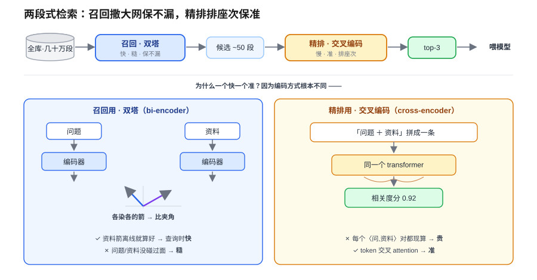
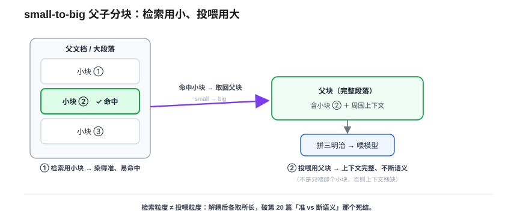
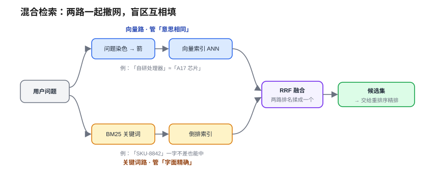

# RAG 工程：向量库、分块与重排序

> 一个全栈工程师的大模型学习笔记（二十一）

上一篇我们把 RAG 的**原理**推通了：切块 → 染色 → 建 ANN 索引 → 拿问题的箭捞 top-K → 拼成铁律三明治喂给模型。照着这套，你能搭出一个**能跑**的 RAG。

然后你把它搬上线，真用公司文档一试——模型答得七零八落。检索回来的资料驴唇不对马嘴，该答对的答错，该说"不知道"的反而一本正经编。**明明照书搭的，为什么效果这么差？**

这一篇就专治这个。我们要把 RAG 从"能跑"拧成"好用"，拧的就是三颗螺丝：**向量库、分块、重排序**。

---

## 一、先定位病根：质量卡在检索

回扣上一篇你自己钉死的那句话：

> **garbage in, garbage out——RAG 的回答质量，被检索质量死死卡住。**

所以 RAG 效果差，第一嫌疑人永远是**检索**：捞回来的资料不对，后面三明治拼得再漂亮、铁律下得再狠，也是给错资料镀金。

那就顺着上一篇那条检索链，看它哪几个环节会漏气：

```
切块 → 每块染色 → 建 ANN 索引 → 拿问题的箭捞 top-K → 喂给模型
 ①                  ②                          ③
```

三个病灶，一个都跑不掉：

- **病因①｜切的时候**：上一篇"切块拉扯"那个死结——切太碎语义断、切太大染不准——在生产里会真实地咬人。
- **病因②｜捞的时候**：ANN 是"近似"检索（用近似换速度），近似会漏；更糟的是，**用户提问的措辞，常常和文档里写资料的措辞对不上**，意思一样、字面两样。
- **病因③｜捞回之后**：top-K 捞回 5 段，就算对的那段在里头、可它排在第 4，模型注意力被前几段带跑（回扣 Blog 15 的 Lost in the Middle），照样白搭。

三味药——**分块、向量库、重排序**——正是分别治这三个病。但在动手配药之前，得先换一个**视角**，这个视角是整篇的脊梁。

---

## 二、脊梁：检索不是一锤子，是"两段式"

先想一个你天天见的场景：**招聘筛简历**。1000 份简历，招 5 个人，你怎么安排？

- 你**不会**让最资深的面试官去逐字精读 1000 份——**太贵太慢**，他的时间烧不起。
- 你也**不会**让 HR 拿关键词刷一遍、刷完直接发 offer——**太糙**。

现实里都是**两道关**：

1. **海选（粗筛）**：HR 快速从 1000 份筛到 50 份。只要求**快 + 别把好苗子漏掉**（宁可多收几个滥的）。
2. **面试（精筛）**：资深面试官对这 **50 个人**逐个深聊、排出前 5。**慢、贵，但准**。

关键在：**一道关求"快+不漏"，另一道关求"准+排座次"。贵而准的那位，只对海选剩下的一小撮使劲，所以贵得起。**

把这套原样搬回 RAG，检索就**不是一锤子买卖，而是两段式**：



**召回（recall）阶段 = 向量检索 = 双塔（bi-encoder）。** 就是上一篇那个"HR"：问题、资料**各染各的箭**，再比夹角。资料的箭离线就算好了 → 查询时只染一次问题、其余是现成的箭比点积，**快**，能对全库几十万段撒网。代价：问题和资料**从没在同一次前向里碰过面**，模型没法让两边的 token 互相 attention，只能"各自表述完再量夹角"——细粒度的相关（谁在回应谁、否定词、限定词）抓不住，所以**糙**。它负责的事只有一件：**别漏**，把对的那段网进候选池。

**精排（rerank）阶段 = 重排序 = 交叉编码（cross-encoder）。** 就是那位"资深面试官"：把「问题 + 这段资料」**拼成一条**喂进 transformer，让 attention 在问题 token 和资料 token 之间**交叉流动**，直接吐一个相关度分。**准**得多（它是真"读"了这段在不在回答这个问题）。代价：每个〈问题, 资料〉对都得**现算一次完整前向**，没法预计算 → **贵** → 只配用在粗筛剩下的几十段上，绝不可能跑全库。

> 一句话钉死这根脊梁：**双塔可预计算所以快但糙，交叉编码不可预计算所以准但贵。两段式 = 让快的负责"别漏"、让准的负责"排座次"。** 这就是生产 RAG 检索几乎清一色两段式的根本原因。

有了这个视角，三味药各归各位就顺理成章了。下面按管线顺序——**建库（分块）→ 召回（向量库）→ 精排（重排序）**——一颗一颗拧。

---

## 三、第一味药·分块：让"检索的块"和"投喂的块"分家

病因①那个死结，上一篇我们只能"找平衡"：**切太碎 → 染得准但语义断；切太大 → 不断但染得糊**。

但现在你手里多了"两段式"那种工程智慧——**别让一个零件既要又要，拆成两件事各干各擅长的**。把它用到切块上，会逼出一个问题：

> 谁规定"**拿去检索的那一块**"，必须和"**最后喂给模型的那一块**"是**同一块**？

不是同一块就行了。这招叫 **small-to-big（父子分块）**：



- **检索用小块**：把文档切成小粒（一两句话），每粒单独染色入库。小 → 主题单一 → 染得准、容易命中（治"染不准"）。
- **投喂用大块**：某个小块被命中后，**别只喂这个小块**，把它所在的**大段落 / 父文档**一起带上喂给模型。大 → 上下文完整、不怕语义被切断（治"断语义"）。

**检索粒度**和**投喂粒度**本就是两个不同的活，解耦之后，第 20 篇那个"准 vs 不断"的死结**不是找平衡，是拆成两件事各自最优**。

这是生产里最常用的分块策略，但不是唯一的旋钮。配套还有几个：

- **按结构切**，别按字数硬切：顺着 Markdown 标题、段落、代码块的天然边界切，最大程度避免"15 天内 | 生鲜除外"那种拦腰断句（回扣上一篇）。
- **重叠切（overlap）**：相邻块留一段重叠，给边界信息上双保险（上一篇讲过）。
- **块大小**：太小则上下文太碎、太大则召回时稀释，常见几百 token 一块——这是个要**拿评估数据调**的超参数（怎么调，下一篇《评估》会给你尺子）。

---

## 四、第二味药·向量库：召回阶段的"别漏"与它的工程

召回阶段只有一个 KPI：**别把对的那段漏在候选池外**——漏了，后面的面试官再神也救不回来。可纯向量检索有个**天生盲区**，正是病因②的后半段。

### 向量的盲区：措辞精确反而吃亏

- 用户搜「iPhone 15 Pro 的 A17 芯片」，文档里写「苹果最新旗舰搭载的自研处理器」——意思一样、字面全不同，**向量能匹配上**，这是它的主场。
- 但反过来：用户搜一个**精确型号 `SKU-8842`**、一个**专有名词 / 罕见缩写 / 人名**，文档里**一字不差**也有这个词。这种**没多少语义、全靠字面精确**的东西，纯向量编码出来的箭**区分度极低、糊成一团**，相关那段反而排不上去——**还不如最老土的关键词精确匹配**。（注意这跟病因②前半段 ANN 的"近似漏检"不是一回事：词一字不差地在库里、不是没找到，是向量分不出它。）

### 药：混合检索（hybrid search）

补法你已经想到了——**再搭一层关键词匹配**，两路一起跑：



- **关键词路**：用 **BM25**（你写过的 `LIKE` 的进化版：带词频 / 逆文档频率加权的字面匹配），底层是**倒排索引**（像书末的索引页：词 → 哪些段里有）。管"精确型号 / 专名 / 罕见缩写"。
- **向量路**：上一篇那套语义检索。管"措辞不同、意思相同"。
- **融合**：两路各出一个排名，用 **RRF（Reciprocal Rank Fusion，倒数排名融合）** 揉成**一个**候选集，一起交给重排序。两路的原始分数量纲不同（BM25 分 vs 余弦相似度）没法直接相加，RRF 的巧处是**只看名次、不看原始分**——把每段在两路里名次的倒数相加，绕开了"分数不可比"。

两路召回的**并集**最大化"别漏"——向量补语义、关键词补字面，盲区互相填。

### 为什么是"向量库"，而不是一个 numpy 数组

到这儿你数数看，召回阶段要同时扛的活：

1. 对**几十万上百万段**跑 ANN 索引，还得**持久化**、能**增量加新文档**（numpy 数组重启就没、加一条要全量重算）；
2. **混合检索**：同时维护向量索引 + 倒排索引，还要融合；
3. **元数据过滤**：只在「这个用户的」「2024 年之后的」文档里搜（`WHERE` 条件 + 向量检索一起做）；
4. 线上**高并发**伺候。

这四样 numpy 一样都干不了——这正是 **向量数据库**（Milvus / Qdrant / Weaviate / pgvector）和**检索引擎**（Elasticsearch / OpenSearch）这类**服务**扛的工程活。

> 先分清一个新手常踩的坑：**索引库 ≠ 向量数据库服务**。像 **Faiss** 这种是"索引库"——它只提供一身高性能 ANN 算法（相当于给 numpy 补上活儿①里"快索引"那一小块），持久化、并发、元数据过滤、混合检索**全得你自己在外面包**，本质离"numpy + 一个快索引"更近。而 **Milvus** 这类"向量数据库"，正是在 Faiss / HNSWlib 这种索引库**之上**加了服务层（持久化、增量、过滤、并发、混合检索），才成为能直接上线的东西。**别把 Faiss 当成 Milvus 的同级替代。**

所谓"**向量库选型**"，就是按你的**规模、要不要混合检索、要不要元数据过滤**来挑：

- 量小、想省事、本来就用 Postgres → **pgvector**（一张表加个向量列，复用你的事务和 `WHERE`）。
- 量大、要专门的向量数据库服务 → **Milvus / Qdrant / Weaviate**。
- 本来就重度依赖关键词检索、想要现成的混合 → **Elasticsearch / OpenSearch**。
- 自建 / 离线管线，只要个快索引、外壳自己包 → **Faiss**。

> 没有最好的向量库，只有**对得上你规模和需求**的那个——这就是工程：约束下的权衡求"够好"（回扣番外 17b）。

---

## 五、第三味药·重排序：把"几十段"排准

召回阶段尽力把对的那段塞进了候选池（比如 50 段），但它可能排在第 30 位。直接拿这 50 段喂模型？两个问题：**塞不进金鱼**（窗口硬墙 + KV Cache 烧钱，回扣 Blog 15/13），就算塞得进，**信噪比稀烂**、对的那段还被 Lost in the Middle 淹掉。

这就轮到那位"资深面试官"上场了——**重排序（reranker）**：

- 拿召回的这 50 段，**逐段**和问题做**交叉编码**（cross-encoder）：把「问题 + 该段」拼一条喂进去，吐一个精准的相关度分。
- 按分数重排，**只取最高的几段**（比如 top-3）喂给模型。

它干的就是第二节那根脊梁的"精排"半段：**双塔召回保不漏，交叉编码精排保排准**。50 段对全库是"少数"，所以这个贵模型跑得起；最终只递 3 段给模型，金鱼吃得下、信噪比也干净。

> 一个常被忽略的点：**召回可以宽、最终投喂必须窄**。召回 top-K 调大（50、100）是为了"别漏"，但喂给模型的必须经重排序收窄到几段——这正呼应第 17 篇"软墙"那笔账、第 15 篇的 Lost in the Middle：**context 是又小又贵的地皮，给金鱼的纸越少越精越好。** 重排序就是那道"收窄"的闸门。

---

## 六、串起来：升级版 RAG 管线全景

把三味药装回上一篇那两条时间线，你得到的是生产级 RAG 的样子：

**离线（建库）：** 文档 →（按结构切的）**小块** + 记下它的**父块** → 逐块染色 → 存进**向量库**（同时建好向量索引 + 倒排索引）。

**在线（查询）：**

```
用户问题
  ├─ 向量路（语义） ┐
  │                 ├─ RRF 融合 → 候选池 50 段（召回·保不漏）
  └─ 关键词路(BM25) ┘
                          ↓
                   重排序 cross-encoder 逐段打分（精排·保排准）
                          ↓
                   取 top-3，换成各自的父块（small-to-big）
                          ↓
                   拼铁律三明治 → 喂模型（回扣 Blog 20）
```

对照上一篇的"能跑版"，升级点全在**检索那一段**变厚了：召回从"单路向量"变成"混合双路 + 保不漏的宽 top-K"，中间多了"重排序精排收窄"，分块从"一刀切"变成"父子解耦"。**A（拼三明治）和 G（生成）几乎没动**——这也印证了那句话：RAG 好不好，九成功夫在检索。

---

## 七、收口：这一篇在 harness 里的位置

回扣第四阶段那条暗线——每个技术都是 harness 的一个零件：

**RAG 工程 = 上下文策展"招 1"从"能用"到"好用"的全部手艺。** Blog 17 说模型是金鱼、context 是唯一杠杆，策展第一招是"按需检索相关资料塞进 context"。Blog 19 造了检索引擎、Blog 20 接到了模型嘴边、**这一篇负责让塞进去的那几段真的是对的、精的**。策展的质量上限，就卡在这一篇的功夫上。

**它也直接喂给后面两篇。** 这一篇反复提到"块大小怎么调、top-K 取几、要不要这个 reranker"——**凭什么说一个配置比另一个好？** 你需要一把尺子，那就是 Blog 22《评估》。而召回出来的候选要不要 rerank、rerank 模型选哪个，本质是 agent 控制流里的又一个判断节点。

一句话钉死今天这篇：**RAG 不是搭起来就完事，它好不好全在检索——分块决定"对的那段存不存在"、混合检索+向量库决定"它漏没漏"、重排序决定"它排没排到模型眼前"。**

---

## 小结

- **病根在检索**：RAG 效果差，第一嫌疑人永远是检索（garbage in / out）。三病因：切不好、捞不全、排太后。
- **脊梁·两段式**：检索不是一锤子。**召回**（双塔 bi-encoder，可预计算→快但糙，负责"别漏"）+ **精排**（交叉编码 cross-encoder，不可预计算→准但贵，负责"排座次"）。贵模型只对召回剩下的几十段使劲，所以跑得起。
- **药·分块（small-to-big）**：检索用小块（染得准、易命中）、投喂用父块（上下文完整）。**解耦检索粒度与投喂粒度**，破"准 vs 断语义"死结。配套：按结构切、重叠切、块大小靠评估调。
- **药·向量库 + 混合检索**：纯向量有盲区（精确型号 / 专名 / 缩写吃亏）→ 加 **BM25 倒排**关键词路，**RRF** 融合两路保召回。向量数据库服务（pgvector / Milvus / Qdrant / Elasticsearch）扛规模、持久化、元数据过滤、混合检索——这些 numpy 干不了；Faiss 这类只是**索引库**（接近 numpy+ANN，服务层得自己包），别当同级替代。选型 = 按规模和需求权衡。
- **药·重排序**：cross-encoder 把召回的几十段逐段精打分、收窄到 top-3 再喂。**召回可以宽，投喂必须窄。**
- **管线全景**：升级全在检索段（混合召回 + 重排序 + 父子分块），A/G 几乎没动——九成功夫在检索。
- **harness 暗线**：RAG 工程 = 上下文策展招 1 从"能用"到"好用"的手艺；它的好坏要靠下一篇《评估》那把尺子来量。

到这儿，RAG 这条线（原理 + 工程）就齐了——你能搭一个**真能用**的知识库外挂。但通篇你一定憋着一个问题：**我换了块大小、加了 reranker、调了 top-K……到底是变好了还是变差了？凭感觉说"好像顺眼了"可不算数。** 没有标准答案的 AI 系统，怎么科学地打分？这就是下一篇《评估与质量度量》要给你的那把尺子。
