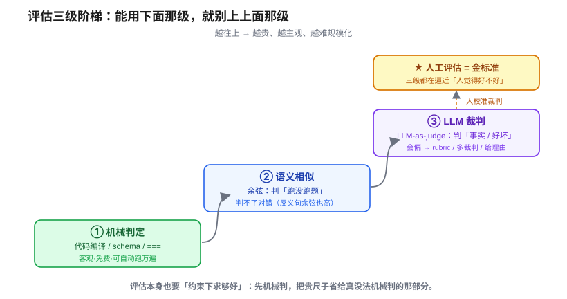
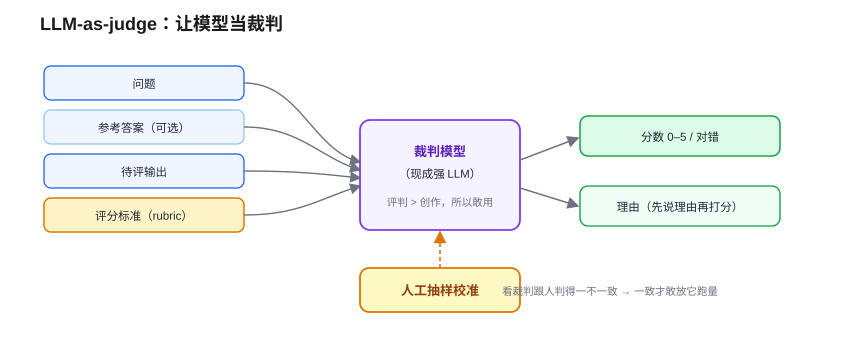
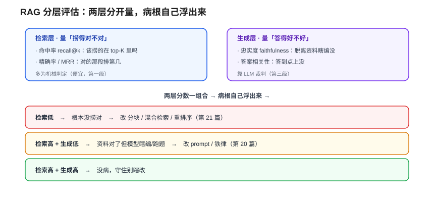

# 评估与质量度量：没有标准答案，怎么给 AI 打分

> 一个全栈工程师的大模型学习笔记（二十二）

上一篇结尾你一定憋着一个问题：我换了块大小、加了 reranker、调了 top-K……**到底变好了还是变差了？** 凭"感觉顺眼"可不算数。这一篇就是给你那把尺子。

但在量"好不好"之前，得先撞一堵墙——而且这堵墙，会把你当全栈工程师的老本能直接撞碎。

---

## 一、墙：`assertEquals` 为什么突然不灵了

你给一个函数写测试，闭着眼都会：

```js
expect(add(2, 3)).toBe(5);   // 实际值 === 期望值
```

确定的输入 → 唯一的输出 → 一个 `===` 搞定。你整套 CI、回归测试，地基都是这个 `===`。

现在你给 RAG 写测试，问「我们公司的退款政策是几天」，标准答案「15 天」。模型回：「您好，根据规定，退款需在十五天内提出申请哦～」

**意思完全对。但 `expect(answer).toBe("15 天")` —— 红的，挂了。**

`assertEquals` 偷偷假设了两件事，LLM 把这两件**都打破了**：

1. **"对"从一个点，变成了一片区域。** 「15 天」「十五天内」「15 天以内哦～」……同一个意思有**无数种合法措辞**。`===` 是点对点精确匹配，可正确答案现在是**一整个集合**。
2. **"对"从二元，变成了有程度。** 很多时候不是对 / 错，而是**答得多好**——答到点没？全不全？有没有顺嘴编？连"期望值"都未必写得出一个确定的串。

> 一句话：传统测试里"对"是**一个确定的点 + 机械判等**；LLM 这儿"对"是**一片语义区域 + 有程度高低**。`===` 这把尺子，量不了"区域"，也量不了"程度"。

---

## 二、别急着扔掉确定性：按"判定难度"分三级

新手撞了这堵墙，最容易过激——"既然没法精确判，那全靠人 / 全靠玄学吧"。错。正确姿势是：**按判定难度把输出分层，能用老办法的地方坚决用老办法，难的才上贵尺子。**



三级阶梯，越往上越贵、越主观：

1. **机械判定**——能 `===` 的，绝不动用花哨手段。
2. **语义相似**——`===` 太死时，松绑成"意思够近就算对"。
3. **LLM 裁判**——前两级判不了的"事实对不对、答得好不好"，请模型当裁判。

而这三级头顶，还悬着一个**金标准**：**人工评估**。这三级全是"自动化的代理指标"，它们存在的唯一意义，是**逼近"人觉得这答案好不好"**。记住这个锚，后面会反复用到。

一级一级往上爬。

---

## 三、第一级·机械判定：能 `===` 的先 `===`

RAG / LLM 的输出，**真的全是"开放无答案"吗**？不。有一大块其实**还能像以前那样精确 assert**——这正是你第 18 篇费劲让模型吐**结构化输出**换来的好处：**让一部分输出重新变回"可机械判定"。**

- **代码** → 能编译吗？过单测吗？（最硬核的一种：编译器**又快又免费又客观**，根本不用请裁判）
- **结构化输出** → JSON 的 schema 合法吗？（回扣 18）
- **分类 / 意图路由** → 标签 `==` 标准标签吗？
- **数字 / 枚举 / 唯一答案的抽取** → 精确匹配。

> 这其实是第 11 篇 **RLVR**「可验证奖励」的同款思路：数学、代码这类有**验证器**的东西，对错机器说了算，不需要主观打分。**评估能搭上验证器的便车，就绝不用花里胡哨的。**

为什么这层要优先？因为它**快、免费、客观、可复现、能自动跑一万遍**。而上面两级又贵又慢、还会看走眼。**评估本身也得"约束下求够好"（回扣 17b）：能机械判的先机械判，把昂贵手段省给真没法机械判的那部分。**

---

## 四、第二级·语义相似：余弦只判"跑没跑题"

但 RAG 的输出大部分不是代码。回到那个例子：问「退款几天」，答「**十五天内哦～**」——编译不了、`===` 也挂，但它**有参考答案**（15 天），只是措辞自由。

既然字面 `===` 太死，就用第 19 篇你已经造好的武器把它**松绑**——**余弦相似度**：把答案和参考答案各染一支箭，**意思够近（夹角够小）就算对**。

但这把尺子有个**致命的坑**，第 19 篇结尾我埋过 ⚠️，现在引爆它：

> 「我要退款」和「我不要退款」，意思相反，可它俩的箭**夹角很小、余弦很高**。

为什么跟直觉反着来？因为 embedding 把整句压成一支箭，方向主要由"**讲什么主题、用了哪些词**"决定。这两句都在讲「退款」、句式几乎一样、**只差一个"不"字**——那个"不"在逻辑上天翻地覆，落到向量里却只是个**微小扰动**，箭的方向被"退款"这个大主题死死拽住。于是夹角小、余弦高。

> 钉死：**余弦量的是"像不像 / 同不同主题"，不是"对不对 / 逻辑一不一致"。** 模型把政策答成「7 天」而非「15 天」、甚至答「不能退」，只要**主题对、措辞像**，余弦都可能给高分，把**事实错误**判成"对"。

**所以第二级只能粗判"答得跑没跑题"，判不了"事实 / 逻辑对不对"。** 这是它的天花板，也逼出了第三级。

---

## 五、第三级·LLM-as-judge：让模型当裁判

要判的是"事实对不对、答得好不好"这种**连人都得读一遍才能下判断**的事。最准的当然是**请真人评**——**人工评估是金标准**，但它**贵、慢、没法规模化**，你不可能每次改配置就请人评一千条。

那有没有一个**又能规模化、又真能"读懂并判断"**的办法？有，就凭第 11 篇你认下的那句——**评判比创作容易**。既然评判比创作易，而我们手里正好有个会创作的东西，那就**让它来当裁判**：



**LLM-as-judge**：拿一个**现成的强模型**，用一段 prompt 把**评分标准（rubric）**告诉它，让它读「问题 +（参考答案）+ 待评输出」，吐出**分数 / 判断 + 理由**。人工评一千条要几天，它几分钟跑完。

它跟第 11 篇那个**奖励模型（RM）**是一脉相承的——RM 是**专门训出来**的裁判，LLM-as-judge 是它**不用训练的轻量后代**：换个 prompt 就换个评分标准。

**但裁判也会看走眼**，三招防偏：

- **有偏好**：偏爱长答案、偏爱自己那套措辞、A/B 比较时有"位置偏好"（偏爱排前面的）。
- **治法**：给**明确 rubric**（别让它凭感觉）、**多个裁判投票**、让它**先说理由再打分**。
- **更关键——用人校准裁判**：拿一批**人工标注**当标尺，看 LLM-judge 跟人判得一不一致；一致性够高，才敢放它去规模化跑。**人校准机器，机器再去跑量。**

> 一个你**一直在亲眼看的活例子**：每篇博客写完我跑的那个**对抗审核 workflow**，就是 LLM-as-judge 的实战——几个 agent 按 rubric 各自找问题、再彼此**对抗验证**剔除误报。多裁判 + 给理由 + 独立复核，正是上面这套防偏招。**你这一路都在用它。**

---

## 六、RAG 专属：把"检索"和"生成"分开量

三级阶梯是通用的。但 RAG 还有个专属难题，回扣第 21 篇你最熟的 **garbage in / out**：

一个 RAG 答错了——可能是**检索没捞对**（喂进去的资料本身就错），也可能是**资料明明捞对了、模型却瞎编 / 答跑题**。**只对最终那句答案打一个总分，你定位不了病根。**

所以 RAG 评估必须**分两层量**：



**检索层（量"捞得对不对"）**——只要你**标了黄金资料**，就能**机械判定**（黄金 id 在不在召回列表里），便宜，属第一级（经典 IR 那套）：

- **召回 / 命中率（recall@k）**：该捞的那段，在 top-K 里有没有？← 量第 21 篇召回阶段那个 KPI"别漏"。
- **精确率 / 排序（precision@k, MRR）**：捞回的有多少真相关、对的那段排第几？← 量第 21 篇**重排序**有没有把对的排上来。

**生成层（量"基于资料答得好不好"）**——得上第三级**裁判**：

- **忠实度（faithfulness）**：答案是不是**只**从给的资料推出来的、有没有脱离资料瞎编？← 量第 20 篇三道锁要压的幻觉。
- **答案相关性（answer relevance）**：答到点上没、有没有答非所问？

**分层打分，直接告诉你该拧第 21 篇哪颗螺丝：**

| 检索分 | 生成分 | 病根 | 去改 |
|:---:|:---:|---|---|
| 低 | — | 根本没捞对 | 分块 / 混合检索 / reranker（第 21 篇）|
| 高 | 低 | 资料对了但模型不老实 / 跑题 | prompt / 铁律 / 换生成模型（第 20 篇）|
| 高 | 高 | 没病 | 守住，别瞎改 |

> 这套指标有现成框架叫 **RAGAS**，把忠实度、答案相关性、检索的 context recall / precision 打包好了。但有个反直觉点得记住：**RAGAS 默认连"检索层"也是用 LLM 来判的**（把参考答案拆成小句，让模型逐句判能不能被召回的资料支持），不是纯机械比对——只有你显式标了黄金资料、改用它的 id 比对变体，检索层才回到上面那种"便宜的机械判定"。

---

## 七、工程化：从一次打分，到越用越好的飞轮

有了尺子，还得有**固定的考卷**，把"我感觉顺眼多了"变成"忠实度 78→85、命中率 0.7→0.9"。

**第一层（离线，当 CI 跑）：黄金评估集 + 回归。** 攒一套固定的〈问题 → 标准答案 / 标准该捞的资料〉，每次改配置、改 prompt、换模型，就**整套跑一遍打分、和上一版比**。分涨才算真好，分跌就是 regression——**和你写的 CI 回归测试一模一样**。（那批"标准答案"哪来的？**人标的**——金标准又出现了。）

**第二层（线上，验真）：A/B 测试。** 离线分高 ≠ 线上真好（评估集覆盖不全、真实问题更野）。新版本先切 **5% 流量**，和旧版比**线上信号**——👍/👎、用户**追问率**、**转人工率**（转人工那一下是最诚实的差评）。赢了再放量。

**第三层（闭环）：把失败回流，转成飞轮。** 这步才是"越用越好"的发动机——点踩的、追问的、转人工的 case 别让它白流走：

```
用户用 → 产生信号 → 信号暴露失败 → 失败回补(评估集/知识库/训练数据)
   ↑                                                    ↓
   └──────────── 系统变好 → 体验更好 → 更多人用 ────────┘
```

而回补时，**失败也要按病根分流**给不同的药（这正是分层定位的延伸，从"检索 vs 生成"延伸到"知识 vs 能力"）：

| 失败病根 | 例子 | 喂给谁 |
|---|---|---|
| 事实缺 / 过时 | 库里根本没这条政策 | **补 RAG 知识库**（不是微调）|
| 检索没捞对 | 资料在库却没捞出 | 调检索（第 21 篇）|
| 能力 / 风格 / 对齐差 | 总太啰嗦、死活不说"不知道" | **SFT / RLHF 微调**（回扣 9 / 11）|

> 一句话分流：**微调改"模型的本事和脾气"，RAG 改"它手边能查的资料"。** 先问"它是**不会查**还是**本事不行**"，前者补 RAG，后者才动微调（回扣第 20 篇：别拿微调灌易变的事实）。
>
> 至于 A/B 平台、灰度发布、CI/CD 流水线这些**重基建**怎么搭，留给第 29 篇《测试与持续交付》——这一篇先把**理念**钉死：先能度量，才谈得上改进。

---

## 八、收口：这一篇在 harness 里的位置

回扣第四阶段那条暗线——每个技术都是 harness 的一个零件：

**评估 = 番外 17b 那根"柱三：用确定手段驯服不确定性"的直接落地。** 模型是会抖的零件，你没法保证它每次都对——但你可以用一套**确定的评估流程**把它的质量**量出来、守得住**。它也是 agent loop 里"校验失败 → 回灌重试"（第 18 篇）那个判断的**度量基础**：没有评估，你连"这次输出合不合格"都说不清，重试循环就成了空转。

更大的一层：**评估是整个 AI 系统从"能跑"到"可信赖、可持续改进"的那道关。** 前面所有篇章造的零件（RAG、工具、记忆……）好不好、改了之后退没退步，全靠这把尺子来量。**没有评估，你做的一切优化都是盲人摸象。**

一句话钉死今天这篇：**LLM 把"对"从点变成了区域和程度，于是评估也得分层——能机械判的机械判、判跑题用余弦、判好坏请裁判、人工是金标准；RAG 再拆成检索层和生成层分头量，最后攒成黄金评估集 + 线上飞轮，让系统越用越好。**

---

## 小结

- **墙**：`assertEquals` 失效，因为 LLM 把"对"从**一个确定的点 + 机械判等**，变成了**一片语义区域 + 有程度高低**。
- **三级阶梯**（越上越贵越主观）：① **机械判定**（代码编译 / schema / 分类 / `===`，回扣 11 RLVR、18，能用就别上别的）→ ② **语义相似**（余弦，判"跑没跑题"；反义句余弦高是大坑，回扣 19）→ ③ **LLM-as-judge**（判事实 / 好坏，回扣 11 评判易于创作；防偏靠 rubric / 多裁判 / 给理由 / 人校准）。
- **人工评估 = 金标准**：三级都是逼近"人觉得好不好"的代理指标；人工用来**校准裁判**、**标注黄金集**、**线上点赞点踩**。
- **RAG 分层量**：**检索层**（命中率 recall@k / 精确率；标了黄金资料可机械判，但注意 RAGAS 默认也用 LLM 判）+ **生成层**（忠实度 faithfulness / 答案相关性，靠裁判）。两层分数组合**定位病根**，告诉你该拧第 20 还是第 21 篇的螺丝。框架：**RAGAS**。
- **工程化飞轮**：黄金评估集（离线 CI 回归）→ A/B（线上验真）→ 失败回补 → 越用越好。回补按病根分流：**事实缺补 RAG、能力差才微调**（别混了，回扣 20）。
- **harness 暗线**：评估 = 柱三"驯服不确定性"的落地、agent 重试循环的度量基础、整个系统可持续改进的前提。**先能度量，才谈得上改进。**

到这儿你手里有尺子了——能判一次输出好不好、能定位 RAG 病根、能搭起越用越好的飞轮。但你有没有注意到，前面聊的全是**单轮**：一问一答、答完即走。可真实产品里用户是**连着聊**的——「我要退款」→「那要多久到账」→「**那个**订单呢」。模型是条记不住事的金鱼（回扣 17），它凭什么接得住这一长串带"那个"的对话？多轮一长，context 又要爆，怎么办？这就是下一篇《对话记忆与状态管理》要解决的——**怎么让金鱼"记得住"。**
