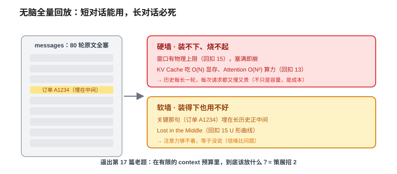
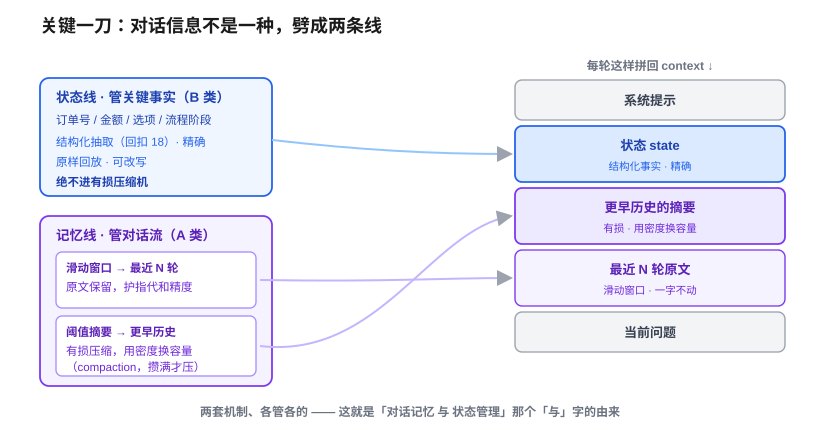
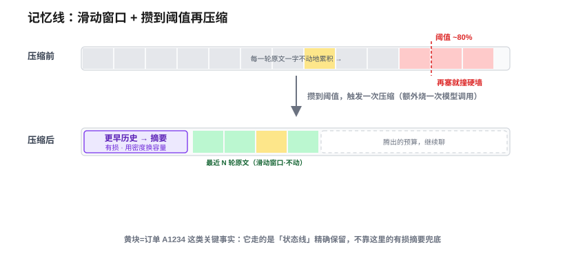

# 对话记忆与状态管理：长对话为什么会「失忆」，怎么治

> 一个全栈工程师的大模型学习笔记（二十三）

上一篇结尾我留了个钩子：前面 22 篇全是**单轮**——一问一答、答完即走。可真实产品里用户是**连着聊**的：

> 用户：「我上周买的那双鞋想退」
> 助手：「好的，可以帮您办理，退款打到原支付方式吗？」
> 用户：「**那个**多久到账？」

第三句里的「那个」指退款。可第 17 篇我们钉死过：模型是条**金鱼，无状态**，每轮把整个 `messages` 数组**原样重放**——它脑子里压根没有「上一轮聊了退款」这回事。

**那它凭什么知道「那个」= 退款？** 这一篇就从这个最朴素的问题钻进去，一路钻到你每天用的 Claude Code 在长会话里到底干了什么。

---

## 一、先泼一盆冷水：记忆根本不在「脑子」里

先把答案说穿，因为它反直觉：

**模型没有「记得」这回事。是 harness 每一轮把前面的对话原文，重新塞进 `messages` 里，替它兜住的。**

第三句发出去的时候，请求体长这样：

```
messages = [
  { role: "user",      content: "我上周买的那双鞋想退" },     ← 第 1 轮原文
  { role: "assistant", content: "好的…退款打到原支付方式吗？" },← 第 2 轮原文
  { role: "user",      content: "那个多久到账？" },            ← 这一轮
]
```

「那个」= 退款，靠的就是**前两轮原文还躺在 `messages` 里**，模型用 attention 在这一整坨里找指代对象（回扣第 4 篇）。所谓「记忆」，不在模型的权重里，而在**你这一侧的那个数组里**——它是**外挂的笔记本**（回扣番外 18a：模型缺的三样里，第一样就是「记忆外挂」）。

> 钉死第一根桩：**记忆 = 每轮把历史拼回 context。** 没有什么神秘的记忆模块，就是「把过去的对话原文，再发一遍」。「聊天」是这场重放演出造出来的幻觉（回扣第 17 篇）。

这招简单、好使，而且**就是聊天产品最朴素的真实实现**。短对话，它够用。

但只要对话一长，它就会撞墙——而且撞的，是你在第三阶段已经反复钉过名字的两堵墙。

---

## 二、无脑全量回放，撞两堵墙

把场景放大：这不是 3 轮，是一个客服会话聊了 **80 轮**；或者一个 coding agent 帮你改了俩小时，中间读了十几个文件、跑了几十条命令，**每条输出都原样躺在 `messages` 里**。

你还想「把所有历史都回放过去」？两堵墙等着你：



- **硬墙 · 装不下、烧不起。** 窗口有物理上限（回扣第 15 篇），塞满就崩。而且别忘了第 13 篇那笔账，两笔分开记：**KV Cache 吃 O(N) 显存、Attention 是 O(N²) 算力**——历史每长一轮，每一轮请求都**又慢又贵**。这不只是「容量」问题，是**成本**问题。
- **软墙 · 装得下也用不好。** 就算还没塞满，80 轮里真正关键的那句（「订单号 A1234」），被埋在长长历史的**中间**——**Lost in the Middle**（回扣第 15 篇 U 形曲线），模型注意力够不着，等于没说。

> 钉死第二根桩：**全量回放，短对话能用，长对话必死。** 硬墙撞容量和成本，软墙撞信噪比。

于是问题就**逼成了**第 17 篇那道老题：在 context 这个**有限预算**里，到底该放什么？这一次，对象是**对话历史**——这就是第 17 篇埋的「上下文策展招 2：记忆 / compaction」。

---

## 三、关键一刀：对话里的信息，不是同一种

撞墙之后，新手的第一反应是「那就只留重要的呗」。方向对，但**重要在哪、怎么留**，藏着这一篇真正的洞见。

先别急着压缩。冷静看一段 80 轮的客服对话，里面的信息**根本不是一种东西**，脾气天差地别：

| | A 类 · 对话流 | B 类 · 关键事实 |
|---|---|---|
| 例子 | 寒暄、抱怨两句、助手解释了一通退款政策 | 订单号 `A1234`、退款 `¥299`、选了「原路退回」、流程走到「等用户确认」 |
| 压成一句话会怎样 | 「用户咨询退款政策」——**丢了细节无所谓** | **错一个字都不行**，更不能被压没、被编错 |
| 该怎么待它 | 可以有损压缩 | 必须精确保留 |

把这两类**一视同仁地丢进同一台有损压缩机**，正是长对话失忆的病根。正确的做法是**劈成两条独立的线**，各管各的：



每一轮，context 这样拼装回来：

```
[系统提示]
[状态 state]      ← B 类：结构化抽取 · 精确 · 原样回放 · 可改写
[更早历史的摘要]   ← A 类远处：模型有损压缩 · 用密度换容量
[最近 N 轮原文]    ← A 类近处：滑动窗口 · 规则保留 · 护指代和精度
[当前问题]
```

- **记忆线**（管对话流）：近处留原文、远处压摘要，跟两堵墙缠斗。
- **状态线**（管关键事实）：拎出来单独精确存、每轮原样回放，**绝不进有损压缩机**。

标题里「对话记忆**与**状态管理」那个「**与**」字，就是这一刀劈出来的——**它们是两套机制，不是一回事。** 下面分别拆。

---

## 四、记忆线：滑动窗口 + 攒到阈值再压缩

记忆线管的是「对话流」（A 类），目标是**在两堵墙的预算里，尽量多保住信息**。它用两挡互补的手段：

**第一挡 · 滑动窗口（管近处）。** 最近 N 轮，**原文一字不动留着**。为什么近处不能压？两个理由都回扣前篇：

1. 指代（「那个」）、刚确认的细节都在近处，**压了就丢精度**；
2. 近因位置好（回扣第 15 篇 LiM 的近因端），留原文性价比最高。

规则极简：永远保留最近 N 轮，更早的才考虑处理。便宜、确定、不出错。

**第二挡 · 压缩 / 摘要（管远处）。** 更早的历史，只需要「大意」——用户是谁、诉求是退款，细节扔了无妨。于是**让模型读一遍这些老对话，吐一段摘要**，**用密度换容量**，把硬墙往后推。这就是 **compaction**，也正是你每天用的 Claude Code 在长会话里干的事（回扣番外 17b：按上下文占用百分比自动触发，具体阈值随版本和窗口大小变化）。



但「让模型来压」这个动作，**本身不是免费的**，拖着三个魔鬼：

| 魔鬼 | 是什么 | 怎么治 |
|---|---|---|
| ① 成本 / 延迟 | 压缩要**额外烧一次模型调用** | 别每轮压。攒到阈值才压一次，摊到几十轮里就不肉疼 |
| ② 有损 / 会编 | 模型自读自写，可能**把关键细节压没**，甚至**顺手编**一句没发生的事（回扣 18a 分不清真懂还是在编） | 把绝不能错的东西**从这条线里拿走**——交给状态线（下一节） |
| ③ 边界失效 | 压缩把第 5 轮「订单 A1234」摘没了，第 81 轮问「那个订单到哪了」，指代跨过压缩线，抓瞎 | 同上：精确事实根本不该走有损这条线 |

看出来没——**魔鬼 ② ③ 的解药是同一个：把「绝不能错的事实」从记忆线里剥出去。** 这就引出了状态线。

至于魔鬼 ① 的扳机：**什么时候触发压缩？** 不能每轮都压（那又烧爆成本）。标准答案是**盯住 context 用量，攒到某个阈值 / 百分比（比如 80% 满）才批量压一次**。这跟滑动窗口分工互补：滑动窗口只管「最近 N 轮留原文」，而**溢出窗口的那批老轮**怎么处理有两种策略——朴素做法是**直接丢掉最老的**（省事，但信息真没了），更好的做法是**攒到阈值把这批老轮整体摘要**（保住密度，代价是那一下额外烧一次调用）。本篇记忆线用的是后者，所以图里「更早历史」是被压成摘要、而不是被删。

---

## 五、状态线：把「绝不能错的事实」单独供起来

状态线管的是 B 类——订单号、金额、流程阶段这些**错一个字都不行**的精确事实。它的待遇和记忆线完全相反：**不压缩、不丢弃、每轮原样回放、有进展就改写。**

它干两件事：

**1. 抽取：从自然语言里抠出结构。** 用户说「就退原路吧，订单 A1234」，要变成 `{ 订单号: "A1234", 退款方式: "原路退回" }` 这样**定死字段**的结构。这个动作——

**你在第 18 篇已经造过专门的零件了：结构化输出。** 拿它来抽状态，一锤子办成两件事：

- **比纯正则强**：正则只能抓死格式（订单号 `A\d{4}` 那种），但「用户选了**原路退回**」要**读懂语义**才能判，正则干瞪眼。模型有理解力，schema 又把字段焊死——**理解力 + 结构，正则只占后者**。
- **挤掉「自由发挥」（克制记忆线的魔鬼 ②）**：让模型自由写摘要，它能顺嘴编一整段；但塞进定死的 schema 槽位（甚至开约束解码，回扣第 18 篇「给金鱼嘴套模具」），它只能往 `订单号` 这个格子里填，**自由叙述里编整段的余地被结构挤没了**。
  - ⚠️ 但记住第 18 篇的边界：约束解码焊死的是**结构**，不是**事实**——它保证一定有 `订单号` 字段、类型对，**不保证填进去的号是真的**，模型仍可能抠错 / 填一个没出现过的号。值的真假得靠**校验**兜底（回扣第 22 篇）。结构化只是把「编造的表面积」收窄，不是根治幻觉。

> 这又是**复用同一把锤子**：结构化输出本是给工具调用造的，这里拿来抽状态——**同一件零件，第二个用途**（回扣第 19 篇池化被复用三次的味道）。

**2. 存与回放：精确存、每轮原样塞回 context、可改写。** 注意是「可改写」不是「只读」——用户改了收货地址、流程从「待确认」推进到「已退款」，这块状态得**更新**。它更像一块**可改写的便签 / 状态对象**，读时回放、有进展就改写。

**那 schema 怎么定？提前写死吗？** 是的——而且「写死」这件事本身，**就是工程**。因为状态**绑定具体业务**：你做「客服退款 bot」，动手前就知道值钱的事实无非订单号、金额、退款方式、流程阶段那几样。业务边界一划，该抠哪些字段是**确定**的。这正是番外 17b 柱一：**约束下的设计**。

但这里有个谱系，取决于业务封不封闭——又是一次「戴着镣铐跳舞」：

| | 业务封闭（退款 bot） | 业务开放（Claude Code 帮你干活） |
|---|---|---|
| 事先知道会出现哪些关键事实？ | 知道 | **不知道**（下一秒可能冒出任何文件名、任何报错） |
| 状态怎么存？ | **写死 schema**，结构化抽取填槽，精确 | 穷举不了字段 → 退化成一块**自由便签 / scratchpad**，让模型自己往里记要点（如 Claude Code 的进度文件，回扣 17b），灵活但又变回有损 |

**封闭业务 → schema 写死（精确）；开放业务 → 自由便签（灵活但有损）。** 选哪头，看你的业务有多封闭。

---

## 六、收口：这一篇在 harness 里的位置

延续第四阶段那条暗线——每个技术都是 harness 的一个零件：

**这整套就是第 17 篇「上下文策展招 2（记忆 / compaction）」的完整落地。** 而且它是 12-Factor Agents 里 **Own Your Context Window** 的字面实现（回扣 17b）：记忆和状态都**攥在 harness 手里，不在模型脑里**——模型还是那条无状态金鱼，是你这一侧的两条线在替它兜住「我是谁、聊到哪、关键事实是什么」。

再往里看，三根柱子都在场：

- **柱一·约束下设计**：状态 schema 提前写死、N 轮窗口取多大、阈值定在百分之几——全是权衡。
- **柱二·确定的章法**：「攒到阈值压一次」是一条**确定性的控制流**，不靠手感靠规则。
- **柱三·驯服不确定性**：压缩会丢会编（不可靠零件），用**结构化抽取 + 分线管理**这套确定手段把它兜住。

一句话钉死今天这篇：**「记忆」不在模型脑里、在 messages 里（回扣 17 金鱼）；无脑全量回放撞硬墙（容量 + 成本）和软墙（LiM）；于是把对话信息劈成两条线——记忆线（滑动窗口护近处 + 阈值触发有损摘要压远处）管对话流，状态线（结构化抽取 / 开放业务退化成便签）精确管关键事实。**

而这，正好是给 Agent 铺地基。下一篇《Agent：让模型自主行动》——一个 agent 帮你连干几十步（读文件 → 改代码 → 跑测试 → 看报错 → 再改），它凭什么记得住「我干到第几步、上一步啥结果」？答案就是今天这套**状态管理**。金鱼能跨多步行动，靠的不是它变聪明了，而是 harness 替它把状态一轮轮接住。

---

## 小结

- **记忆的真相**：模型无状态（回扣 17 金鱼）。「记忆」= harness 每轮把历史原文拼回 `messages`，是**外挂的笔记本**（回扣 18a），不在权重里。
- **全量回放撞两堵墙**：**硬墙**（窗口容量 + KV Cache 的 O(N) 显存、Attention 的 O(N²) 算力，回扣 13/15）+ **软墙**（Lost in the Middle，回扣 15）。短对话能用，长对话必死。
- **关键一刀·劈两条线**：对话信息不是一种——**A 类对话流**（细节可丢）vs **B 类关键事实**（错一字都不行）。一视同仁丢进有损压缩机，就是失忆病根。
- **记忆线**（管 A 类）：**滑动窗口**留最近 N 轮原文（护指代和精度、占近因位置好）+ **阈值触发的有损摘要 / compaction**（用密度换容量，攒到 ~80% 满才批量压一次）。三魔鬼：成本 / 会丢 / 会编。
- **状态线**（管 B 类）：用**结构化输出**（回扣 18）从自然语言抽出定死字段——比正则强在有理解力、防住「会编」；**精确存、每轮回放、可改写**。schema **封闭业务写死**（柱一·约束下设计）/ **开放业务退化成自由便签**。
- **harness 暗线**：这套 = 第 17 篇「策展招 2」落地 + 12-Factor **Own Your Context Window**；三根柱子齐活。它是下一篇 **Agent 跨多步行动**的地基——金鱼能连续干活，靠的是 harness 替它接住状态。
