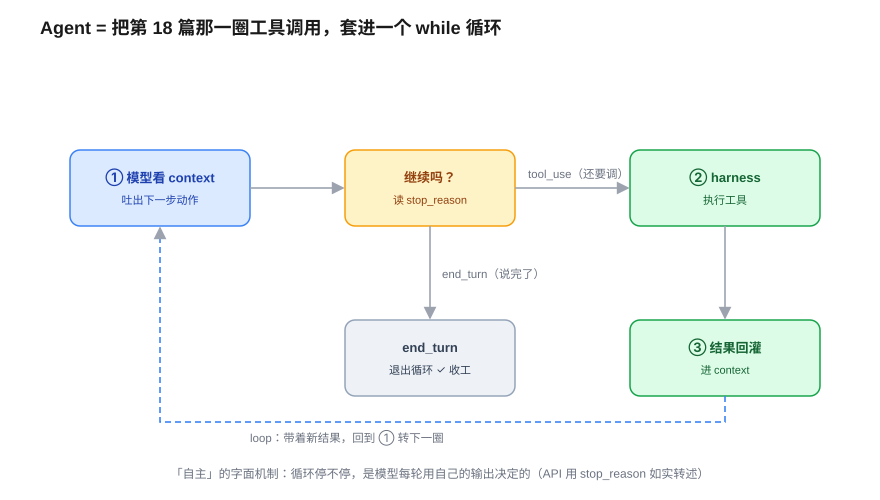
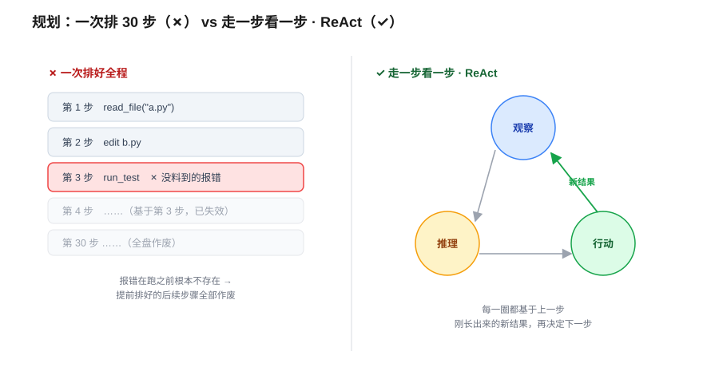
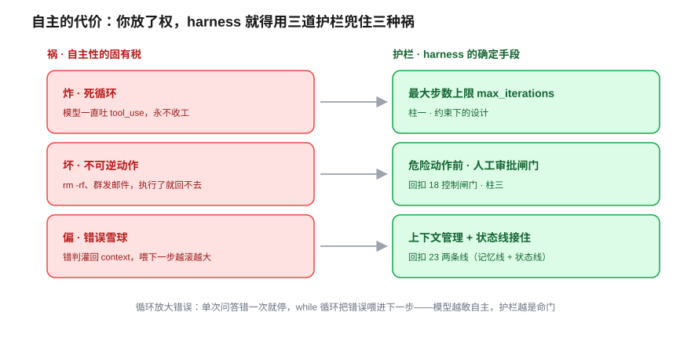

# Agent：让模型自主行动 —— 从「转一圈」到自己连转几十圈

> 一个全栈工程师的大模型学习笔记（二十四）

上一篇结尾我留了个钩子：一个 agent 帮你连干几十步——读文件 → 改代码 → 跑测试 → 看报错 → 再改——它凭什么记得住「我干到第几步、上一步啥结果」？答案是第 23 篇那套**状态管理**。

可那只回答了「怎么**记住**」。今天要回答更前面的一个问题：这个「连干几十步」的**循环本身**，到底是怎么转起来的？模型一不会真的「动手」、二看不见未来，**它凭什么能自主地一步接一步干下去？**

这一篇，我们不引入几个新零件。手里的零件其实**早就齐了**——第 18 篇给过工具调用、第 17b 给过 agent loop、第 23 篇给过跨轮记账。今天只做一件事：**把这些零件拼成一台会自己转的机器**，然后看清「自主」两个字的字面机制，以及它的代价。

---

## 一、Agent 是什么？把第 18 篇那一圈，套进一个 while 循环

先回到第 18 篇你已经推通的东西。那篇讲工具调用，循环转了**一圈**：

1. 模型吐出一个受约束的工具请求（比如 `read_file("a.py")`）
2. harness 的工具模块**真的去执行**它
3. 执行结果**回灌**进 context，给模型看

然后呢？模型看完结果，**这一轮就 `end_turn` 结束了**。一问一答，干净利落。

现在我想让它变成「读文件 → 改代码 → 跑测试 → 看报错 → 再改」连干几十步。**最少需要补什么？**

答案朴素到好笑：**一个 `while` 循环**。把第 18 篇那一圈，套进循环里反复转。

```js
while ( /* 还要继续吗？ */ ) {
  const out = model(context);   // ① 模型看 context，吐下一步
  const res = execute(out);     // ② harness 执行那一步
  context.push(out, res);       // ③ 结果塞回 context
}
```

> 钉死第一根桩：**Agent 没有黑魔法。它就是把第 18 篇那一圈工具调用，套进一个 `while` 循环里反复转。** 第 17b 篇说的 agent loop 三步（模型吐 JSON → 确定性代码执行 → 塞回 context → 循环），到这儿成了一段你随手能写出来的代码。

骨架就这么点。但所有玄机，全藏在那个 `while( ??? )` 的**括号里**。

---

## 二、循环条件之谜：谁决定「停」？——「自主」的字面机制

那个括号里该填什么？我把三个选项摆出来，你会发现前两个都不对：

- `while(true)`：永远转、永不停。那它怎么收工？
- `while(i < 100)`：固定转 100 步。可「改个 bug」有时 3 步搞定、有时 30 步——你**提前根本不知道填几**。
- 那到底**谁、在哪一步**，决定「这轮接着干」还是「行了，收工」？

谜底又**回扣第 18 篇**你学过的 `stop_reason` 分流。这里有个精确的归属，第 18 篇就强调过：`stop_reason` **不是模型吐出来的内容**，而是 **API 看模型这轮吐了什么、替你如实报告的一个字段**——模型真正产出的是「答话 +（要不要）附一个工具请求」，API 据此分流：

- 模型这轮**附了工具请求** → API 报 `stop_reason = tool_use`（「我还想调工具」）→ **循环继续**
- 模型这轮**只答话、没附工具请求** → API 报 `stop_reason = end_turn`（「我说完了」）→ **循环停下**

所以那个括号的真面目是（`resp` 是 API 的响应对象）：

```js
while ( resp.stop_reason === "tool_use" ) { ... }
```



**这是今天第一个关键洞察**：循环停不停，**不是 harness 写死的，是模型每一轮用自己的输出（吐不吐那个工具请求）决定的**。你给的不是 `while(true)`、也不是 `while(i<100)`，而是**把「继不继续」这个开关，交到了模型手里**。

这就是「**自主**」两个字的**字面机制**——不是什么哲学意义上的自我意识，就是「循环的节奏由模型的输出来踩」。番外 17b 里 12-Factor Agents 的 **Own Your Control Flow**，到这儿翻了个面：控制流的**形状**还攥在 harness 手里（是你写的这个 while），但每一步**踩不踩油门**，让给了模型。

> 钉死第二根桩：**「自主」= 循环的停止条件交给了模型的输出。** harness 拥有循环的骨架，模型拥有每一步的「继续/收工」开关。Claude Code 干完活自己停下来，靠的就是它某一轮吐了 `end_turn`。

---

## 三、决策祛魅：没有「规划器」，就是同一台 next-token 机

「何时停」只是个 yes/no 开关。可循环每转一圈，模型还要决定一件更难的事：**这一步到底干啥**——是 `read_file` 还是 `run_test`？参数填什么？

「自主规划」四个字，听起来像 agent 里藏了个**规划器模块**，在替模型排兵布阵。

**没有。** 模型吐出 `read_file("a.py")` 这个动作，跟它吐「今天天气真」后面接「好」，**用的是同一台 next-token 概率机**（回扣第 1 篇）。工具调用，不过是「在当前这坨 context 下，概率上最该接的下一串 token，恰好长成了一个工具请求的样子」。第 18 篇我们就说过：工具调用 = 结构化输出的一个应用。

这一步看穿，「自主规划」立刻**祛魅**：所谓「规划」，根本不是上帝视角把 30 步排好。它就是那台概率机，**盯着眼前这坨 context，吐出此刻最像样的下一个动作**。

那矛盾就来了：既然它**只是**台 next-token 机、只能看见**眼前**的 context、还看不见未来，它怎么可能干成「读文件→改代码→跑测试→看报错→再改」这种明明需要谋篇布局的多步活儿？

两条路，哪条是真实的 agent：

- **A**：任务一开始，模型先吐一张完整计划「第1步读A、第2步改B、第3步跑测试……」共 30 步，然后 harness 照单全收、挨个执行。
- **B**：模型**一次只决定一步**，干完看结果，再**基于刚冒出来的新结果**决定下一步，走一步看一步。

是 **B**。而且 B 赢，有两条腿：

1. **模型自己有不确定性**：就算它排好了 30 步，凭它的概率本性也未必能一步不差地执行完。
2. **更硬的一条**：`run_test` 跑出来报**什么**错，**在你真跑之前这个信息根本不存在**。下一步的决策所依赖的输入，是上一步执行完才**长出来**的。所以「提前排 30 步」不是不想，是**物理上办不到**——世界要等你动了手，才肯把反馈交给你。



这套「**走一步 → 看结果 → 再决定下一步**」的循环，有个你以后会反复见到的名字：**ReAct（Reason + Act，推理 + 行动）**。Agent 的「聪明」不在某个规划器里，**就在这个循环本身**。它正好**回扣第 17 篇**的 just-in-time：agent 不是把未来一次喂饱，而是**每一步现取现用**——那个 `while` 循环真正的燃料，就是 ② 执行后 ③ 回灌进来的**新观察**。

> 钉死第三根桩：**模型决策用的是同一台 next-token 机，没有独立规划器。** 因为环境的反馈得动手才长出来，agent 只能 ReAct——走一步看一步，而不是一次排好全程。

---

## 四、自主的代价：你放了权，就得兜住三种祸

到这儿，agent 的**正面**推通了。但你刚干了两件危险的事：把「继不继续」的开关**交给了模型**，又让它**真的去执行**读写文件、跑命令这些动作。放了权，就得兜住祸。三种，逐一看：



**祸一 · 炸（死循环）。** 万一模型一直吐 `tool_use`、永远不说 `end_turn` 呢？那 `while` 永不退出，token 烧到天荒地老。
**护栏**：给循环设个**最大步数上限**（`max_iterations`）。你不知道要几步，但你能划一条「最多 50 步」的线。这是**柱一·约束下的设计**——拿一个确定的上界，兜住一个不确定的循环。

**祸二 · 坏（不可逆动作）。** 模型某一步吐了 `rm -rf` 或「给全体用户发邮件」，harness 二话不说执行了——闯祸了。
**护栏**：危险动作执行前**停下、等人点头**（human-in-the-loop 审批）。这就是**第 18 篇的「控制闸门」**——执行权始终在 harness 手里，模型**想**调，放不放行你说了算。这是**柱三·用确定手段兜住不可靠零件**。

**祸三 · 偏（错误雪球）。** 这种最阴，前两道护栏都拦不住：agent 跑到第 7 步读错一个文件、得出一个错判断，这个错判断**留在了 context 里**；第 8 步基于它往下推，第 9 步又基于第 8 步……30 步后，它**信心十足地在干一件完全跑偏的事**，每一步看着都「合理」。

为什么这是 `while` 循环**特有**的病、单次问答不会得？因为单次问答是**直线**——错一次就错一次，没有下文。而循环是**链条**：每一圈的输出灌回 context、喂给下一圈当输入。错误不是停在原地，是被**喂进了下一步的决策**——garbage in 滚成 garbage 雪球（回扣第 20 篇）。**循环放大了错误，这是自主性的固有税。**

> 钉死第四根桩：**自主的反面，全是 harness 拿确定性章法去驯服那个被放权的循环。** 炸→上限、坏→闸门、偏→好的上下文管理。模型越敢自己做主，harness 的护栏就越是命门。

---

## 五、续命：长循环靠第 23 篇两条线接住

祸三还有半句没说完。这个循环连转几十圈，context 越堆越大、还混进了上一步的垃圾——它凭什么还记得住「我最初的任务是啥、干到第几步」？

这正是上一篇埋的钩子，**回扣第 23 篇的两条线**，agent 这儿两条都要用上：

- **记忆线（compaction）**：压住越堆越大的容量。几十步的工具输出原文不可能全留，攒到阈值就有损摘要一次（回扣第 23 篇「策展招 2」）。
- **状态线（结构化状态 / scratchpad）**：更关键。「最初任务是啥、干到第几步、上一步关键结果」这种**错一字都不行**的事实，靠 B 类状态线单独拎出来记。但这里要照搬第 23 篇那张谱系表的讲究：业务**封闭**（退款 bot）能**写死 schema、精确填槽**；可 coding agent 这种**开放**业务，字段穷举不了，只能退化成一块**自由便签 / scratchpad**——Claude Code 那个进度文件就是它（回扣 17b/23），灵活，但按第 23 篇的定性「**又变回有损**」。换句话说，agent 多半落在**有损**这一端，所以它记「干到第几步」天生比退款 bot 记订单号更脆——这也正是上面祸三（错误雪球）难根治的一个底层原因。

金鱼能跨几十步**不忘初心**，不是它变聪明了，是 harness 这两条线一轮轮替它接住状态。**第 24 篇的循环，是踩在第 23 篇的地基上才转得起来的。**

---

## 六、收口：Agent = Model + Harness 的完全体

把整条链回放一遍——它全是我们前面篇目的零件拼出来的，没有一件凭空冒出来：

> `while` 循环（骨架）→ 停止条件 = 模型用自己的输出（吐不吐工具请求）决定、API 用 `stop_reason` 转述（=「自主」的字面机制，回扣 18）→「下一步干啥」用同一台 next-token 机、没有规划器（祛魅，回扣 01）→ 所以只能 ReAct 走一步看一步，因为环境反馈得动手才长出来（回扣 17 just-in-time）→ 三种祸：炸（死循环→max 步数/柱一）、坏（误删→人工审批闸门/回扣 18/柱三）、偏（错误雪球→上下文管理）→ 长循环续命靠第 23 篇两条线接住任务与进度。

延续第四阶段那条暗线——每个技术都是 harness 的一个零件。今天这件，是 **agent loop 的完全体**：第 18 篇给的是 loop 转**一圈**，第 24 篇让它**自己连转到底**。

而最饱满的一次落地，是番外 17b 那句 **「if you're not the model, you're the harness」**：

**模型在这台机器里只贡献一件事——「每一步那个决策」（吐下一个动作 / 决定停不停）。其余全是 harness**：那个 `while` 循环、工具的真实执行、max 步数的护栏、人工审批的闸门、续命的记忆线和状态线。把模型这颗「决策核心」抠掉，剩下的整副骨架，就是 **Agent = Model + Harness** 里 Harness 那一半的**完整清单**。

Agent 不是一个更聪明的模型。Agent 是**一个朴素的 while 循环，外加一整套兜住它的工程**。

下一篇《Multi-Agent 与工作流编排》——既然一个 agent 就是一个会自主决策的循环，那**什么时候该让模型自己决策、什么时候该用写死的确定流程**？把多个这样的循环编排到一起，又会撞上什么新问题？

---

## 小结

- **Agent 是什么**：把第 18 篇那一圈工具调用（模型吐请求 → harness 执行 → 结果回灌）**套进一个 `while` 循环**反复转。骨架就这么点，没有黑魔法（回扣 17b agent loop 三步）。
- **「自主」的字面机制**：循环停不停，由模型每轮**吐不吐工具请求**决定、API 用 `stop_reason` 如实报告（`tool_use` 继续 / `end_turn` 收工，回扣 18）。harness 拥有循环骨架，模型拥有每步的「继续/收工」开关——这是 12-Factor 的 Own Your Control Flow 翻了个面。
- **决策祛魅**：模型决策用的是**同一台 next-token 机**（回扣 01），没有独立规划器。「规划」= 盯着眼前 context 吐出最像样的下一步。
- **ReAct（走一步看一步）**：不是一次排好 30 步，而是观察→推理→行动→再观察。因为环境的反馈**得动手才长出来**（回扣 17 just-in-time），提前排全程物理上办不到。
- **自主的三种祸 + 三道护栏**：**炸**（死循环 → 最大步数上限/柱一）、**坏**（不可逆动作 → 人工审批闸门/回扣 18/柱三）、**偏**（错误灌回 context 滚成雪球 → 上下文管理）。循环放大错误，是自主性的固有税。
- **长循环续命**：靠第 23 篇两条线——记忆线 compaction 压容量、状态线精确记「任务 + 进度」。金鱼跨多步不忘初心，是 harness 替它接住的。
- **harness 暗线收口**：Agent = agent loop 完全体（18 转一圈 → 24 连转到底）。模型只贡献「每步那个决策」，**其余全是 harness**——这是「if you're not the model, you're the harness」最饱满的落地。
