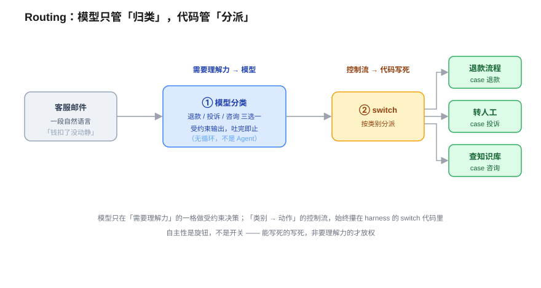
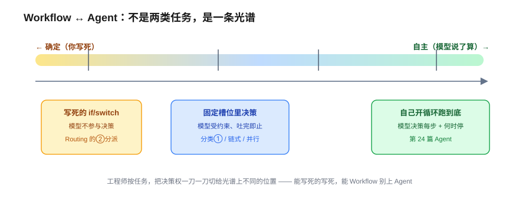
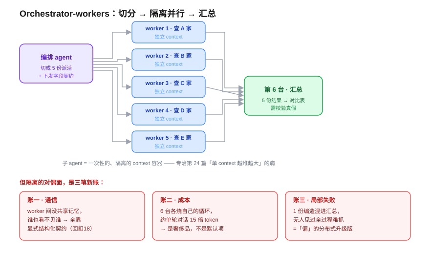

# Multi-Agent 与工作流编排 —— 什么时候让模型决策，什么时候用确定流程

> 一个全栈工程师的大模型学习笔记（二十五）

上一篇我们把一台 agent 拼了出来：一个 `while` 循环，模型每步自己决定「继续还是收工」。推完那台机器，有个念头几乎挡不住——**「这玩意儿这么强，那以后所有任务我都丢给它自己跑不就行了？」**

这一篇就来拦这个念头。它会带出本系列第四阶段最重要的一个**工程判断**：副标题那句话——**什么时候该让模型自己决策，什么时候该用写死的确定流程？** 以及当你把好几台这样的循环**编排到一起**时，会撞上哪些第 24 篇没有的新问题。

照例，今天几乎不引入新零件。手里的全齐了——第 18 篇结构化输出、第 24 篇 agent 循环、第 17b 篇三根柱子。今天只做一件事：**学会怎么把它们切开、拼好。**

---

## 一、把确定的事交给会抖的模型，亏在哪？

先做道判断题。下面两个任务，凭你全栈工程师的直觉，哪个适合第 24 篇那台**自主循环**，哪个不适合：

- **任务 A**：把用户上传的一段英文产品说明，**翻译成中文 → 压缩成 3 条要点 → 存进数据库**。每次都这固定三步，不多不少。
- **任务 B**：「生产环境这个下单接口**偶尔**超时，你去查一下为啥。」可能要看日志、查慢查询、看监控，查到一半发现是缓存问题又得换方向——**事先根本不知道要查几步、查哪些东西**。

答案很直觉：**A 适合写死的确定流程，B 适合自主循环。** A 的路径你拿手指头都数得清，B 的路径连你自己都说不准。

但真正值钱的问题在后半句：A 既然「确定流程也行」，**为什么不干脆也用自主 agent**？反正它更万能，A 这种小事它闭着眼也能跑。你非要写死，图啥？

假设你真把 A 丢给自主循环——让模型每一步都**自己重新决策**「我现在该翻译、该总结、还是该存库了」——你会白白付出三笔账：

1. **偏（凭空多出的风险）**：A 本是一条直线，错一步顶多错一步。可一旦交给循环，模型每一圈都要重新决策下一步，它完全可能在第 2 步抽风决定「我再翻译一遍」或「跳过总结直接存」。你**主动给一件确定的事注入了不确定性**，换来的「灵活」你根本不需要（回扣第 24 篇祸三）。
2. **白烧的成本**：确定流程里三步是写死的代码，模型最多被调用两次（翻译、总结），中间没有「该干啥」的决策开销。自主循环每一圈都要把历史灌回 context + 让模型推理一次来决定下一步——多出来的全是 token 和延迟，纯亏。
3. **没法测、不可复现**：确定流程能写单元测试、每次跑结果一样；自主循环每次路径都可能不同，出了 bug 你都难复现。

> 钉死第一根桩：**路径已知，就把它焊死成代码；只有路径未知时，才把决策权交给模型。** 这正是第 17b 篇**柱一·约束下的设计**——别为你不需要的灵活性买单。

这两端，各有正式的名字：

- A 那种「**人事先把步骤写死、模型只在固定槽位里干活**」的——叫 **Workflow（工作流）**。
- B 那种「**模型自己决定下一步、自己决定何时停**」的——就是第 24 篇那台 **Agent**。

记住这个分界，下一节我们就会发现：它根本不是非黑即白的两类任务。

---

## 二、自主性是旋钮，不是开关

现实里大量任务**夹在 A 和 B 中间**。看这个客服场景：

> 「用户发来一封**客服邮件**，先判断它属于退款 / 投诉 / 咨询里的哪一类，**再按类别走不同的处理**。」

这是纯 Workflow 还是纯 Agent？都不是——它是**两者的拼接**。关键在于：你能把它**切成两个性质完全不同的动作**。

**动作①：判断这封邮件是哪一类。** 这件事能用 `if-else` 写死吗？不能。「我下的单三天了还没动静，钱也扣了」——这压根没出现「退款」俩字，但它就是退款。看懂人话需要**理解力**，这一格只能交给模型。

**动作②：判断完之后，退款走退款流程、投诉转人工、咨询查知识库。** 这件事呢？一旦①给出了类别，「类别 → 动作」这套分派**需要模型每次重新动脑子吗**？不需要——你拿一个 `switch` 就写死了。

看出门道了吗——**你没有把整个方向盘甩给模型。** 你只在「需要理解力」的那一格把决策权切给它，而「类别 → 动作」的控制流，仍牢牢攥在你的 `switch` 代码手里。

还有个精确的点：动作①**严格说还不是**第 24 篇那台 while 循环 agent——它只是**一次**带结构化输出的分类调用（回扣第 18 篇 `response_format`、第 19 篇分类）。模型的「自主」被**死死框在「三选一」里**，吐完就完，没有循环、没有「我要不要再来一步」。

> 钉死第二根桩：**自主性不是开关，是旋钮。** 工程师的活儿，是把任务切成段，每段单独拧——能写死的写死，非要理解力的才放权，且放得越少越好（回扣柱一）。

这个「**模型分类 → 代码分派**」的拼法有个正式名字，叫 **Routing（路由）**。它和另外几种标准积木一起，铺满了「确定 ↔ 自主」之间的整条光谱：

| 拼法 | 模型管什么 | 代码管什么 | 像什么 |
|------|-----------|-----------|--------|
| **Prompt chaining（链式）** | 每步生成内容 | 步骤顺序写死 | 任务 A：翻译→总结→存库 |
| **Routing（路由）** | 分类（理解力） | 类别→动作的分派 | 客服邮件分流 |
| **Parallelization（并行）** | 各分支生成 | 拆分+合并写死 | 同一文档让 3 个模型从不同角度审 |
| **Agent（自主）** | 每步决策+何时停 | 只提供循环骨架+工具 | 任务 B：查超时 |

**Workflow vs Agent 不是两类任务，是一条光谱**，由你这个工程师一刀一刀切出来。能写死的写死，能 Workflow 别上 Agent——这是贯穿本篇的纪律。

---

## 三、编排多个循环：Orchestrator-workers

单个模型调用怎么编排，你通了。现在上副标题后半句的硬菜——**把多个第 24 篇那样的循环编排到一起。**

看这个会让人想偷懒的场景：

> 「给我**调研** 5 家竞品的定价策略，每家都要翻官网、扒新闻、看用户评价，最后汇总成一张对比表。」

两种干法：

- **干法甲**：用**一台** agent，在一个 while 循环里把 5 家**挨个**调研完、再汇总。
- **干法乙**：开**5 台** agent **同时**各查一家，最后再来**第 6 台**把 5 份结果汇总成表。

该选乙——理由直指第 24 篇那个病根：5 家公司 × 每家好几步工具调用，全塞进**同一个** context 里，会**爆窗口、还互相干扰**（回扣第 24 篇：单 context 越堆越大的堆积病）。干法乙给每台子 agent **单开一个干净的 context 窗口**，正好躲过这个病，还顺手并行加了速。

这就是 **Orchestrator-workers（编排者-工人）模式**：一台编排 agent 切分任务、派给多台并行的子 agent，最后汇总。**子 agent 的本质，就是一个一次性的、隔离的上下文容器。**

但工程里有条铁律：**每个解法都带着它自己的代价。** 你刚把「context 隔离」当优点用对了——下一节看它的反面。

---

## 四、隔离的三笔代价

「context 隔离」是优点，但它的对偶面，是三笔你必须兜住的新账。

**账一 · 通信问题。** 正因为 5 台工人 context 互相隔离，**worker 3 根本不知道 worker 1 查到了啥**。那 5 份结果凭什么能拼成**对齐**的一张表？worker 1 报「月付 $20」、worker 3 报「年付 $200」、worker 5 干脆按「基础版/高级版」分——汇总的人傻眼。「拼得起来」**不能靠默契，只能靠显式契约**：编排者派活时，必须把「**你要返回什么字段、什么格式**」一起焊死下去（「每家都返回 `{月付价, 年付价, 套餐档位}`」——回扣第 18 篇结构化输出！）。

> 钉死第三根桩：**多 agent 之间没有共享记忆，通信全靠显式的结构化契约**——任务规格往下传、结构化结果往上收。context 隔离是优点，**也**逼你把通信做成硬契约，这是它的对偶代价。

**账二 · 成本问题。** 干法甲 1 台、干法乙 6 台，每台都在烧自己的 while 循环——**大概 6 倍量级**。Anthropic 自己测，多 agent 调研系统约烧**单轮对话 15 倍**的 token。

> 钉死第四根桩：**多 agent 不是默认选项，是奢侈品。** 只有任务**能并行**、且大到「context 隔离/并行省下的，抵得过 token 税」时才值得。能单 agent 别上多 agent，能 Workflow 别上 Agent（回扣柱一 +「从简单开始」）。

**账三 · 局部失败（你还没踩到的雷）。** 万一 worker 3 中途崩了、或者**编了一个根本不存在的定价**回来呢？第 6 台汇总 agent 把「4 份真 + 1 份假」拼成一张**看着齐整**的表——而且**没有任何一个 context 完整见过全过程**，谁来发现那 1 份是假的？

这正是第 24 篇「**偏**（错误雪球）」的**分布式升级版**：错误不再在一条链上滚，而是**散在多个隔离的 context 里，更难抓**。护栏还是老几样——编排者必须**校验**工人的返回（回扣第 22 篇评估 / 第 18 篇校验重试），别照单全收。

---

## 五、收口：这一篇是「柱一 + Own Your Control Flow」的总落地

延续第四阶段那条暗线——每个技术都是 harness 的一个零件。今天这件，是**控制流设计**本身。

回放整条链，它全是前面篇目的零件切出来、拼起来的：

> 路径已知 → 焊死成 Workflow（柱一）→ 自主性是**旋钮不是开关**，按需切片放权（Routing：模型分类① + 代码分派②）→ 一条**确定 ↔ 自主光谱**，工程师一刀刀切 → 多个循环编排 = Orchestrator-workers，子 agent = 隔离的 context 容器（躲过第 24 篇堆积病）→ 但隔离带来三笔新账：**通信靠硬契约、成本翻倍是奢侈品、局部失败是分布式的「偏」**。

第 24 篇讲的是**「if you're not the model, you're the harness」**——模型只贡献每步那个决策。今天这一篇，是 harness 在更高一层的活儿：**决定哪些决策**交给模型、哪些**根本不该**交给模型。

这正是 12-Factor Agents 的 **Own Your Control Flow**（自己掌控控制流）最饱满的一次落地：编排层的控制流——任务怎么切、谁调谁、何时分叉合并——**始终是工程师写死的代码**，模型只在你切开的那些「需要理解力」的格子里做受约束的决策（哪怕格子里装的是一台自主 agent，它的自主也被你框定的边界圈着）。**模型越强越诱人，越容易让人想把一切甩给它**；但该不该放权，标准始终是**路径定不定、值不值、测不测得了**，跟模型多强无关。

下一篇起，我们进入第五阶段「AI 架构设计」。第一篇《模型选型与智能路由》——既然「该让模型决策还是写死流程」是一把尺子，那「**该用大模型还是小模型、该用哪家模型**」又是另一把尺子。怎么用最少的钱达到最好的效果？

---

## 小结

- **Workflow vs Agent 不是两类任务，是一条光谱**：从写死的 `if/switch`，到模型在固定槽位决策，到模型自己开循环跑到底。工程师按任务把决策权一刀一刀切。
- **核心纪律（柱一）**：路径已知就焊死成代码；只有路径未知才把决策权交给模型。把确定的事交给会抖的模型，白白付出「偏的风险 + 烧 token + 不可测」三笔账。
- **自主性是旋钮不是开关**：Routing 模式里，模型只管「看懂人话、归类」（需要理解力），代码用 `switch` 管「类别→动作」（控制流写死）。模型的自主权被框在结构化输出的「三选一」里，吐完即止。
- **Orchestrator-workers**：一台编排 agent 切分任务、派给多台并行的隔离子 agent、再汇总。子 agent = 一次性的、隔离的上下文容器，专治第 24 篇「单 context 越堆越大」的病。
- **隔离的三笔代价**：①**通信**——没有共享记忆，全靠显式结构化契约（回扣 18）；②**成本**——多 agent 约烧单轮对话 15 倍 token，是奢侈品不是默认项；③**局部失败**——是第 24 篇「偏」的分布式升级版，编排者必须校验工人返回（回扣 22）。
- **harness 暗线收口**：这一篇是 **12-Factor 的 Own Your Control Flow** 最饱满的落地——编排层的控制流始终是工程师写死的代码，模型只在切开的格子里决策。**模型越强越诱人，但该不该放权的标准始终是「路径定不定、值不值、测不测得了」，跟模型多强无关。**
