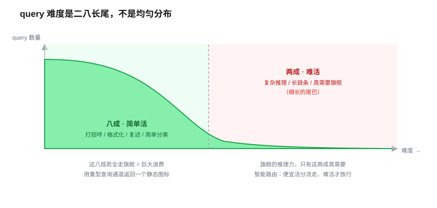
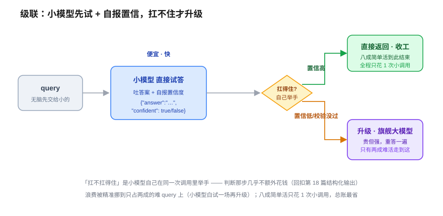
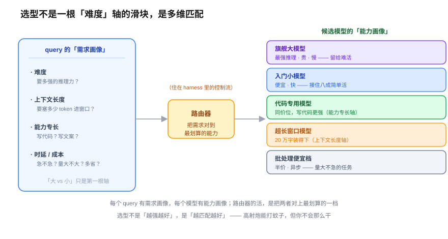

# 模型选型与智能路由 —— 怎么用最少的钱达到最好的效果

> 一个全栈工程师的大模型学习笔记（二十六）

上一篇我们立了一把尺子：**该让模型自己决策，还是写死成确定流程？** 现在假设某个环节你已经决定「这儿得用模型」了——一个新问题立刻冒出来：**用哪个模型？**

这就是第五阶段「AI 架构设计」的第一件事，也是副标题那句话——**怎么用最少的钱，达到最好的效果？** 今天几乎不引入什么高深新概念，全靠你搭后端的老直觉往上推。

---

## 一、你早就会这一招了，只是没搬到模型上

先离开模型，回你的老本行。你线上系统里「处理一个请求」，是不是所有请求都走同一套最贵的资源？肯定不是。你至少有这三招：

- **CDN**：静态资源「简单、重复」→ 别去打源站，就近拿。
- **读写分离**：读多写少、读「轻」→ 分流到从库，别挤主库。
- **热点走 Redis**：数据「频繁、可预测」→ 走内存，别每次砸数据库。

这三招背后是**同一个动作**，你天天在做却未必命名过它：

> **先判断这个请求「是什么货色」，再把它分到成本匹配的通道去。** 贵资源，留给真正需要它的活。

你从来不会用「一刀切最贵路径」伺候所有请求——那既烧钱又慢。现在，把这个骨架**原封不动**搬到模型上，就是这一整篇的内容。

搬之前，有个前提你得先信：**模型之间的成本差距，比你以为的夸张得多。**

同一家厂商的旗舰款和入门款，API 定价差多少？给你个真实量级（约数，具体价格随版本变）：

- **Claude**：Opus（旗舰）对 Haiku（入门），同代每百万 token 差 **5 倍上下**（跨代际、跨厂商比更夸张）。
- **OpenAI**：GPT-4o 对 GPT-4o-mini，差 **十几倍**。

而且贵的不只是钱——**大模型还更慢**（首 token 延迟更高、吐字更慢）。所以「无脑全上旗舰」这个默认做法，是在**用钱和延迟双重挨宰**。

---

## 二、二八定律：为什么「无脑全上旗舰」是巨大的浪费

顺着 CDN 的直觉往下推一步。假设你面前有**一万个用户 query**，这一万个里，「真的难到非旗舰不可」的占多大比例？

凭直觉——**大概二八**。八成是简单活（打招呼、改错别字、格式化、简单分类、复述），两成才真需要旗舰的推理力。query 难度不是均匀分布的，是**长尾**。

这个分布，就是整件事成立的**地基**。如果一万个 query 难度均匀，那没啥好折腾的，全上旗舰认了。可现实是长尾，于是浪费一目了然：

> 假设你整个系统只挂了一个 Opus——**那八成的简单活，你全在用旗舰的价钱和延迟去伺候。** 相当于你拿聚合报表的重型查询通道，去返回一个静态图标。

所以「智能路由」这四个字，翻译成大白话，就是你 CDN 那套：

> **便宜的活分流到小模型，难的活才放行到大模型。**

理论上，这能把大头成本砍掉一大截——因为大头本来就是简单活。动机通了。但魔鬼藏在一个你搭 CDN 时不会遇到的坎里。

---

## 三、判难度的坑：规则路由会被表面特征骗

CDN 判断「这是不是静态资源」很容易，看后缀 `.png` `.js` 就行，**规则是死的**。可现在你要判断的是「**这个 query 难不难**」——而这，规则做不到。

你脑子里那点「经验」，落成路由器能自动执行的代码，最朴素就两类信号：

- **关键词**：query 里有没有「写代码」「证明」「分析」这类词 → 判难。
- **长度/结构**：短句判简单，长文判难；带不带代码块。

这就是**规则路由**：一堆 `if-else`，快、免费、完全掌控。但它会被表面特征骗。看两个 query：

1. `帮我写个匹配邮箱的正则` —— 短短一句，没啥吓人关键词。
2. `把下面这段 2000 字的会议记录，一字不改原样复述一遍` —— 很长。

规则会把 1 判成**简单**、2 判成**难**。但真实难度**恰好反过来**：1 要点真本事（正则容易写错），2 就是台复读机，Haiku 都嫌大材小用。

> **规则数的是长度、看的是关键词，它读不懂 query 的「意思」。** 而难度，恰恰藏在意思里。

那怎么办？「判断 query 难不难」这件事本身**需要理解语义**——回想第 19、25 篇，「需要理解力的判断」我们交给谁？交给**模型**。

---

## 四、预判式路由：让小模型当分类器（但别用错模型）

「交给模型判难度」方向对，但这里有个坑，很容易踩进去：

> **如果你用旗舰大模型去判断「这个 query 难不难」，那你已经把大模型调用一次了——省钱的初衷当场破产。**

相当于你为了决定「要不要打车」，先打了个车去问司机。所以判难度这活，得交给一个**便宜的小模型**当分类器：让 Haiku / mini 读一眼 query，吐一个「简单 / 难」的标签（回扣第 18 篇结构化输出、第 19 篇分类——就是让小模型吐个受约束的枚举值）。简单的分流到小模型答，难的才升级放行给旗舰。

这条路叫**预判式路由**（先分类，再分流）。但它有两处别扭。

**别扭一：这个小分类器自己也会看走眼。** 它判的是「粗难度」，不是精确难度——完全可能把难的误判成简单、塞给小模型答砸，或把简单的误判成难、白占旗舰。你等于为了省钱，先立了一个**自己也会出错的裁判**。

**别扭二：它对每个 query 都多收一道税。**

> **为了省钱，我每个 query 都得先多调一次小模型判难度。** 这笔预判开销，在占八成的简单 query 上是白花的——它们本来小模型就能答，你还多问了一道「你难吗」。

于是有人想了个更鸡贼的办法，连「预判」这步都省了——**既然那个分类器又会错、又要额外收费，干脆绕开它。**

---

## 五、级联（cascade）：小的先试，扛不住再升级

**思路**：不预判，直接让小模型上，然后根据它答得怎么样，再决定要不要升级。

你可能立刻反驳：「那不是又得多一个模型来判断结果好不好？这不是更麻烦？」——问得好，正好戳中级联的成败点。答案是：**判断那步，大多数时候不用请第二个模型。** 有两条便宜路子：

1. **让小模型自己举手**：回扣第 18 篇结构化输出——让它在吐答案的同时，多吐一个字段，比如 `{"answer": "...", "confident": false}`。它自己拿不准就报低置信。同一次调用，不额外花钱。
2. **看廉价信号**：结构化任务里，小模型的输出 schema 校验没过 / 它直接说了「我不确定」 / 置信度过低——这些都是近乎免费的信号。

所以级联的真实形态是：**小模型直接上 → 它自己举手说「这个我扛不住」→ 才升级到旗舰。**

那它到底比预判式省在哪？把两种路由的账算给你看，用二八分布：

| | 简单 query（80%）花几次调用 | 难 query（20%）花几次调用 |
|---|---|---|
| **无脑全上旗舰** | 1 次大 😱 | 1 次大 |
| **预判式**（先小分类，再分流） | 小分类 + 小回答 = **2 次小** | 小分类 + 大回答 = 小 + 大 |
| **级联**（小先试，扛不住升级） | **1 次小**，完事 | 小（白试）+ 大 = 小 + 大 |

门道在这：**级联在「占八成的简单 query」上，只花 1 次小模型调用就收工**——预判式还得先问一句「你难吗」，多花一道。级联把浪费（多一次调用）**精准地挪到了只占两成的难 query 上**（那 20% 小模型白试一场再升级）。

因为简单的占大头，**级联总账通常最省。** 代价就是你说的「麻烦」：要设计自我举手机制、要处理「升级」的控制流。这是典型的**工程权衡**——多写点路由逻辑，换一大截成本。

> 顺带一提：级联和预判式不是二选一的对错题，是两种权衡。query 分布越是极端二八、小模型自评越靠谱，级联越划算；反过来若「白试再升级」的浪费太大（比如难 query 占比高、大模型特别贵），预判式先拦一道反而更稳。**没有银弹，看你的分布。**

---

## 六、路由逻辑住在哪儿？—— harness 的一个旋钮

这套「先试小的、不行再升级」的判断和分流逻辑，是一段**代码**，它得有个地方住。回想整个第四阶段的暗线——**它住在哪儿？谁执行它？**

住在 **harness 里**。它不在模型里——模型是冻死的黑盒，它不知道自己贵不贵、也管不着自己该不该被调用。「这个 query 该走哪个模型」是**工程师的决策，落成 harness 代码，模型只在被选中之后干它那格子里的活**。

这正是 12-Factor 的 **Own Your Control Flow**（自己掌控控制流）在选型层面的又一次落地：**模型选型，是 harness 面板上的一个旋钮。** 你可能会想到「那能不能抽一层专门的中转站，统一管所有模型的接入和路由？」——能，业界管它叫 **LLM 网关**（LiteLLM、OpenRouter 这类）。但那是**下一篇**的正题，这里先埋个钩：不管叫网关还是路由层，本质都是**住在 harness 里的一段控制流**。

---

## 七、不止「大 vs 小」一根轴：选型是多维匹配

到这，「大 vs 小」这根轴推透了。但真实的模型选型，**远不止这一根轴**。看三个场景，如果你只有「大 / 小」这一根尺，够不够分？

1. 一个**写代码**的 query，和一个**难度相当的写诗** query。
2. 一个要**塞进 20 万字文档**做问答的 query。
3. 一个凌晨跑的**批量打标签**任务，不急，但量巨大。

一个个看，你会发现每个都卡在**不同的轴**上：

- **场景 2 → 上下文窗口轴。** 不管模型多聪明，窗口装不下 20 万字就是零分（回扣第 15 篇）。这跟「难度」无关，是**容量**问题。
- **场景 3 → 速度 / 并发 / 成本轴。** 量大不急，你要的是吞吐和便宜。而且「不急」还解锁一个便宜档：很多厂商有**批处理 API**（半价、异步），专为这种不赶时间的量大任务而生。
- **场景 1 → 能力专长轴。** 我说了**难度相当**，所以「大 / 小」分不开它们。差在哪？差在**专长**：有些模型专门在代码上调过（code-tuned），写代码强但未必有文采；有些通用模型文笔好。**同样的价钱、同样的档位，专长不同。**

把这一节收成一句话，也是整篇的**核心洞察**：

> **模型选型不是「难度」一根轴上的滑块，是一个多维匹配问题。** 每个 query 有一张**需求画像**（要不要长窗口？要不要代码专长？急不急？要多准？多省？），每个模型有一张**能力画像**。路由器干的活，就是**把需求画像对到最划算的那张能力画像上。**「大 vs 小」只是其中最显眼的一根轴。

---

## 八、澄清一个必然的混淆：这个「路由」和上一篇那个不一样

最后收一个坑，不然你会和上一篇打架。

第 25 篇我们讲了个词叫 **Routing（路由）**：邮件 → 模型分类 → `switch` 分派到不同处理流程。这一篇又叫**智能路由**。**同名，但根本不是一层东西。**

- **第 25 篇的 Routing，路由的是「业务逻辑」**——这个任务该走哪条**代码路径**（退款流程 / 转人工 / 查知识库）。
- **第 26 篇的智能路由，路由的是「模型」**——这次生成该用哪个**模型**（Opus / Haiku / code 模型）。

一个管**业务流向**，一个管**资源分配**。更妙的是，它俩能**嵌套**——**外层 Routing 套内层智能路由**：

> 邮件进来，**外层**（Blog 25，粗）先分类 switch 到「走生成」这条业务分支；在这条分支**内部**，**内层**（Blog 26，细）智能路由再决定这次生成用 Opus 还是 Haiku。外层分「走哪条路」，内层分「这条路上骑哪匹马」。

两者都是 harness 里工程师写死的控制流，只是**粒度**不同。看到「路由」别混，先问一句：**路由的是路径，还是模型？**

---

## 九、收口：省钱的本质，是「别用高射炮打蚊子」

第五阶段问的是「怎么用最少的钱达到最好的效果」。这一篇给的第一个答案是：**别拿一杆枪打所有的鸟。**

回放整条链，全是你后端老直觉的迁移：

> CDN/读写分离/Redis 的骨架 = 按货色分流到成本匹配的通道 → 模型成本差数倍乃至十几倍 + 更慢 → query 难度二八长尾 → 智能路由：便宜活走小模型 → 但判难度不能靠规则（被表面骗）→ 交小模型当分类器（预判式），或让小模型先试、扛不住再升级（级联，二八下最省）→ 路由逻辑住 harness = Own Your Control Flow 的旋钮 → 而且不止「大小」一根轴，是**需求画像 ↔ 能力画像**的多维匹配。

一句话钉死这篇的纪律：

> **模型选型不是「越强越好」，是「越匹配越好」。** 高射炮能打蚊子，但你不会那么干——贵、慢、还不见得比苍蝇拍利索。

下一篇，我们把这里埋的钩挖出来：既然每个 query 都要在多个模型间挑、还要级联升级、还要处理某个模型突然挂掉，**这些接入逻辑总不能散在业务代码里到处都是**——该有一层统一的**入口**来收口。这就是第 27 篇《LLM 网关：统一接入层设计》。

---

## 小结

- **核心直觉（后端迁移）**：CDN / 读写分离 / 热点走 Redis，背后是同一个动作——**先判断请求是什么货色，再分到成本匹配的通道**。模型选型就是这一招搬到模型上。
- **前提 + 分布**：模型成本差数倍乃至十几倍、大模型还更慢；而 query 难度是**二八长尾**，八成是简单活。所以「无脑全上旗舰」= 用旗舰的价钱和延迟去伺候八成的简单活，巨大浪费。
- **判难度的坑**：规则路由（关键词 / 长度）会被表面特征骗（正则难但短、复述简单但长）——判难度需要理解语义，得交给模型。
- **两种路由**：①**预判式**——小模型当分类器先判难度再分流，缺点是每个 query 多花一道分类；②**级联**——小模型先试 + 自报置信度，扛不住才升级到旗舰，二八分布下**总账最省**，因为八成简单活只花 1 次小调用。没有银弹，看你的 query 分布。
- **归属（harness 暗线）**：路由逻辑住在 harness 里，是 **Own Your Control Flow** 的一个旋钮。「统一中转站」= LLM 网关，是下一篇正题。
- **多维匹配**：选型不是「难度」一根轴的滑块，是**需求画像 ↔ 能力画像**的多维匹配——难度、上下文窗口、速度 / 并发 / 成本、能力专长。「大 vs 小」只是最显眼的一根。
- **澄清坑**：第 25 篇 Routing 路由的是**业务路径**，本篇智能路由路由的是**模型**；两者可嵌套（外层 Routing 套内层智能路由）。看到「路由」先问：路由的是路径，还是模型？
