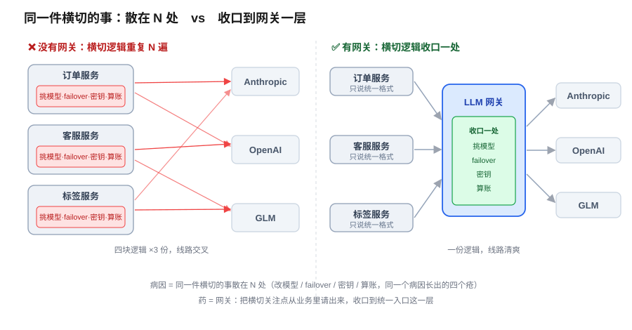
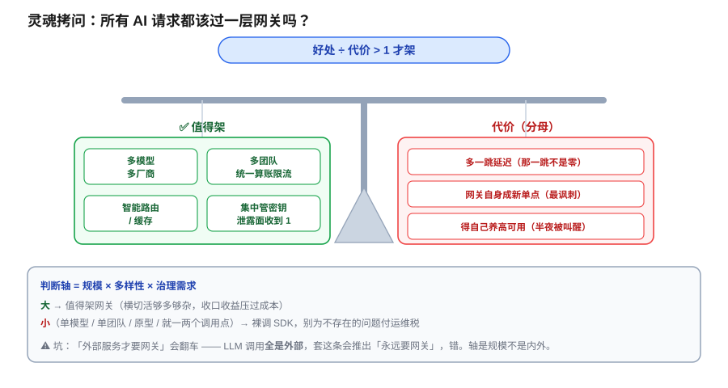

# LLM 网关：统一接入层设计 —— 所有 AI 请求都该过一层网关吗？

> 一个全栈工程师的大模型学习笔记（二十七）

上一篇结尾我埋了个钩：既然每个 query 都要在多个模型间挑、还要级联升级、还要处理某个模型突然挂掉，**这些接入逻辑总不能散在业务代码里到处都是**——该有一层统一的入口来收口。

这一篇就把这层挖开。好消息是：今天几乎不引入任何新概念——因为这层东西，**你搭后端时早就发明过、也早就架过了**。我们要做的，只是把你的老朋友请到 LLM 这个新后端前面来。

---

## 一、先看病：三件散活，硬塞进业务代码会烂成什么样

假设你现在**没有**任何网关。业务代码里，AI 调用是这样散落各处的：

```js
// 订单服务里
const summary = await anthropic.messages.create({ model: "claude-...", ... })

// 客服服务里
const reply = await openai.chat.completions.create({ model: "gpt-...", ... })

// 另一个角落，又换了家便宜的
const tags = await glm.chat({ model: "glm-...", ... })
```

现在把上一篇点出的三件事**落地到每一个调用点**：智能路由挑模型、扛不住级联升级（这两件第 26 篇正文讲透了），以及某厂商挂了切备用（第 26 篇结尾埋的钩，本篇正式接手）。你会得到什么？

第一反应人人都有：**「硬编码，改个模型巨麻烦。」** 对，但这只是**表面症状**。底下的病因是一句话：

> **同一件事，散在 N 个地方。**

一旦是「散在 N 处」，烂掉的就绝不止「改模型」这一件。顺着这一个病因往下数，你会数出**一整排疮**：

| 横切的活 | 散在业务里会怎样 |
|---|---|
| **改模型** | 写死了 `anthropic.messages.create` 这个具体方言，换模型要翻遍代码库改 N 处 |
| **容错 failover** | 某厂商挂了要切备用——这套 retry / 切换逻辑，你得在每个调用点**重写一遍** |
| **密钥管理** | `anthropic` / `openai` 的 API key 散在各处，泄露面 = N，轮换一次密钥噩梦 |
| **算账** | 老板问「这月 AI 花了多少、哪个团队花的」——你只能全库 grep，根本算不清 |

这四个疮，**同一个病因**长出来的。而这个病因——「一件横切的事散在 N 处」——你作为后端，**早就为它发明过一味药**。

当年你在一堆微服务前面架的那层东西，叫什么？**网关。**

---

## 二、网关是你的老朋友：90% 直接照搬

「网关」这个词一出，这篇的地基就砸实了——因为你**闭着眼都知道网关是干嘛的**：所有请求的**统一入口**，把那些「每个服务都要做、但又不属于业务本身」的**横切关注点**，收到一层去。你甚至能背出它收了哪些活：

> 统一入口 · 认证鉴权 · 限流配额 · 路由转发 · 日志监控 · 熔断降级 · 密钥收口

把这张清单往 LLM 调用上一贴，**大半直接就能套**，几乎一一对应：

- **熔断降级** → 某模型挂了自动切备用（failover），正是上一篇要的容错。
- **日志监控** → 每次调用记录 token 数、延迟、成本，算账问题当场解决。
- **密钥收口** → 三家的 API key 全锁在网关里，业务代码一个 key 都摸不到。
- **限流配额** → 按团队 / 按 key 限速限额，防止某个服务把预算烧穿。
- **路由转发** → 上一篇的智能路由，正好住这儿（下一节细说）。

看出来了吗？**LLM 网关不是什么新发明，它 90% 就是你的 API Gateway 换了个后端。** 你已有的全部网关经验，直接迁移。

真正让这一篇值得单独写的，是**剩下那 10%**。



---

## 三、LLM 独有的 10%：协议转换

传统 API Gateway 后面挂的服务，基本是**同构**的——都是你自己的 HTTP 服务，请求长什么样你说了算。可 LLM 网关后面挂的，是 Anthropic、OpenAI、GLM 三家**外人**，而这三家的 API 形状**各不相同**：

```
Anthropic：  anthropic.messages.create({ messages, system, ... })   → 返回 content[]、stop_reason
OpenAI：     openai.chat.completions.create({ messages, ... })      → 返回 choices[]、finish_reason
GLM：        glm.chat({ ... })                                       → 又一套字段名
```

方法名不同、参数结构不同、返回格式不同、连流式事件和工具调用的字段都不同（Anthropic 的 `tool_use` vs OpenAI 的 `tool_calls`）。**这，就是普通网关从来不用操心、而 LLM 网关躲不掉的脏活**：

> **协议转换**（也叫**适配层 / 统一 schema**）：业务代码只用**一种**统一格式往网关发，网关背后再把它翻译成各家的方言，返回时又翻译回统一格式。

注意这一下，把**第一节开头那个病**给根治了。你说「改模型巨麻烦」，麻烦在哪？麻烦在业务代码里写死了 `anthropic.messages.create` 这个**具体方言**。协议转换一上，业务代码**根本不知道**后面是谁：

```js
// 业务代码只认这一种统一格式，永远不变
const resp = await gateway.chat({ messages, model: "auto" })
```

后面是 Claude 还是 GPT 还是 GLM，是网关的配置说了算。「改模型」于是真的退化成了**「改一行配置」**。病因（散在 N 处的具体方言）→ 药（网关统一 schema），闭环。

> **接上实战卷**：你如果读过本系列的实战卷，第一篇要焊的 `ModelProvider` 接口，干的就是这件事的**单机极简版**——一个能同时容纳 Anthropic 流式 `tool_use` 和 GLM 流式 `tool_calls` 的统一接口。网关，就是把这个 `ModelProvider` 从「进程内一个接口」放大成「一层独立的服务」。同一个思想，两种体量。

协议转换是**进门的入场券**——它让「后面挂着多家厂商」这件事，在业务代码眼里彻底消失。拿到这张票之后，网关能干的，就远不止被动转发了。

---

## 四、智能路由住哪层？—— Own Your Control Flow 的又一次落地

上一篇那套**智能路由**——小模型先试、扛不住才升级旗舰的**级联逻辑**——我们说它「住在 harness 里」，但没说具体住哪。现在你有网关了，问题变成：**这套挑模型 / 级联 / failover 的决策逻辑，该住哪一层？**

答案就三个词，全是你后端的老经验：**统一、复用、解耦。**

- **统一**：路由规则只有一处，一改处处生效，不会 A 服务用了新策略、B 服务还是老的。
- **复用**：写一遍，所有调用点白嫖。
- **解耦**：业务代码彻底不关心「这次该用哪个模型」——它只管把 query 递进来。

这三个词合起来，就是你天天念的**关注点分离**：路由 / 级联 / failover 是**横切关注点**，横切的东西就该收口到一层，不该缠在业务里。你在鉴权、限流上早认过这个理，「模型选择」只是又一个横切关注点罢了。

把这个连到我们这条贯穿全系列的 **harness 暗线**上，就顺理成章了：

> 网关这层，正是 **12-Factor Agents 的 Own Your Control Flow** 的又一次落地——**「该调哪个模型、失败了怎么办」这个控制流，攥在你自己手里（网关配置），既不散给业务代码，更不甩给模型。**

但这里有个**边界**必须替你划清，不然你会和第 24 篇打架。「控制流」其实分**两层**，各管各的粒度，谁也不越界：

| | 住哪层 | 管什么粒度 | 视角 |
|---|---|---|---|
| **网关控制流** | 基础设施层 | 跨请求、跨团队：这个 query 派给哪个**厂商 / 模型**、挂了切谁 | 运维 |
| **agent loop 控制流**（第 24 篇） | 应用层 | 单次任务内：这一步该不该再调工具、该不该停 | 应用 |

两层都在「拥有控制流」，只是粒度不同——**像你架构里 Nginx 网关的路由，和单个服务内部的业务分支**，一个在门口分流，一个在屋里决策，井水不犯河水。（看到「路由 / 控制流」这种词，还是先问一句：管的是**哪个粒度**？这是第 25、26 篇反复敲的同一颗钉。）


---

## 五、灵魂拷问：所有 AI 请求，都该过一层网关吗？

到这儿你已经把网关的**好处**数得一清二楚了。真正像工程师的一问，是副标题那句——**「所有 AI 请求都该过一层网关吗？」**

先说一个**很容易踩的坑**。有人会用微服务的老经验直接套：「外部服务要网关，内部不用。」听着对，但**用在 LLM 上会翻车**——因为你回头看开篇那三段代码，`anthropic`、`openai`、`glm`，**全是外部**！三家都是外人。按「外部就要网关」推，你会得出「LLM 请求永远都要网关」——可这明显不对：一个只调**一个**模型、就一个调用点的小原型，你架一层网关，就是典型的**过度工程（YAGNI）**。

所以真正的判断轴**不是内外**，是 **规模 × 多样性 × 治理需求**：

- **值得架**：多模型 / 多厂商、多团队要统一算账限流、要智能路由和缓存、要集中管密钥——横切的活够多够杂，收口的收益压过成本。
- **过度工程**：单模型、单团队、原型阶段、就一两个调用点——裸调 SDK 更快更简单，架网关纯属自找麻烦。

而且，网关**不是白来的**。你数好处时，得把这三条**代价**放进分母：

1. **多一跳延迟**：每个请求都要多绕网关一层，那一跳的耗时，不是零。
2. **新的单点故障**——**最讽刺的一条**：你架网关有一半是为了 failover（某模型挂了切备用），结果**网关自己**成了新的命门。它一挂，全公司的 AI 请求**一起**瘫。为了治单点，你引入了一个更大的单点（所以网关自身必须高可用，这又是成本）。
3. **运维成本**：你得自己养一个高可用服务，半夜被叫醒的，就是这层。



---

## 六、自建还是托管？—— LiteLLM 与 OpenRouter

上面第 3 条「得自己养一个高可用服务」，很多人到这儿会本能地退一步：**这层能不能不自己养？**

能。这就解释了上一篇埋的那个「中转站」钩子——市面上早有**托管 LLM 网关**替你把这层做好了：

- **LiteLLM**：一个能把上百家模型 API 统一成 OpenAI 格式的库 / 代理，协议转换、路由、算账、限流全给你打包了。既可当库嵌进去，也可起成独立代理服务。
- **OpenRouter**：一个托管的聚合入口，你对它一个 endpoint 说话，它背后接了一大堆厂商，帮你做路由和 failover。

用托管网关，等于**拿现成的收口能力，把「协议转换 + 路由 + 算账 + 运维 + 单点风险」整包外包出去**——你不用自己养那层高可用服务了。代价是：**多信一个中间商**（你的请求和 key 从它家过），以及少一点定制自由度。

所以这又是一道**「约束下权衡」**，没有标准答案：

> **自建**：控制力最强、数据不出门、能深度定制——但那层高可用服务得你自己扛。
> **托管**：几行配置就上线、省掉全部运维——但把信任和一部分掌控让渡给了中间商。

规模小、想快，用托管；规模大、数据敏感、要深度定制，才值得自建。**跟选模型一个道理：不是「自己造的最好」，是「越匹配你的约束越好」。**

---

## 七、收口：网关是「把横切关注点请出业务」的老规矩

第五阶段问的是「怎么把 AI 系统的架构搭对」。上一篇给了第一招（按难度选模型省钱），这一篇给第二招：**把散落的接入逻辑，收口成一层统一入口。**

而这一招的骨架，**全是你后端老规矩的平移**：

> 三件散活（挑模型 / 级联 / failover）硬塞业务 = **散在 N 处**的病 → 老药：**网关**收口横切关注点（认证 / 限流 / 密钥 / 熔断，90% 是老朋友）→ LLM 独有的 10% = **协议转换**（统一 schema，业务代码不认方言，「改模型」退化成改配置）→ 智能路由 / failover **住网关层** = **Own Your Control Flow**（基础设施层控制流，与第 24 篇应用层 agent loop 分粒度）→ 「都该过网关吗」= **规模 × 多样性 × 治理** 定值不值，延迟 / 单点 / 运维是分母 → 自建 vs 托管（LiteLLM / OpenRouter）又一道权衡。

一句话钉死这篇的纪律：

> **网关不是「多一层」，是「把不属于业务的横切关注点，请出业务」。** 该不该请这一层，看你的横切活够不够多、够不够杂——不够，就别为一个不存在的问题付运维税。

下一篇，我们把镜头往回拉，聊聊在这套架构里绕不开的一个老话题——当 AI 请求量、成本、延迟都开始变成真问题，**缓存**这把老武器该怎么用在 LLM 上（相同的问题，能不能不重复烧钱问模型？语义相近的问题，缓存还认得出吗？）。

---

## 小结

- **核心直觉（后端迁移）**：AI 调用散在业务代码各处，病因是「同一件横切的事散在 N 处」——改模型、failover、密钥、算账四个疮，同一个病因。药，就是你早架过的**网关**：把横切关注点收口到统一入口。
- **90% 是老朋友**：LLM 网关的认证 / 限流 / 密钥 / 熔断 / 日志算账，几乎全是 API Gateway 经验的直接平移。
- **独有的 10% = 协议转换**：网关背后挂的是 Anthropic / OpenAI / GLM 三家**异构外人**，各有各的方言。网关用**统一 schema** 屏蔽差异，让业务代码不认方言——「改模型」于是退化成「改配置」。（回扣实战卷 `ModelProvider`：网关 = 它的服务化放大版。）
- **智能路由住网关层**：路由 / 级联 / failover 是横切关注点，收口到网关 = **Own Your Control Flow**。注意双层控制流边界：**网关控制流**（基础设施层，跨请求选模型）≠ **agent loop 控制流**（应用层，单任务内决策），粒度不同。
- **都该过网关吗**：判断轴不是「内外」（LLM 调用全是外部，套这条会翻车），是 **规模 × 多样性 × 治理需求**。代价（分母）= 多一跳延迟 + 网关自身成新单点 + 运维成本。单模型 / 单团队 / 原型 → 裸调 SDK 别过度工程。
- **自建 vs 托管**：不想自己养高可用服务，用托管网关（**LiteLLM / OpenRouter**）把协议转换 + 路由 + 运维整包外包，代价是多信一个中间商。又一道「约束下权衡」，越匹配约束越好。
