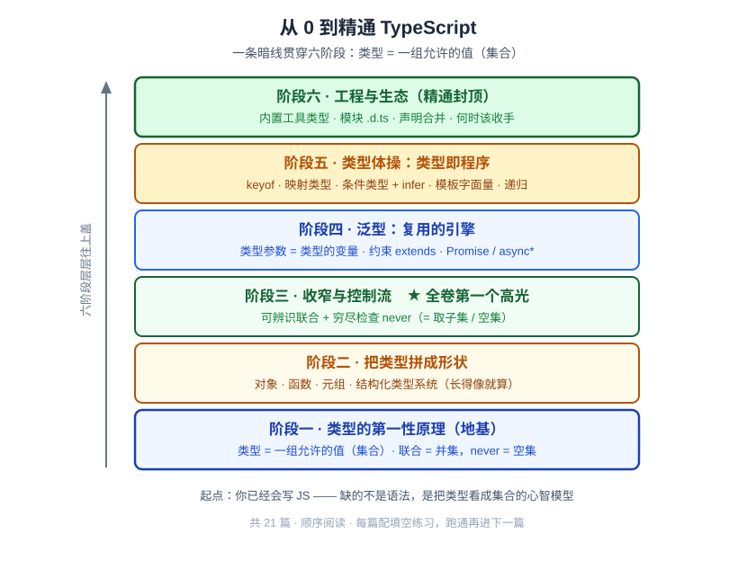

# 卷首语：给会写代码的人，补一门类型课

> 全栈工程师的大模型学习笔记 · 独立系列《从 0 到精通 TypeScript》· 卷首语

你已经写了很多年代码。JS 你闭着眼睛都能撸，React、Node、SQL 一路打通。可一碰 TypeScript，你心里有个说不出口的小尴尬——**你是靠"红线消了就算过"在写 TS**：

- `any` 一把梭：类型太烦，`: any` 一贴，世界清净。
- `as` 硬转：编译器不服？`as SomeType` 摁下去，它就闭嘴了。
- 泛型：别人写的 `Array<T>`、`Promise<T>` 你看得懂，可让你自己写一个带 `<T>` 的函数，就卡壳。
- `.d.ts`、`infer`、`keyof`、条件类型：看到就想绕，报错了就复制粘贴 Stack Overflow。

这不是因为你不会写代码——你显然会。**是因为你没有类型系统的心智模型。** 你把 TypeScript 学成了一堆互不相干的语法开关：这个符号干这个、那个关键字干那个，记一个是一个。碎片多了，自然发怵。

这一卷来治这个病。**我们不背语法，我们建模型。**

---

## 一、这一卷给你一把钥匙

整卷我只让你记住一句话，然后你会发现后面所有东西都是它的变奏：

> **一个类型 = 一组允许的值（一个集合）。**

`string` 不是"字符串这个标签"，它是**所有字符串组成的那个集合**。`42` 这个字面量类型，是**只装着一个值 `42` 的单元素集合**。一旦你把"类型"重新看成"集合"，TypeScript 里那些吓人的特性会一个接一个塌缩成你早就懂的集合运算：

| 你以为的语法 | 其实是集合运算 |
|---|---|
| 联合类型 `A \| B` | 求**并集** |
| 类型收窄（narrowing） | 从大集合**取子集** |
| `never` | **空集**（一个值都没有的类型） |
| 字面量类型 `"red"` | **单元素集** |
| 条件类型 `T extends U ? X : Y` | 对集合做**判断分支** |
| 交叉类型 `A & B` | 求**交集** |

这就是这一卷的暗线。它像概念系列里那句"`f(x)` 是个会抖的概率函数"、像实战卷里那"三根柱子"——**一句话，把一地碎片焊成一个整体。** 你现在觉得 TS 特性又多又杂，学完这一卷，你会觉得它们其实是同一件事的不同长相。

---

## 二、路线图：从第一性原理爬到类型体操

我们分六个阶段往上爬，每一阶都踩在前一阶的肩膀上：

- **阶段一 · 类型的第一性原理**：把"类型 = 集合"这块地基夯死——注解 vs 推断、编译期擦除、原始/字面量/联合类型。
- **阶段二 · 把类型拼成形状**：对象类型、`interface` vs `type`、函数类型、数组元组、以及 TS 最反直觉的一点——**结构化类型系统（长得像就算数）**。
- **阶段三 · 收窄与控制流**：类型不是死的，它会随代码"变窄"。这一阶的 **可辨识联合 + 穷尽检查（`never`）** 是全卷第一个高光点，也正是你读实战卷"归一化事件流"时卡住的那块。
- **阶段四 · 泛型：复用的引擎**：把"类型参数"理解成"类型的变量"，泛型就不再是天书。落到 `Promise<T>`、`async function*` 这些你天天用却没吃透的东西上。
- **阶段五 · 类型体操：类型即程序**：`keyof`、映射类型、**条件类型 + `infer`**、模板字面量类型、递归类型。到这一阶你会亲手造出 `Partial`、`Pick` 这些"内置魔法"——它们没有魔法，全是集合运算。
- **阶段六 · 工程与生态**：内置工具类型全景、模块与 `.d.ts`、声明合并，以及最重要的一课——**类型体操的边界与代价：什么时候该收手。** 精通不是把一切都写成类型体操，而是知道何时停。

**共 21 篇，顺序阅读，每篇踩着上一篇长。** 别跳读——阶段五的体操之所以能"塌缩成集合运算"，全靠阶段一那块地基。

---

## 三、这一卷是"边读边写"的

**光读会点头，一写就废。** 类型体操尤其如此：你读条件类型的例子觉得"嗯有道理"，自己一敲键盘就发现根本写不出来。所以这一卷跟纯讲解的博客不一样——**它配一套你必须亲手填的练习。**

- 练习是一个**累积仓库** `code/ts-course/`，每章一个练习包 `tsNN-<slug>/`。
- 每个练习包里有一份 **`exercises.ts`**：我把题目挖好空，留下 `// TODO` 和一开始**故意报错的断言**。**空壳我搭，肉你自己长。** 你填对了，红线才消。
- 两种验证，跑一下就知道对没对：
  - **运行时题**（前四阶段居多）：`bun test tsNN` 跑绿就算过。
  - **类型题**（阶段五体操主力）：用 `Expect<Equal<你写的, 期望的>>` 这种断言，**`tsc --noEmit` 不报错 = 你答对了**。这是 `type-challenges` 那套玩法，`Expect`/`Equal` 工具类型本身也是教材，我们会亲手写。
- 每个练习包配一份 **`solution.ts`** 参考答案，**单独放**——你先自己做，卡住了再对答案，别偷看。

节奏就是三拍：**博客把原理引导你想通 → 你去做该章练习包 → 卡住回来问 / 做完对答案。** 博客管"想明白"，练习管"手熟"。两样都到位，才叫真的会。

环境零负担：跟你读实战卷时一样用 **Bun**（`bun test` + `tsc --noEmit`），不装任何额外依赖。每章做完可以打个 tag `ts-ch<NN>` 方便回溯。

---

## 四、几句先说清的约定

**这一卷假设你 JS 已经扎实。** 变量、循环、函数、闭包、`Promise`、解构——这些 JS 通用基础我**不铺**，直接从 TypeScript 独有的类型层讲起。你要是这些还没稳，先补 JS，再回来。

**这一卷和实战卷里的 `实战00a`/`实战00b` 不冲突、不重复。** 那两篇是实战卷的"够用就走"版——只讲读懂 harness 代码**当下需要**的那点 TS，快进快出。**这一卷是从 0 系统深讲的独立卷**，两者定位不同、并存。你可以把 00a/00b 当"应急速查"，把这一卷当"打地基"。

**类型体操不是炫技。** 这一卷会一路推到条件类型、`infer`、递归类型——但我到最后一章会明确告诉你**它们的代价和边界**。真实工程里，一段没人看得懂的类型体操，往往不如一行老实的 `any` 加一句注释。精通的标志，是知道什么时候**不**用它。

**还是引导式。** 跟之前的系列一样，每篇我不会上来就把结论塞给你，而是先带你一步步想通再落地。练习必须**亲手跑**——看着答案点头不算学会。

---

## 小结

- 这一卷是独立系列《从 0 到精通 TypeScript》：**不背语法，建模型。** 一把钥匙贯穿全卷——**类型 = 一组允许的值（集合）**，联合是并集、收窄是取子集、`never` 是空集、条件类型是对集合做判断。
- 六阶段往上爬：第一性原理 → 拼形状 → 收窄与控制流 → 泛型 → 类型体操 → 工程与边界。**共 21 篇，顺序阅读。**
- **边读边写**：练习进累积仓 `code/ts-course/`，我搭空壳、你填空，`bun test` / `tsc --noEmit` 验证，`solution.ts` 自查。
- 约定记牢：① 假设你 **JS 已扎实**，不铺 JS 基础；② 和实战卷 00a/00b **并存不重复**，那是速查、这是地基；③ 类型体操**有边界有代价**，最后一章讲何时收手；④ 引导式，练习**亲手跑**。

下一篇——**ts01《类型是什么：一组允许的值》**：我们先干一件看起来很小、其实决定一切的事——**把"类型"这个词重新定义一遍**。你以为类型是 `string`、`number` 这些标签，学完这一篇你会改口：类型是一个**集合**。这块地基一夯死，后面六阶段的楼才盖得起来。

钥匙给你了。开爬。
