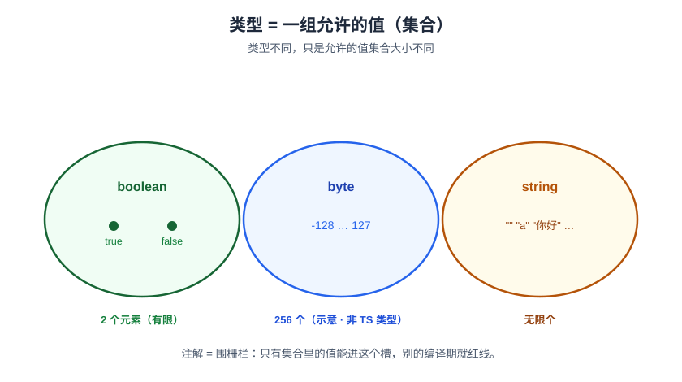
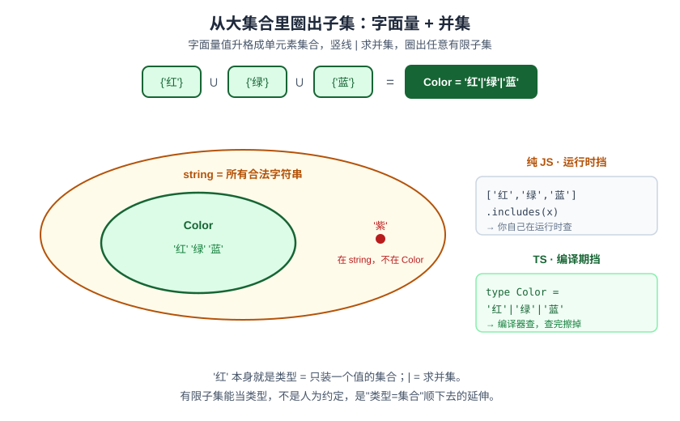
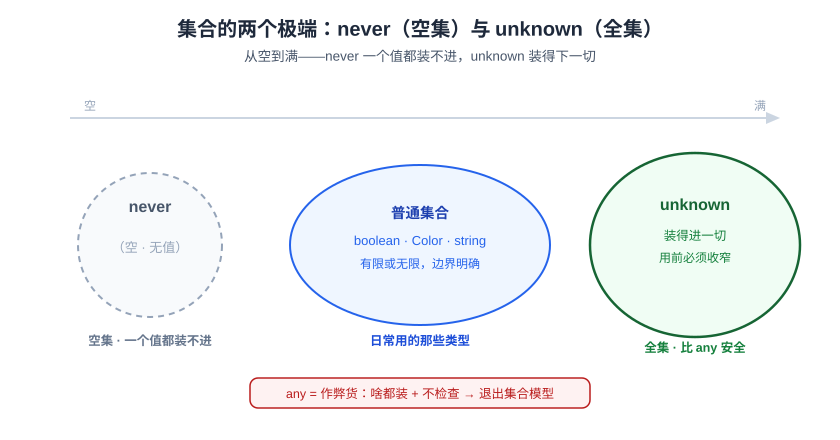

# ts01 类型是什么：一组允许的值

> 独立系列《从 0 到精通 TypeScript》· 阶段一 · 第 1 篇 · 全程拿 JS 当锚

学 TypeScript 最常见的开局，是有人甩给你一张表：`string`、`number`、`boolean`、`any`、`unknown`、`never`……然后你一个一个背。背完你会了语法，却没有**心智模型**——碰到 `'red' | 'green'`、`infer`、条件类型就懵，因为它们看起来不在那张表里。

这一篇我们不背表。我们把"类型"这个词**重新定义一遍**，定义完你会发现：后面那些最让你懵的特性——联合、交叉、收窄、条件类型——大多是这一个定义的变奏。

先说结论，整卷的绳子就这一句：

> **一个类型 = 一组允许的值（一个集合）。**

下面我们一步步把它推出来——你在对话里其实已经自己推过一遍了，这里落成文字。

---

## 一、类型 = 一组允许的值

先站在你最熟的**纯 JS** 上。JS 里写 `let x`，这个槽**什么值都能塞**：字符串、数字、对象、`null`，没人拦你。

现在你给它加上 TS：

```ts
let flag: boolean
```

TS 做的事只有一件：**在这个槽上围一道栅栏，规定"只准 `true` 和 `false` 这两个值进来"。**

所以 `boolean` 到底"是"什么？把"类型/标签"这个词扔掉，你会发现它就是一个**集合**：

```
boolean = { true, false }          // 正好 2 个元素
```

顺着数下去，每个类型都是集合，区别只在**大小**：

```
boolean = { true, false }                    // 2 个
byte    = { -128, -127, …, 126, 127 }        // 256 个（2⁸），有硬边界
string  = { "", "a", "b", …, "你好", … }     // 无限个，但仍是"所有合法字符串"这一堆
```

> ⚠️ 说明：`boolean` 和 `string` 是**真实的 TS 类型**；中间的 `byte` 是**借来的例子**——JS/TS 里根本没有 `byte` 类型（`number` 是 64 位浮点、是无限集），这里只借它"256 个值、边界写死"来演示一个"比 2 大、但仍然有限"的集合。别真去写 `let b: byte`。

有限也好、无限也好，**它们全是集合**。大小不重要，"是一堆被允许的值"这件事才是本质。



这就是地基。刻死它：**类型注解不是贴标签，是给槽围栅栏、圈定一个允许的值集合。**

---

## 二、既然是集合，任意有限子集就能当类型

集合这个视角，马上让你干一件**纯 JS 干不了**的事。

在 JS 里，`'红'`、`'绿'`、`'蓝'` 只是三个普通字符串值。你想强制"这个变量只能是这三个之一"，JS 帮不了你——你只能**运行时自己查**：

```js
// 纯 JS：只准三个,这条规矩活在运行时的数组里,靠你自己查
if (!['红', '绿', '蓝'].includes(x)) {
  throw new Error('非法颜色')
}
```

TS 因为把类型看成"允许哪些值"，而 `'红'` 本身就是一个合法值，于是它允许你**直接给"恰好这三个值"的集合起个名，当类型用**：

```ts
type Color = '红' | '绿' | '蓝'

let c: Color = '红'   // ✅ 在集合里
c = '紫'              // ❌ 编译期就红线：'紫' 不在这个集合里
```

这里有个纯 JS 没有、TS 独有的动作：**一个字面量值，本身可以升格成类型**。`'红'` 作为类型，意思是"只装着 `'红'` 一个值的**单元素集合**"。单个值能当类型，再用 `|`（读作"或"）把它们并起来，你就能圈出**任意有限子集**。

> ⚠️ 动手先别踩坑：`let c = '红'` 推出来的类型是 `string`，**不是** `'红'`（这叫"拓宽 widening"，下一篇 ts02 专门讲）。想真的拿到单元素集合，要么显式注解 `let c: '红'`，要么用 `const c = '红'`。

`|` 在这里的数学身份，就是**集合求并集**：

```
'红' | '绿' | '蓝'  =  {'红'} ∪ {'绿'} ∪ {'蓝'}  =  {'红','绿','蓝'}
```



**同一个"只准三个"的规矩，两条路挡的时机根本不同**：纯 JS 那段 `includes` 守卫把检查搬到**运行时**（真会抛错）；TS 的 `type Color` 是纯类型，编译期就拦住，编译后**整个擦掉、运行时一行检查都不剩**。所以别误会——**字面量联合类型不会在运行时挡住 `'紫'`**，它挡在你写代码 / 编译那一刻；真跑起来的 JS 跟你"压根不做校验时会写的裸 JS"一样，零运行时开销。

> ⚠️ 一个值得先破的疑问：**"字面量能当类型"是不是 TS 拍脑袋定的人为约定？**
> 半对。三元素集合 `{'红','绿','蓝'}` 是**客观存在**的（它就是 string 大集合的一个子集），这不是约定。约定的只是"语言给不给你语法去指着它、给它起名"——纯 JS 不给，TS 给了。而且 TS 给这个语法**不是随手乱定**，是把"类型=集合"这个事实**顺下去的一致延伸**：既然单个值 `'红'` 存在，那"只装 `'红'` 的集合"当然也该能起名。
> 但也别把话说满：这样能圈的只是**有限**子集（把值一个个 `|` 起来）。像"所有偶数""长度为 3 的字符串"这类**无限**子集，虽然客观存在，字面量并集却写不出来——语言没给、也给不了一条有穷语法去描述它（后面阶段会讲怎么用别的手段近似）。这反而佐证了那句话：**客观的是集合本身，约定的只是"语法能圈出多少"。**

---

## 三、集合的两个极端：`unknown` 与 `never`

如果"类型=集合"是真的、而且 TS 把它贯彻到底，那它**必然**要处理两个极端：装下一切值的**全集**，和一个值都不装的**空集**。TS 两个都给了，没偷懒。

### 全集 = `unknown`

一个"什么值都装得进"的槽。TS 给它个诚实的名字 `unknown`：

```ts
let a: unknown = 42
a = '任何东西'   // ✅ 全集,啥都能塞
a.toFixed(2)     // ❌ 但取出来用之前,TS 逼你先检查/收窄,不查不让你用
```

它旁边还站着一个**作弊货 `any`**：`any` 也啥都装，但它把类型检查**全关了**，等于让你退回没类型的裸 JS。区别是：

- `unknown` = 老实的**全集**：装得进，但**用之前必须先收窄**（这正是它比 `any` 安全的地方）。
- `any` = "我不管了"：装得进，直接用也不拦，把安全网撤了。

**能用 `unknown` 就别用 `any`。** `unknown` 的"麻烦"（装得进、直接用不了）恰恰是它的价值。

### 空集 = `never`

一个值都塞不进的槽。听着像废物，其实是**全卷最优雅的零件**。它表示**"这里永远到不了 / 不可能发生"**。两个杀手级用途，先尝个味（细讲在后面）：

1. **穷尽检查**（阶段三的大主角）：一个联合类型，你把每种情况一个个处理掉，**处理干净后"剩下的"会塌成 `never`；要是你漏了一种，剩下的就不是 never，TS 当场红线**。等于编译器替你数"是不是每种情况都覆盖了"。

2. **永不返回的函数**：一个只会抛异常、永远不 `return` 的函数，它的返回值集合就是空集：

```ts
function boom(): never {
  throw new Error('我永远不会正常返回')
}
```

再记一条反直觉、但顺模型的性质（留到阶段三展开）：**空集是所有集合的子集** → 所以 `never` 能赋值给**任何**类型，但**任何**类型都赋不进 `never`。



---

## 小结

- **类型 = 一组允许的值（集合）**。类型注解不是贴标签，是给变量槽围栅栏、圈定允许的值集合。`boolean`={true,false}、`string`=无限集，大小不同，都是集合。
- **任意有限子集都能当类型**：字面量值能升格成单元素集合，`|` = 求并集，拼出任意有限子集（`type Color='红'|'绿'|'蓝'`）。纯 JS 只能运行时拿数组查；TS 写进类型层、编译期查、查完擦掉（运行时零检查）。这是把集合模型顺下去的一致延伸，不是人为约定；能圈的只是有限子集，无限子集（如"所有偶数"）字面量并集写不出来。
- **两个极端**：全集 `unknown`（装得进、用前必须收窄，比 `any` 安全）；空集 `never`（永不发生；穷尽检查主角；空集⊆一切）。
- 这条"类型=集合"的绳子，后面 20 篇一路复用：联合是并集、收窄是取子集、交叉是交集、条件类型是对集合做判断。

## 动手（必做）

这一篇的练习在 `code/ts-course/ts01/`。规则跟卷首语说的一样——**我搭空壳，你填空**：

- 打开 `exercises.ts`，里面的 `// TODO` 和一开始**故意报错**的 `Expect<Equal<…>>` 断言由你来填。
- 验证方式（本篇纯类型题）：在 `code/ts-course/` 下跑 `bun run typecheck`（即 `tsc --noEmit`），**一个错都不报 = 你全对**。
- 卡住了再看 `solution.ts`，别先偷看。

下一篇——**ts02《注解 vs 推断：谁来决定一个槽的集合》**：你写 `let n = 42`，没写类型，TS 却知道 `n` 是 `number`——它怎么猜的？什么时候该你手写、什么时候该让它猜？顺带把"类型在运行时到底还在不在"（编译期擦除）一次讲透。
