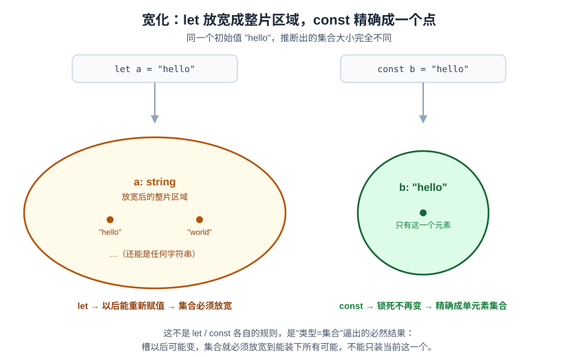
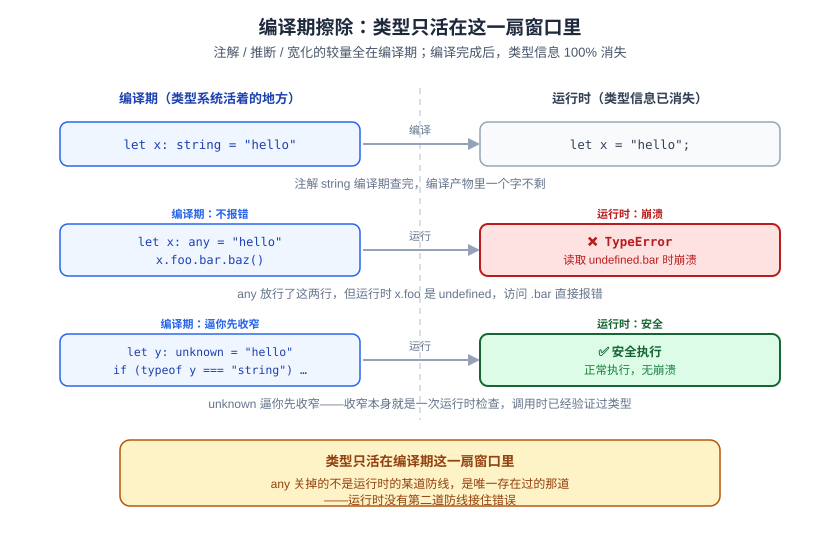

# ts02 注解 vs 推断：谁来决定一个槽的集合

> 独立系列《从 0 到精通 TypeScript》· 阶段一 · 第 2 篇 · 全程拿 JS 当锚

上一篇我们把"类型"重新定义成了**一组允许的值（集合）**：`boolean = {true, false}`、`Color = {'红','绿','蓝'}`。但你有没有注意到一件怪事——

```ts
let n = 42
```

这行代码**没写任何类型**，可你去编辑器里悬停看 `n`，它明明白白写着 `number`。没人告诉编译器"这是数字"，它是怎么知道的？

这一篇要拆开两件事：**推断**（编译器自己猜）和**注解**（你亲手写），谁在什么时候说了算；顺带解决 ts01 留的一个坑——`let c = '红'` 为什么推不出 `'红'` 这个单元素集合，反而推成了宽泛的 `string`。最后我们把"类型"这套东西挖到底：编译期查完之后，运行时它到底还在不在。

---

## 一、推断：有值可看的地方，编译器会自己猜

```ts
let n = 42
```

`42` 是一个具体的值，摆在编译器眼前。编译器往集合模型里一套：既然 `n` 的初始值是 `42`，那 `n` 这个槽至少得能装下 `42`——于是它自动给 `n` 圈了一个能装下这个值的集合。这个"自动圈集合"的动作，就叫**类型推断**：不用你写注解，编译器盯着初始值自己算。

前提就一条：**得有个具体值可看**。`let n = 42` 里 `42` 就是那个值。没有值的地方，推断就无从下手——这条留到第四节细说。

---

## 二、拓宽：推断留了一手（ts01 挖的坑，这里填上）

刚才"编译器盯着初始值自己算"听起来很老实，但试试这个对比：

```ts
let a = "hello"
const b = "hello"
```

两个初始值一模一样，但你去悬停看，`a` 和 `b` 的推断类型**不一样**：

```
a: string          ← 宽泛的"所有字符串"集合
b: "hello"          ← 只装一个值的单元素集合
```

为什么同样的值，推断结果差这么多？关键不在值，在**这个槽以后还能不能变**。

`a` 是 `let`，意味着后面完全可能出现 `a = "world"`。如果编译器把 `a` 锁死成单元素集合 `{"hello"}`，那 `a = "world"` 立刻就会红线——但这行代码在 JS 里天经地义，`let` 变量本来就该能重新赋值。编译器不敢把话说死，只好**放宽**成整个 `string` 集合，好让"以后可能变成的任何字符串"都有地方装。

`b` 是 `const`，从声明那一刻起就锁死了、这辈子不会再变。既然不会变，编译器没必要留余地，直接精确成单元素集合 `{"hello"}`——反正 `b` 永远也只会是这一个值。

这就是**拓宽（widening）**：`let` 的推断结果会从"一个点"跳到"点所在的整片区域"，`const` 则不用跳，原地精确。

回到 ts01 挖的那个坑：`let c = '红'` 也是 `let`，同一条规则套下去——`c` 以后能被重新赋值，编译器不敢把它锁死成单元素集合 `{'红'}`，只好放宽成整个 `string`。这就是为什么当时要么写 `let c: '红'`、要么换成 `const c = '红'`，才能真的拿到那个单元素集合。



> ⚠️ 这不是 `let`/`const` 单独的规则，是"类型=集合"逼出来的必然结果：**只要这个槽以后可能被塞进别的值，集合就必须大到能装下所有可能，不能只装当前这一个。** 记住这条，后面看到"函数参数默认也会拓宽""对象字面量属性会拓宽"之类的现象，都不用死记，套这条推一遍就懂。

---

## 三、注解：两件事——收紧推断结果，或者当检查关卡

拓宽是编译器的默认选择，但**默认不等于唯一选择**。如果你就是想要 `a`（还是 `let`，以后还能变），但只能被赋值成 `"hello"` 或 `"world"` 这两个之一，而不是任意字符串，你可以自己划集合边界：

```ts
let a: "hello" | "world" = "hello"
a = "world"   // ✅ 在集合里
a = "other"   // ❌ 编译期红线：不在 {"hello","world"} 里
```

**显式注解会盖过默认的拓宽推断**，把 `a` 的类型钉死成你写的那个——哪怕它是 `let`。这是注解的第一个身份：**收紧**（这里的"收紧"指声明时你划定的子集，跟阶段三要讲的"类型收窄 narrowing"是两回事——那个发生在运行时的控制流分支里，这里发生在编译期的声明那一刻）。

但注解不是"我说是啥就是啥、编译器全盘听你的"。试试这个：

```ts
let c: "hello" = "world"
//  ~~~~~~~~~~~~~~~~~~~~
//  error TS2322: Type '"world"' is not assignable to type '"hello"'.

let e: number = "hello"
//  ~~~~~~~~~~~~~~~~~~~
//  error TS2322: Type 'string' is not assignable to type 'number'.
```

注解 `"hello"` 对应的是单元素集合 `{"hello"}`，而 `"world"` 根本不是这个集合的成员——编译器直接拦下来，不会因为你"写了注解"就盲目放行。所以注解的第二个身份是：**给初始值设一道检查关卡**——你划定一个目标集合，编译器负责验证你塞进去的值是不是这个集合的成员。

一句话收：**推断是编译器根据值猜集合；注解是你划定集合，编译器反过来拿值核对集合。** 方向刚好相反，但骨子里都是同一件事——确定"这个槽允许哪些值"。

---

## 四、什么时候必须你手写：推断没有"值"可看

前三节的推断都发生在**变量初始化**这种场景——有个具体值摆在那，编译器才能猜。但换一种场景：

```ts
function greet(name) {
  console.log(name.toUpperCase())
}
```

`name` 是函数参数，声明的时候**没有任何初始值**——`name` 到底会是什么，要等**未来某次调用**才知道。这里没有值可看，推断的前提直接不成立。你猜 TS 会怎么办？会不会看到函数体里 `name.toUpperCase()` 这行，倒推出 `name` 应该是 `string`？

拿真编译器验证一下，答案很干脆：

```
error TS7006: Parameter 'name' implicitly has an 'any' type.
```

**不会反推。** 函数体里怎么用 `name`，编译器根本不当回事——因为函数定义的时候，谁会调用它、传什么值，编译器完全不知道，哪怕你在同一个文件里紧接着写了 `greet("hello")` 又写了 `greet(42)`，`name` 的类型依然被判 `any` 报错，跟这两次调用毫无关系。

这就摸到了推断和注解的**分界线**：

- **推断**：编译器**沿着一条已经写好的执行路径往前观察**，一步步攒出结论——`let n = 42` 只有一步，一眼就看穿；`let arr = []` 后面接连 `arr.push(1)`、`arr.push("hello")`，编译器就一路跟着这条路径，把类型攒成 `(string | number)[]`（这个"边走边攒"的特殊行为叫 evolving any，只在一条确定的路径上生效）。
- **注解**：一旦这个槽的值**不是沿着一条已知路径产生的，而是来自未来某个不确定的调用者**（函数参数正是如此——调用者可能是任何文件、任何时刻、传任何值），编译器没法"往前看"，因为压根没有"前"可看。这时候类型必须由你**现在就定好**，当成审查未来所有调用者的**契约**；不定的话，就会滑向那个"说谎的"类型 `any`（ts01 提过：装得进一切、也放行一切操作，安全网直接撤了）——`strict` 模式的 `noImplicitAny` 就是专门堵这个口子的。

> ⚠️ 番外：`let arr = []` 的"边走边攒"也不是无条件的。如果 `arr` 被另一个函数的函数体捕获（比如 `function useArr() { return arr[0].toFixed(2) }`），编译器一样会报错——因为 `useArr` 什么时候被调用是不确定的，"到那时 `arr` 攒成什么样"编译器同样看不到头。判断标准从来不是"在不在同一个文件"，而是**这个值的确定过程，是不是走在一条编译器看得到终点的路径上**。

![推断的边界：左边 let arr = [] 沿着 arr.push(1)、arr.push("hello") 这条编译器亲眼看得到终点的路径边走边攒类型；右边函数参数 name 的值来自未来某个不确定的调用者，编译器没有路径可看，只能要求你现在就写注解当契约，否则滑向 any 并报错](assets/img/ts02-inference-boundary.svg)

---

## 五、编译期擦除：这一整套较量，运行时还在不在

推断也好、拓宽也好、注解也好，读到这里你可能会问：这些"类型"较量完之后，**运行时**还剩下什么？

拿前面那两行去编译看看：

```ts
let a = "hello"
const b = "hello"
```

编译成 JS 之后：

```js
let a = "hello";
const b = "hello";
```

——一个字都没提到类型。`string`、`"hello"` 这些集合的名字，编译期查完就**全部擦除**，编译产物里连痕迹都不留。这就是**编译期擦除**：TypeScript 的类型系统只存在于"你写代码、编译器检查"这段窗口期，一旦编译完成，运行时的 JS 引擎从来没听说过"类型"这回事。

这也是为什么 `any` 格外危险。回忆 ts01："`unknown` 装得进一切但用前必须收窄；`any` 装得进一切、用的时候也不拦"。现在你知道原因了——`any` 关闭的不是"运行时的某道防线"，它关闭的是**唯一存在过的那道防线**，因为运行时压根没有第二道：

```ts
let x: any = "hello"
x.foo.bar.baz()   // 编译期：不报错（any 不检查）
```

这行代码编译期一路放行，但真的跑起来：`x.foo` 是 `undefined`，`undefined.bar` 直接抛出运行时的 `TypeError: Cannot read properties of undefined (reading 'bar')`——一个编译器本该在你写下这行代码的瞬间就拦住的错误，因为用了 `any`，硬生生拖到运行时才炸。



**一句话收尾：类型只活在编译期这一个窗口里。** 注解和推断吵的，是"这个窗口期该由谁划定集合边界"；`any` 吵赢的方式是"直接把窗户关了"——关完之后，运行时的世界对你写没写过类型，一无所知。

---

## 小结

- **推断**：有具体初始值可看的地方（`let n = 42`），编译器自动圈出能装下这个值的集合，不用你写注解。
- **拓宽**：`let` 允许以后重新赋值，推断结果会从"一个点"放宽成"一整片区域"（`string`）；`const` 锁死不变，推断结果精确成单元素集合。这是"类型=集合"逼出的必然结果，不是 `let`/`const` 各自死记的规则。
- **注解**两种身份：① 收紧默认的拓宽结果（`let a: "hello"|"world"`）；② 给初始值设检查关卡——注解划定目标集合，编译器核对你塞的值是不是这个集合的成员，不是盲目照单全收。
- **推断的边界**：只在"沿一条编译器看得到的路径往前观察"时成立（变量初始化、`let arr = []` 的 evolving any）。一旦这个槽的值来自**不确定的未来调用者**（函数参数、被另一个函数体捕获的变量），编译器没有"前"可看，类型必须由你现在就定好当契约，否则滑向 `any`。
- **编译期擦除**：类型系统只存在于编译这个窗口期，编译产物里类型信息 100% 消失。`any` 的危险之处，正是它关掉了运行时唯一会有的那道检查——关掉之后没有第二道防线。

## 动手（必做）

这一篇的练习在 `code/ts-course/ts02/`。规则跟以往一样——**我搭空壳，你填空**：

- 打开 `exercises.ts`，里面的 `// TODO` 由你来填，包括几处要你自己动手验证"报不报错"的断言。
- 验证方式（本篇有类型题也有需要观察报错信息的题）：在 `code/ts-course/` 下跑 `bun run typecheck`（即 `tsc --noEmit`），**一个错都不报 = 你全对**。
- 卡住了再看 `solution.ts`，别先偷看。

下一篇——**ts03《原始类型 · 字面量类型 · 联合类型：把集合拼成更精确的形状》**：这一篇我们已经用 `Color = '红'|'绿'|'蓝'` 尝过并集的味道，下一篇把原始类型的全景摊开，正式把"任意有限子集都能当类型"这件事用透，为阶段二"把类型拼成形状"打地基。
