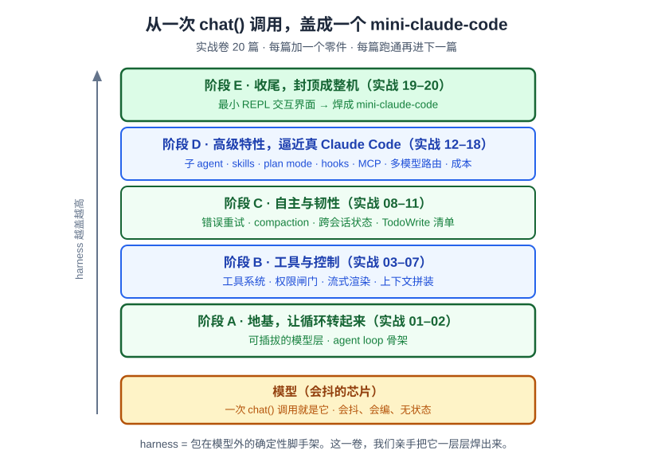

# 卷首语：我们要亲手焊一台 harness

> 一个全栈工程师的大模型学习笔记（第六阶段 · 实战卷 · 卷首语）

前面二十五篇正文加两篇番外，我们把大模型这台机器从里到外拆了个遍：从 `f(x)=kx+b` 到 Transformer、从预训练到 RLHF、从 KV Cache 到 RAG、从工具调用到多 Agent 编排。

到番外《什么是"工程"？从 Prompt 到 Harness》那篇，我给这一整套"包在模型外面的确定性脚手架"起了个业界名字——**Harness**，并撂下一句话：

> `Agent = Model + Harness`。你只要不是那个模型，你就是 harness。

但那一篇讲的是**为什么**：为什么需要 harness、它由哪三根柱子焊成、拆开来有哪些零件。**它没让你写一行 harness 的代码。**

这一卷来还这笔账——**我们真的从 0 写一个。**

---

## 一、这一卷要干成一件什么事？

一句话：**从一次模型调用，一层层盖成一个你日常能用的 mini-claude-code。**

看这张图。最底下那块琥珀色的，是**会抖的模型**——一次 `chat()` 调用就是它，会抖、会编、无状态（回扣番外《这颗"大脑"和你的不一样》）。往上，我们一层一层盖 harness：

- **阶段 A · 地基**：让循环转起来——可插拔的模型层 + agent loop 骨架。
- **阶段 B · 工具与控制**：工具系统、权限闸门、流式渲染、上下文拼装。
- **阶段 C · 自主与韧性**：错误重试、compaction、跨会话状态、TodoWrite。
- **阶段 D · 高级特性**：子 agent、skills、plan mode、hooks、MCP、多模型路由、成本统计——逼近真 Claude Code。
- **阶段 E · 收尾**：包一个最小 REPL，焊成整机。

**共 20 篇，每篇只加一个零件**，每篇都有真实可跑的 TypeScript 代码。你跑通当篇，再进下一篇。到最后，`code/harness/` 会是一个能完成真实改码任务的 mini-claude-code——而它的每一层，都是你亲手焊的。

---

## 二、每篇都有双重价值

这一卷跟前面的概念系列**互补**，不重复：

| | 概念系列（01–31） | 实战卷（本卷） |
|---|---|---|
| 回答 | **为什么**（原理） | **怎么真的写出来** |
| 代码 | JS 伪代码，示意为主 | **真实可运行的 TS**，跑通再走 |
| 独有环节 | 引导式推导 | **🔬 翻开真实源码对照** |

所以每读一篇，你拿到两样东西：

1. **自己动手写的那一层** —— 从一次调用，逐步长成能日常用的 harness。
2. **读懂真实的 Claude Code** —— 每篇末尾翻开真实（还原）源码，看真实工程比我们的简化版**多做了什么、为什么**。这正是番外 17b 那句"工程 = 约束下的权衡"的活体标本：我们的简化版做了权衡，真实源码也做了权衡，只是约束更狠。

**卷级分工铁律**：概念系列回答"为什么"，实战卷回答"怎么写 + 翻源码"。所以实战篇**不重新推导概念篇已经推导过的"为什么"**——比如实战02 不再重推"为什么 agent loop 是 while + 停止条件"（那是概念24 的事，直接回扣），只做代码落地 + 翻源码看真实多做了什么。

每篇的节奏原则上是三段式，但它是**弹性模板不是刚性公式**：有设计折叠点的篇（loop / 权限 / compaction / 路由）走完整引导式推导；纯基础设施篇（流式 / hooks / MCP / REPL）允许降级成"需求 → 协议讲解 → 代码 → 翻源码"，不硬凑假问答。

---

## 三、三条必须先说清的诚实声明

这一卷有三处地方，如果不提前交代，你跑到一半会踩坑或被误导。**我宁可啰嗦也先说死。**

### 声明一：源码是"逆向还原"，不是上游原始态

我们对照的源码放在 `/Users/weifengzhu/work/ai/claude-code-rev`，一个 Bun 项目。但它是**通过 source map 逆向还原 + 补齐缺失模块**得到的，**不是 Anthropic 上游的原始代码**。这意味着：

- 里面有**兼容 shim 和降级实现**。比如 `src/query/transitions.ts` 就是个 3 行的 no-op 空壳。
- 凡是引用到还原降级的地方，我会**明确标注**"此处为还原实现，可能与线上真实行为有出入"。
- 每次引用源码，我都**实际打开当前内容验证**，不靠文件名臆测、不凭记忆断言。（这份设计稿初版就因为臆测源码位置被审核抓出 10 多处锚点错位——是这条纪律的反面教材。）

所以你看到的"源码对照"是**尽力还原的对照**，方向可信、细节可能有还原噪声。我会诚实标注哪些是哪些。

### 声明二：provider 可插拔，是本卷自创的抽象

这一卷的模型层做成**可插拔**：你可以用 Anthropic 官方 API，也可以用任何 OpenAI 兼容端点（比如 GLM）。**用你自己有 key 的那家验证就行。**

但你要知道：**这是本卷自创的简化抽象，不是源码还原。** 真实源码是 **Anthropic-only**——121 个文件 import `@anthropic-ai/sdk`；它那个 `APIProvider = firstParty | bedrock | vertex | foundry` 四选一，指的是 Anthropic 协议的四种**承载通道**（直连 / AWS Bedrock / GCP Vertex / Azure Foundry），**不是 OpenAI 兼容层，也不是协议归一层**。

所以我们的 `ModelProvider` 归一层是**给读者方便造的扩展**。翻源码时我会点破这个差异，不含糊。

### 声明三：教学级"全量"，不是生产级健壮

这一卷覆盖 Claude Code 的**核心 14 类特性**——loop、工具、权限、流式、compaction、状态、子 agent、skills、plan mode、hooks、MCP、多模型路由、成本、REPL——但每个零件都做**最小可运行实现**，然后讲清真实工程多做了什么。

举例：bash 工具我们只做最小执行，真实源码那上万行的 BashTool（光命令语义解析就 2600 多行）我们只对照不复刻；MCP 我们只做 stdio 传输的列/调工具闭环，不碰 websocket/OAuth；TUI 我们用现成的库包一个最小 REPL，真实那两万行自研渲染层只翻不抄。

**验收标准是"功能存在且你能跑通"，不是"每个零件都达到生产级健壮"。** 差距本身，就是最好的教学点。

---

## 四、怎么读这一卷

- **运行时用 Bun**（源码本身就是 Bun 项目，最贴近）。你本地先装好 `bun`，每篇的运行命令统一是 `bun run`。
- **代码是一个累积仓库** `code/harness/`：第 N 章 = 第 N-1 章 + 一个新零件，不是每章从头抄一遍。
- **每章末打 git tag**（如 `harness-ch04-permission-gate`）。想跑某一章末的状态：`git checkout harness-ch<NN>-<slug>`，按那篇的验证步骤跑通。
- **阅读是顺序的**：每篇都在上一篇的基础上长，别跳读。tag 是用来做"运行态隔离验证"的，不是用来跳着看的。
- 有一处叙事张力先打预防针：引入"流式"（实战05/06）时，会把实战02 的非流式 loop **重构成流式**——那是**重塑主干**，不是"加一个零件"。到那篇我会明说。

---

## 小结

- 这一卷是概念系列的**第六阶段 · 实战卷**：概念讲**为什么**，实战讲**怎么写 + 翻源码**，互补不重复。
- 目标：**从一次 `chat()` 调用，20 篇一层层盖成一个能干真实改码任务的 mini-claude-code**。每篇一个零件、真实可跑的 TS、跑通再走。
- 三条诚实声明记牢：① 源码是**逆向还原**、非上游原始态，降级处会标注；② provider 可插拔是**本卷自创**、真源码 Anthropic-only；③ 每个零件是**教学级最小实现**、非生产级健壮，差距即教学点。
- 用 **Bun**，代码进 `code/harness/` 累积仓库，每章末打 tag，顺序阅读。

下一篇——**实战01《第一次对话：可插拔的模型层》**：我们先不写循环、不写工具，只干一件事——**发一句话给模型，拿到回复**，并把这一步写成一个**换个 key 就能切换后端**的可插拔模型层。那是整台 harness 最底下、会抖的那块芯片。

焊台准备好了。开工。
