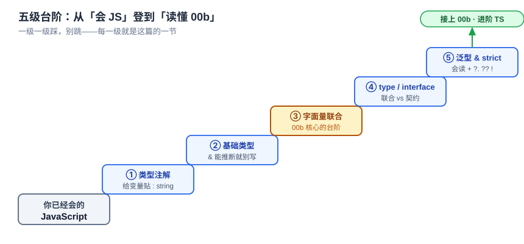

# 番外：先给 TypeScript 打地基（写给会 JS 的你）

> 一个全栈工程师的大模型学习笔记（第六阶段 · 实战卷 · 番外）

你是全栈，JavaScript 是老本行。但这一卷的代码是 **TypeScript**。下一篇番外（00b）会拿真实的 `spike.ts` 当解剖标本，逐行讲「读懂 harness 要的那些 TS」——可那篇有个隐含前提：**你手里已经有 TS 的地基。**

这篇就是来打这个地基的。它**不碰 spike.ts**，只用你能随手敲进一个文件、`bun run` 一下就看到结果的最小例子。目标只有一个：**让你从「会 JS」平滑迈到「能读 TS」**，然后再进 00b 看真代码就不慌了。

一句话定位：**你已经会的 JS 一个字都不作废，TS 只是在上面加了「一层类型标签」。** 这篇讲的全是那「一层」。



看这张台阶图。最左边是**你已经会的 JS**，往右上每一级台阶就是这篇的一节，登到顶就接上 00b。**一级一级踩，别跳。**

---

## 一、先装一个心智模型：类型是"编译期的脚手架"

如果你只从这篇记住一句话，记这句：

> **TypeScript = JavaScript + 一层只在编译期存在的类型。运行时，类型被 100% 擦掉。**

这句话能治好新手八成的困惑。看这张图：


比如这行 TS：

```ts
type Msg = { role: 'user' | 'assistant'; content: string }
const m: Msg = { role: 'user', content: '你好' }
```

它编译（或 Bun 转译）之后，`type Msg` 这行**整条没了**，`: Msg` 这个标注也被**剥掉**，剩下的就是一段普通 JS：

```js
const m = { role: 'user', content: '你好' }
```

类型的作用发生在**你按下运行之前**：编辑器和类型检查器拿它帮你抓错——把 `role` 写成 `'system'` 会立刻标红，因为它不在 `'user' | 'assistant'` 里。运行时呢？类型早擦光了，帮不上也拦不住。

**记住这个边界**：类型帮你在**写代码时**不犯低级错，但它**管不住运行时的数据**。等实战里模型吐回来一坨 JSON，你标了 `content: string` 不代表模型真给你 string——运行时该 `parse`、该校验一样不能少。这条到 00b 和实战03 会反复撞见，先记着。

---

## 二、三分钟跑起来：建一个 `.ts`、让它动

光看不练没用。你已经装了 `bun`（卷首语里让你装的），现在建一个文件 `hello.ts`：

```ts
function greet(name: string) {
  return `你好，${name}`
}

console.log(greet('全栈'))
```

跑它——**不用先编译**：

```bash
bun run hello.ts
# 你好，全栈
```

这就是第一处「TS 跟 JS 不一样」的体感：`bun run` 直接吃 `.ts`，当场把类型标注剥掉、跑剩下的 JS（为什么 Bun 能这样、别的运行时行不行，是 00b 生态层的话题，这里先只管跑通）。

现在**故意写错**，把最后一行改成传个数字：

```ts
console.log(greet(42))   // 42 不是 string
```

你的编辑器会立刻在 `42` 下面标红：`Argument of type 'number' is not assignable to parameter of type 'string'`。**这就是类型在编译期替你抓错**——你还没跑，它就拦住了。

⚠️ 但这里有个**新手必踩的坑**：`bun run hello.ts` **照样能跑起来**，还真打印出 `你好，42`。因为 Bun 只「擦类型」、不「查类型」——它把红线当耳边风。真正查类型的是**编辑器**和一条手动命令 `tsc --noEmit`（只检查、不产文件）。

> 先立一根弦：**能跑 ≠ 类型没错。** 这根弦到 00b §生态层会展开，这里先有个印象就够。

---

## 三、给 JS 变量贴标签：类型注解基础

TS 干的第一件事，就是给 JS 的变量、参数、返回值**贴标签**——在名字后面加个 `: 类型`：

```ts
let title: string = '实战卷'
let count: number = 20
let done: boolean = false

function repeat(text: string, times: number): string {
  return text.repeat(times)
}
```

- 参数 `text: string`、`times: number`：贴上标签后，谁传错类型，编译器当场报错。
- 返回值 `: string`：声明「我保证吐出来的是 string」。

**几个基础类型**，你在 JS 里早认识，只是现在有了名字：

```ts
let s: string          // 字符串
let n: number          // 数字（TS 不分 int/float，就一个 number）
let b: boolean         // 布尔
let arr: string[]      // 字符串数组，等价写法 Array<string>
let obj: { id: number; name: string }   // 对象：每个字段各自贴标签
```

**一个重要习惯——能推断就别写**。TS 很聪明，很多时候你不标它也知道：

```ts
let title = '实战卷'        // TS 自动推断 title 是 string，不用写 : string
const nums = [1, 2, 3]      // 自动推断 number[]

function double(n: number) {  // 参数要标，但返回值不标——
  return n * 2                // TS 自己推断出返回 number
}
```

参数**通常要标**（TS 猜不到调用方会传啥），但变量初始化、返回值这些**能推断的就别硬写**。这跟你写 JS「能省则省」的直觉一脉相承——别把 TS 写成到处贴标签的裹脚布。

---

## 四、联合类型 & 字面量联合（00b 的关键台阶）

这一节格外重要——它是 00b 那个「全卷最核心一招」的**前置台阶**，慢一点读。

JS 里一个变量常常「可能是这个、也可能是那个」。TS 用一根竖线 `|` 把这件事**写进类型**，叫**联合类型**：

```ts
let id: string | number      // id 要么是 string，要么是 number
id = 'abc'                    // ✅
id = 42                       // ✅
id = true                     // ❌ 报错：boolean 不在联合里
```

更狠的是，`|` 两边可以不是「类型」而是**具体的值**——这叫**字面量联合类型**：

```ts
let role: 'user' | 'assistant'    // 只能是这两个字符串之一
role = 'user'                     // ✅
role = 'system'                   // ❌ 报错：'system' 不在允许的值里
```

看出门道了吗？`role` 的类型不是「任意 string」，而是**穷举出来的两个合法值**。写错一个字母，编译器立刻拦你。这在 JS 里只能靠注释和脑子记，TS 把它变成编译器的硬约束。

**为什么说它是台阶？** 因为 harness 里到处是「一个东西只可能是有限几种形态之一」：一个流式事件要么是文本、要么是工具调用、要么是结束……00b 会把字面量联合再往上叠一层，变成「可辨识联合」——那是归一化两家模型的核心武器。你现在把 `'user' | 'assistant'` 这一级踩稳，到那儿就顺。

---

## 五、`type` 还是 `interface`？

你会看到两个都能「描述一个对象长啥样」的关键字。先看它们怎么用：

```ts
// 用 type
type Point = { x: number; y: number }

// 用 interface
interface User {
  id: number
  name: string
}
```

九成场景两者可以互换。区别在**各自擅长的方向**：

| | `interface` | `type` |
|---|---|---|
| 擅长 | 描述**对象/类的契约**（"谁实现我，就得长这样"） | **联合类型**、类型别名、元组 |
| 能表达 `A \| B` 联合 | ❌ | ✅ |
| 能被 `class implements` | ✅ | ✅（但联合类型不行） |

**够用的经验法则**：

- 描述**一个契约、一个类要去实现的对象形状** → 用 `interface`。
- 只要涉及**联合类型或类型别名**（比如第四节那个 `'user' | 'assistant'`，或几种形态五选一）→ 只能用 `type`，`interface` 表达不了联合。

记住这条法则就行。到 00b 你会看到 spike.ts 里两个都用了，且正是按这条法则分工的——那时回头看就懂了。

---

## 六、泛型：会读就行，不用自己写

TS 代码里到处是尖括号 `<>`，别怕。它们是**泛型（generics）**——你把尖括号读成**「这个容器装的是什么」**就行：

```ts
const ids = new Set<number>()          // 装 number 的 Set
const cache = new Map<string, number>() // 键是 string、值是 number 的 Map
```

你天天用的 JS 结构，加上尖括号就是「说清里面装什么」：

- `Array<string>`（= `string[]`）——装 string 的数组。
- `Map<K, V>`——`cache.get('x')` 返回 `number | undefined`（**可能没这个键**，编译器逼你考虑取不到的情况，回扣第七节）。
- `Promise<T>`——`async` 函数的返回值，`T` 是 `await` 之后拿到的东西。比如 `Promise<string>`，`await` 完得到一个 string。

**这一卷你几乎不需要自己定义泛型**，但要能一眼读懂 `Map<K, V>`、`Promise<T>` 这种「容器装什么」。会读，就够进 00b 了。

---

## 七、strict 模式三件套：`?.` / `??` / `!`

这一卷的 `tsconfig` 开了 `strict`（还有个 `noUncheckedIndexedAccess`）。它会让编译器更啰嗦，但每条啰嗦都在替你堵 JS 里最常见的运行时崩溃——那些 `Cannot read property 'x' of undefined`。

先看一个 harness 里的典型场景：从一个可能不存在的地方取值。

```ts
const first = list?.[0]     // 为什么要这一堆问号
if (!first) return
console.log(first.name)
```

**① `?.`（可选链）**——JS 你已经会：`a?.b` 表示「`a` 是 null/undefined 就整体返回 undefined，不报错」。TS 里它和判空配合尤其顺手（配合后编译器怎么"顺着你的判断收紧类型"，00b 会展开）。

**② `??`（空值合并）**——也来自 JS，但要跟 `||` 分清楚：

```ts
const port = input ?? 3000   // input 是 null/undefined 才用 3000
const bad  = input || 3000   // input 是 0 或 '' 也会被替成 3000 ← 常见 bug
```

`??` **只在 null/undefined 时兜底**，`0` 和 `''` 会照常保留；`||` 会把 `0`/`''` 也当假值替掉。处理「下标可能是 0」「数量可能是 0」这类场景，**必须用 `??`**。

**③ 非空断言 `!`**——TS 独有：

```ts
const el = document.querySelector('#app')!   // 我担保这里不是 null
```

`!` 是你对编译器的**口头保证**：「这里我有把握不是 null，别拦我」。它**运行时不做任何检查**——所以要**少用**、只用在你真有把握的地方。滥用 `!` 等于把 strict 的安全网自己剪个洞。

**还有一条容易懵的规则**：开了 `noUncheckedIndexedAccess` 后，`arr[0]` 的类型是 `T | undefined`（而不是 `T`），因为下标访问**可能越界拿到 undefined**。所以第七节开头那个 `list?.[0]` 拿到的是「可能没有」，下一行 `if (!first) return` 先挡掉空的，后面才能安心 `.name`。这条规则把「数组取值可能是 undefined」从**「你得记得」**变成**「编译器逼你处理」**。

---

## 小结

- **一句话心智模型**：TS = JS + **编译期类型**，运行时类型标注**全擦掉**；类型帮你写代码时不犯错，但**管不住运行时的数据**（模型吐的 JSON 照样要 parse+校验）。
- **怎么跑**：`bun run x.ts` 直接跑，不用先编译；但**能跑 ≠ 类型没错**——Bun 只擦类型不查，查类型靠编辑器和 `tsc --noEmit`。
- **五级台阶**：类型注解 `: string`（能推断就别写）→ 基础类型 → **联合 & 字面量联合**（00b 核心一招的前置台阶）→ `type` 管联合 / `interface` 管契约 → 泛型「会读就行」→ strict 三件套 `?.`/`??`/`!` + 下标可能 undefined。

地基打好了。这些**不依赖任何 harness 知识**，你随手敲进一个 `.ts` 就能验证。

下一篇——**番外 00b《读懂本卷代码要的 TypeScript》**：我们拿这些地基去啃真正的 `spike.ts`，讲三招 harness 真正吃劲的进阶——**可辨识联合 + switch 收窄**（就是把这篇第四节的字面量联合再叠一层）、**`class implements` 契约**（provider 要签的合同）、**`async function*` + `for await`** 流式骨架——再加上 Bun/ESM/tsconfig 那套你说不熟的生态。带着这篇的地基，那篇你就能逐行读懂，而不是「大概看个意思」。
