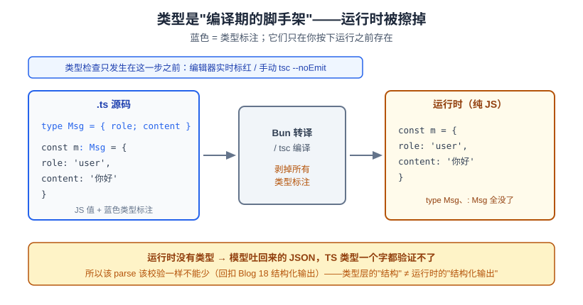
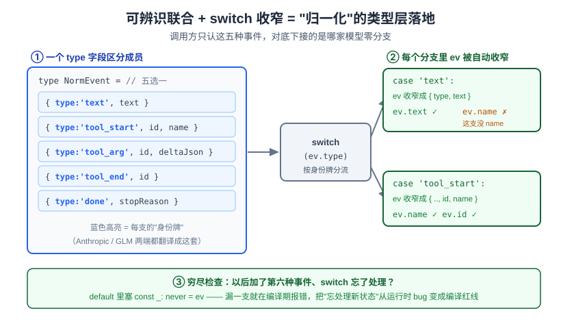

# 番外：读懂本卷代码要的 TypeScript

> 一个全栈工程师的大模型学习笔记（第六阶段 · 实战卷 · 番外）

你是全栈，JavaScript 是老本行。但这一卷的代码是 **TypeScript**，而且跑在 **Bun** 上——如果你平时不怎么碰 TS 生态，翻开代码可能会被几个东西绊住：`interface` 和 `type` 到底选哪个？`async function*` 是什么鬼？为什么源码 `import` 后面跟着 `.js` 但文件明明是 `.ts`？`bun run xxx.ts` 凭什么不用先编译？

这篇番外只干一件事：**把「读懂/写本卷 harness 代码」需要的 TypeScript，一次讲清。** 不是泛泛的 TS 教程——只讲我们真会用到的那些，而且**全部拿你已经看它跑通了的 `spike.ts` 当解剖标本**（就是上一步验证「一个接口装两种模型」的那份 spike 代码）。

分两半：**语言层**（TS 的语法/类型）和**生态层**（运行时、编译、模块、包管理这套你说不熟的东西）。

---

## 一、先建一个正确的心智模型：类型是"编译期的脚手架"

如果你只从这篇记住一句话，记这句：

> **TypeScript = JavaScript + 一层只在编译期存在的类型。运行时，类型被 100% 擦掉。**

这句话能治好新手八成的困惑。看这张图：



`spike.ts` 里这行：

```ts
type Msg = { role: 'user' | 'assistant'; content: string }
```

它**不产生任何运行时代码**。编译（或 Bun 转译）之后，`type Msg` 这行就没了，`: Msg` 这些标注也全被剥掉，剩下的就是普通 JS。类型的作用发生在**你按下运行之前**：编辑器和类型检查器拿它帮你抓错（把 `role` 写成 `'system'` 会立刻标红，因为不在 `'user' | 'assistant'` 里）。

（一个精确的边界：被擦掉的是**类型标注本身**。TS 里少数**非纯类型语法**——如 `enum`、以及 §2.5 会用到的"参数属性" `constructor(private base: string)`——那个 `private`、`: string` 会擦掉，但它顺带触发的字段赋值 `this.base = base` 是**值**、会留在运行时。所以准确说法是"类型标注被擦光"，不是"所有 TS 写法都凭空消失"。）

**一个对 harness 至关重要的推论**：类型帮你在**写代码时**不犯低级错，但它**管不住运行时的数据**。模型在运行时吐回来的 JSON，TS 类型**一个字都验证不了**——你标了 `content: string` 不代表模型真给你 string。这正是概念篇 Blog 18《结构化输出》的核心：模型是概率性的，运行时该 parse 该校验一样不能少。**类型层的"结构"和运行时的"结构化输出"是两件事，别混。** 这条我们在实战03 落工具时会反复撞见。

---

## 二、语言层：把 `spike.ts` 拆开看

### 2.1 类型注解基础

TS 就是给 JS 的变量、参数、返回值**贴标签**：

```ts
type Msg = { role: 'user' | 'assistant'; content: string }
type ToolDef = { name: string; description: string; parameters: Record<string, unknown> }

function safeParse(s: string) {           // 参数 s 标成 string
  try { return JSON.parse(s) } catch { return s }
}
```

- `role: 'user' | 'assistant'` 是**字面量联合类型**——这个字段只能是这两个字符串之一，不是任意 string。写错立刻报错。
- `Record<string, unknown>` = "键是 string、值类型未知的对象"。`unknown` 是"我还不知道是什么，用之前必须先收窄"的安全版 `any`（`any` 是"关掉类型检查"，能不用就不用）。
- 返回值没标？TS 会**自动推断**（`safeParse` 推断出返回 `any`，因为 `JSON.parse` 返回 `any`）。**能推断出来的就别硬写**，这是 TS 的日常习惯，跟 JS 的"能不写就不写"一脉相承。

对比 JS：JS 里这些标签根本不存在，全靠你脑子记 `s` 是不是 string。TS 把"脑子记"换成"编译器记"。

### 2.2 `type` 还是 `interface`？

`spike.ts` 里两个都用了，而且用得有讲究：

```ts
type NormEvent =                          // 用 type
  | { type: 'text'; text: string }
  | { type: 'tool_start'; id: string; name: string }
  | ...

interface ModelProvider {                 // 用 interface
  readonly label: string
  streamChat(messages: Msg[], tools: ToolDef[]): AsyncGenerator<NormEvent>
}
```

两者都能描述"对象的形状"，九成场景可以互换。区别在**擅长的方向**：

| | `interface` | `type` |
|---|---|---|
| 擅长 | 描述**对象/类的契约**（"谁实现我要长这样"） | **联合类型**、别名、元组、映射类型 |
| 能被 `class implements` | ✅ | ✅（但联合类型不行） |
| 能表达 `A | B` 联合 | ❌ | ✅ |
| 能被重复声明"合并" | ✅（declaration merging） | ❌ |

**够用的经验法则**：描述一个**契约/一个类要实现的对象形状** → 用 `interface`（所以 `ModelProvider` 用它，两个 provider 类都要 `implements` 它）；只要涉及**联合类型或类型别名** → 用 `type`（所以 `NormEvent` 这个"五选一"必须用 `type`，`interface` 表达不了联合）。

### 2.3 可辨识联合 + `switch` 收窄（**全卷最核心的一招**）

这一节请慢读，它是整卷代码反复用的模式，也是 TS 最能打的地方。

`NormEvent` 是个**联合类型**——一个 `NormEvent` 值，要么是文本事件、要么是工具开始、要么是工具参数……五选一。而且每个成员都带一个**共同的字面量字段 `type`** 当"身份牌"：

```ts
type NormEvent =
  | { type: 'text'; text: string }
  | { type: 'tool_start'; id: string; name: string }
  | { type: 'tool_arg'; id: string; deltaJson: string }
  | { type: 'tool_end'; id: string }
  | { type: 'done'; stopReason: string }
```

这种"用一个字面量字段区分成员"的联合，叫**可辨识联合（discriminated union）**。它的魔力在 `switch` 里：

```ts
for await (const ev of p.streamChat(messages, tools)) {
  switch (ev.type) {
    case 'text':
      text += ev.text          // ✅ 这里 ev 被收窄成 { type:'text'; text:string }，能点 .text
      break
    case 'tool_start':
      toolName.set(ev.id, ev.name)   // ✅ 收窄成有 id/name 的那支，能点 .name
      break
    case 'tool_arg':
      // ev.name 在这里会报错——因为这一支没有 name 字段
      ...
  }
}
```

进到 `case 'text'` 分支，编译器**自动把 `ev` 收窄**成"文本那一支"，于是 `ev.text` 合法、`ev.name` 报错（因为文本事件没有 `name`）。这叫**类型收窄（narrowing）**：你在 `case` 里判了 `ev.type`，编译器就顺着推断出此刻 `ev` 到底是哪一支。



**为什么它对 harness 这么关键？** 回想上一步 spike 的结论：Anthropic 和 GLM 两端的流式格式天差地别，但我们把它们都翻译成**同一套 `NormEvent`**。调用方 `runOnce` 里那个 `switch(ev.type)`，对两端**零分支**——它根本不知道下面接的是哪家模型，只认这五种事件。**可辨识联合 + 收窄，就是"归一化"在类型层的落地。** 这也正是 Blog 18 那句"结构化输出"的类型层镜像：把不确定的外部输入，收进一组你穷举得清的确定形状。

**额外好处——穷尽检查**：如果 `NormEvent` 以后加了第六种事件，而你的 `switch` 忘了处理它，可以用一个小技巧让编译器**在编译期就报错**提醒你（给 `default` 分支塞一个 `const _exhaustive: never = ev`）。`never` 是"不可能有值"的类型，一旦漏了分支、`ev` 还剩某种可能，赋值给 `never` 就编译失败。这一手让"加了新状态忘了处理"从运行时 bug 变成编译期红线。

### 2.4 泛型怎么读（会读就够，不用自己写）

`spike.ts` 里到处是尖括号，别怕，它们是**泛型（generics）**——"带一个类型参数的类型"，你把尖括号读成"装什么的容器"就行：

```ts
const blockTool = new Map<number, string>()   // 键是 number、值是 string 的 Map
const started = new Set<number>()              // 装 number 的 Set
async function* streamChat(...): AsyncGenerator<NormEvent>   // 吐出 NormEvent 的异步生成器
async function* sseLines(res: Response): AsyncGenerator<string>  // 吐出 string 的异步生成器
```

- `Map<number, string>` ——`.get(3)` 返回 `string | undefined`（可能没这个键），编译器逼你处理"取不到"的情况。
- `Promise<T>` ——`async` 函数的返回值，`T` 是 `await` 之后拿到的东西。
- `AsyncGenerator<NormEvent>` ——见下一节。

本卷你几乎**不需要自己定义泛型**，但要能一眼读懂 `Map<K, V>`、`Promise<T>` 这类"容器装什么"。

### 2.5 `class ... implements 接口`

```ts
class AnthropicProvider implements ModelProvider {
  readonly label = 'anthropic'
  constructor(private base: string, private key: string, ...) {}
  async *streamChat(messages: Msg[], tools: ToolDef[]): AsyncGenerator<NormEvent> { ... }
}
```

- `implements ModelProvider` = "**我保证长成 `ModelProvider` 那个契约的样子**"。少实现一个方法、或方法签名对不上，编译器立刻报错。这就是 §2.2 说 `interface` 擅长"契约"的意思——它是 provider 类必须签的合同。
- `constructor(private base: string, ...)` 是 TS 的**参数属性**语法糖：在构造函数参数前加 `private`，等于"声明一个私有字段 + 自动 `this.base = base`"，省掉一堆样板。这是纯 JS 没有的便利。
- `readonly label` = 只读字段，构造后不能再改。

### 2.6 async 迭代器：`async function*` + `for await...of`（流式的骨架）

这个即使是全栈，平时也未必天天写，但它是**整个流式管线的骨架**，值得单拎出来。

普通函数 `return` 一次就结束。**生成器函数**（`function*`，带星号）能**多次 `yield`**、每次吐一个值、然后暂停，等你要下一个再继续。加上 `async`，就是**异步生成器**——可以在 `yield` 之间 `await`（比如等网络下一个数据块）：

```ts
async function* sseLines(res: Response): AsyncGenerator<string> {
  const reader = res.body!.getReader()
  const decoder = new TextDecoder()
  let buf = ''
  for (;;) {
    const { done, value } = await reader.read()   // 等网络下一块
    if (done) break
    buf += decoder.decode(value, { stream: true })
    let nl: number
    while ((nl = buf.indexOf('\n')) >= 0) {
      const line = buf.slice(0, nl).trim()
      buf = buf.slice(nl + 1)
      if (line.startsWith('data:')) yield line.slice(5).trim()   // 吐一行出去，暂停
    }
  }
}
```

消费端用 **`for await...of`** 一个个接：

```ts
for await (const data of sseLines(res)) {   // 每 yield 一行，这里转一圈
  const ev = JSON.parse(data)
  ...
}
```

**为什么流式非它不可**：模型的回复是**一块一块从网络流回来**的，你不想等全部到齐才处理（那就不叫流式了）。异步生成器让你写成"每来一块就 `yield` 出去"，消费端用 `for await` 像遍历数组一样自然地边到边处理。`streamChat` 也是 `async function*`：provider 每解析出一个归一化事件就 `yield`，调用方 `for await` 逐个消费。**一条从网络字节到归一化事件的流水线，全靠这套语法串起来。**

### 2.7 strict 模式的几个坑（别被红线吓到）

本卷 `tsconfig` 开了 `strict` 和 `noUncheckedIndexedAccess`。它们会让编译器更啰嗦，但每条啰嗦都在帮你堵 JS 里最常见的运行时崩溃：

```ts
const choice = ev.choices?.[0]   // 为什么要 ?. 和这堆判空
if (!choice) continue
```

- **`noUncheckedIndexedAccess`**：开了它，`arr[0]` 的类型是 `T | undefined`（而不是 `T`）——因为下标访问**可能越界拿到 undefined**。所以上面 `ev.choices?.[0]` 拿到的是"可能没有"，下一行 `if (!choice) continue` 先挡掉空的情况，后面才能安心用。这条规则把"数组取值可能是 undefined"从"你得记得"变成"编译器逼你处理"。
- **`?.`（可选链）**：`ev.choices?.[0]` = 如果 `choices` 是 null/undefined 就整体返回 undefined，不报错。JS 也有，但在 TS 里配合类型收窄尤其顺手。
- **`??`（空值合并）**：`tc.index ?? 0` = "`index` 是 null/undefined 就用 0"。注意跟 `||` 的区别：`??` 只在 null/undefined 时兜底，`0` 和 `''` 会照常保留；`||` 会把 `0`/`''` 也当假值替掉。处理"下标可能是 0"这种场景，必须用 `??`。
- **非空断言 `!`**：`res.body!` 里的 `!` 是"我担保这里不是 null，别拦我"。它是**你对编译器的口头保证**、运行时不做任何检查——所以要少用、用在你真有把握的地方（`fetch` 的流式响应体 `res.body` 类型上是 `ReadableStream | null`，但流式请求成功后它一定在）。

---

## 三、生态与工具链地图（你说不熟的这块）

语言讲完，剩下这套"周边"——运行时、编译、模块、包管理。你说不熟，我给你一张地图。

### 3.1 运行时：Node / Deno / Bun 是什么关系

它们都是**在浏览器之外跑 JS 的运行时**，可以类比成"JS 世界的三种 JVM"：

- **Node.js**：最老牌、生态最大，业界默认。但它**原生只认 JS**——想跑 TS 得先编译，或挂个加载器。
- **Deno**：Node 原作者重做的，原生支持 TS——但和 Bun 一样，`deno run` **默认也只擦类型、跑时不做类型检查**（要检查得显式 `deno check` 或 `deno run --check`，只有 `deno test` 默认查）。它真正的差异化在**更严的安全沙箱**（默认无文件/网络权限）。
- **Bun**：最新、主打快，**原生直接跑 `.ts`**，内置打包器/测试器/包管理器，还内置了 `fetch`、Web Streams、`.env` 自动加载这些"开箱即用"的东西。

本卷用 **Bun**，因为**源码 `claude-code-rev` 本身就是 Bun 项目**，最贴近。副作用是很多便利白拿：`spike.ts` 里读 `process.env.OPENAI_API_KEY` 没引任何 dotenv 库，就是 Bun 自动加载了 `.env`。

### 3.2 为什么 TS 通常要"编译"、而 Bun 能直接跑

浏览器和 Node **看不懂 TS 语法**（那些类型标注不是合法 JS）。所以传统流程是：**`tsc` 把 `.ts` 编译成 `.js`**（这一步顺便做类型检查），再拿 Node 跑那个 `.js`。

Bun（和 Deno、以及很新的 Node）走的是另一条路：**运行时内置了转译器**，加载 `.ts` 时**当场把类型标注剥掉**、直接跑剩下的 JS。所以 `bun run spike.ts` 不用你先编译。

**但有个关键坑必须说清**：Bun 直接跑 = **只转译、不做类型检查**（它只是"擦掉"类型，不验证类型对不对）。也就是说，**代码里有类型错误，Bun 照样能跑起来**——直到那个错误在运行时真的炸了你才发现。真正的类型检查靠两处：**你的编辑器**（实时标红）和**手动跑 `tsc --noEmit`**（只检查、不产出文件）。所以本卷 `tsconfig` 里 `"noEmit": true`——我们从不用 `tsc` 产 `.js`（Bun 直接跑源码），`tsc` 只当"类型检查器"用。**心里要有这根弦：能跑 ≠ 类型没错。**

### 3.3 `tsc` / `tsx` / `ts-node` 各是什么

你在 TS 项目里会撞见这几个名字，一句话区分：

- **`tsc`**：官方编译器（TypeScript Compiler）。`.ts → .js`，或加 `--noEmit` 只做类型检查。
- **`ts-node`**：给 Node 挂的加载器，让 Node 能"直接跑" `.ts`（其实是运行时帮你编译）。老牌方案。
- **`tsx`**：更快的同类替代（基于 esbuild），现在更常用。

**本卷一个都不太需要**——Bun 把"直接跑 TS"这件事内置了。列出来是为了你在别的 TS 项目里看到不发懵。

### 3.4 模块系统：ESM vs CommonJS，和那个 `.js` 后缀之谜

JS 有两套"怎么把文件拆成模块、怎么互相 import"的体系：

- **CommonJS（CJS）**：Node 的老体系，`require()` / `module.exports`。
- **ESM（ES Modules）**：现代标准，`import` / `export`。本卷用这套（`package.json` 里 `"type": "module"` 就是声明"这个项目走 ESM"）。

（我们的 `spike.ts` 是自包含单文件，**没有任何 import**。）等**翻开源码 `claude-code-rev`**，你会看到大量这样的 import——注意这是**源码、不是我们的 spike**：

```ts
import type { AnalyticsMetadata } from '../../services/analytics/index.js'
```

这行有两个点值得说：

**`import type`** = "我只借这个**类型**，不借运行时的值"——转译后这行会被**整条删掉**（类型是编译期的，回扣 §1）。明确写 `import type` 能帮转译器/打包器更干净地擦除。

**那个"文件是 `.ts` 却 import `.js`"的怪事**：它**不是 ESM 语言规范逼的**，而是 **TypeScript 的约定**——TS 从不改写你 import 里的路径字符串。所以有些项目会把路径写成"**假设将来编译成 `.js` 后**该有的那个名字"（哪怕源文件是 `.ts`），运行时/打包器再把这个 `.js` 说明符**解析回对应的 `.ts`**——**并不真的存在一个被加载的 `.js` 文件**（Bun 直接跑 `.ts`，回扣 §3.2）。在 `node16`/`nodenext` 这类解析模式下它是硬性要求；在别的模式下（源码其实用的就是下面说的 `bundler`）更多是团队沿用的写法习惯。

**好消息**：本卷自己的 `tsconfig` 用 `"moduleResolution": "bundler"`，这个模式**不要求写扩展名**——所以我们自己的代码 `import './chat'` 就行，不用加 `.js`。你只在**翻源码**时会撞见那串 `.js` 后缀，知道它是"TS 不改写路径 + 写成 emit 后的名字"这套约定即可，别照抄到我们的代码里。

### 3.5 类型从哪来：`@types/*` 与 `tsconfig` 关键字段

很多 JS 库本身没带类型（它是纯 JS 写的）。社区把类型定义单独打包，放在一个叫 **DefinitelyTyped** 的仓库里，发布成 `@types/xxx` 包。比如给 Node 的内置 API 补类型就装 `@types/node`。

本卷 `package.json` 的 devDependencies 里有 `@types/bun`——给 Bun 的全局 API（像 `Bun.file`）补类型，**只在开发时给编辑器用**，跑的时候 Bun 自己知道，不需要它。

`tsconfig.json` 几个你会看到的关键字段：

- `"strict": true` —— 打开一整套严格检查（§2.7 那些）。
- `"module" / "target": "ESNext"` —— 用最新的模块语法和 JS 特性（Bun 都支持）。
- `"moduleResolution": "bundler"` —— §3.4 说的，让我们不用写 `.js` 后缀。
- `"noEmit": true` —— §3.2 说的，`tsc` 只检查不产文件。

装了 `@types/bun` 后，TypeScript 会**自动纳入**它（所有 `@types/*` 默认都自动纳入，不用在 `tsconfig` 里显式列 `types`）——于是 `Bun.file`、`process.env` 这些全局才有类型提示。

### 3.6 包管理：npm / pnpm / bun 一句话区分

- **npm**：Node 自带，最通用。
- **pnpm**：用硬链接共享依赖，省磁盘、装得快。
- **bun**：Bun 自带的包管理器，非常快，`bun install` 一步到位。

本卷用 `bun install`，命令、锁文件都归 Bun 管，你不用在它们之间纠结。

---

## 小结

- **一句话心智模型**：TS = JS + 编译期类型，**运行时类型标注全擦掉**（少数非纯类型语法如 `enum`/参数属性另说）；类型帮你写代码时不犯错，但**管不住运行时的数据**（模型吐的 JSON 照样要 parse+校验，回扣 Blog 18）。
- **语言层**（全在 `spike.ts` 里）：类型注解 → `type` 管联合/`interface` 管契约 → **可辨识联合 + `switch` 收窄**（全卷最核心，是"归一化"的类型层落地）→ 泛型会读就行 → `class implements 接口` → **`async function*` + `for await`** 是流式骨架 → strict 的 `?.`/`??`/`!`/下标可能 undefined。
- **生态层**：Node/Deno/**Bun** 三种运行时，本卷用 Bun 因为源码是 Bun 项目；Bun **只转译不检查**（能跑 ≠ 类型没错，检查靠编辑器/`tsc --noEmit`）；ESM 走 `import/export`，源码那串 `.js` 后缀是 TS 约定（写成 emit 后的名字、不是 ESM 规范逼的），我们用 `bundler` 模式免了；`@types/*` 补类型；`bun install` 管依赖。

带着这些，实战01 的代码你就能**逐行读懂**，而不是"大概看个意思"。

下一篇——**实战01《第一次对话：可插拔的模型层》**：我们把 spike 里验证过的那条缝，收敛成 `code/harness/` 里第一份正式代码——一个换个 key 就能切后端的 `chat()`。那是整台 harness 最底下、会抖的那块芯片。
