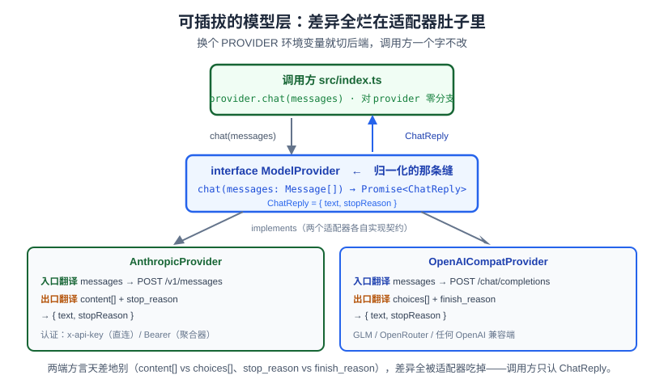

# 实战01：第一次对话——可插拔的模型层

> 一个全栈工程师的大模型学习笔记（第六阶段 · 实战卷 · 实战01）

卷首语说，我们要从一次 `chat()` 调用、一层层盖成 mini-claude-code。这一篇就落最底下那块**会抖的芯片**——一个「发一句话给模型、拿到回复」的模型层。

但我们不只是把一次 API 调用抄下来。这一篇的真问题是：**怎么把这次调用写成一个「换个环境变量就能切后端」的可插拔层**，好让上面 19 篇要盖的东西（循环、工具、权限……）永远不用关心底下接的是哪家模型。

（读代码卡壳请先翻[实战00b《读懂本卷代码要的 TypeScript》](实战00b-typescript-for-harness.md)——本篇的 `interface`、`implements`、`?.`/`??`、`res.json()` 为什么是 `unknown`，那篇都讲过。）

---

## 一、引导式设计：这一层最少需要什么？

**锚定**：调 API 是你的老本行——`POST /chat`，body 塞 `messages`，拿回一段回复。假如只连一家，十行搞定，没什么可设计的。

**需求来了**：同一份业务代码，**既要能连 Anthropic，又要能连 GLM**（你两家 key 都有）。你最直接的写法八成是在调用处分叉：

```ts
if (provider === 'anthropic') {
  // 拼 Anthropic 的 body，解析 content[].text，读 stop_reason
} else {
  // 拼 OpenAI 的 body，解析 choices[].message.content，读 finish_reason
}
```

单看没毛病。但往后想三步——实战02 要在它外面套 `while` 循环、实战03 要往里塞工具、实战04 要在动作前插权限闸门。**当这个 `if(provider)` 分叉散在调用链每一处时，会长出什么病？**

这个病你在概念篇见过：**同一件横切的事散在 N 处**——正是 [Blog 27《LLM 网关》](27-llm-gateway.md)的病根，只不过那篇是散在 N 个服务、这里是散在**进程内**的 N 个调用点。27 篇的药是网关（服务化收口）；进程内的等价物，就是**一个接口 + 适配器**，把「怎么跟模型说话」这件横切的事收进一处。

**命名**：这个收口点叫 `ModelProvider` 接口，两个实现 `AnthropicProvider` / `OpenAICompatProvider`。它内部干两件翻译活：

- **入口翻译**：中立的 `messages` → 各家的请求 body
- **出口翻译**：各家的响应 → **归一化**的回复

**这一刀切在哪，是本篇唯一的设计抉择**。逼一下出口那侧：接口该把**厂商的原始响应对象**直接扔回给调用方吗？不能——那样差异就漏出去了。Anthropic 回的是 `content[]` 数组、停止信号叫 `stop_reason`；GLM 回的是 `choices[]`、停止信号叫 `finish_reason`。**连字段名都不一样**。所以出口**必须归一化**成一个调用方能穷举的固定形状：

```ts
type ChatReply = { text: string; stopReason: string }
```

**范围（每篇只加一个零件）**：实战01 只做**最小非流式** `chat()`——发一句、整段拿回。**不含工具**（留实战03）、**不含流式**（留实战05/06，那时会把循环主干重构成流式，卷首语打过预防针）。回复里除了 `text`，**顺手带上 `stopReason`**：它在下一篇 `while` 循环里正是「该不该继续」的信号，现在归一化好、实战02 直接取用，省一次接口返工。

两处回扣钉死这一层的位置：

- **[Blog 17 金鱼](17-context-engineering.md)**：模型无状态，记忆不在它脑里、在你传的 `messages` 数组里，每轮原样重放。所以我们的入口是 `Message[]`，不是一句 string。
- **[Blog 18 结构化输出](18-structured-output-tool-calling.md)**：出口要 parse 厂商回的 JSON。而 JSON 是模型/接口在运行时给的，**类型管不住**（回扣 [实战00b §1](实战00b-typescript-for-harness.md)）——所以出口翻译要容错，字段可能缺。

先看这一层在整个 harness 里的**全局坐标**：调用方只对着 `ModelProvider` 接口说话，两个适配器把两端方言全烂在自己肚子里。往后 19 篇要盖的循环、工具、权限，都挂在"调用方"这一格里，永远不碰底下接的是哪家。



---

## 二、代码落地

代码进 `code/harness/src/`，用 Bun 跑。先立契约 `types.ts`：

```ts
export type Role = 'user' | 'assistant'
export type Message = { role: Role; content: string }
export type ChatReply = { text: string; stopReason: string }

export interface ModelProvider {
  readonly name: string
  chat(messages: Message[]): Promise<ChatReply>
}
```

**Anthropic 适配器**（`src/providers/anthropic.ts`）——注意两处翻译：

```ts
export class AnthropicProvider implements ModelProvider {
  readonly name = 'anthropic'
  constructor(
    private base: string, private apiKey: string,
    private authToken: string, private model: string,
  ) {}

  async chat(messages: Message[]): Promise<ChatReply> {
    const headers: Record<string, string> = {
      'content-type': 'application/json',
      'anthropic-version': '2023-06-01',
    }
    // 直连用 x-api-key；聚合器（zenmux 等）多用 Authorization: Bearer
    if (this.authToken) headers['authorization'] = `Bearer ${this.authToken}`
    else headers['x-api-key'] = this.apiKey

    // 入口翻译：中立 messages → Anthropic body
    const res = await fetch(`${this.base}/v1/messages`, {
      method: 'POST', headers,
      body: JSON.stringify({ model: this.model, max_tokens: 1024, messages }),
    })
    if (!res.ok) throw new Error(`anthropic ${res.status}: ${await res.text()}`)

    // 出口翻译：Anthropic 回 content[] 数组，取 text 块拼起来
    const data = (await res.json()) as {
      content?: Array<{ type: string; text?: string }>
      stop_reason?: string
    }
    const text = (data.content ?? [])
      .filter(b => b.type === 'text').map(b => b.text ?? '').join('')
    return { text, stopReason: data.stop_reason ?? 'end_turn' }
  }
}
```

> 眼尖会问：Anthropic body 里那个 `max_tokens: 1024` 是哪来的、为什么下面 OpenAI 那端没写？这也是**入口翻译**要吃掉的方言差异——`max_tokens` 是 Anthropic API 的**必填项**，OpenAI 兼容端点可省略走默认。可见两端的差异不止「字段名」，连「哪些字段必填」都不一样，都归入口翻译处理。

**OpenAI 兼容适配器**（`src/providers/openai.ts`）——同一个契约，肚子里翻译成另一套方言：

```ts
export class OpenAICompatProvider implements ModelProvider {
  readonly name = 'openai-compat'
  constructor(private base: string, private apiKey: string, private model: string) {}

  async chat(messages: Message[]): Promise<ChatReply> {
    const res = await fetch(`${this.base}/chat/completions`, {
      method: 'POST',
      headers: { 'content-type': 'application/json', authorization: `Bearer ${this.apiKey}` },
      body: JSON.stringify({ model: this.model, messages }),   // 入口翻译
    })
    if (!res.ok) throw new Error(`openai-compat ${res.status}: ${await res.text()}`)

    // 出口翻译：OpenAI 回 choices[]，取 message.content 与 finish_reason
    const data = (await res.json()) as {
      choices?: Array<{ message?: { content?: string }; finish_reason?: string }>
    }
    const choice = data.choices?.[0]
    return { text: choice?.message?.content ?? '', stopReason: choice?.finish_reason ?? 'stop' }
  }
}
```

> **一个 TS 细节**（回扣实战00b）：`res.json()` 在 strict 下返回 **`unknown`**，不是 `any`。所以我们用 `as {...}` 给它一个**最小形状**再取字段。这不是走过场——它逼你把「厂商回的 JSON 里哪些字段可能缺」写进类型（`text?`、`stop_reason?`），也呼应 Blog 18：**运行时数据不可信，字段用 `?.`/`??` 兜底。**

上面两个适配器的**出口翻译**具体在干什么，放大看这一步：两套结构、字段名都不一样的响应，被映射进同一个 `ChatReply`——这就是「这一刀必须归一化」的字面落地。

![出口翻译放大图：左边 Anthropic 响应的 content[].text 和 stop_reason，右边 OpenAI/GLM 响应的 choices[].message.content 和 finish_reason，字段名与结构都不同，两条箭头汇聚到中间同一个归一化 ChatReply {text, stopReason}，调用方只认这个形状](assets/img/实战01-normalize.svg)

**可插拔的落点** `src/provider.ts`——按环境变量装配，这就是「换个环境变量（`PROVIDER` + 对应那端的 key）就能切」的那颗开关：

```ts
export function makeProvider(): ModelProvider {
  const kind = process.env.PROVIDER ?? 'anthropic'
  if (kind === 'anthropic') { /* 读 ANTHROPIC_* 环境变量，new AnthropicProvider */ }
  if (kind === 'openai' || kind === 'glm') { /* 读 OPENAI_* 环境变量，new OpenAICompatProvider */ }
  throw new Error(`未知 PROVIDER: ${kind}`)
}
```

**调用方** `src/index.ts`——全篇的题眼，**对 provider 零分支**：

```ts
const provider = makeProvider()
const messages: Message[] = [{ role: 'user', content: question }]
const reply = await provider.chat(messages)   // ← 它不知道底下是哪家模型
console.log(`[assistant]   ${reply.text}`)
console.log(`[stop_reason] ${reply.stopReason}`)
```

把整条路串起来看一次 `chat()` 怎么跑：**装配时**按 `PROVIDER` 选好适配器，**之后每次调用**都走同一条四步流水——入口翻译、`fetch`、判 `res.ok`（失败就 `throw` 逃逸）、出口翻译归一化。两个适配器共用这套骨架，只有翻译节点里的方言不同。

![一次 chat() 调用的控制流程图：chat(messages) 进来后①入口翻译把 messages 拼成各家 body（Anthropic 走 /v1/messages 且 max_tokens 必填，OpenAI/GLM 走 /chat/completions）②fetch POST 等响应③判 res.ok，否则 throw Error 逃逸不返回④出口翻译解析响应（Anthropic content[].text/stop_reason，OpenAI choices[].content/finish_reason）归一化成 ChatReply{text, stopReason}，主路径高亮，调用方只认这个形状](assets/img/实战01-call-flow.svg)

### 验证

`.env` 里填你有 key 的那一端（`.env.example` 有模板），然后：

```bash
# Anthropic 端
PROVIDER=anthropic bun run src/index.ts "用一句话解释什么是 harness。"
# GLM 端——同一行调用方代码，只换环境变量
PROVIDER=glm       bun run src/index.ts "用一句话解释什么是 harness。"
```

两端真实跑出来（Anthropic 经 zenmux 聚合器、GLM 经智普）：

```
[provider]    anthropic
[assistant]   Harness 是一个用于管理和运行测试（或任务）的框架/工具……
[stop_reason] end_turn
```
```
[provider]    openai-compat
[assistant]   Harness 作名词指用于套住动物的"马具"……
[stop_reason] stop
```

**通过标准**：换 `PROVIDER` 就切了后端，`src/index.ts` **一个字没改**；两端的停止信号从不同字段名（`stop_reason` / `finish_reason`）收敛进了同一个 `reply.stopReason`。这一层的活儿干完了。

> ⚠️ 一处别误会：归一化的是**字段位置**，不是**取值词表**。`stopReason` 的类型是裸 `string`，我们只是把厂商原值透传进同一个字段——一端是 `end_turn`、一端是 `stop`，两套值并没有被映射成一套统一枚举。所以实战02 要跨端判断「该不该停」时，**不能直接 `switch('end_turn')`**（那会在 GLM 端漏判），得自己再做一层值映射。这也预告了下一节要讲的坑。

最后用一张时序图收尾，把这次调用的**往返**看清：翻译不是发生在某一处，而是**出、入两侧各一次**——去程 provider 把中立 `messages` 译成方言 body，回程再把方言响应译回归一化 `ChatReply`。调用方从头到尾只跟接口打交道。

![一次 chat() 调用的序列图：三条泳道（调用方 index.ts、provider 适配器、模型 API）。调用方发 chat(messages) 给适配器；适配器做入口翻译把 messages 拼成 body，POST 给模型 API；API 返回 content[]/choices[] 与 stop_reason/finish_reason；适配器做出口归一成 ChatReply，return {text, stopReason} 回调用方。底注说明装配 makeProvider 按 PROVIDER 选适配器发生在 chat 之前一次性，调用方全程只认 chat/ChatReply](assets/img/实战01-sequence.svg)

当篇 checkpoint：`git tag harness-ch01-pluggable-model`。想跑本章末状态：`git checkout harness-ch01-pluggable-model`。

---

## 三、🔬 翻开源码：真实的 provider 层长什么样

按卷级铁律，我们打开还原源码 `claude-code-rev` 对照——看真实工程比我们多做了什么、以及**哪里我们是自创**。

**第一件事必须诚实说死**：`src/utils/model/providers.ts` 里有个 `APIProvider`：

```ts
export type APIProvider = 'firstParty' | 'bedrock' | 'vertex' | 'foundry'
```

看着像「可插拔多 provider」，其实**四个全是 Anthropic 协议的不同承载通道**——直连 / AWS Bedrock / GCP Vertex / Azure Foundry。它**不是 OpenAI 兼容层，也不是协议归一层**。真实 Claude Code 是 **Anthropic-only**：`src/` 下 **121 个文件** import `@anthropic-ai/sdk`。

所以——**我们这一篇的「provider 可插拔（含 GLM）」是本卷自创的扩展，不是源码还原。** 卷首语声明二说的就是这件事。我们造这层，是为了让你用手头任一家 key 都能跟着做；代价是它跟真实源码分道扬镳。

**真实工程比我们多做了什么**：我们的 `chat()` 是裸 `fetch` 三十行。真实那条调用路径（`src/services/api/`，光 `claude.ts` 就近 13 万字节）在同一件事外面裹了一大圈——`withRetry.ts` 的重试与退避、`errors.ts` 的错误分类、`logging.ts` 的埋点、prompt cache 命中检测……这些正是实战08（错误与重试）之后要一件件补的零件。**「功能存在」到「生产级健壮」之间那圈，就是 17b 篇说的「工程 = 约束下的权衡」。**

**一个伏笔**：我们出口翻译里读了 `stop_reason` 当停止信号。但真实源码 `src/query.ts:554` 有句注释：

```
// Note: stop_reason === 'tool_use' is unreliable -- it's not always set correctly.
```

真实的 agent loop **不信 `stop_reason` 字段**——它靠**流式期间累积到的 `tool_use` 块**判断该不该继续（源码 `toolUseBlocks` 数组，注释原话「the sole loop-exit signal」）。我们实战01 是非流式、只发一句，用 `stopReason` 当信号够用；等实战02 搭起循环、实战06 上流式，我们会撞上这个坑并回来收它。

---

## 小结

- 这一层的病：`if(provider)` 分叉散在每个调用点 = **同一件横切的事散在 N 处**（[Blog 27 网关](27-llm-gateway.md)病根的进程内版）。
- 药：`ModelProvider` 接口收口 + 两个适配器，各干**入口翻译**（中立 `messages`→各家 body）与**出口翻译**（各家响应→归一化 `ChatReply`）。**这一刀的关键是出口必须归一化**，否则 `content[]`/`choices[]`、`stop_reason`/`finish_reason` 的差异会漏进调用方。
- 范围：只做最小非流式 `chat()`，回复带 `text` + `stopReason`（为实战02 循环停止埋一手）；工具留 03、流式留 05/06。
- 🔬 源码对照：真实 `APIProvider` 四值全是 Anthropic 承载通道、非协议归一，**provider 可插拔是本卷自创**；真实调用路径还裹了重试/错误分类/日志一大圈；`stop_reason` 不可靠、真实 loop 靠累积 `tool_use` 块判断——**实战02 见**。

下一篇——**实战02《agent loop 骨架》**：给这颗芯片外面套上 `while` 循环，让它能连续转起来、并接住第一个工具请求。到那时你会看到，`Agent = Model + Harness` 里的 `while`，其实就这么点东西。
