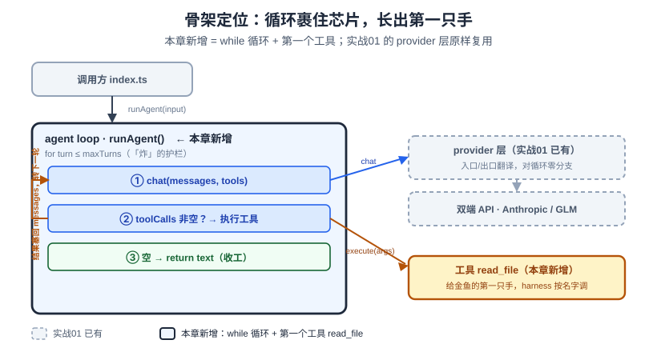

# 实战02：agent loop 骨架——给芯片套上循环

> 一个全栈工程师的大模型学习笔记（第六阶段 · 实战卷 · 实战02）

实战01 我们造出了一颗**会抖的芯片** `chat(messages)`：发一句、拿回一段话，完事。但它是个只会聊天的金鱼——问它「当前目录下 `package.json` 里写了啥」，它只能编，因为它**没有手**（回扣 [Blog 18a](18a-brain-vs-model.md)：泡在罐里的脑，能想不能动）。

这一篇把这颗芯片外面套上 `while` 循环，让它能**连续转起来、并接住第一个工具**——读一个文件、再据此回答。走完你会看到，`Agent = Model + Harness` 里那个 `while`，骨架真就这么点。

（读代码卡壳请先翻 [实战00b《读懂本卷代码要的 TypeScript》](实战00b-typescript-for-harness.md)——本篇要用**可辨识联合 + `switch` 收窄**，那是全卷最核心的类型技巧。）

**卷级铁律先亮明**：概念系列已经把「**为什么** agent 是 while + 停止条件、谁决定停、为什么只能走一步看一步」讲透了（[Blog 24](24-agent-autonomous-action.md)）。实战卷**不重推这些为什么**，只回扣。这一篇只干两件事：**把它写成代码**、**翻开真源码看它多做了什么**。

先给一张全局地图定位本章在整个 harness 的位置：新增的其实只有中间那个 `while` 循环和第一个工具 `read_file`，实战01 的 provider 层原样挂在右边、对循环零分支。下面三个折叠点，都是在把这张图里的连线一根根接通。



---

## 一、引导式设计：`while` 的括号里填什么

概念 24 的骨架一句话：**把「工具调用」这件单圈的事，套进一个循环**——模型吐工具请求 → harness 执行 → 结果塞回 context → 再问模型 → 直到模型不再要工具、说「我说完了」。我们现在就是把这句话**翻译成代码**：

```ts
while ( /* ??? */ ) {
  const reply = await chat(messages, tools)
  // 模型要工具就执行，不要就跳出
}
```

### 折叠点①：循环条件——一个 实战01 埋好的坑

括号里判断「要不要再转一圈」，第一直觉是用 实战01 归一化好的 `stopReason`：

```ts
while (reply.stopReason === 'tool_use') { ... }   // ← 会翻车
```

当场跑一遍分两端看：**Anthropic 端**模型要工具时 `stop_reason` 是 `'tool_use'`，成立 ✅；**GLM（OpenAI 兼容）端**——翻回 实战01 的 `openai.ts`——那个位置填的是 `finish_reason`，而 OpenAI 协议里要工具时它是 **`'tool_calls'`**，不是 `'tool_use'`。同一行代码，GLM 端**永远不成立**，agent 在 GLM 上根本调不了工具。

这正是 实战01 结尾特意标 ⚠️ 埋的坑：那次归一化只统一了**字段位置**，没统一**取值词表**——`stopReason` 是裸 `string`，两端取值（`end_turn`/`tool_use` vs `stop`/`tool_calls`）没被映射成统一枚举。你想跨端 `switch` 就得先补一层值映射。

但有个**更漂亮的出口**。我们真正想知道的不是「那个字符串等于什么」，而是「**模型这轮到底有没有请求工具**」。那与其比字符串，不如让 `chat()` 直接把工具请求**吐回来**，循环条件看它有没有：

```ts
while (reply.toolCalls.length > 0) { ... }   // 不碰 stopReason 字符串
```

**这恰好就是真源码的做法**——`src/query.ts:554` 有句实测过的注释：`stop_reason === 'tool_use' is unreliable`，真实循环靠**累积到的 `tool_use` 块**判断该不该继续，把它叫作「the sole loop-exit signal」。我们不是在模仿，是被同一个道理逼到了同一个答案（这条伏笔 实战01 已经埋下，第三节收）。

### 折叠点②：`chat` 要吐回工具请求，也要收下工具说明

循环条件要 `toolCalls`，可 实战01 的 `ChatReply` 只有 `{ text, stopReason }`——它连「模型想调哪个工具、传什么参数」都没带回来。所以 `ChatReply` 得扩容，多带一串工具请求：

```ts
type ToolCall = { id: string; name: string; args: any }
type ChatReply = { text: string; stopReason: string; toolCalls: ToolCall[] }
```

那个 `id` 先记住，折叠点③要用它「缝线」。

反过来问：模型怎么**知道**自己手上有哪些工具可用？这份「工具说明」（名字/干什么/参数长啥样）是从哪进它脑子里的？

有人会猜「训练时烤进去的」。用你最熟的场景当场证伪：你给 Claude Code 挂一个**新 MCP 工具**，需要重训模型吗？不用，改个配置几秒生效。可如果说明是训练时进去的，就意味着模型的手艺出厂即焊死（回扣 [Blog 18a](18a-brain-vs-model.md)：知识出厂烤死），加个新工具就得重训——这跟你天天挂 MCP 的体验直接矛盾。

所以工具说明只剩一个时机、一个入口：**每次请求时，当作 context 的一部分随 `messages` 一起发过去**（回扣 [Blog 17](17-context-engineering.md)：工具/MCP 说明本就是「一整坨 context」的六类之一；[Blog 18](18-structured-output-tool-calling.md)：把工具的 JSON Schema 放进 context）。模型是**当场**才看到这轮有哪些家伙可用，用完这轮就忘（金鱼无状态）。落到签名上，`chat` 得多收一个入参：

```ts
chat(messages: Message[], tools?: Tool[]): Promise<ChatReply>
```

`tools` 可选——不传就退化成 实战01 的纯聊天（回扣 Blog 18：工具按需 opt-in，普通问答根本不该塞工具）。而一个 `Tool` 要同时伺候**两个主人**：

```ts
type Tool = {
  name: string
  description: string
  parameters: object                        // JSON Schema，剥出来给「模型」看
  execute: (args: any) => Promise<string>    // 干活的「手」，harness 按名字调
}
```

**一个工具 = 一张说明书 + 一只手，自包含**。加工具只是往清单塞一个新对象，别处不动。

### 折叠点③：工具结果怎么塞回 messages——同一个病第三次犯

模型请求了 `read_file`，harness 执行完拿到文件内容，得把它作为一条消息**塞回 `messages`** 好让模型下一轮看到。问题：Anthropic 和 GLM「塞一条工具结果」的格式一样吗？

摊开看——又不一样，而且牵出那根 `id` 线：

- **Anthropic**：模型的请求是 assistant 消息里的块 `{type:'tool_use', id, name, input}`；结果要作为一条 **`user` 消息**塞回，里面是 `{type:'tool_result', tool_use_id, content}`。
- **OpenAI / GLM**：请求在 `tool_calls:[{id, function:{name, arguments}}]`；结果要作为一条 **`role:'tool'` 消息**塞回，带 `tool_call_id`。

那个 `tool_use_id` / `tool_call_id` 就是把「哪个请求」和「哪个结果」缝在一起的线——这就是为什么折叠点②的 `ToolCall` 必须带 `id`：模型一轮点名调好几个工具时，结果塞回去全靠它对号。

三处折叠点——**出口的循环信号（①）、出口吐回 `toolCalls`（②）、入口结果塞回消息（③）**——都是**同一个病**：两端方言全不同（`tool_use`/`tool_calls`、`content[]`/`tool_calls[]`、`tool_result`/`role:'tool'`）。但注意①的**药**和②③不一样：②③ 是把方言**翻译成一个中立形状**（`ToolCall` / `{role:'tool',…}`）给循环体消费；①我们**根本没去映射那个字符串**——`stopReason` 仍是裸 `string` 透传（实战01 就没归它的取值），我们只是改读②吐回的 `toolCalls`、把它**绕过**了。所以准确说是「②③ 归一化中立形状 + ① 被②吸收」。共同点仍在：**处理方言的活全烂在 provider 翻译里**，循环体只跟中立形状打交道。

![工具调用的三处折叠点：Anthropic 与 OpenAI/GLM 在循环信号（stop_reason:tool_use vs finish_reason:tool_calls）、工具请求（content[] 的 tool_use 块 vs tool_calls[]，OpenAI 的 arguments 是 JSON 字符串要 parse）、结果塞回（user 消息装 tool_result vs role:tool 消息）三处形态全不同；②③ 归一成中立形状 ToolCall{id,name,args} 与 {role:tool,toolCallId,content}，①的循环信号 toolCalls.length 其实就是②那个 ToolCall[] 的长度（①被②吸收，不单独映射字符串）；处理方言的活全在 provider 翻译里；那根 id 是把请求和结果缝在一起的线](assets/img/实战02-tool-dialects.svg)

代价是中立的 `Message` 不够用了——带工具后消息不止「纯文本」一种，得从「一种」劈成**可辨识联合**（回扣 [实战00b](实战00b-typescript-for-harness.md)：全卷最核心的类型技巧）：

```ts
type Message =
  | { role: 'user'; content: string }
  | { role: 'assistant'; content: string; toolCalls?: ToolCall[] }
  | { role: 'tool'; toolCallId: string; content: string }
```

**范围（每篇只加一个零件）**：

- 只接**一个**最小工具 `read_file`，让循环能演示转一圈——完整**工具系统**（注册表 + write/edit/bash）留实战03。
- **非流式**：一次拿完整响应，不做逐字流式。⚠️ **预防针**：实战05/06 上流式时，会把这个非流式 loop **重构成流式生成器**——那是**重塑主干**，不是「加一个零件」，卷首语打过招呼，到那时你会看到主干换血。
- **循环本身是多轮的**（`while` 里模型只要继续吐 `toolCall` 就一直转，这正是 agent loop 的题眼），但本篇的**演示场景是单轮**：读一个文件就答完，不刻意构造多轮工具嵌套的例子。别把「demo 单轮」误当成「循环只能转一圈」。
- 循环加一道 `maxTurns` 上限，就是概念 24「三祸」里**「炸」（死循环）**的护栏——本篇只放这一道，「坏」（人工审批）留实战04、「偏」（错误雪球）留实战08。

---

## 二、代码落地

代码进 `code/harness/src/`，用 Bun 跑。先把契约扩好（`types.ts` 全貌见上一节的四个类型）。

**Anthropic 适配器**的三处翻译（`src/providers/anthropic.ts`，节选出口与结果塞回）：

```ts
async chat(messages: Message[], tools?: Tool[]): Promise<ChatReply> {
  const body: Record<string, unknown> = {
    model: this.model, max_tokens: 1024,
    messages: this.toAnthropicMessages(messages),   // 入口翻译①：含 tool_use/tool_result 块
  }
  if (tools?.length) {
    // 入口翻译②：工具说明 → Anthropic 的 tools（参数字段叫 input_schema）
    body.tools = tools.map(t => ({ name: t.name, description: t.description, input_schema: t.parameters }))
  }
  const res = await fetch(`${this.base}/v1/messages`, { method: 'POST', headers, body: JSON.stringify(body) })
  if (!res.ok) throw new Error(`anthropic ${res.status}: ${await res.text()}`)

  // 出口翻译：content[] 里混着 text 块和 tool_use 块，各自抽出来
  const data = (await res.json()) as {
    content?: Array<{ type: string; text?: string; id?: string; name?: string; input?: unknown }>
    stop_reason?: string
  }
  const blocks = data.content ?? []
  const text = blocks.filter(b => b.type === 'text').map(b => b.text ?? '').join('')
  const toolCalls: ToolCall[] = blocks
    .filter(b => b.type === 'tool_use')
    .map(b => ({ id: b.id ?? '', name: b.name ?? '', args: b.input ?? {} }))
  return { text, stopReason: data.stop_reason ?? 'end_turn', toolCalls }
}
```

结果塞回那处（`toAnthropicMessages` 里）——`tool` 消息渲染成一条 `user` 的 `tool_result`，连续多个结果并进同一条 `user`：

```ts
// role === 'tool'
const block = { type: 'tool_result', tool_use_id: m.toolCallId, content: m.content }
const last = out[out.length - 1]
if (last && last.role === 'user' && Array.isArray(last.content)) last.content.push(block)
else out.push({ role: 'user', content: [block] })
```

**OpenAI 兼容适配器**同一个契约、另一套方言（`src/providers/openai.ts`，节选出口）——注意一个坑：

```ts
const toolCalls: ToolCall[] = (msg?.tool_calls ?? []).map(tc => ({
  id: tc.id ?? '',
  name: tc.function?.name ?? '',
  args: safeParse(tc.function?.arguments),   // ⚠️ OpenAI 的参数是一坨 JSON 字符串，得 parse
}))
```

> Anthropic 的 `input` 直接是对象，OpenAI 的 `arguments` 是**字符串**，还可能损坏（回扣 [Blog 18](18-structured-output-tool-calling.md)：模型吐 JSON 是概率性的，会坏格式）。所以 `safeParse` 解析失败就退回 `{}`，别让整条循环崩掉。结果塞回则走 `{ role:'tool', tool_call_id, content }`——独立消息，不像 Anthropic 要并进 `user`。

**第一个工具 `read_file`**（`src/tools/read_file.ts`）——给金鱼接上第一只手：

```ts
export const readFileTool: Tool = {
  name: 'read_file',
  description: '读取指定路径的文本文件，返回其完整内容。',
  parameters: { type: 'object', properties: { path: { type: 'string', description: '文件路径' } }, required: ['path'] },
  execute: async (args: { path?: string }) => {
    if (!args?.path) return 'error: 缺少 path 参数'
    try { return await readFile(args.path, 'utf-8') }
    catch (e) { return `error: 读不了 ${args.path}: ${(e as Error).message}` }  // 出错也返回文本，回灌给模型自纠（回扣 Blog18）
  },
}
```

**agent loop 本体**（`src/loop.ts`）——全篇的题眼，就这么点：

```ts
export async function runAgent(provider: ModelProvider, tools: Tool[], userInput: string, maxTurns = 10) {
  const messages: Message[] = [{ role: 'user', content: userInput }]
  const toolByName = new Map(tools.map(t => [t.name, t]))

  for (let turn = 1; turn <= maxTurns; turn++) {
    const reply = await provider.chat(messages, tools)

    if (reply.toolCalls.length === 0) return reply.text   // 模型这轮不要工具 → 收工

    // 要工具：先把这轮请求作为 assistant 轮记进历史（缝 id 用）
    messages.push({ role: 'assistant', content: reply.text, toolCalls: reply.toolCalls })
    // 逐个执行，结果作为 tool 消息塞回，供下一轮模型看到
    for (const call of reply.toolCalls) {
      const tool = toolByName.get(call.name)
      const result = tool ? await tool.execute(call.args) : `error: 未知工具 ${call.name}`
      messages.push({ role: 'tool', toolCallId: call.id, content: result })
    }
  }
  return `（达到最大轮数 ${maxTurns}，强制停止）`   // 「炸」的护栏
}
```

`while` 的括号里，最终填的不是字符串比较，是 `reply.toolCalls.length`——把「停不停」的开关交给了模型（它这轮吐不吐工具请求），这正是概念 24 说的「自主」的字面机制。


### 验证

`.env` 里填你有 key 的那端，然后（**单轮工具调用**）：

```bash
PROVIDER=glm       bun run src/index.ts "读一下 package.json，告诉我这个项目叫什么、有哪些脚本。"
PROVIDER=anthropic bun run src/index.ts "读一下 package.json，告诉我这个项目叫什么、有哪些脚本。"
```

两端真实跑出来（Anthropic 经 zenmux、GLM 经智普）——同一套 `runAgent`，调用方零分支：

```
[provider] anthropic
[you]      读一下 package.json，告诉我这个项目叫什么、有哪些 npm 脚本。

  [turn 1] read_file({"path":"package.json"}) -> { "name": "mini-harness", "version": "0.1.0", "descrip…

[assistant] 这个项目叫 mini-harness（版本 0.1.0）……包含 chat / typecheck / spike:glm …… 等脚本。
```

**通过标准**：模型自己**决定**要读文件、harness 执行并把内容回灌、模型据此答题——循环转了一圈。GLM 端走 `tool_calls`→`role:'tool'`、Anthropic 端走 `tool_use`→`tool_result`，两套方言收敛进同一条中立 loop。

把这一圈用时序看一遍：`turn1` 模型要工具、harness 执行并把结果塞回，`turn2` 模型说完了、循环收工——**谁决定停，全看每轮吐不吐 `toolCalls`**。

![实战02 序列图：runAgent 循环、模型（provider）、工具 read_file 三条泳道。turn1——runAgent 调 chat(messages, tools)，模型返回 reply·toolCalls=[read_file(path)]；runAgent 执行 execute({path}) 拿到文件内容，把 assistant 轮和 tool 结果塞回 messages。turn2——runAgent 再调 chat，模型返回 reply·text·toolCalls=[]（说完了），runAgent 判 toolCalls.length===0 → return text 给调用方。底注说明循环条件看 reply.toolCalls.length、两端方言在 provider 里翻译好](assets/img/实战02-sequence.svg)

当篇 checkpoint：`git tag harness-ch02-agent-loop`。

---

## 三、🔬 翻开源码：真实的 loop 长什么样

打开还原源码 `claude-code-rev/src/query.ts`（1729 行）对照。

**主循环真身**在 `queryLoop()` 里，就是一个 `while (true)`（`query.ts:307`，上面还挂着 `// eslint-disable-next-line no-constant-condition`——它就是要写死的无限循环）：

```ts
// query.ts:307
while (true) {
  // …取模型响应、执行工具、把结果塞回 messages、continue 回到循环顶…
} // query.ts:1728  } // while (true)
```

它不像我们用 `for turn <= maxTurns` 那样自带上界，而是**无限循环 + 循环体内部满足条件就 `return`**。而「满足条件」——正是 实战01 埋、本篇折叠点①提前收的那个伏笔。`query.ts:554` 起的注释说死了：

```
// Note: stop_reason === 'tool_use' is unreliable -- it's not always set correctly.
// Set during streaming whenever a tool_use block arrives — the sole
// loop-exit signal. If false after streaming, we're done…
const toolUseBlocks: ToolUseBlock[] = []
```

**流式期间**每来一个 `tool_use` 块，`query.ts:834` 就在 `toolUseBlocks.push(...)` 的同一处把一个布尔 `needsFollowUp` 置真——这个布尔是 `toolUseBlocks` 数组的**同步孪生量**（数组在 728/907 归零时它也一起归零）。真正的退出判据在 `query.ts:1062`：`if (!needsFollowUp)` 成立（这轮没累积到任何 `tool_use` 块）就 `return { reason: 'completed' }` 收工。**它压根不信 `stop_reason` 字段**，只看「这轮到底累积没累积到 tool_use 块」——源码注释本身把这个信号叫「the sole loop-exit signal」，跟我们 `reply.toolCalls.length` 是同一个道理。

**诚实标注三处降级**（卷首语声明一：源码是逆向还原、教学级最小实现，降级处标注）：

1. **`while(true)` vs 我们的 `for turn<=max`**：真实主循环无上界，靠内部 `return`；我们用有界 `for` 顺手把「炸」的护栏（`maxTurns`）也当了循环上界，是教学简化。
2. **流式 vs 非流式**：`query()`/`queryLoop()` 是 `async function*`（异步生成器），`toolUseBlocks` 是**边流边累积**（`for await` 里 `.push`）；我们是非流式，一次拿到完整响应后从 `content[]` 里一把 `filter` 出来。等值、但机制不同——实战05/06 会把我们这条主干重构成流式，那时才真正撞上「边流边拼工具参数」的活。
3. **真实 loop 外面那一大圈**：重试/退避、错误分类、prompt cache、子 agent 分叉、stop-hook……我们这 20 行只是它剥到只剩骨头的样子。这些零件后面一件件补。

---

## 小结

- 循环条件的坑：直觉 `stopReason === 'tool_use'` 在 GLM 端（`tool_calls`）永远漏判——实战01 埋的「只归字段位置、没归取值词表」在这里发作。**出口**：让 `chat` 吐回 `toolCalls`，循环看 `toolCalls.length`，不比字符串。
- 三处折叠点是**同一个病**（stopReason 取值 / 吐回 toolCalls / 结果塞回消息），两端方言全不同，**全归 provider 翻译**；循环体只碰中立形状。中立 `Message` 为此劈成**可辨识联合**（回扣 实战00b）。
- 工具说明是**入方向**——每次请求随 `messages` 塞进 context（回扣 17/18，也解释了挂 MCP 为何几秒生效）；一个 `Tool` = 说明书（给模型）+ `execute`（给 harness）。
- 范围：一个工具 `read_file`（单轮演示，工具系统留 03）、非流式（05/06 重构为流式）、只放「炸」的护栏 `maxTurns`。
- 🔬 源码对照：真实主循环是 `while(true)`（query.ts:307）+ 内部 return；`stop_reason` 不可靠（§554），真正的 loop-exit 信号是**累积的 `tool_use` 块**——我们的 `toolCalls.length` 是它的非流式等价物。

下一篇——**实战03《工具系统》**：把这唯一的 `read_file` 扩成一套**工具注册表** + `write`/`edit`/`ls`/`bash`，让它不只会读、还能**改**一个文件。你会看到「加工具 = 往清单塞一个自包含对象」这句话开始兑现。
